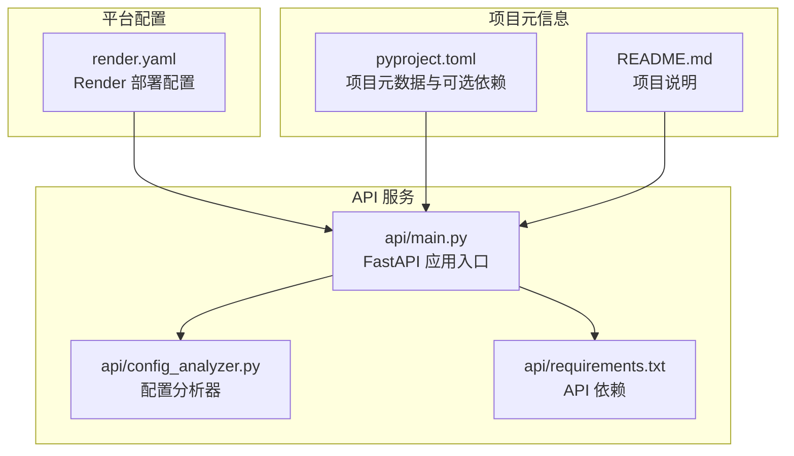
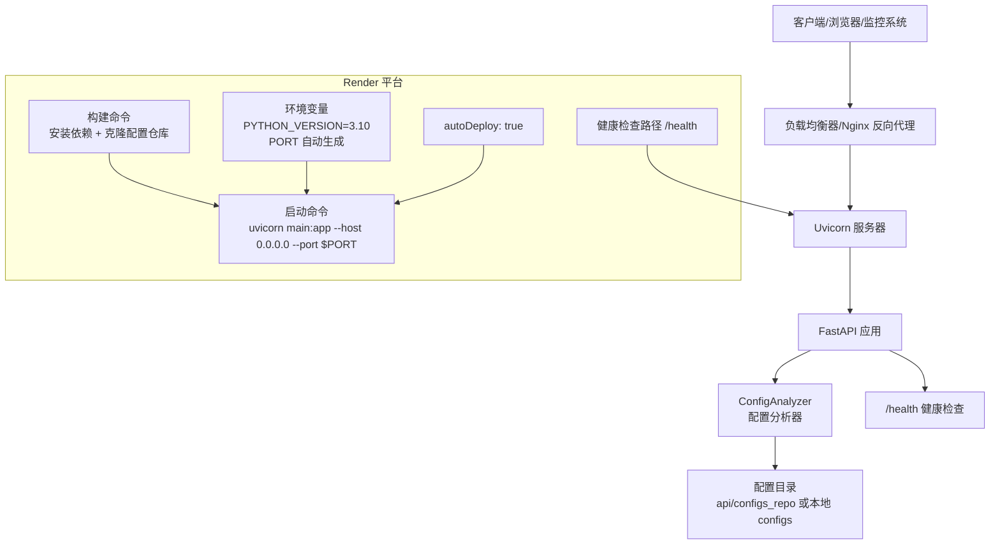
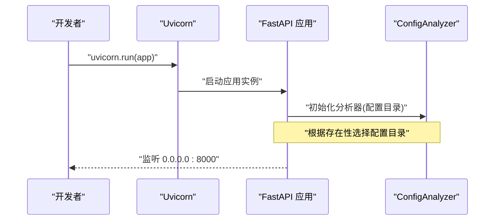
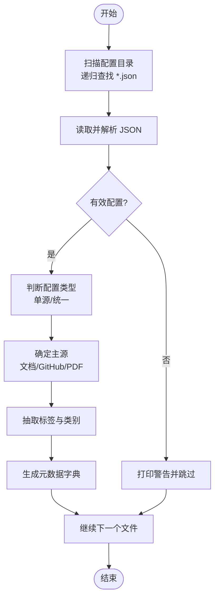
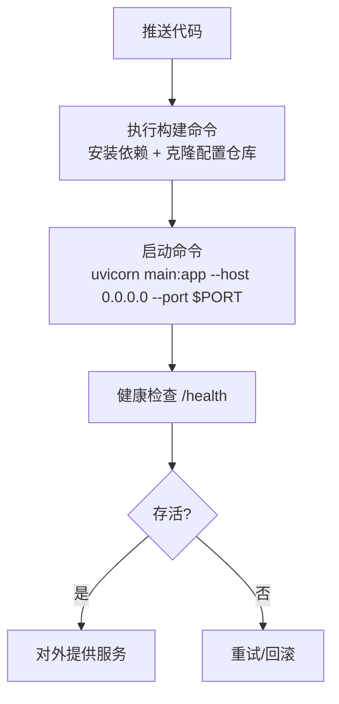
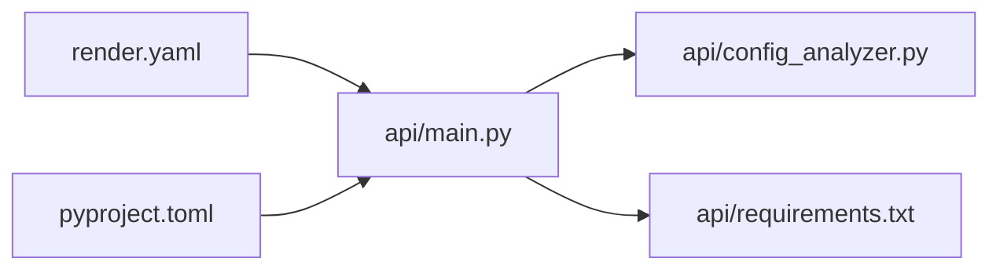

# 部署架构

<cite>
**本文引用的文件**
- [api/main.py](file://api/main.py)
- [api/config_analyzer.py](file://api/config_analyzer.py)
- [api/requirements.txt](file://api/requirements.txt)
- [render.yaml](file://render.yaml)
- [pyproject.toml](file://pyproject.toml)
- [README.md](file://README.md)
</cite>

## 目录
1. [简介](#简介)
2. [项目结构](#项目结构)
3. [核心组件](#核心组件)
4. [架构总览](#架构总览)
5. [详细组件分析](#详细组件分析)
6. [依赖关系分析](#依赖关系分析)
7. [性能考量](#性能考量)
8. [故障排查指南](#故障排查指南)
9. [结论](#结论)
10. [附录](#附录)

## 简介
本文件系统化梳理了该 FastAPI 应用的部署架构，重点覆盖以下方面：
- FastAPI 应用与 Uvicorn 的集成方式，包括本地开发通过 if __name__ == "__main__" 块启动 Uvicorn 的实现细节。
- Render 平台的生产部署配置，包括服务类型、Python 运行时、构建命令（安装依赖与克隆配置仓库）、启动命令、环境变量（PYTHON_VERSION、PORT）及健康检查路径 /health 的作用与意义。
- 自动部署（autoDeploy: true）对持续集成的支持。
- 部署拓扑建议：反向代理（如 Nginx）与负载均衡器的配置模式，以及迁移到 Docker/Kubernetes 的实践要点。

## 项目结构
该项目采用“多模块”组织方式，API 服务位于 api/ 目录，核心业务逻辑由 FastAPI 应用与配置分析器共同构成；渲染平台的部署配置集中在根目录的 render.yaml 中。

图表来源
- [api/main.py](file://api/main.py#L1-L220)
- [api/config_analyzer.py](file://api/config_analyzer.py#L1-L349)
- [api/requirements.txt](file://api/requirements.txt#L1-L4)
- [render.yaml](file://render.yaml#L1-L18)
- [pyproject.toml](file://pyproject.toml#L1-L162)
- [README.md](file://README.md#L1-L200)

章节来源
- [api/main.py](file://api/main.py#L1-L220)
- [api/config_analyzer.py](file://api/config_analyzer.py#L1-L349)
- [api/requirements.txt](file://api/requirements.txt#L1-L4)
- [render.yaml](file://render.yaml#L1-L18)
- [pyproject.toml](file://pyproject.toml#L1-L162)
- [README.md](file://README.md#L1-L200)

## 核心组件
- FastAPI 应用与路由
  - 应用初始化包含标题、描述、版本与文档路径，并启用 CORS 中间件以允许跨域访问。
  - 路由包括根路径、配置列表、分类查询、下载接口与健康检查。
  - 下载接口对文件名进行安全校验，防止路径穿越，并支持递归查找配置文件。
- 配置分析器
  - 负责从配置目录递归扫描 JSON 文件，提取元数据（类型、类别、标签、主源、大小、更新时间等），并生成下载链接。
  - 支持单源与统一（多源）配置的识别与处理。
- Uvicorn 启动
  - 在本地开发场景下，通过 if __name__ == "__main__" 块直接调用 uvicorn.run 启动应用，默认监听 0.0.0.0:8000。
- 渲染平台部署
  - 服务类型为 web，运行时为 Python，构建阶段安装 api/requirements.txt 并克隆官方配置仓库到 api/configs_repo。
  - 启动命令使用 uvicorn 指定应用入口 main:app，并通过 $PORT 环境变量绑定端口。
  - 定义健康检查路径 /health，用于平台健康探测。
  - 设置环境变量 PYTHON_VERSION=3.10，并开启自动生成的 PORT 变量。
  - 开启 autoDeploy: true，实现代码变更后的自动部署。

章节来源
- [api/main.py](file://api/main.py#L1-L220)
- [api/config_analyzer.py](file://api/config_analyzer.py#L1-L349)
- [api/requirements.txt](file://api/requirements.txt#L1-L4)
- [render.yaml](file://render.yaml#L1-L18)

## 架构总览
下图展示了从客户端请求到 API 处理再到配置仓库的数据流，以及 Render 平台的部署与健康检查机制。

图表来源
- [api/main.py](file://api/main.py#L1-L220)
- [api/config_analyzer.py](file://api/config_analyzer.py#L1-L349)
- [render.yaml](file://render.yaml#L1-L18)

## 详细组件分析

### FastAPI 应用与 Uvicorn 集成
- 应用初始化与中间件
  - 初始化 FastAPI 实例，设置文档路径与版本信息。
  - 添加 CORS 中间件，允许所有来源、方法与头，便于前端跨域访问。
- 路由设计
  - 根路径返回服务基本信息与可用端点列表。
  - 列表与详情接口支持过滤参数（类别、标签、类型）。
  - 分类统计接口按类别计数。
  - 下载接口对文件名进行安全校验，确保仅返回 JSON 文件并以 FileResponse 返回。
  - 健康检查接口返回服务状态。
- 本地启动
  - 通过 if __name__ == "__main__" 块调用 uvicorn.run，绑定主机与端口，便于本地开发调试。

图表来源
- [api/main.py](file://api/main.py#L1-L220)
- [api/config_analyzer.py](file://api/config_analyzer.py#L1-L349)

章节来源
- [api/main.py](file://api/main.py#L1-L220)

### 配置分析器工作流程
- 目录扫描与元数据提取
  - 递归扫描配置目录下的 JSON 文件，解析内容并生成元数据字典。
  - 自动推断配置类型（单源或统一多源），并提取主源（文档、GitHub 或 PDF）。
  - 基于名称与描述进行类别与标签抽取，生成下载链接与最后更新时间。
- 错误处理
  - 对无效 JSON、缺失字段与异常情况给出警告并跳过，保证整体稳定性。

图表来源
- [api/config_analyzer.py](file://api/config_analyzer.py#L1-L349)

章节来源
- [api/config_analyzer.py](file://api/config_analyzer.py#L1-L349)

### Render 生产部署配置详解
- 服务类型与运行时
  - 类型为 web，运行时为 Python，计划为 free（免费层）。
- 构建命令
  - 安装 api/requirements.txt 中声明的依赖。
  - 克隆官方配置仓库到 api/configs_repo，供应用在生产环境加载配置。
- 启动命令
  - 使用 uvicorn 指定应用入口 main:app，并绑定主机与端口。
  - 端口通过 $PORT 环境变量注入，由平台动态分配。
- 环境变量
  - PYTHON_VERSION=3.10，确保运行时版本一致。
  - PORT 由平台自动生成，无需手动指定。
- 健康检查
  - 健康检查路径为 /health，用于平台探测服务存活状态。
- 自动部署
  - autoDeploy: true，当代码变更推送后，平台自动触发构建与部署，实现持续集成。

图表来源
- [render.yaml](file://render.yaml#L1-L18)

章节来源
- [render.yaml](file://render.yaml#L1-L18)

### 环境变量与端口管理
- PYTHON_VERSION
  - 固定运行时 Python 版本，确保依赖兼容与一致性。
- PORT
  - 由平台动态生成，应用通过 $PORT 接收端口，避免硬编码导致冲突。
- 主机绑定
  - 启动命令绑定 0.0.0.0，使容器网络暴露给外部或反向代理。

章节来源
- [render.yaml](file://render.yaml#L1-L18)
- [api/main.py](file://api/main.py#L211-L220)

### 健康检查路径 /health 的作用
- 服务监控
  - 平台定期访问 /health，确认应用处于健康状态，以便进行滚动更新、扩缩容或故障切换。
- 故障定位
  - 当 /health 返回非 2xx 状态码时，平台会标记实例不健康，便于运维快速介入。
- 与业务解耦
  - 健康检查仅验证进程存活与基本可用性，不承载业务逻辑，降低对主业务的影响。

章节来源
- [api/main.py](file://api/main.py#L211-L215)
- [render.yaml](file://render.yaml#L16-L16)

### 自动部署（autoDeploy: true）与持续集成
- 触发条件
  - 代码推送到关联分支，平台自动拉取、构建与部署。
- 优势
  - 缩短交付周期，减少人工干预，提升发布频率与质量。
- 注意事项
  - 建议配合自动化测试与预检脚本，确保每次部署前的稳定性。

章节来源
- [render.yaml](file://render.yaml#L17-L17)

## 依赖关系分析
- 组件耦合
  - api/main.py 依赖 api/config_analyzer.py 提供配置元数据。
  - api/main.py 依赖 api/requirements.txt 中声明的 FastAPI、Uvicorn 与 multipart 解析库。
  - render.yaml 将构建与启动过程与 api/main.py 的入口 main:app 强耦合，确保部署一致性。
- 外部依赖
  - Python 运行时版本要求与 pyproject.toml 中的可选依赖保持一致，避免运行期差异。
- 环境变量与端口
  - $PORT 由平台注入，应用通过环境变量读取端口，避免硬编码。

图表来源
- [api/main.py](file://api/main.py#L1-L220)
- [api/config_analyzer.py](file://api/config_analyzer.py#L1-L349)
- [api/requirements.txt](file://api/requirements.txt#L1-L4)
- [render.yaml](file://render.yaml#L1-L18)
- [pyproject.toml](file://pyproject.toml#L1-L162)

章节来源
- [api/main.py](file://api/main.py#L1-L220)
- [api/config_analyzer.py](file://api/config_analyzer.py#L1-L349)
- [api/requirements.txt](file://api/requirements.txt#L1-L4)
- [render.yaml](file://render.yaml#L1-L18)
- [pyproject.toml](file://pyproject.toml#L1-L162)

## 性能考量
- 并发与异步
  - FastAPI 基于 Starlette，支持异步处理；若未来引入异步任务或 SSE，可结合 uvicorn 的异步 worker 模式提升吞吐。
- 静态资源与缓存
  - 下载接口返回 JSON 文件，建议在反向代理层启用静态缓存与压缩，减少后端压力。
- 配置目录规模
  - 配置文件数量较多时，扫描与解析可能成为瓶颈；可考虑分页或索引策略优化。
- 运行时版本
  - 统一 PYTHON_VERSION=3.10，有助于避免依赖冲突与性能波动。

## 故障排查指南
- 健康检查失败
  - 检查 /health 是否可达且返回 2xx；若失败，查看应用日志与依赖安装是否完整。
- 端口冲突
  - 确认 $PORT 已正确注入，应用绑定 0.0.0.0:PORT；避免硬编码端口导致冲突。
- 配置加载失败
  - 确认 api/configs_repo 已成功克隆，且配置目录存在；检查配置 JSON 的有效性与必需字段。
- 构建失败
  - 检查 api/requirements.txt 依赖是否可正常安装；必要时清理缓存或升级 pip。
- 自动部署未触发
  - 确认 render.yaml 中 autoDeploy: true，且推送分支与平台配置匹配。

章节来源
- [api/main.py](file://api/main.py#L211-L220)
- [render.yaml](file://render.yaml#L1-L18)

## 结论
该部署架构以 FastAPI + Uvicorn 为核心，结合 Render 平台的自动化构建与部署能力，实现了从开发到生产的无缝衔接。通过明确的健康检查、环境变量与端口管理，以及统一的配置仓库策略，系统具备良好的可观测性与可维护性。建议在生产环境中进一步完善反向代理与负载均衡配置，并在 CI/CD 流程中加入自动化测试与灰度发布策略，以提升稳定性与交付效率。

## 附录

### 部署拓扑建议
- 反向代理（Nginx）
  - 将外部流量转发至 Uvicorn，启用 gzip/HTTP/2，设置合理的超时与缓冲区。
  - 将 /health 暴露给平台健康检查，同时隐藏内部实现细节。
- 负载均衡器
  - 多实例部署时，使用负载均衡器进行健康检查与流量分发，实现高可用。
- 安全加固
  - 限制来源 IP、启用 HTTPS、配置速率限制与 WAF 规则。
- 日志与监控
  - 记录访问日志与错误日志，接入指标采集（如 Prometheus/Grafana）与链路追踪。

### 迁移指南：Docker 与 Kubernetes
- Docker
  - 基于 Python 官方镜像，复制 api/requirements.txt 并安装依赖，复制应用代码，暴露 $PORT，使用 uvicorn 启动。
  - 使用 docker-compose 管理服务编排，结合健康检查与重启策略。
- Kubernetes
  - 定义 Deployment（副本数、探针）、Service（ClusterIP/LoadBalancer）、ConfigMap（环境变量）与 Secret（敏感信息）。
  - 使用 HorizontalPodAutoscaler 根据 CPU/内存或自定义指标自动扩缩容。
  - 配置 Ingress 控制器暴露域名与 TLS，结合证书管理工具（如 cert-manager）。

章节来源
- [api/requirements.txt](file://api/requirements.txt#L1-L4)
- [render.yaml](file://render.yaml#L1-L18)
- [api/main.py](file://api/main.py#L211-L220)