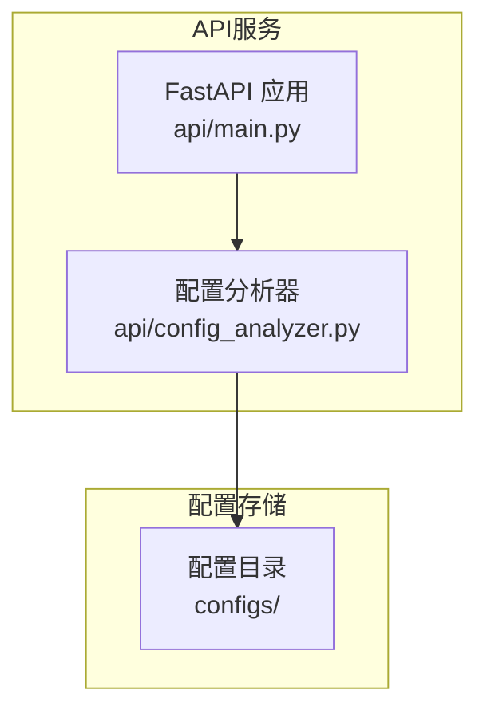
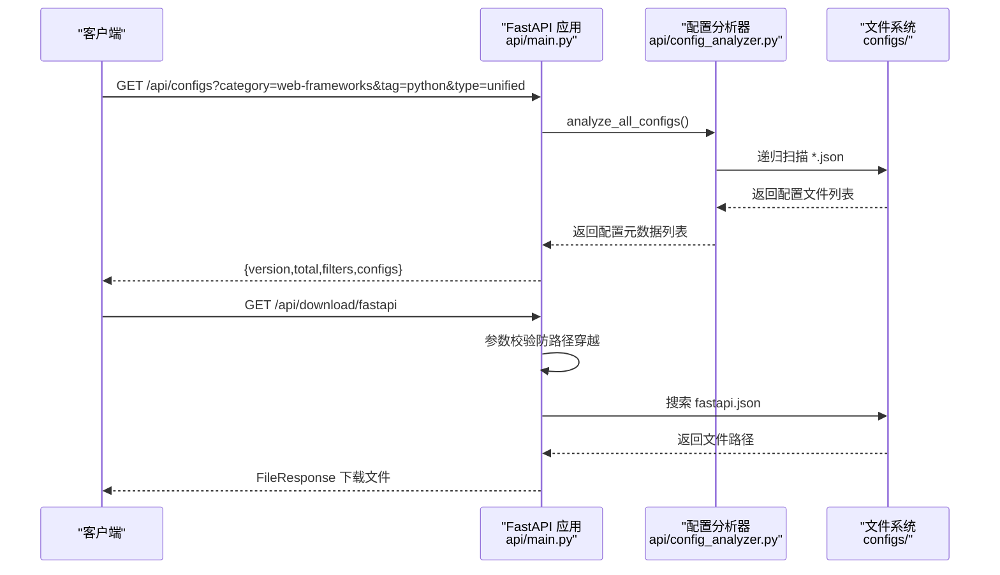
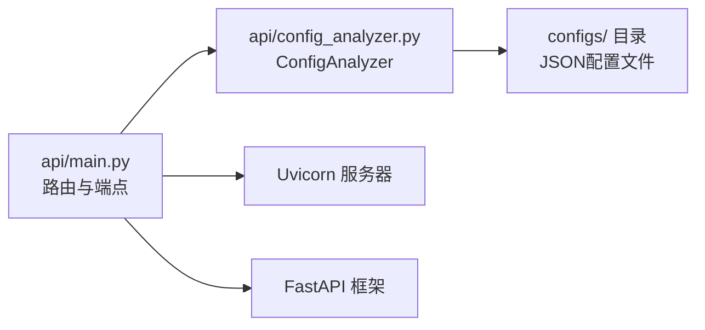
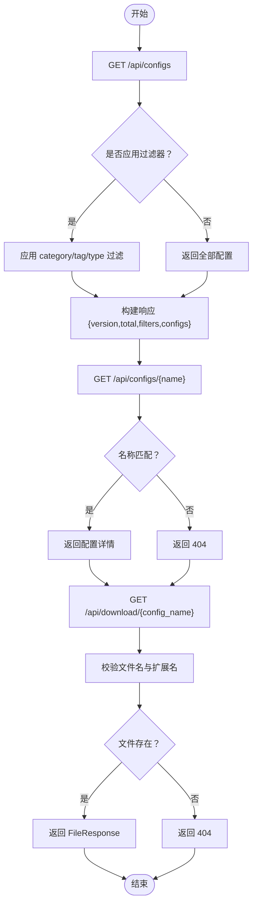

# API端点说明

<cite>
**本文引用的文件**
- [api/main.py](file://api/main.py)
- [api/config_analyzer.py](file://api/config_analyzer.py)
- [api/README.md](file://api/README.md)
- [configs/fastapi.json](file://configs/fastapi.json)
- [configs/react.json](file://configs/react.json)
- [configs/django.json](file://configs/django.json)
- [test_api.py](file://test_api.py)
</cite>

## 目录
1. [简介](#简介)
2. [项目结构](#项目结构)
3. [核心组件](#核心组件)
4. [架构总览](#架构总览)
5. [详细端点说明](#详细端点说明)
6. [依赖关系分析](#依赖关系分析)
7. [性能与可扩展性](#性能与可扩展性)
8. [故障排查指南](#故障排查指南)
9. [结论](#结论)
10. [附录：端点调用示例与最佳实践](#附录端点调用示例与最佳实践)

## 简介
本文件面向使用者与集成开发者，系统化说明 Skill Seekers 配置 API 的核心端点，包括：
- /api/configs：列出所有可用配置，并支持按类别、标签、类型过滤
- /api/configs/{name}：获取指定配置的完整元数据
- /api/categories：列出所有类别及其数量
- /api/download/{config_name}：下载指定配置文件
- /health：健康检查

文档覆盖每个端点的 HTTP 方法、查询/路径参数、响应格式、错误码，以及端点间的数据流与组合使用方式，并提供可直接落地的调用示例与最佳实践。

## 项目结构
后端基于 FastAPI 构建，核心逻辑集中在 api/main.py 中定义路由与业务处理；配置解析与元数据提取由 api/config_analyzer.py 提供。配置文件位于 configs/ 目录下，示例包含多种框架的配置 JSON 文件。

图表来源
- [api/main.py](file://api/main.py#L1-L220)
- [api/config_analyzer.py](file://api/config_analyzer.py#L1-L349)

章节来源
- [api/main.py](file://api/main.py#L1-L220)
- [api/config_analyzer.py](file://api/config_analyzer.py#L1-L349)

## 核心组件
- FastAPI 应用与路由：负责定义端点、CORS 支持、根信息、健康检查及文件下载
- 配置分析器：递归扫描配置目录，解析 JSON，抽取元数据（类型、分类、标签、主源、大小、更新时间、下载链接等），并支持按名称检索

章节来源
- [api/main.py](file://api/main.py#L1-L220)
- [api/config_analyzer.py](file://api/config_analyzer.py#L1-L349)

## 架构总览
以下序列图展示典型“列出配置”到“下载配置”的端到端流程，体现端点间的协作与数据流。

图表来源
- [api/main.py](file://api/main.py#L61-L209)
- [api/config_analyzer.py](file://api/config_analyzer.py#L70-L171)

## 详细端点说明

### 1) GET /api/configs
- 功能：列出所有可用配置，并支持按类别、标签、类型进行过滤
- HTTP 方法：GET
- 查询参数：
  - category（可选）：按类别过滤（例如 web-frameworks）
  - tag（可选）：按标签过滤（例如 javascript）
  - type（可选）：按类型过滤（single-source 或 unified）
- 响应字段：
  - version：API 版本
  - total：当前过滤后的配置总数
  - filters：应用的过滤条件（若无则为 null）
  - configs：配置元数据数组，每项包含 name、description、type、category、tags、primary_source、max_pages、file_size、last_updated、download_url、config_file 等
- 错误码：
  - 400：当内部分析过程异常时返回 500（本端点未显式抛出 400）
  - 404：未找到配置时返回 404（由其他端点触发）
  - 500：服务器内部错误（例如分析配置时发生异常）

响应示例要点（字段说明见“附录：端点调用示例与最佳实践”）
- 包含 version、total、filters、configs 数组
- configs 中的每个元素包含 name、type、category、tags、primary_source、max_pages、file_size、last_updated、download_url、config_file 等

章节来源
- [api/main.py](file://api/main.py#L61-L109)
- [api/config_analyzer.py](file://api/config_analyzer.py#L70-L171)

### 2) GET /api/configs/{name}
- 功能：获取指定配置的完整元数据
- HTTP 方法：GET
- 路径参数：
  - name：配置名称（例如 react、django、fastapi）
- 响应字段：与 /api/configs 列表中的单个配置一致
- 错误码：
  - 404：当找不到对应名称的配置时
  - 500：服务器内部错误（例如加载配置时发生异常）

章节来源
- [api/main.py](file://api/main.py#L112-L138)
- [api/config_analyzer.py](file://api/config_analyzer.py#L156-L171)

### 3) GET /api/categories
- 功能：列出所有类别及其对应的配置数量
- HTTP 方法：GET
- 响应字段：
  - total_categories：类别总数
  - categories：类别名到数量的映射
- 错误码：
  - 500：服务器内部错误（例如分析类别时发生异常）

章节来源
- [api/main.py](file://api/main.py#L140-L165)
- [api/config_analyzer.py](file://api/config_analyzer.py#L70-L171)

### 4) GET /api/download/{config_name}
- 功能：下载指定配置文件（JSON）
- HTTP 方法：GET
- 路径参数：
  - config_name：配置文件名（例如 fastapi.json 或 fastapi）
- 行为与安全：
  - 自动补全 .json 扩展名（若未提供）
  - 防止路径穿越攻击（禁止 ..、/、\）
  - 在配置目录中递归查找匹配文件
- 响应：
  - 成功：FileResponse，媒体类型 application/json，文件名为传入的配置名
  - 错误码：
    - 400：无效的配置名（包含非法字符）
    - 404：未找到配置文件
    - 500：服务器内部错误（例如下载过程中发生异常）

章节来源
- [api/main.py](file://api/main.py#L167-L209)

### 5) GET /health
- 功能：健康检查，用于监控
- HTTP 方法：GET
- 响应字段：
  - status：服务状态（healthy）
  - service：服务标识（skill-seekers-api）
- 错误码：无（正常返回 200）

章节来源
- [api/main.py](file://api/main.py#L211-L215)

## 依赖关系分析
- 端点与分析器的耦合：
  - /api/configs、/api/configs/{name}、/api/categories 均依赖 ConfigAnalyzer.analyze_all_configs 与 get_config_by_name
  - /api/download/{config_name} 依赖配置目录的文件系统访问与安全校验
- 外部依赖：
  - FastAPI、Uvicorn、python-multipart
  - Git 历史用于 last_updated 的回退（若无法获取则使用文件修改时间）

图表来源
- [api/main.py](file://api/main.py#L1-L220)
- [api/config_analyzer.py](file://api/config_analyzer.py#L1-L349)

章节来源
- [api/main.py](file://api/main.py#L1-L220)
- [api/config_analyzer.py](file://api/config_analyzer.py#L1-L349)

## 性能与可扩展性
- 配置扫描复杂度：对配置目录进行递归扫描，时间复杂度近似 O(N)，N 为 JSON 文件数量
- 过滤策略：在内存中进行列表过滤，时间复杂度 O(M)，M 为已分析配置数
- 并发与限速：当前端点未内置并发控制或速率限制，建议在网关层或上游代理处实施
- 缓存建议：对于高频读取的 /api/configs 可考虑缓存最近一次分析结果，减少磁盘扫描开销
- 类型与分类：ConfigAnalyzer 内置分类与标签提取逻辑，避免重复计算

[本节为通用性能讨论，不直接分析具体文件]

## 故障排查指南
- 400 错误（下载端点）：
  - 检查 config_name 是否包含非法字符（..、/、\）
  - 若仅传入名称，请确认其存在 .json 后缀或端点会自动补全
- 404 错误：
  - /api/configs/{name}：确认 name 是否存在于已分析的配置集合中
  - /api/download/{config_name}：确认文件确实存在于配置目录且名称正确
- 500 错误：
  - 分析配置时 JSON 解析失败或文件读取异常
  - 建议检查配置文件是否为合法 JSON，或是否存在权限问题
- 健康检查：
  - /health 用于确认服务存活，若返回非 200，需检查服务进程与网络连通性

章节来源
- [api/main.py](file://api/main.py#L108-L138)
- [api/main.py](file://api/main.py#L167-L209)

## 结论
本 API 通过清晰的端点设计与统一的配置分析器，实现了从“发现配置”到“下载配置”的完整链路。结合类别与标签过滤，用户可以高效定位所需配置；下载端点提供安全可靠的文件获取能力。建议在生产环境中配合缓存与限流策略，进一步提升稳定性与性能。

[本节为总结性内容，不直接分析具体文件]

## 附录：端点调用示例与最佳实践

### 端点调用示例
- 列出所有配置
  - curl https://skillseekersweb.com/api/configs
- 按类别过滤（Web 框架）
  - curl https://skillseekersweb.com/api/configs?category=web-frameworks
- 按标签过滤（JavaScript）
  - curl https://skillseekersweb.com/api/configs?tag=javascript
- 按类型过滤（unified）
  - curl https://skillseekersweb.com/api/configs?type=unified
- 获取指定配置详情（例如 fastapi）
  - curl https://skillseekersweb.com/api/configs/fastapi
- 获取类别统计
  - curl https://skillseekersweb.com/api/categories
- 下载配置文件（例如 fastapi.json）
  - curl -O https://skillseekersweb.com/api/download/fastapi.json
- 下载配置文件（省略 .json）
  - curl -O https://skillseekersweb.com/api/download/fastapi
- 健康检查
  - curl https://skillseekersweb.com/health

章节来源
- [api/README.md](file://api/README.md#L1-L191)

### 数据模型与字段说明
- 公共字段（出现在 /api/configs 与 /api/configs/{name} 的响应中）
  - name：配置标识（例如 react、django、fastapi）
  - description：用途描述
  - type：配置类型（single-source 或 unified）
  - category：自动分类（例如 web-frameworks、game-engines、devops、css-frameworks、uncategorized）
  - tags：相关标签（例如 javascript、python、frontend、backend、github、documentation、pdf、multi-source 等）
  - primary_source：主要来源（文档站点、GitHub 仓库、PDF 等）
  - max_pages：估计页面数量（用于抓取估算）
  - file_size：配置文件大小（字节）
  - last_updated：ISO 8601 格式的最后更新时间
  - download_url：下载链接
  - config_file：配置文件名（例如 react.json）

章节来源
- [api/config_analyzer.py](file://api/config_analyzer.py#L135-L171)
- [api/README.md](file://api/README.md#L172-L191)

### 端点间关系与数据流
- 列表端点（/api/configs）与详情端点（/api/configs/{name}）共享同一份分析结果，后者通过名称精确匹配返回
- 下载端点（/api/download/{config_name}）依赖配置目录中的真实文件，先进行安全校验再返回 FileResponse
- 类别端点（/api/categories）基于分析结果统计各分类数量，便于前端导航

图表来源
- [api/main.py](file://api/main.py#L61-L209)
- [api/config_analyzer.py](file://api/config_analyzer.py#L70-L171)

### 实际配置示例参考
- fastapi.json：包含基础 URL、起始 URL、选择器、URL 规则、分类、限速与最大页数等字段
- react.json：包含基础 URL、起始 URL、选择器、URL 规则、分类、限速与最大页数等字段
- django.json：包含基础 URL、起始 URL、选择器、URL 规则、分类、限速与最大页数等字段

章节来源
- [configs/fastapi.json](file://configs/fastapi.json#L1-L34)
- [configs/react.json](file://configs/react.json#L1-L32)
- [configs/django.json](file://configs/django.json#L1-L35)

### 最佳实践
- 组合使用建议：
  - 先调用 /api/categories 获取类别概览，再用 /api/configs?category=... 进行筛选
  - 使用 /api/configs?tag=... 与 /api/configs?type=... 进一步缩小范围
  - 获取目标配置的详情后再执行 /api/download/{name} 下载
- 客户端缓存：
  - 对 /api/configs 的结果进行短期缓存，降低频繁扫描配置目录的开销
- 错误处理：
  - 对 404 场景提示用户检查名称或先列出可用配置
  - 对 500 场景记录日志并重试或回退到本地缓存
- 安全：
  - 下载端点已内置路径穿越防护，客户端仍应避免拼接不受信任的文件名

[本节为通用指导，不直接分析具体文件]