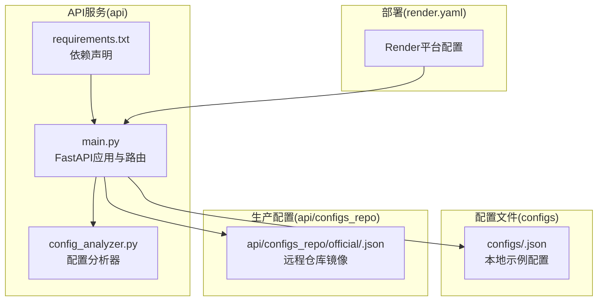
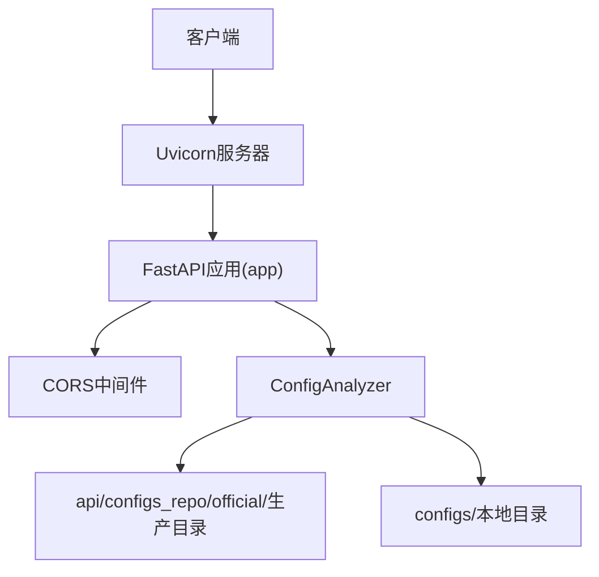
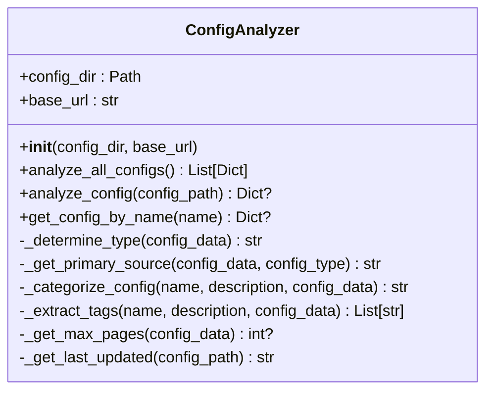
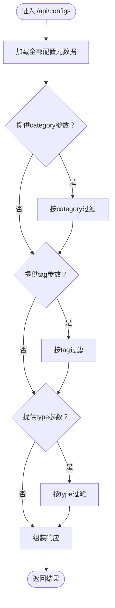
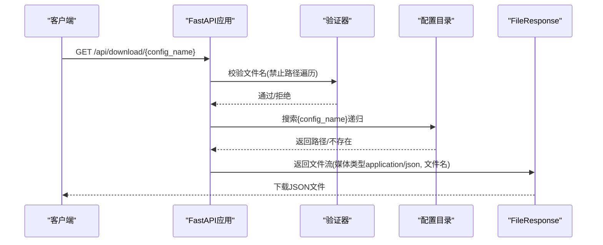
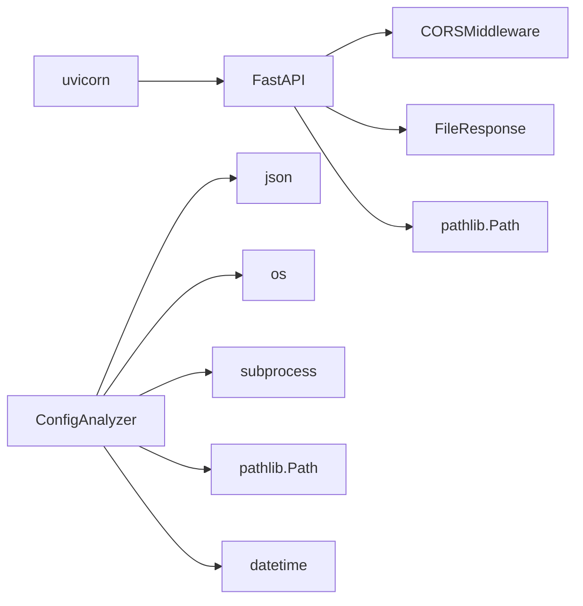

# REST API集成

<cite>
**本文引用的文件**
- [api/main.py](file://api/main.py)
- [api/config_analyzer.py](file://api/config_analyzer.py)
- [api/requirements.txt](file://api/requirements.txt)
- [test_api.py](file://test_api.py)
- [configs/react.json](file://configs/react.json)
- [configs/fastapi.json](file://configs/fastapi.json)
- [configs/example-team/react-custom.json](file://configs/example-team/react-custom.json)
- [render.yaml](file://render.yaml)
</cite>

## 目录
1. [简介](#简介)
2. [项目结构](#项目结构)
3. [核心组件](#核心组件)
4. [架构总览](#架构总览)
5. [详细组件分析](#详细组件分析)
6. [依赖关系分析](#依赖关系分析)
7. [性能与可扩展性](#性能与可扩展性)
8. [故障排查指南](#故障排查指南)
9. [结论](#结论)
10. [附录](#附录)

## 简介
本文件面向需要集成Skill Seekers配置API的开发者，系统化说明基于FastAPI实现的REST接口，涵盖以下端点：
- GET /api/configs（支持category、tag、type过滤）
- GET /api/configs/{name}
- GET /api/categories
- GET /api/download/{config_name}
- GET /health（健康检查）

文档同时解析ConfigAnalyzer类对配置文件元数据的提取与校验流程，说明CORS与安全策略（含路径遍历防护），并提供客户端调用示例与生产部署最佳实践。

## 项目结构
- 后端服务位于 api/ 目录，包含FastAPI应用入口与配置分析器。
- 配置文件位于 configs/ 目录；在生产环境中，服务会从远程仓库克隆到 api/configs_repo/official 并优先使用该目录。
- 渲染平台配置 render.yaml 定义了构建与启动命令、健康检查路径及自动部署策略。

图表来源
- [api/main.py](file://api/main.py#L1-L220)
- [api/config_analyzer.py](file://api/config_analyzer.py#L1-L349)
- [api/requirements.txt](file://api/requirements.txt#L1-L4)
- [render.yaml](file://render.yaml#L1-L18)

章节来源
- [api/main.py](file://api/main.py#L1-L220)
- [api/config_analyzer.py](file://api/config_analyzer.py#L1-L349)
- [api/requirements.txt](file://api/requirements.txt#L1-L4)
- [render.yaml](file://render.yaml#L1-L18)

## 核心组件
- FastAPI应用与路由：定义根端点、配置列表、详情、分类统计、下载与健康检查。
- ConfigAnalyzer：递归扫描JSON配置文件，提取类型、类别、标签、主源、大小、更新时间、下载链接等元数据，并生成统一的配置清单。
- 生产配置目录：优先使用 api/configs_repo/official，回退到本地 configs 目录。

章节来源
- [api/main.py](file://api/main.py#L1-L220)
- [api/config_analyzer.py](file://api/config_analyzer.py#L1-L349)

## 架构总览
下图展示API请求在运行时的关键交互路径，包括CORS中间件、配置分析器与配置文件目录的关系。

图表来源
- [api/main.py](file://api/main.py#L1-L220)
- [api/config_analyzer.py](file://api/config_analyzer.py#L1-L349)

## 详细组件分析

### 路由与端点规范
- 基础信息端点
  - 方法：GET
  - 路径：/
  - 功能：返回API名称、版本、可用端点与仓库信息
  - 成功响应：JSON对象
  - 错误码：无显式错误处理（内部异常将由框架转换为5xx）

- 列表端点
  - 方法：GET
  - 路径：/api/configs
  - 查询参数：
    - category: 字符串，按类别过滤
    - tag: 字符串，按标签过滤
    - type: 字符串，取值"single-source"或"unified"
  - 成功响应：包含版本、总数、已应用过滤器、配置列表的JSON对象
  - 错误码：500（分析失败）

- 详情端点
  - 方法：GET
  - 路径：/api/configs/{name}
  - 路径参数：name（配置名）
  - 成功响应：完整配置元数据
  - 错误码：404（未找到），500（加载失败）

- 分类统计端点
  - 方法：GET
  - 路径：/api/categories
  - 成功响应：包含分类计数字典与分类总数
  - 错误码：500（分析失败）

- 下载端点
  - 方法：GET
  - 路径：/api/download/{config_name}
  - 路径参数：config_name（配置文件名，可省略.json后缀）
  - 安全限制：禁止包含路径遍历字符（..、/、\）
  - 成功响应：JSON文件下载（application/json）
  - 错误码：400（无效文件名），404（文件不存在），500（下载失败）

- 健康检查端点
  - 方法：GET
  - 路径：/health
  - 成功响应：包含状态与服务标识的JSON对象
  - 错误码：无显式错误处理

章节来源
- [api/main.py](file://api/main.py#L42-L215)

### ConfigAnalyzer类：配置元数据提取与验证
ConfigAnalyzer负责从JSON配置文件中抽取统一元数据，包括：
- 类型判定：根据是否存在"sources"或"merge_mode"字段判断为"unified"或"single-source"
- 主源识别：依据单源的base_url、repo或pdf_url，或统一源的sources数组首项类型与字段推断
- 自动分类：基于预设CATEGORY_MAPPING与描述关键词进行分类
- 标签提取：基于TAG_KEYWORDS匹配语言、技术栈与来源类型标签，并附加类型标签
- 文件属性：文件大小、最后更新时间（优先git提交时间，回退文件修改时间）
- 下载链接：基于base_url与下载端点生成

图表来源
- [api/config_analyzer.py](file://api/config_analyzer.py#L1-L349)

章节来源
- [api/config_analyzer.py](file://api/config_analyzer.py#L1-L349)

### 过滤逻辑流程（/api/configs）

图表来源
- [api/main.py](file://api/main.py#L61-L107)

章节来源
- [api/main.py](file://api/main.py#L61-L107)

### 下载流程与安全防护（/api/download/{config_name}）

图表来源
- [api/main.py](file://api/main.py#L167-L209)

章节来源
- [api/main.py](file://api/main.py#L167-L209)

### 示例配置文件（用于理解元数据）
- 单源配置示例：react.json、fastapi.json
- 统一源配置示例：example-team/react-custom.json（包含自定义选择器、URL模式与团队元数据）

章节来源
- [configs/react.json](file://configs/react.json#L1-L32)
- [configs/fastapi.json](file://configs/fastapi.json#L1-L34)
- [configs/example-team/react-custom.json](file://configs/example-team/react-custom.json#L1-L36)

## 依赖关系分析
- 应用层依赖：FastAPI、CORS中间件、FileResponse、Path
- 分析器依赖：标准库json、os、subprocess、pathlib、datetime
- 运行时依赖：uvicorn（开发/生产运行时）
- 生产依赖：Python运行时、requirements.txt声明的包

图表来源
- [api/main.py](file://api/main.py#L1-L220)
- [api/config_analyzer.py](file://api/config_analyzer.py#L1-L349)
- [api/requirements.txt](file://api/requirements.txt#L1-L4)

章节来源
- [api/main.py](file://api/main.py#L1-L220)
- [api/config_analyzer.py](file://api/config_analyzer.py#L1-L349)
- [api/requirements.txt](file://api/requirements.txt#L1-L4)

## 性能与可扩展性
- 配置扫描复杂度：O(N)遍历所有JSON文件，N为配置文件数量；每文件解析为O(1)（假设文件大小有限）。
- 分类与标签提取：基于预设映射与关键字匹配，整体近似O(N)。
- 下载端点：递归搜索首个匹配文件，最坏O(N)；可通过索引或缓存优化。
- 建议：
  - 在高频访问场景下引入内存缓存（如lru_cache）以减少重复解析。
  - 对下载端点增加ETag/Last-Modified支持，提升CDN缓存命中率。
  - 将配置目录改为只读挂载，避免频繁IO；必要时预热索引。
  - 使用异步任务定期生成静态清单，前端直接拉取，后端仅提供增量更新。

[本节为通用建议，无需具体文件引用]

## 故障排查指南
- 404未找到
  - 列表详情：确认name是否存在于已分析的配置清单中
  - 下载：确认文件名正确且存在于配置目录；注意不允许路径遍历字符
- 500服务器错误
  - 列表/分类/详情：检查配置文件JSON合法性与必需字段
  - 下载：确认配置目录存在且可读
- 健康检查失败
  - 检查渲染平台健康检查路径与端口配置
- CORS问题
  - 当前允许所有来源、方法与头，请在生产中收紧白名单

章节来源
- [api/main.py](file://api/main.py#L61-L215)

## 结论
本API通过清晰的端点设计与ConfigAnalyzer的标准化元数据提取，为上层应用提供了稳定、可扩展的配置发现与下载能力。结合生产部署配置与安全加固，可在多环境下可靠运行。

[本节为总结，无需具体文件引用]

## 附录

### API端点一览与示例
- 列出配置（支持过滤）
  - GET /api/configs?category=web-frameworks&tag=javascript&type=single-source
  - 成功响应：包含版本、总数、过滤器与配置列表
- 获取指定配置
  - GET /api/configs/react
  - 成功响应：完整配置元数据
- 获取分类统计
  - GET /api/categories
  - 成功响应：分类计数字典与总数
- 下载配置
  - GET /api/download/react.json 或 /api/download/react
  - 成功响应：JSON文件下载
- 健康检查
  - GET /health
  - 成功响应：服务健康状态

章节来源
- [api/main.py](file://api/main.py#L61-L215)

### 客户端调用示例（概念性）
- 列出特定类别的配置
  - 请求：GET /api/configs?category=web-frameworks
  - 处理：解析响应中的configs数组
- 下载配置文件
  - 请求：GET /api/download/react
  - 处理：保存返回的JSON文件至本地
- 错误处理
  - 捕获404与500状态码，提示用户重试或检查输入

[本节为概念性说明，无需具体文件引用]

### 部署架构与最佳实践
- 运行时
  - 使用uvicorn作为ASGI服务器，监听$PORT端口
- 构建与启动
  - 构建阶段安装依赖并克隆配置仓库到 api/configs_repo/official
  - 启动命令指向api/main.py中的FastAPI应用
- 健康检查
  - Render平台使用/health作为健康检查路径
- 生产安全
  - CORS当前允许所有来源，建议在生产中限制为可信域名
  - 下载端点已内置路径遍历防护，仍建议对文件名做白名单校验
  - 对外暴露的端点应配合反向代理与WAF进行限流与防护

章节来源
- [render.yaml](file://render.yaml#L1-L18)
- [api/main.py](file://api/main.py#L1-L220)