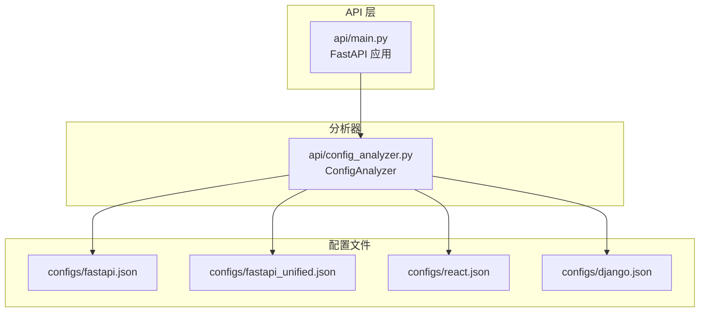
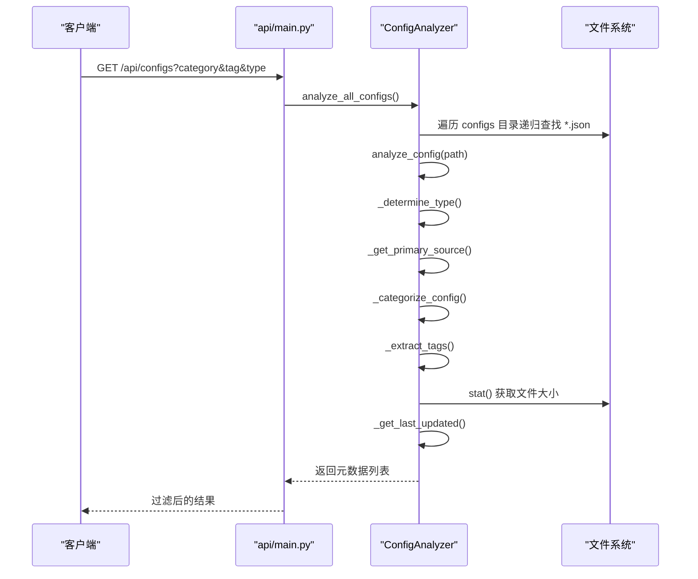
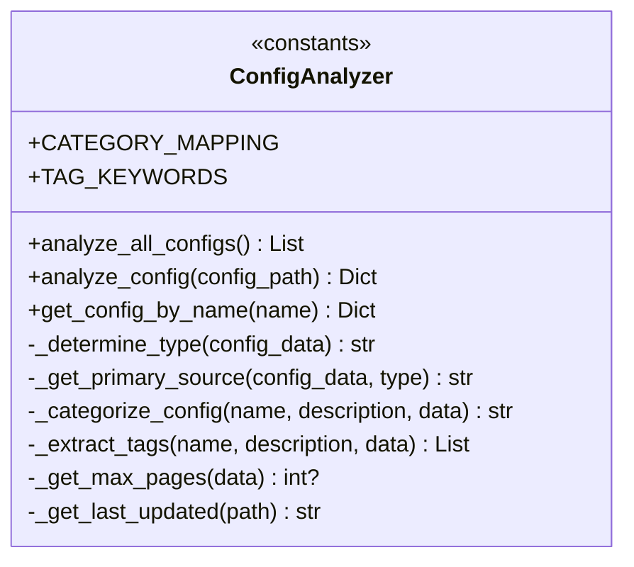
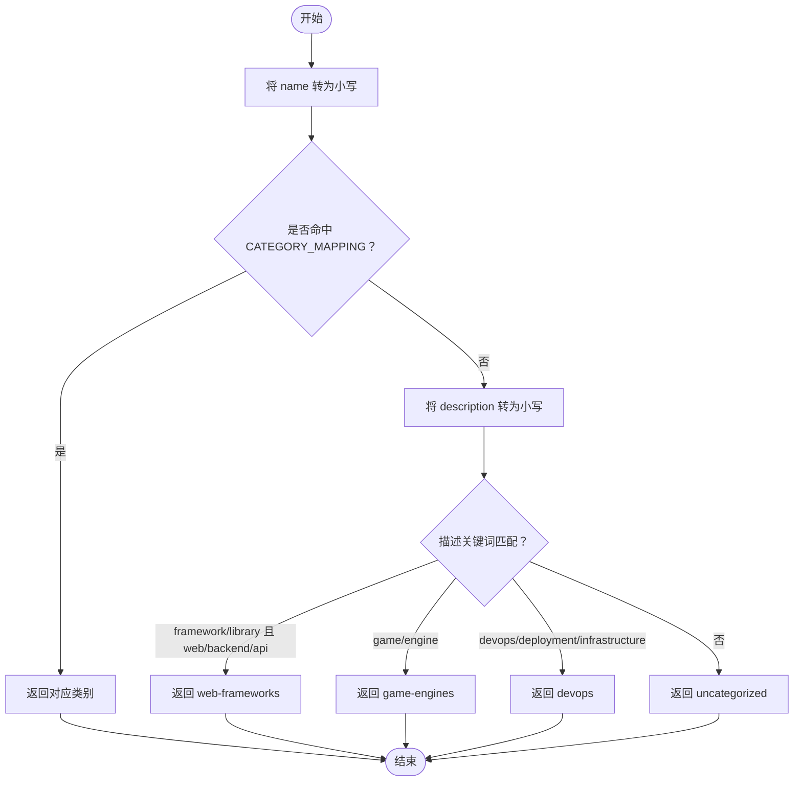
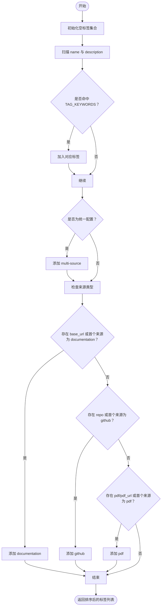
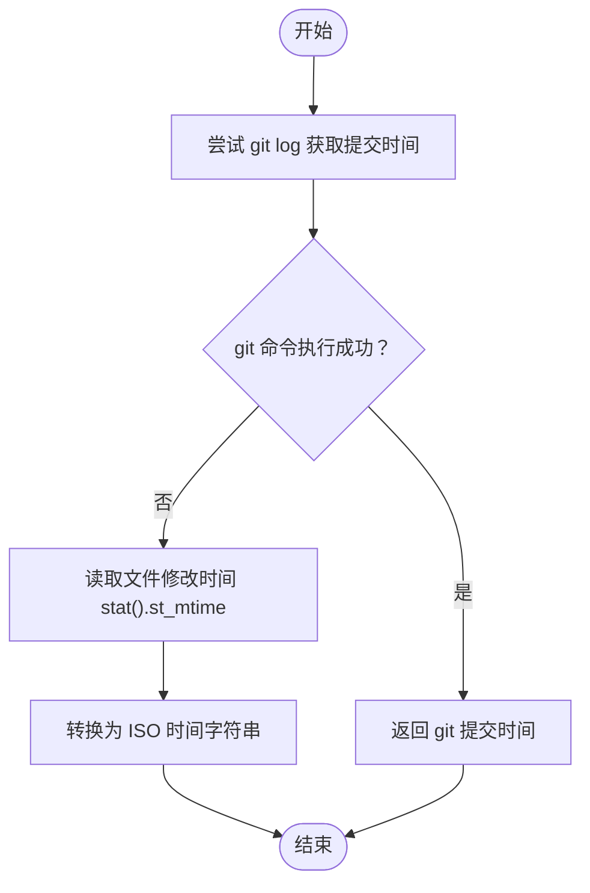
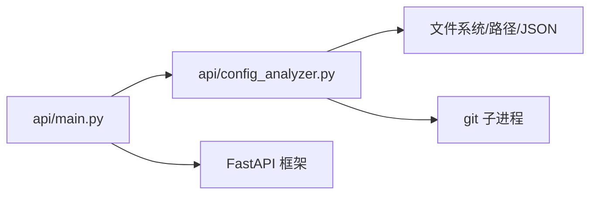

# 元数据处理逻辑

<cite>
**本文引用的文件**
- [api/config_analyzer.py](file://api/config_analyzer.py)
- [api/main.py](file://api/main.py)
- [test_api.py](file://test_api.py)
- [configs/fastapi.json](file://configs/fastapi.json)
- [configs/fastapi_unified.json](file://configs/fastapi_unified.json)
- [configs/react.json](file://configs/react.json)
- [configs/django.json](file://configs/django.json)
</cite>

## 目录
1. [简介](#简介)
2. [项目结构](#项目结构)
3. [核心组件](#核心组件)
4. [架构总览](#架构总览)
5. [详细组件分析](#详细组件分析)
6. [依赖关系分析](#依赖关系分析)
7. [性能考量](#性能考量)
8. [故障排查指南](#故障排查指南)
9. [结论](#结论)
10. [附录](#附录)

## 简介
本文件聚焦于 ConfigAnalyzer 类中的元数据处理逻辑，系统性解析以下私有方法：
- _determine_type：判断配置类型（单源/统一）
- _get_primary_source：确定主来源（URL、GitHub 仓库或 PDF）
- _categorize_config：自动分类（基于名称与内容）
- _extract_tags：从名称、描述与内容中抽取标签
- _get_last_updated：获取最后更新时间（优先 Git 历史，回退到文件修改时间）

同时解释分类映射 CATEGORY_MAPPING 与标签关键词 TAG_KEYWORDS 的实现原理，并以 fastapi.json 与 fastapi_unified.json 为实例，演示完整处理流程。

## 项目结构
- 核心分析器位于 api/config_analyzer.py，负责读取配置文件并生成标准化元数据。
- API 层位于 api/main.py，提供 REST 接口，内部调用 ConfigAnalyzer 完成分析与过滤。
- 示例配置位于 configs/，包含单源与统一两种格式的示例文件。
- 测试脚本 test_api.py 演示了如何初始化分析器并输出元数据概览。

图表来源
- [api/main.py](file://api/main.py#L61-L133)
- [api/config_analyzer.py](file://api/config_analyzer.py#L70-L148)
- [configs/fastapi.json](file://configs/fastapi.json#L1-L34)
- [configs/fastapi_unified.json](file://configs/fastapi_unified.json#L1-L46)
- [configs/react.json](file://configs/react.json#L1-L32)
- [configs/django.json](file://configs/django.json#L1-L35)

章节来源
- [api/main.py](file://api/main.py#L61-L133)
- [api/config_analyzer.py](file://api/config_analyzer.py#L70-L148)

## 核心组件
- ConfigAnalyzer：封装所有元数据提取逻辑，支持批量分析与按名称检索。
- 分析入口 analyze_all_configs 与 analyze_config：前者遍历目录递归扫描 JSON 文件，后者对单个文件进行解析与元数据组装。
- 关键私有方法：_determine_type、_get_primary_source、_categorize_config、_extract_tags、_get_last_updated。
- 配置类型识别：通过是否存在 sources 或 merge_mode 字段判断统一配置。
- 主来源推断：根据配置类型选择 first source 的类型（文档、GitHub、PDF）或单源字段（base_url、repo、pdf）。
- 自动分类：CATEGORY_MAPPING 映射 + 描述关键词辅助判定；默认“未分类”。
- 标签抽取：TAG_KEYWORDS + 配置类型与来源类型的附加标签。
- 最后更新：优先 git log 获取提交时间，失败则回退到文件修改时间。

章节来源
- [api/config_analyzer.py](file://api/config_analyzer.py#L70-L148)
- [api/config_analyzer.py](file://api/config_analyzer.py#L172-L349)

## 架构总览
下图展示 API 调用链与 ConfigAnalyzer 的处理流程：

图表来源
- [api/main.py](file://api/main.py#L61-L106)
- [api/config_analyzer.py](file://api/config_analyzer.py#L70-L148)

## 详细组件分析

### 类与方法关系图

图表来源
- [api/config_analyzer.py](file://api/config_analyzer.py#L14-L349)

### _determine_type：配置类型判定
- 统一配置判定依据：
  - 若存在 sources 数组，则为统一配置。
  - 否则若存在 merge_mode 字段，则为统一配置。
  - 否则为单源配置。
- 作用：决定后续主来源与标签抽取策略。

章节来源
- [api/config_analyzer.py](file://api/config_analyzer.py#L172-L191)

### _get_primary_source：主来源推断
- 统一配置（unified）：
  - 取 sources 第一个元素，根据其 type 决定返回值：
    - documentation：返回 base_url。
    - github：返回 github.com/<repo>。
    - pdf：返回 pdf_url 或“PDF 文件”。
  - 若 sources 为空或无匹配类型，返回“多来源”。
- 单源配置（single-source）：
  - 优先级：base_url > repo > pdf_url/pdf。
  - 若均不存在，返回“未知”。

章节来源
- [api/config_analyzer.py](file://api/config_analyzer.py#L192-L224)

### _categorize_config：自动分类
- 优先级规则：
  1) 使用 CATEGORY_MAPPING：若配置名包含任一关键字，则直接返回该类别。
  2) 描述关键词辅助：
     - 包含“framework”或“library”，且包含“web/frontend/backend/api”之一时，归为“web-frameworks”。
     - 包含“game”或“engine”时，归为“game-engines”。
     - 包含“devops/deployment/infrastructure”时，归为“devops”。
  3) 默认返回“uncategorized”。

图表来源
- [api/config_analyzer.py](file://api/config_analyzer.py#L226-L259)

章节来源
- [api/config_analyzer.py](file://api/config_analyzer.py#L226-L259)

### _extract_tags：标签抽取机制
- 基础标签：
  - 遍历 TAG_KEYWORDS，若配置名或描述包含任一关键词，则加入对应标签集合。
- 类型标签：
  - 若为统一配置，追加“multi-source”。
- 来源类型标签：
  - 若存在 base_url 或统一配置首个来源为 documentation，追加“documentation”。
  - 若存在 repo 或统一配置首个来源为 github，追加“github”。
  - 若存在 pdf/pdf_url 或统一配置首个来源为 pdf，追加“pdf”。
- 输出：去重后排序的字符串列表。

图表来源
- [api/config_analyzer.py](file://api/config_analyzer.py#L260-L296)

章节来源
- [api/config_analyzer.py](file://api/config_analyzer.py#L260-L296)

### _get_last_updated：最后更新时间
- 优先策略：
  - 执行 git log -1 --format=%cI 获取文件最后一次提交时间。
  - 若成功，返回 ISO 时间字符串。
- 回退策略：
  - 失败或异常时，使用文件 stat().st_mtime 并转换为 ISO 时间字符串。

图表来源
- [api/config_analyzer.py](file://api/config_analyzer.py#L320-L349)

章节来源
- [api/config_analyzer.py](file://api/config_analyzer.py#L320-L349)

### 实例演示：fastapi.json（单源）
- 输入配置要点：
  - name、description、base_url、start_urls、selectors、url_patterns、categories、rate_limit、max_pages。
- 处理步骤：
  1) _determine_type：无 sources 且无 merge_mode，返回“single-source”。
  2) _get_primary_source：存在 base_url，返回该 URL。
  3) _categorize_config：name 包含“fastapi”，命中 CATEGORY_MAPPING 中的“web-frameworks”。
  4) _extract_tags：命中“python”、“backend”、“api”等关键词；由于是单源，不添加“multi-source”；存在 base_url，添加“documentation”。
  5) 文件元信息：file_size 由 stat 获取；last_updated 优先 git，失败回退文件修改时间。
  6) max_pages：直接取配置中的值。
- 输出字段：name、description、type、category、tags、primary_source、max_pages、file_size、last_updated、download_url、config_file。

章节来源
- [configs/fastapi.json](file://configs/fastapi.json#L1-L34)
- [api/config_analyzer.py](file://api/config_analyzer.py#L172-L349)

### 实例演示：fastapi_unified.json（统一配置）
- 输入配置要点：
  - name、description、merge_mode、sources（包含 documentation 与 github 两类）。
- 处理步骤：
  1) _determine_type：存在 sources，返回“unified”。
  2) _get_primary_source：取第一个来源（documentation），返回 base_url。
  3) _categorize_config：name 包含“fastapi”，命中 CATEGORY_MAPPING 中的“web-frameworks”。
  4) _extract_tags：命中“python”、“backend”、“api”等关键词；由于是统一配置，添加“multi-source”；首个来源为 documentation，添加“documentation”；第二个来源为 github，添加“github”。
  5) max_pages：从第一个 documentation 来源取值。
  6) last_updated：同上优先 git，失败回退文件修改时间。
- 输出字段：与单源一致，但 tags 会包含“multi-source”、“documentation”、“github”。

章节来源
- [configs/fastapi_unified.json](file://configs/fastapi_unified.json#L1-L46)
- [api/config_analyzer.py](file://api/config_analyzer.py#L172-L349)

### API 集成与过滤
- 列表接口：/api/configs 支持按 category、tag、type 过滤。
- 详情接口：/api/configs/{name} 返回指定配置的完整元数据。
- 下载接口：/api/download/{name} 支持安全下载配置文件。

章节来源
- [api/main.py](file://api/main.py#L61-L133)
- [api/main.py](file://api/main.py#L140-L209)

## 依赖关系分析
- ConfigAnalyzer 依赖：
  - 文件系统：读取 JSON、stat 获取文件大小、路径操作。
  - Git：通过子进程调用 git log 获取提交时间。
  - 标准库：json、os、subprocess、pathlib、typing、datetime。
- API 层依赖：
  - FastAPI：路由定义、HTTP 异常处理。
  - ConfigAnalyzer：元数据分析与过滤。

图表来源
- [api/main.py](file://api/main.py#L1-L220)
- [api/config_analyzer.py](file://api/config_analyzer.py#L1-L349)

章节来源
- [api/main.py](file://api/main.py#L1-L220)
- [api/config_analyzer.py](file://api/config_analyzer.py#L1-L349)

## 性能考量
- 扫描策略：递归遍历 configs 目录下的所有 JSON 文件，时间复杂度 O(N)，N 为 JSON 文件数量。
- 解析成本：每个文件 JSON 解码一次，IO 密集；CPU 成本低。
- Git 查询：对每个文件执行一次 git log，整体 O(N)；在大型仓库中可能成为瓶颈。
- 缓存建议：
  - 对 last_updated 可做本地缓存（如基于文件路径+mtime 的键）以减少重复 git 调用。
  - 对常用查询结果可做内存缓存（如按 category/tag/type 的索引）。
- I/O 优化：
  - 批量读取与并发（受限于 JSON 解码与 git 调用的串行性）。
  - 减少不必要的 stat 调用，仅在需要时获取文件大小。

## 故障排查指南
- JSON 解析错误：
  - 现象：打印“无效 JSON”并跳过该文件。
  - 排查：检查配置文件语法与编码。
- Git 不可用：
  - 现象：_get_last_updated 回退到文件修改时间。
  - 排查：确认当前工作目录为 Git 仓库根，或允许回退逻辑生效。
- 配置缺少必要字段：
  - 现象：name 缺失时直接返回 None，不会被纳入结果。
  - 排查：确保每个配置包含 name 字段。
- API 过滤无效：
  - 现象：过滤参数未生效。
  - 排查：确认传入的 category、tag、type 与实际元数据一致。

章节来源
- [api/config_analyzer.py](file://api/config_analyzer.py#L149-L154)
- [api/config_analyzer.py](file://api/config_analyzer.py#L320-L349)
- [api/main.py](file://api/main.py#L61-L106)

## 结论
ConfigAnalyzer 将配置文件标准化为统一的元数据结构，关键在于：
- 通过 _determine_type 与 _get_primary_source 精准识别来源形态与主来源；
- 通过 _categorize_config 与 _extract_tags 建立可搜索、可过滤的分类与标签体系；
- 通过 _get_last_updated 提供版本演进的时间线索；
- 在 API 层完成高效过滤与下载能力。

对于 fastapi.json 与 fastapi_unified.json，上述流程清晰地展示了从输入到输出的完整链路，便于扩展更多配置文件与增强自动化能力。

## 附录
- 快速验证：
  - 使用 test_api.py 初始化 ConfigAnalyzer 并输出前若干条元数据概览，统计各类别数量，验证分类与标签效果。
- 常见配置样例参考：
  - 单源：react.json、django.json
  - 统一：fastapi_unified.json

章节来源
- [test_api.py](file://test_api.py#L1-L41)
- [configs/react.json](file://configs/react.json#L1-L32)
- [configs/django.json](file://configs/django.json#L1-L35)
- [configs/fastapi_unified.json](file://configs/fastapi_unified.json#L1-L46)