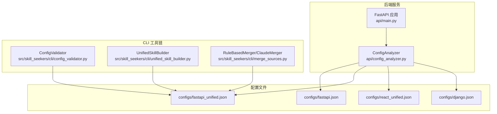
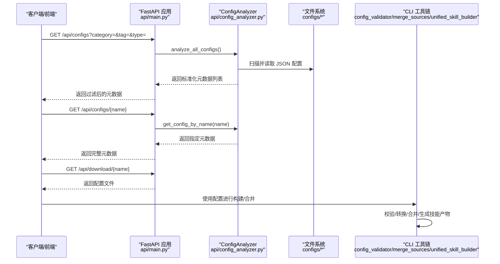
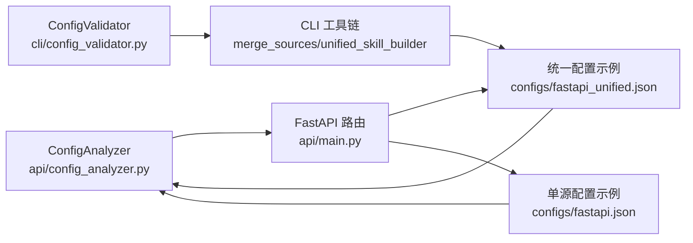

# 元数据字段说明

<cite>
**本文引用的文件**
- [api/config_analyzer.py](file://api/config_analyzer.py)
- [api/main.py](file://api/main.py)
- [src/skill_seekers/cli/config_validator.py](file://src/skill_seekers/cli/config_validator.py)
- [src/skill_seekers/cli/unified_skill_builder.py](file://src/skill_seekers/cli/unified_skill_builder.py)
- [src/skill_seekers/cli/merge_sources.py](file://src/skill_seekers/cli/merge_sources.py)
- [configs/fastapi.json](file://configs/fastapi.json)
- [configs/fastapi_unified.json](file://configs/fastapi_unified.json)
- [configs/react_unified.json](file://configs/react_unified.json)
- [configs/django.json](file://configs/django.json)
</cite>

## 目录
1. [简介](#简介)
2. [项目结构与元数据来源](#项目结构与元数据来源)
3. [核心元数据字段详解](#核心元数据字段详解)
4. [架构总览](#架构总览)
5. [组件与流程深度解析](#组件与流程深度解析)
6. [依赖关系分析](#依赖关系分析)
7. [性能与可扩展性考量](#性能与可扩展性考量)
8. [故障排查指南](#故障排查指南)
9. [结论](#结论)
10. [附录：字段取值与业务含义对照表](#附录字段取值与业务含义对照表)

## 简介
本文件围绕“配置元数据模型”展开，系统解释各字段的数据类型、取值范围与业务含义，并通过 fastapi.json（单源）与 fastapi_unified.json（统一多源）的对比，说明元数据如何影响技能的分类、检索与使用。同时结合后端 API 的实现与 CLI 工具链，给出端到端的数据流与处理逻辑，帮助读者从工程实践角度理解元数据的价值与约束。

## 项目结构与元数据来源
- 元数据提取由后端服务负责，核心类为 ConfigAnalyzer，它会扫描 configs 目录下的所有 JSON 配置文件，解析并生成标准化元数据。
- 前端/客户端可通过 /api/configs 与 /api/configs/{name} 获取元数据；下载接口 /api/download/{name} 提供配置文件本身。
- CLI 工具链负责配置校验、统一化转换、合并策略选择以及最终技能产物的生成。

图表来源
- [api/main.py](file://api/main.py#L61-L120)
- [api/config_analyzer.py](file://api/config_analyzer.py#L91-L148)
- [src/skill_seekers/cli/config_validator.py](file://src/skill_seekers/cli/config_validator.py#L86-L120)
- [src/skill_seekers/cli/unified_skill_builder.py](file://src/skill_seekers/cli/unified_skill_builder.py#L30-L71)
- [src/skill_seekers/cli/merge_sources.py](file://src/skill_seekers/cli/merge_sources.py#L450-L489)

章节来源
- [api/main.py](file://api/main.py#L61-L120)
- [api/config_analyzer.py](file://api/config_analyzer.py#L91-L148)

## 核心元数据字段详解
以下字段均由 ConfigAnalyzer 在解析配置时生成，用于前端检索、分类与下载等用途。字段类型与取值范围以实际实现为准。

- 字段：name
  - 类型：字符串
  - 取值范围：非空字符串，通常为小写、短横线或下划线分隔的标识符
  - 业务含义：配置的唯一标识，作为检索与下载的关键键值
  - 实现要点：若配置缺少该字段，将被跳过不纳入元数据列表
  - 章节来源
    - [api/config_analyzer.py](file://api/config_analyzer.py#L106-L110)

- 字段：description
  - 类型：字符串
  - 取值范围：任意 UTF-8 文本
  - 业务含义：简要描述该配置的用途与覆盖范围
  - 章节来源
    - [api/config_analyzer.py](file://api/config_analyzer.py#L110-L112)

- 字段：type
  - 类型：字符串
  - 取值范围："single-source" 或 "unified"
  - 业务含义：区分单源配置与统一多源配置；影响前端筛选与后续处理策略
  - 实现要点：通过是否存在 sources 数组或 merge_mode 字段判断
  - 章节来源
    - [api/config_analyzer.py](file://api/config_analyzer.py#L172-L191)
    - [src/skill_seekers/cli/config_validator.py](file://src/skill_seekers/cli/config_validator.py#L61-L70)

- 字段：category
  - 类型：字符串
  - 取值范围：预定义类别之一（如 web-frameworks、game-engines、devops、css-frameworks、uncategorized）
  - 业务含义：自动分类，便于按领域检索
  - 实现要点：基于名称关键词与描述关键词映射，若无法判定则归为 uncategorized
  - 章节来源
    - [api/config_analyzer.py](file://api/config_analyzer.py#L226-L259)

- 字段：tags
  - 类型：字符串数组
  - 取值范围：预定义标签集合（如 javascript、python、backend、frontend、documentation、github、pdf、multi-source 等）
  - 业务含义：细粒度筛选与关联推荐的重要维度
  - 实现要点：基于名称与描述关键词匹配，附加根据配置类型与来源类型动态添加的标签
  - 章节来源
    - [api/config_analyzer.py](file://api/config_analyzer.py#L260-L297)
    - [src/skill_seekers/cli/config_validator.py](file://src/skill_seekers/cli/config_validator.py#L282-L300)

- 字段：primary_source
  - 类型：字符串
  - 取值范围：文档站点 URL、GitHub 仓库地址、PDF 文件标识或 "Multiple sources"/"Unknown"
  - 业务含义：主数据源的直观标识，便于用户快速定位原始资料
  - 实现要点：统一配置取首个源；单源配置优先 base_url/repo/pdf，否则回退
  - 章节来源
    - [api/config_analyzer.py](file://api/config_analyzer.py#L192-L225)

- 字段：max_pages
  - 类型：整数（可选）
  - 取值范围：正整数或未设置
  - 业务含义：用于估算抓取规模与资源预算；统一配置优先取文档源的 max_pages
  - 实现要点：单源直接取配置项；统一配置从第一个文档源中取值
  - 章节来源
    - [api/config_analyzer.py](file://api/config_analyzer.py#L298-L319)

- 字段：file_size
  - 类型：整数
  - 取值范围：非负整数（字节）
  - 业务含义：配置文件大小，辅助存储与传输成本评估
  - 实现要点：通过文件系统统计
  - 章节来源
    - [api/config_analyzer.py](file://api/config_analyzer.py#L126-L126)

- 字段：last_updated
  - 类型：字符串（ISO 8601）
  - 取值范围：合法 ISO 时间戳
  - 业务含义：最近更新时间，支持按时间排序与新鲜度判断
  - 实现要点：优先从 Git 历史获取，失败回退到文件修改时间
  - 章节来源
    - [api/config_analyzer.py](file://api/config_analyzer.py#L320-L349)

- 字段：download_url
  - 类型：字符串（URL）
  - 取值范围：基于后端基础 URL 与配置名拼接的下载链接
  - 业务含义：提供直接下载配置文件的能力
  - 章节来源
    - [api/config_analyzer.py](file://api/config_analyzer.py#L129-L131)
    - [api/main.py](file://api/main.py#L167-L209)

- 字段：config_file
  - 类型：字符串
  - 取值范围：配置文件名（含 .json 后缀）
  - 业务含义：用于前端显示与下载路径拼接
  - 章节来源
    - [api/config_analyzer.py](file://api/config_analyzer.py#L146-L146)

## 架构总览
下图展示了从配置文件到元数据、再到 API 暴露与 CLI 使用的整体流程。

图表来源
- [api/main.py](file://api/main.py#L61-L120)
- [api/config_analyzer.py](file://api/config_analyzer.py#L70-L148)
- [src/skill_seekers/cli/config_validator.py](file://src/skill_seekers/cli/config_validator.py#L86-L120)
- [src/skill_seekers/cli/merge_sources.py](file://src/skill_seekers/cli/merge_sources.py#L450-L489)
- [src/skill_seekers/cli/unified_skill_builder.py](file://src/skill_seekers/cli/unified_skill_builder.py#L30-L71)

## 组件与流程深度解析

### 单源 vs 统一配置在元数据上的差异（以 fastapi.json 与 fastapi_unified.json 为例）
- 单源配置（fastapi.json）
  - 元数据字段：包含 name、description、type（single-source）、category、tags、primary_source（base_url）、max_pages 等
  - 特点：字段相对简洁，适合单一文档站点抓取场景
  - 章节来源
    - [configs/fastapi.json](file://configs/fastapi.json#L1-L34)
    - [api/config_analyzer.py](file://api/config_analyzer.py#L172-L225)

- 统一配置（fastapi_unified.json）
  - 元数据字段：包含 name、description、type（unified）、category、tags、primary_source（取自 sources 第一个源）、max_pages（取自文档源）、merge_mode 等
  - 特点：支持多源（文档、GitHub、PDF），tags 中会自动添加 multi-source、documentation、github、pdf 等标签
  - 章节来源
    - [configs/fastapi_unified.json](file://configs/fastapi_unified.json#L1-L46)
    - [api/config_analyzer.py](file://api/config_analyzer.py#L172-L225)
    - [api/config_analyzer.py](file://api/config_analyzer.py#L260-L297)

- 关键差异对比
  - type：单源为 single-source，统一为 unified
  - primary_source：单源直接取 base_url/repo/pdf；统一取 sources 第一个源的标识
  - tags：统一配置会额外标注 multi-source、documentation、github、pdf 等
  - max_pages：统一配置优先取文档源的 max_pages
  - 章节来源
    - [api/config_analyzer.py](file://api/config_analyzer.py#L172-L225)
    - [api/config_analyzer.py](file://api/config_analyzer.py#L260-L297)
    - [api/config_analyzer.py](file://api/config_analyzer.py#L298-L319)

### 元数据如何影响技能的分类、检索与使用
- 分类（category）
  - 通过名称与描述关键词映射到固定类别，便于按领域筛选
  - 章节来源
    - [api/config_analyzer.py](file://api/config_analyzer.py#L226-L259)
    - [api/main.py](file://api/main.py#L140-L165)

- 标签（tags）
  - 动态提取语言、技术栈、来源类型等标签，支持更细粒度筛选
  - 章节来源
    - [api/config_analyzer.py](file://api/config_analyzer.py#L260-L297)
    - [api/main.py](file://api/main.py#L61-L100)

- 下载与使用
  - 通过 download_url 直接获取配置文件，结合 CLI 工具链完成构建与合并
  - 章节来源
    - [api/config_analyzer.py](file://api/config_analyzer.py#L129-L131)
    - [api/main.py](file://api/main.py#L167-L209)
    - [src/skill_seekers/cli/config_validator.py](file://src/skill_seekers/cli/config_validator.py#L86-L120)
    - [src/skill_seekers/cli/merge_sources.py](file://src/skill_seekers/cli/merge_sources.py#L450-L489)
    - [src/skill_seekers/cli/unified_skill_builder.py](file://src/skill_seekers/cli/unified_skill_builder.py#L30-L71)

### 元数据字段在 API 中的使用
- 列表接口：支持按 category、tag、type 过滤
- 详情接口：返回完整元数据（含所有字段）
- 下载接口：根据配置名返回对应 JSON 文件
- 章节来源
  - [api/main.py](file://api/main.py#L61-L120)
  - [api/main.py](file://api/main.py#L140-L209)

### 元数据字段在 CLI 中的作用
- 验证与转换：确保统一配置格式正确，必要时将旧格式转换为统一格式
- 合并策略：根据 merge_mode（rule-based 或 claude-enhanced）决定 API 合并方式
- 技能构建：UnifiedSkillBuilder 依据配置生成 SKILL.md 与 references 目录
- 章节来源
  - [src/skill_seekers/cli/config_validator.py](file://src/skill_seekers/cli/config_validator.py#L86-L120)
  - [src/skill_seekers/cli/merge_sources.py](file://src/skill_seekers/cli/merge_sources.py#L450-L489)
  - [src/skill_seekers/cli/unified_skill_builder.py](file://src/skill_seekers/cli/unified_skill_builder.py#L30-L71)

## 依赖关系分析
- ConfigAnalyzer 依赖文件系统扫描与 Git 历史（last_updated）
- API 层依赖 ConfigAnalyzer 提供的元数据
- CLI 层依赖 ConfigValidator 与合并器，进一步依赖配置的 type 与 sources 结构
- 统一配置对多源能力有更强依赖，因此 tags 与 primary_source 的推断更复杂

图表来源
- [api/config_analyzer.py](file://api/config_analyzer.py#L91-L148)
- [api/main.py](file://api/main.py#L61-L120)
- [src/skill_seekers/cli/config_validator.py](file://src/skill_seekers/cli/config_validator.py#L86-L120)
- [src/skill_seekers/cli/merge_sources.py](file://src/skill_seekers/cli/merge_sources.py#L450-L489)
- [src/skill_seekers/cli/unified_skill_builder.py](file://src/skill_seekers/cli/unified_skill_builder.py#L30-L71)

## 性能与可扩展性考量
- 元数据生成开销主要来自文件系统扫描与 Git 历史查询；建议：
  - 对大型仓库启用增量扫描或缓存最近更新时间
  - 将 configs 目录结构保持扁平或有限层级，减少递归遍历成本
- 统一配置的 tags 计算与 max_pages 推断会增加少量 CPU 开销，但收益显著（提升检索质量）
- API 层面的过滤（category/tag/type）可在数据库层进一步优化（当前为内存过滤）

## 故障排查指南
- 配置缺失关键字段
  - 现象：该配置不会出现在元数据列表中
  - 处理：确保包含 name 字段
  - 章节来源
    - [api/config_analyzer.py](file://api/config_analyzer.py#L106-L110)

- 统一配置格式错误
  - 现象：校验抛出异常，提示无效类型或必填字段缺失
  - 处理：参考统一配置校验规则，补齐 sources、type、base_url/repo/path 等
  - 章节来源
    - [src/skill_seekers/cli/config_validator.py](file://src/skill_seekers/cli/config_validator.py#L86-L120)
    - [src/skill_seekers/cli/config_validator.py](file://src/skill_seekers/cli/config_validator.py#L136-L190)

- 下载失败
  - 现象：/api/download/{name} 返回 404
  - 处理：确认配置名与文件名一致且存在于 configs 目录
  - 章节来源
    - [api/main.py](file://api/main.py#L167-L209)

- last_updated 异常
  - 现象：回退到文件修改时间
  - 处理：检查 Git 仓库状态或权限
  - 章节来源
    - [api/config_analyzer.py](file://api/config_analyzer.py#L320-L349)

## 结论
元数据字段是连接“配置文件—后端 API—CLI 工具链”的桥梁。通过标准化的字段定义与严格的提取/校验流程，系统实现了：
- 明确的分类与标签体系，提升检索效率
- 清晰的来源与规模估计，指导抓取与合并策略
- 一致的下载与使用体验，降低用户上手成本

在单源与统一配置之间，元数据的差异体现了不同场景下的权衡：前者简洁高效，后者丰富全面。合理利用这些字段，可以显著提升技能的可用性与可维护性。

## 附录：字段取值与业务含义对照表
- name：字符串，唯一标识，用于检索与下载
- description：字符串，用途说明
- type：字符串，single-source 或 unified
- category：字符串，自动分类（如 web-frameworks、game-engines、devops、css-frameworks、uncategorized）
- tags：字符串数组，语言/技术/来源标签（如 javascript、python、backend、frontend、documentation、github、pdf、multi-source）
- primary_source：字符串，文档 URL、GitHub 仓库或 PDF 标识
- max_pages：整数（可选），抓取规模估算
- file_size：整数（字节），配置文件大小
- last_updated：字符串（ISO 8601），最后更新时间
- download_url：字符串（URL），配置文件下载链接
- config_file：字符串，配置文件名

章节来源
- [api/config_analyzer.py](file://api/config_analyzer.py#L129-L147)
- [api/main.py](file://api/main.py#L61-L120)