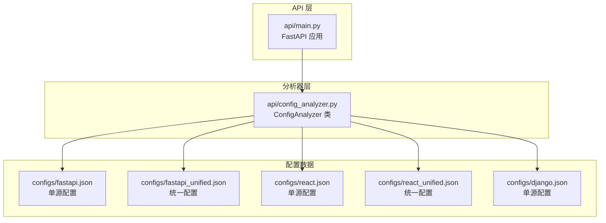
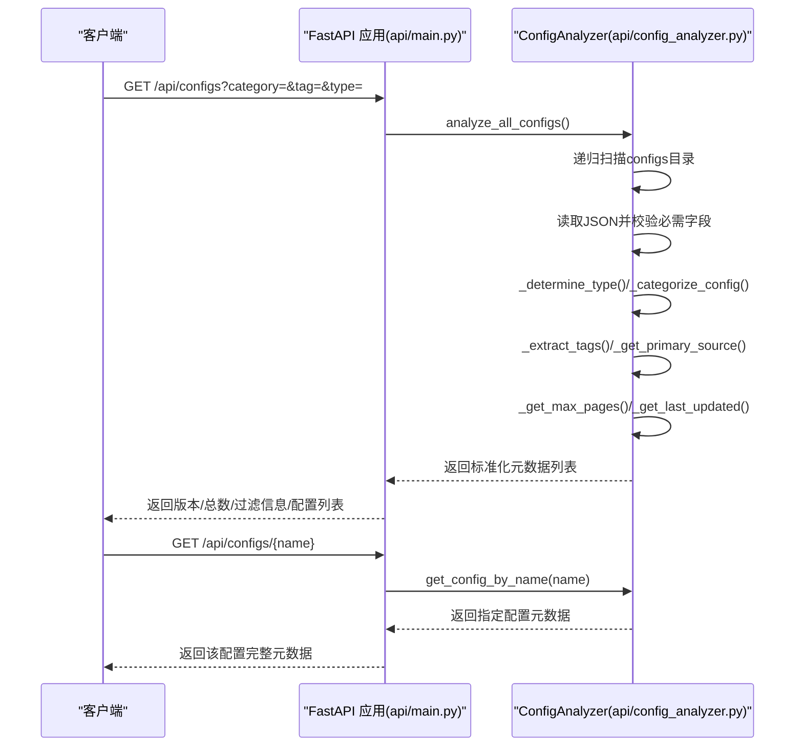
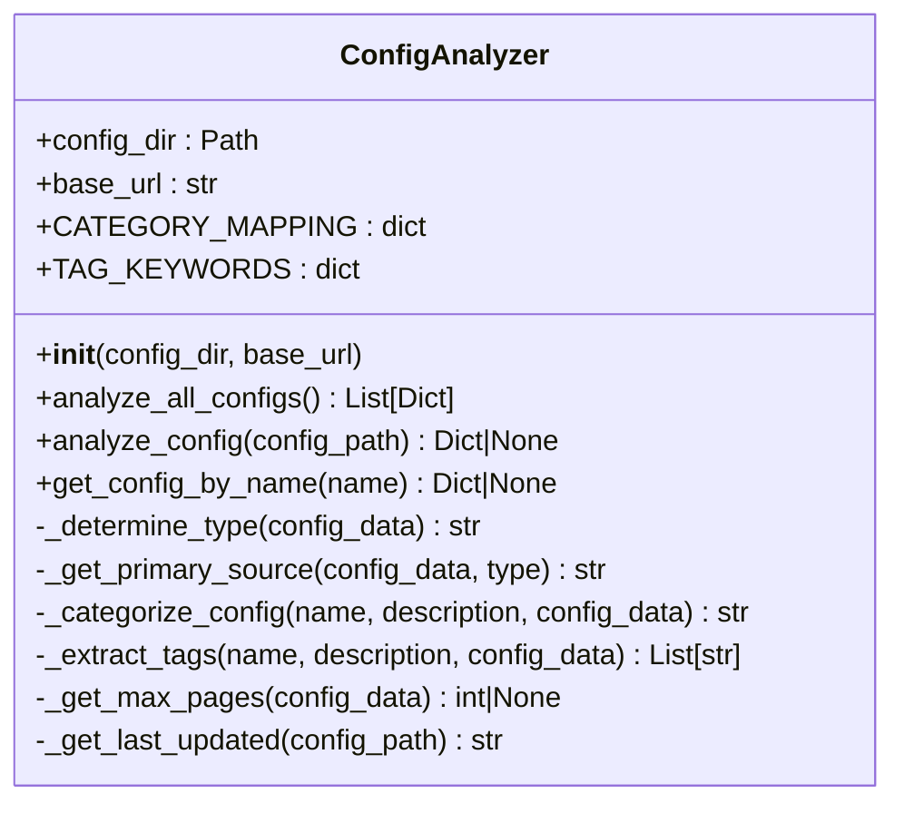
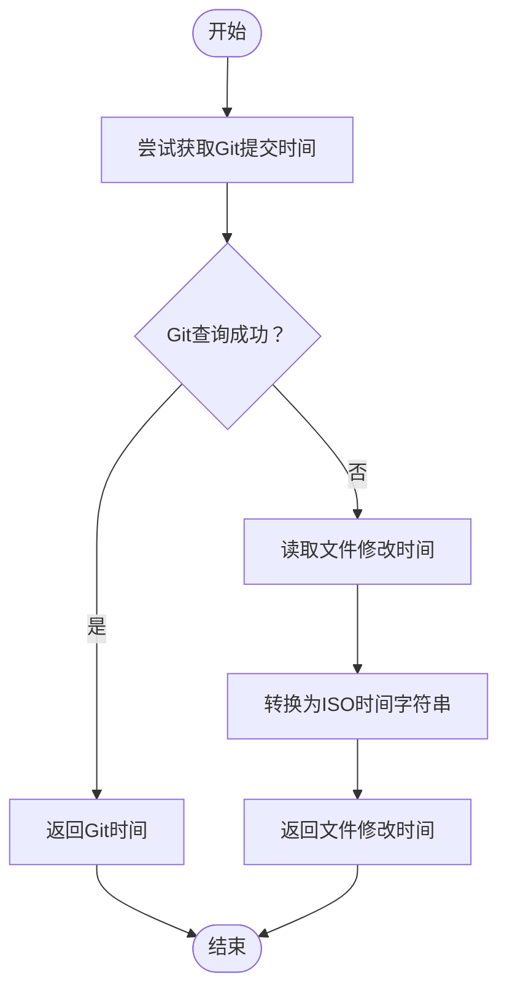
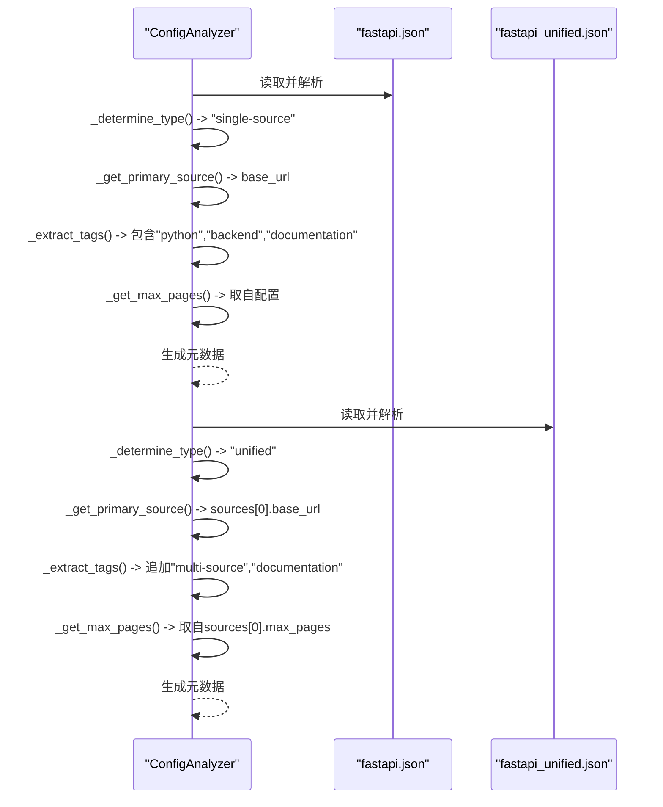
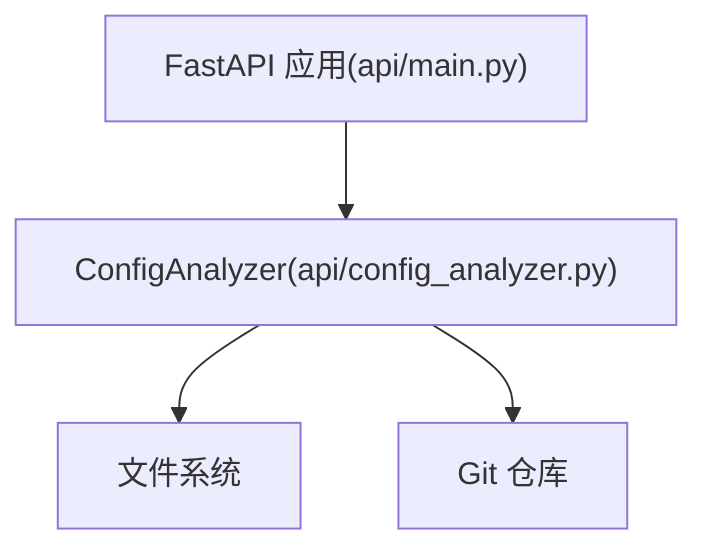

# 配置元数据模型

<cite>
**本文引用的文件**
- [api/config_analyzer.py](file://api/config_analyzer.py)
- [api/main.py](file://api/main.py)
- [configs/fastapi.json](file://configs/fastapi.json)
- [configs/fastapi_unified.json](file://configs/fastapi_unified.json)
- [configs/react.json](file://configs/react.json)
- [configs/react_unified.json](file://configs/react_unified.json)
- [configs/django.json](file://configs/django.json)
</cite>

## 目录
1. [简介](#简介)
2. [项目结构](#项目结构)
3. [核心组件](#核心组件)
4. [架构总览](#架构总览)
5. [详细组件分析](#详细组件分析)
6. [依赖关系分析](#依赖关系分析)
7. [性能考量](#性能考量)
8. [故障排查指南](#故障排查指南)
9. [结论](#结论)
10. [附录](#附录)

## 简介
本文件系统性阐述“配置元数据模型”，围绕 ConfigAnalyzer 类的实现，说明其如何从 JSON 配置文件中提取并标准化元数据，涵盖字段：name、description、type（单源/统一）、category、tags、primary_source、max_pages、file_size、last_updated、download_url，并解释分类映射与标签提取机制，以及 last_updated 的来源策略（Git 历史优先、文件修改时间回退）。同时以 fastapi.json 与 fastapi_unified.json 为例，对比单源与统一配置在元数据上的差异。

## 项目结构
- 元数据抽取核心位于 api/config_analyzer.py，提供 ConfigAnalyzer 类，负责读取 configs 目录下的所有 JSON 配置文件，逐个解析并生成标准化元数据字典。
- API 层位于 api/main.py，通过 FastAPI 暴露 /api/configs、/api/configs/{name}、/api/categories、/api/download/{name} 等端点，供前端或外部系统查询与下载配置。
- 示例配置位于 configs/ 目录，包含单源与统一两种形态的配置样例，便于对照理解元数据差异。

图表来源
- [api/main.py](file://api/main.py#L33-L138)
- [api/config_analyzer.py](file://api/config_analyzer.py#L70-L148)
- [configs/fastapi.json](file://configs/fastapi.json#L1-L34)
- [configs/fastapi_unified.json](file://configs/fastapi_unified.json#L1-L46)
- [configs/react.json](file://configs/react.json#L1-L32)
- [configs/react_unified.json](file://configs/react_unified.json#L1-L45)
- [configs/django.json](file://configs/django.json#L1-L35)

章节来源
- [api/main.py](file://api/main.py#L33-L138)
- [api/config_analyzer.py](file://api/config_analyzer.py#L70-L148)

## 核心组件
- ConfigAnalyzer 类
  - 职责：递归扫描 configs 目录，读取每个 JSON 配置，提取并标准化元数据；支持按名称检索、按类别/标签/类型过滤。
  - 关键能力：
    - 类型判定：依据是否存在 sources 或 merge_mode 字段判断“单源”或“统一”。
    - 主要来源(primary_source)：根据配置内容选择 base_url、repo、pdf_url 或统一配置中的首个有效来源。
    - 自动分类(category)：基于 CATEGORY_MAPPING 映射与描述关键词进行分类。
    - 标签提取(tags)：基于 TAG_KEYWORDS 与配置类型/来源类型动态打标。
    - 最大页数(max_pages)：优先取配置自身，否则从统一配置的第一个文档来源取值。
    - 文件大小(file_size)：直接取文件系统大小。
    - 更新时间(last_updated)：优先取 Git 提交时间，失败则回退到文件修改时间。
    - 下载链接(download_url)：基于 base_url 与文件名拼接。
- API 层
  - 提供列表、详情、分类统计、下载等接口，内部调用 ConfigAnalyzer 完成元数据提取与过滤。

章节来源
- [api/config_analyzer.py](file://api/config_analyzer.py#L14-L148)
- [api/main.py](file://api/main.py#L61-L138)

## 架构总览
下图展示了从请求到返回标准化元数据的整体流程，包括类型判定、分类、标签、来源、更新时间与下载链接的生成路径。

图表来源
- [api/main.py](file://api/main.py#L61-L138)
- [api/config_analyzer.py](file://api/config_analyzer.py#L70-L148)

## 详细组件分析

### ConfigAnalyzer 类
- 字段提取与标准化
  - 必需字段：name（缺失则跳过）、description（默认空字符串）。
  - 可选字段：type、category、tags、primary_source、max_pages、file_size、last_updated、download_url、config_file。
- 类型判定(_determine_type)
  - 若存在 sources 或 merge_mode，则标记为“统一”；否则为“单源”。
- 主要来源(_get_primary_source)
  - 统一配置：优先取 sources 中第一个条目的 base_url、repo 或 pdf_url；若无则标注为“Multiple sources”。
  - 单源配置：优先 base_url，其次 repo，再其次 pdf_url/pdf，最后 Unknown。
- 分类(_categorize_config)
  - 使用 CATEGORY_MAPPING 进行关键字匹配；若未命中，基于 description 中的关键词推断；默认“uncategorized”。
- 标签(_extract_tags)
  - 使用 TAG_KEYWORDS 进行关键字匹配；追加配置类型标签“multi-source”（统一配置）；追加来源类型标签“documentation/github/pdf”。
- 最大页数(_get_max_pages)
  - 单源：取配置中的 max_pages。
  - 统一：取 sources 中第一个“documentation”类型的 max_pages。
- 文件大小与更新时间
  - file_size：直接取文件系统大小。
  - last_updated：优先执行 git log 获取提交时间；失败则回退到文件修改时间。
- 下载链接(_get_download_url)
  - 基于 base_url 与文件名拼接，形成可下载链接。

图表来源
- [api/config_analyzer.py](file://api/config_analyzer.py#L14-L148)

章节来源
- [api/config_analyzer.py](file://api/config_analyzer.py#L14-L148)

### 分类逻辑与标签提取机制
- 分类映射(CATEGORY_MAPPING)
  - 以关键词集合对配置进行自动分类，如 web-frameworks、game-engines、devops、css-frameworks、development-tools、gaming、testing。
  - 若 name 未命中，会进一步检查 description 中是否包含“framework/library/web/frontend/backend/api/game/devops/deployment/infrastructure”等关键词，以提升准确性。
- 标签提取(TAG_KEYWORDS)
  - 以关键词集合对配置进行多语言/技术栈标签打标，如 javascript、python、php、frontend、backend、css、game-development、devops、documentation、testing。
  - 同时追加来源类型标签与配置类型标签，确保检索与筛选更灵活。

章节来源
- [api/config_analyzer.py](file://api/config_analyzer.py#L17-L54)
- [api/config_analyzer.py](file://api/config_analyzer.py#L226-L297)

### last_updated 的确定策略
- 优先使用 Git 历史
  - 通过 git log -1 --format=%cI 获取文件最近一次提交的时间戳，格式化为 ISO 时间字符串。
- 回退到文件修改时间
  - 若 Git 查询失败或不可用，则使用文件 stat().st_mtime 并转换为 ISO 时间字符串。

图表来源
- [api/config_analyzer.py](file://api/config_analyzer.py#L320-L349)

章节来源
- [api/config_analyzer.py](file://api/config_analyzer.py#L320-L349)

### 单源 vs 统一配置的元数据差异（以 fastapi 为例）
- 单源配置 fastapi.json
  - type：single-source
  - primary_source：来自 base_url
  - tags：可能包含“python”“backend”“documentation”等
  - max_pages：取自配置本身
  - category：由 CATEGORY_MAPPING 推断为“web-frameworks”
- 统一配置 fastapi_unified.json
  - type：unified
  - primary_source：取自 sources 中首个条目（此处为 documentation 的 base_url）
  - tags：除上述外，还会追加“multi-source”“documentation”
  - max_pages：取自 sources 中第一个“documentation”的 max_pages
  - category：仍为“web-frameworks”

图表来源
- [api/config_analyzer.py](file://api/config_analyzer.py#L172-L225)
- [api/config_analyzer.py](file://api/config_analyzer.py#L226-L297)
- [api/config_analyzer.py](file://api/config_analyzer.py#L298-L319)
- [configs/fastapi.json](file://configs/fastapi.json#L1-L34)
- [configs/fastapi_unified.json](file://configs/fastapi_unified.json#L1-L46)

章节来源
- [configs/fastapi.json](file://configs/fastapi.json#L1-L34)
- [configs/fastapi_unified.json](file://configs/fastapi_unified.json#L1-L46)
- [api/config_analyzer.py](file://api/config_analyzer.py#L172-L225)
- [api/config_analyzer.py](file://api/config_analyzer.py#L226-L297)
- [api/config_analyzer.py](file://api/config_analyzer.py#L298-L319)

### 其他示例对比：react 与 django
- react.json（单源）
  - type：single-source
  - primary_source：来自 base_url
  - tags：可能包含“javascript”“frontend”“documentation”
  - max_pages：取自配置本身
- react_unified.json（统一）
  - type：unified
  - primary_source：取自 sources 中首个条目（此处为 documentation 的 base_url）
  - tags：追加“multi-source”“documentation”
  - max_pages：取自 sources 中第一个“documentation”的 max_pages
- django.json（单源）
  - type：single-source
  - primary_source：来自 base_url
  - tags：可能包含“python”“backend”“documentation”
  - max_pages：取自配置本身

章节来源
- [configs/react.json](file://configs/react.json#L1-L32)
- [configs/react_unified.json](file://configs/react_unified.json#L1-L45)
- [configs/django.json](file://configs/django.json#L1-L35)
- [api/config_analyzer.py](file://api/config_analyzer.py#L172-L225)
- [api/config_analyzer.py](file://api/config_analyzer.py#L226-L297)
- [api/config_analyzer.py](file://api/config_analyzer.py#L298-L319)

## 依赖关系分析
- ConfigAnalyzer 依赖
  - 文件系统：读取 JSON、统计文件大小、获取修改时间。
  - Git：查询文件最近提交时间。
  - FastAPI：在 api/main.py 中被实例化并调用，用于对外提供接口。
- API 层依赖
  - ConfigAnalyzer：用于生成与过滤配置元数据。
  - 下载端点：根据配置文件名在 configs 目录中查找并返回文件。

图表来源
- [api/config_analyzer.py](file://api/config_analyzer.py#L320-L349)
- [api/main.py](file://api/main.py#L167-L209)

章节来源
- [api/config_analyzer.py](file://api/config_analyzer.py#L320-L349)
- [api/main.py](file://api/main.py#L167-L209)

## 性能考量
- 扫描策略
  - 递归扫描 configs 目录下的所有 JSON 文件，复杂度近似 O(N)，N 为 JSON 数量。
- 解析与计算
  - 每个配置文件的解析为 O(1)（JSON 解析与字段读取）。
  - 分类与标签：遍历映射表，复杂度与映射规模相关，通常较小常数级别。
  - Git 查询：对每个文件执行一次子进程调用，整体复杂度 O(N)；建议在批量分析时注意并发与超时控制。
- 建议
  - 对大规模配置集，可在 API 层引入缓存或增量更新策略。
  - 控制 Git 查询超时，避免阻塞。
  - 对 tags 与 category 的匹配可预处理为集合以降低查找成本。

[本节为通用性能讨论，不直接分析具体文件]

## 故障排查指南
- 常见问题与定位
  - 配置无效或缺少 name：分析器会跳过并输出警告，检查 JSON 是否有效、是否包含 name 字段。
  - JSON 解码错误：捕获 JSONDecodeError 并返回 None，检查 JSON 语法。
  - Git 查询失败：当无法获取提交时间时，回退到文件修改时间；若仍失败，确认当前目录为 Git 仓库且有权限访问。
  - 下载端点异常：检查配置文件名是否合法（防止路径穿越）、是否以 .json 结尾、是否存在于 configs 目录。
- 相关实现位置
  - 配置解析与异常处理：参见分析器的 analyze_config 与异常捕获。
  - Git 查询与回退：参见 _get_last_updated。
  - 下载端点校验与查找：参见 /api/download/{config_name}。

章节来源
- [api/config_analyzer.py](file://api/config_analyzer.py#L91-L154)
- [api/config_analyzer.py](file://api/config_analyzer.py#L320-L349)
- [api/main.py](file://api/main.py#L167-L209)

## 结论
ConfigAnalyzer 将多样化的 JSON 配置统一为标准化元数据，覆盖类型、分类、标签、来源、最大页数、文件大小、更新时间与下载链接等关键字段。通过 CATEGORY_MAPPING 与 TAG_KEYWORDS 实现自动化分类与标签提取，结合 Git 历史与文件修改时间确保 last_updated 的可靠性。单源与统一配置在 type、primary_source、tags 与 max_pages 上存在明显差异，便于用户按需筛选与使用。

[本节为总结性内容，不直接分析具体文件]

## 附录
- 字段清单与含义
  - name：配置名称（必需）
  - description：配置描述（可选）
  - type：配置类型（single-source 或 unified）
  - category：自动分类结果
  - tags：标签集合（基于关键词与来源类型）
  - primary_source：主要来源（base_url/repo/pdf 或统一配置首个来源）
  - max_pages：最大抓取页数（单源取自身，统一取首个文档来源）
  - file_size：配置文件大小（字节）
  - last_updated：最后更新时间（优先 Git 提交时间，失败回退文件修改时间）
  - download_url：下载链接（基于 base_url 与文件名）
  - config_file：配置文件名

[本节为概念性汇总，不直接分析具体文件]