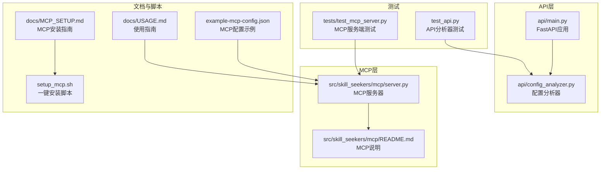
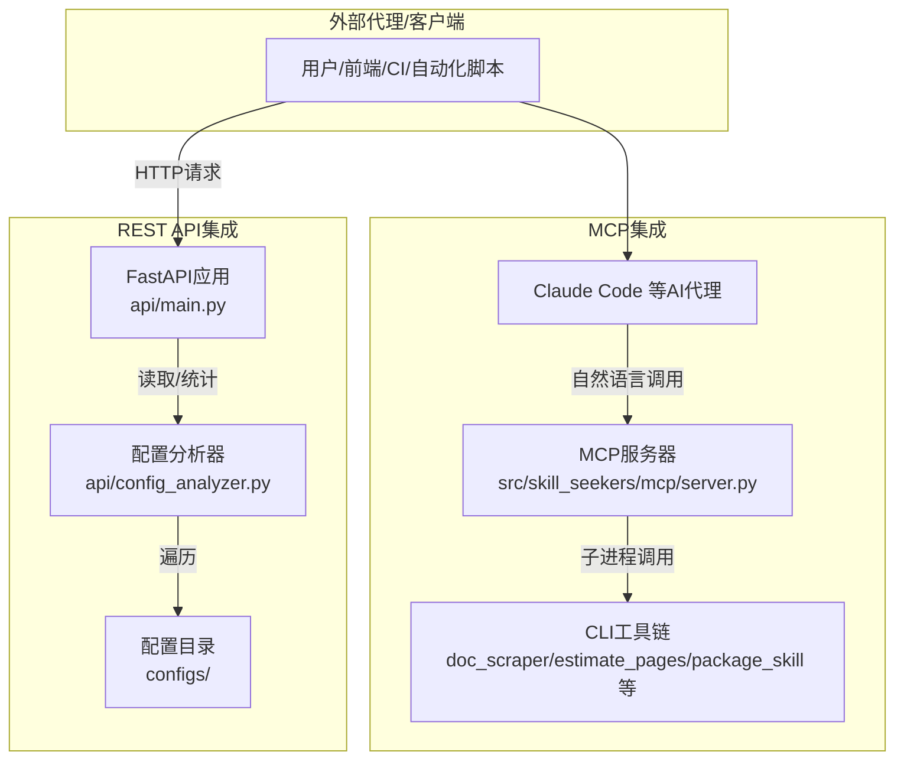
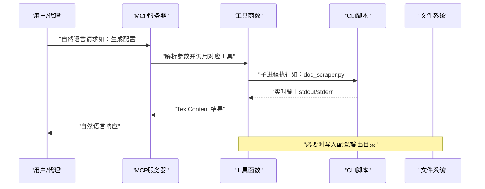
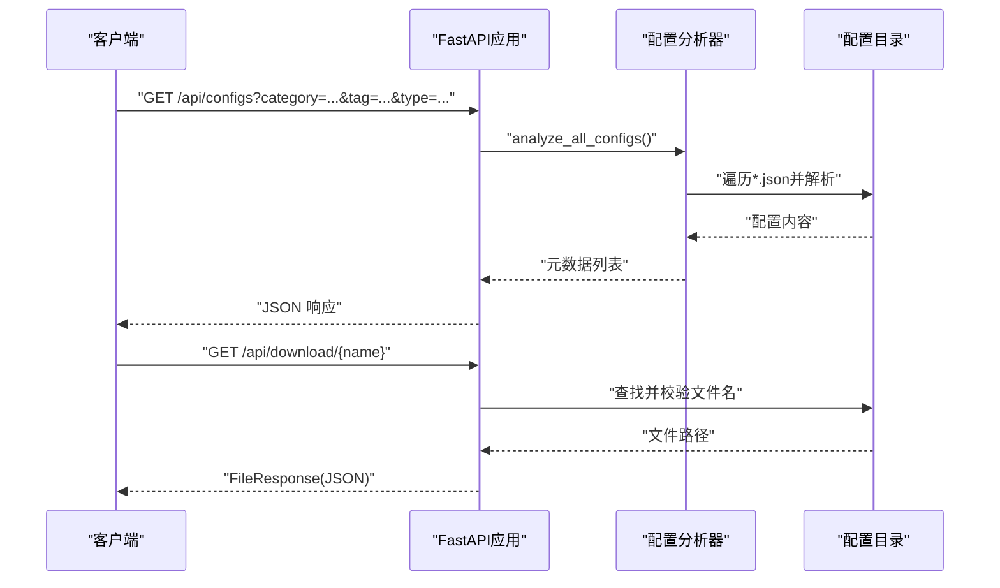
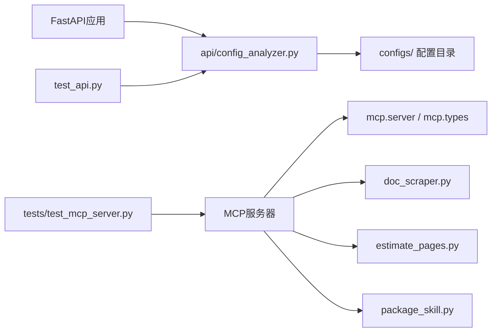

# 集成与扩展

<cite>
**本文引用的文件**
- [api/main.py](file://api/main.py)
- [api/config_analyzer.py](file://api/config_analyzer.py)
- [src/skill_seekers/mcp/server.py](file://src/skill_seekers/mcp/server.py)
- [src/skill_seekers/mcp/README.md](file://src/skill_seekers/mcp/README.md)
- [docs/MCP_SETUP.md](file://docs/MCP_SETUP.md)
- [docs/USAGE.md](file://docs/USAGE.md)
- [example-mcp-config.json](file://example-mcp-config.json)
- [setup_mcp.sh](file://setup_mcp.sh)
- [test_api.py](file://test_api.py)
- [tests/test_mcp_server.py](file://tests/test_mcp_server.py)
</cite>

## 目录
1. [简介](#简介)
2. [项目结构](#项目结构)
3. [核心组件](#核心组件)
4. [架构总览](#架构总览)
5. [详细组件分析](#详细组件分析)
6. [依赖关系分析](#依赖关系分析)
7. [性能考量](#性能考量)
8. [故障排查指南](#故障排查指南)
9. [结论](#结论)
10. [附录](#附录)

## 简介
本文件聚焦于系统的“集成与扩展”能力，围绕两种主要集成方式展开：
- Model Context Protocol（MCP）集成：通过本地 MCP 服务器向 Claude 等 AI 代理暴露自然语言可调用的工具接口，支持从配置生成、页面估算、文档抓取、技能打包到上传的完整工作流。
- REST API 集成：通过 FastAPI 提供的配置发现、分类统计、下载与健康检查等接口，便于程序化调用与自动化集成。

文档同时解释 MCP 工具配置格式（如 example-mcp-config.json），对比两种集成方式的适用场景，并给出客户端集成示例与安全配置建议。

## 项目结构
- API 层：位于 api/，提供 FastAPI 应用与配置分析器，负责配置列表、详情、分类统计、下载与健康检查。
- MCP 层：位于 src/skill_seekers/mcp/，提供 MCP 服务器，将内部 CLI 工具封装为 MCP 工具集，供 Claude 等代理以自然语言调用。
- 文档与脚本：docs/ 提供 MCP 安装与使用指南；setup_mcp.sh 提供一键安装与配置脚本；example-mcp-config.json 提供 MCP 服务器在 Claude Code 中的配置样例。
- 测试：tests/ 包含 MCP 服务端测试与 API 分析器测试，确保工具可用性与数据正确性。

图表来源
- [api/main.py](file://api/main.py#L1-L220)
- [api/config_analyzer.py](file://api/config_analyzer.py#L1-L349)
- [src/skill_seekers/mcp/server.py](file://src/skill_seekers/mcp/server.py#L1-L2201)
- [src/skill_seekers/mcp/README.md](file://src/skill_seekers/mcp/README.md#L1-L597)
- [docs/MCP_SETUP.md](file://docs/MCP_SETUP.md#L1-L619)
- [docs/USAGE.md](file://docs/USAGE.md#L1-L812)
- [example-mcp-config.json](file://example-mcp-config.json#L1-L12)
- [setup_mcp.sh](file://setup_mcp.sh#L1-L267)
- [tests/test_mcp_server.py](file://tests/test_mcp_server.py#L1-L200)
- [test_api.py](file://test_api.py#L1-L41)

章节来源
- [api/main.py](file://api/main.py#L1-L220)
- [api/config_analyzer.py](file://api/config_analyzer.py#L1-L349)
- [src/skill_seekers/mcp/server.py](file://src/skill_seekers/mcp/server.py#L1-L2201)
- [src/skill_seekers/mcp/README.md](file://src/skill_seekers/mcp/README.md#L1-L597)
- [docs/MCP_SETUP.md](file://docs/MCP_SETUP.md#L1-L619)
- [docs/USAGE.md](file://docs/USAGE.md#L1-L812)
- [example-mcp-config.json](file://example-mcp-config.json#L1-L12)
- [setup_mcp.sh](file://setup_mcp.sh#L1-L267)
- [tests/test_mcp_server.py](file://tests/test_mcp_server.py#L1-L200)
- [test_api.py](file://test_api.py#L1-L41)

## 核心组件
- MCP 服务器（src/skill_seekers/mcp/server.py）
  - 暴露一组 MCP 工具，涵盖配置生成、页面估算、文档抓取、技能打包、上传、配置验证、拆分与路由生成、PDF 抓取等。
  - 使用装饰器与安全降级机制，保证在 MCP 不可用时仍可运行。
  - 通过子进程调用 CLI 脚本执行实际任务，支持实时输出流式返回。
- FastAPI 应用（api/main.py）
  - 提供根信息、配置列表、按名称获取配置、分类统计、配置下载与健康检查等端点。
  - 使用 CORS 中间件允许跨域访问，便于前端或外部系统集成。
  - 基于 ConfigAnalyzer 统计与聚合配置元数据。
- 配置分析器（api/config_analyzer.py）
  - 递归扫描配置目录，提取类型、类别、标签、主源、最大页数、文件大小、最后更新时间与下载链接等元信息。
  - 支持单源与统一多源配置识别，自动标注标签与分类。
- MCP 配置示例（example-mcp-config.json）
  - 展示如何在 Claude Code 的 MCP 配置中注册 skill-seeker 服务器，包含命令、参数与工作目录。

章节来源
- [src/skill_seekers/mcp/server.py](file://src/skill_seekers/mcp/server.py#L1-L2201)
- [api/main.py](file://api/main.py#L1-L220)
- [api/config_analyzer.py](file://api/config_analyzer.py#L1-L349)
- [example-mcp-config.json](file://example-mcp-config.json#L1-L12)

## 架构总览
下图展示 MCP 与 REST API 的整体交互关系与数据流向。

图表来源
- [src/skill_seekers/mcp/server.py](file://src/skill_seekers/mcp/server.py#L1-L2201)
- [api/main.py](file://api/main.py#L1-L220)
- [api/config_analyzer.py](file://api/config_analyzer.py#L1-L349)

## 详细组件分析

### MCP 服务器与工具集
- 工具清单与输入模式
  - 列表工具：列出所有可用 MCP 工具及其输入模式（JSON Schema）。
  - 具体工具：包括 generate_config、estimate_pages、scrape_docs、package_skill、upload_skill、list_configs、validate_config、split_config、generate_router、scrape_pdf、scrape_github、install_skill、fetch_config、submit_config、add_config_source、list_config_sources、remove_config_source 等。
- 子进程与流式输出
  - 通过 run_subprocess_with_streaming 实现长耗时任务的实时输出，避免 MCP 协议阻塞。
- 安全降级与装饰器
  - safe_decorator 在 MCP 不可用时返回空操作，保证服务可回退运行。
- MCP 配置与启动
  - example-mcp-config.json 展示了在 Claude Code 中注册 skill-seeker 服务器的方式。
  - docs/MCP_SETUP.md 与 setup_mcp.sh 提供完整的安装、配置与验证流程。

图表来源
- [src/skill_seekers/mcp/server.py](file://src/skill_seekers/mcp/server.py#L60-L2201)
- [example-mcp-config.json](file://example-mcp-config.json#L1-L12)
- [docs/MCP_SETUP.md](file://docs/MCP_SETUP.md#L1-L619)
- [setup_mcp.sh](file://setup_mcp.sh#L1-L267)

章节来源
- [src/skill_seekers/mcp/server.py](file://src/skill_seekers/mcp/server.py#L1-L2201)
- [src/skill_seekers/mcp/README.md](file://src/skill_seekers/mcp/README.md#L1-L597)
- [docs/MCP_SETUP.md](file://docs/MCP_SETUP.md#L1-L619)
- [example-mcp-config.json](file://example-mcp-config.json#L1-L12)
- [setup_mcp.sh](file://setup_mcp.sh#L1-L267)

### FastAPI REST API 与配置分析器
- FastAPI 应用
  - 根端点：返回 API 基本信息与可用端点列表。
  - 列表端点：支持按分类、标签、类型过滤配置列表。
  - 详情端点：按名称返回配置元数据。
  - 分类端点：统计各分类数量。
  - 下载端点：根据名称下载配置文件，内置路径校验防止目录穿越。
  - 健康检查端点：用于监控。
- 配置分析器
  - 递归扫描配置目录，提取类型、类别、标签、主源、最大页数、文件大小、最后更新时间与下载链接。
  - 自动分类与标签抽取，支持单源与统一多源配置识别。

图表来源
- [api/main.py](file://api/main.py#L1-L220)
- [api/config_analyzer.py](file://api/config_analyzer.py#L1-L349)

章节来源
- [api/main.py](file://api/main.py#L1-L220)
- [api/config_analyzer.py](file://api/config_analyzer.py#L1-L349)
- [test_api.py](file://test_api.py#L1-L41)

### MCP 工具配置格式（example-mcp-config.json）
- 关键字段
  - mcpServers：服务器集合
    - skill-seeker：服务器标识
      - command：Python 可执行文件路径
      - args：服务器脚本绝对路径
      - cwd：工作目录（仓库根路径）
- 使用建议
  - 将 args 与 cwd 设置为仓库实际路径，确保 Claude Code 能正确加载 MCP 服务器。
  - 如需增强功能，可在 env 中设置 ANTHROPIC_API_KEY 等环境变量。

章节来源
- [example-mcp-config.json](file://example-mcp-config.json#L1-L12)
- [docs/MCP_SETUP.md](file://docs/MCP_SETUP.md#L1-L619)

### MCP 工具工作流（示例）
- 从零开始生成技能
  - 生成配置 → 页面估算 → 文档抓取 → 技能打包 → 上传（可选）
- 使用现有配置
  - 列出配置 → 估算页面 → 抓取文档 → 打包 → 上传
- 大型文档拆分与路由
  - 估算页面 → 拆分配置 → 并行抓取子技能 → 生成路由 → 打包与上传

章节来源
- [src/skill_seekers/mcp/README.md](file://src/skill_seekers/mcp/README.md#L1-L597)
- [docs/USAGE.md](file://docs/USAGE.md#L1-L812)

## 依赖关系分析
- MCP 服务器依赖
  - 外部 MCP 包（mcp.server、mcp.types）用于协议实现与工具定义。
  - 内部 CLI 工具链（doc_scraper、estimate_pages、package_skill 等）通过子进程调用。
  - 安全降级：当 MCP 不可用时，装饰器保证服务仍可运行。
- FastAPI 应用依赖
  - FastAPI 与 CORS 中间件。
  - ConfigAnalyzer 依赖标准库与外部工具（如 git 历史解析）。
- 配置与测试
  - MCP 服务端测试覆盖工具清单、路由与各工具行为。
  - API 分析器测试验证元数据提取与分类统计。

图表来源
- [src/skill_seekers/mcp/server.py](file://src/skill_seekers/mcp/server.py#L1-L2201)
- [api/main.py](file://api/main.py#L1-L220)
- [api/config_analyzer.py](file://api/config_analyzer.py#L1-L349)
- [tests/test_mcp_server.py](file://tests/test_mcp_server.py#L1-L200)
- [test_api.py](file://test_api.py#L1-L41)

章节来源
- [src/skill_seekers/mcp/server.py](file://src/skill_seekers/mcp/server.py#L1-L2201)
- [api/main.py](file://api/main.py#L1-L220)
- [api/config_analyzer.py](file://api/config_analyzer.py#L1-L349)
- [tests/test_mcp_server.py](file://tests/test_mcp_server.py#L1-L200)
- [test_api.py](file://test_api.py#L1-L41)

## 性能考量
- MCP
  - 子进程流式输出避免长时间阻塞，提升交互体验。
  - 对大型文档可采用拆分与并行抓取策略，显著缩短总耗时。
- API
  - 列表与分类统计为内存内聚合，复杂度与配置数量线性相关。
  - 下载端点进行路径校验与递归搜索，注意大规模配置目录下的 I/O 开销。
- 通用建议
  - 合理设置 rate_limit 与 max_pages，平衡速度与礼貌性。
  - 使用缓存数据（skip_scrape）快速重建与验证。

[本节为通用指导，不直接分析具体文件]

## 故障排查指南
- MCP
  - MCP 不可用：确认已安装 mcp 包并正确导入；检查装饰器降级逻辑。
  - 配置路径错误：核对 Claude Code 的 mcp.json 中的 args 与 cwd 是否指向仓库实际路径。
  - 工具不可用：重启 Claude Code；检查 CLI 工具是否存在且可执行。
  - 慢或卡顿：调整 rate_limit、限制 max_pages 或使用缓存数据。
- API
  - 跨域问题：CORS 已允许所有来源，若仍受限，请检查客户端或代理设置。
  - 文件下载失败：确认配置名合法且存在；检查文件扩展名与目录层级。
  - 健康检查异常：检查服务是否正常启动与监听端口。

章节来源
- [docs/MCP_SETUP.md](file://docs/MCP_SETUP.md#L1-L619)
- [src/skill_seekers/mcp/README.md](file://src/skill_seekers/mcp/README.md#L1-L597)
- [api/main.py](file://api/main.py#L1-L220)

## 结论
- MCP 集成适合需要自然语言交互与可视化的场景，尤其适用于非技术用户或需要与 Claude 等代理协作的工作流。
- REST API 集成适合程序化调用、自动化流水线与后端系统集成，便于批量处理与监控。
- 两者互为补充：MCP 提供“人机对话式”的易用入口，API 提供“机器可读式”的稳定接口。

[本节为总结性内容，不直接分析具体文件]

## 附录

### MCP 与 REST API 的适用场景对比
- MCP 更适合
  - 自然语言指令驱动
  - 快速原型与探索性工作流
  - 团队协作与知识沉淀
- REST API 更适合
  - CI/CD 自动化
  - 后台服务集成
  - 批量配置管理与分发

[本节为概念性内容，不直接分析具体文件]

### 客户端集成示例（思路与要点）
- MCP（Claude Code）
  - 在 Claude Code 的 MCP 配置中添加 skill-seeker 服务器，设置 command、args 与 cwd。
  - 重启 Claude Code 后，使用自然语言指令调用工具（如“生成配置”、“估算页面”、“抓取文档”、“打包技能”）。
- REST API（任意 HTTP 客户端）
  - 列表与筛选：GET /api/configs?category=...&tag=...&type=...
  - 获取详情：GET /api/configs/{name}
  - 分类统计：GET /api/categories
  - 下载配置：GET /api/download/{config_name}
  - 健康检查：GET /health

[本节为概念性内容，不直接分析具体文件]

### 安全配置建议
- MCP
  - 仅在受信任网络与可信主机上运行 MCP 服务器。
  - 如启用 API 增强，谨慎管理 ANTHROPIC_API_KEY，避免泄露。
  - 使用虚拟环境隔离依赖，减少系统污染。
- REST API
  - 生产环境建议启用反向代理与 TLS。
  - 控制 CORS 策略，避免过度放行。
  - 对下载端点进行严格的文件名与路径校验，防止目录穿越。
  - 部署健康检查与日志监控，及时发现异常。

[本节为通用指导，不直接分析具体文件]