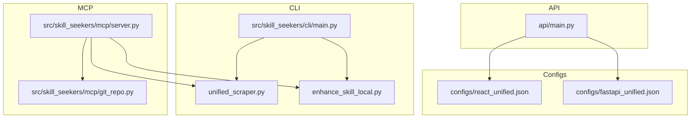
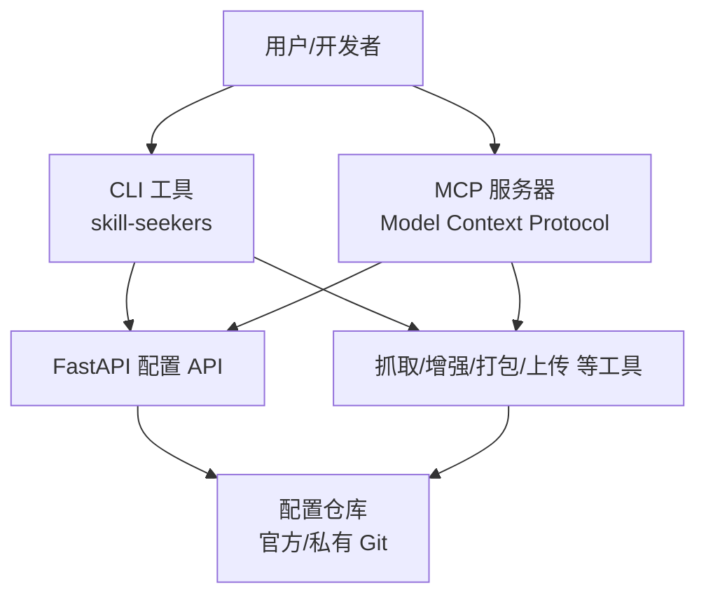
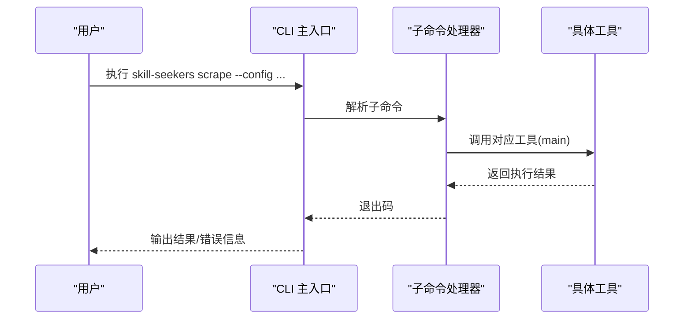
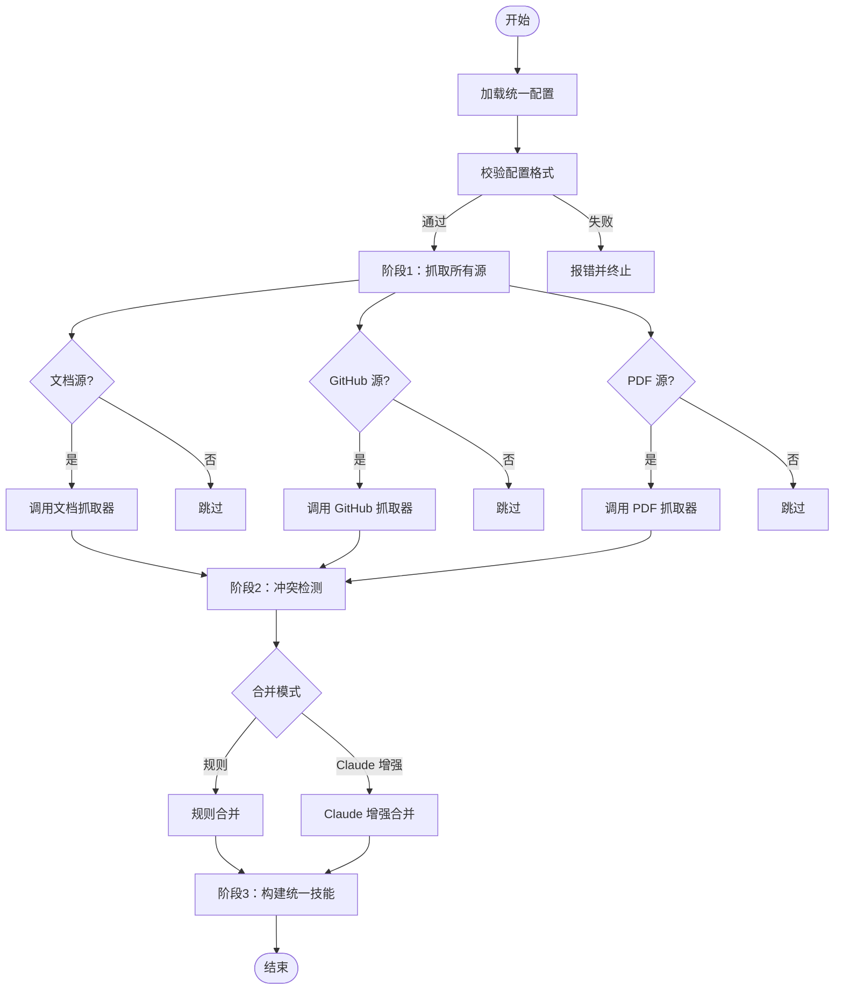
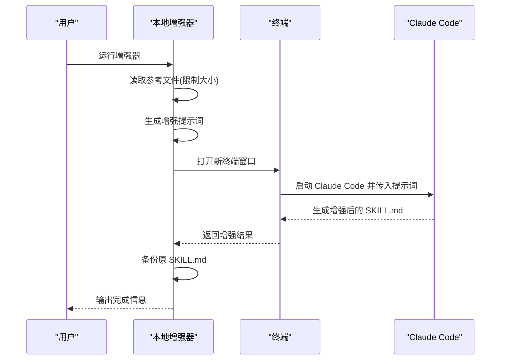
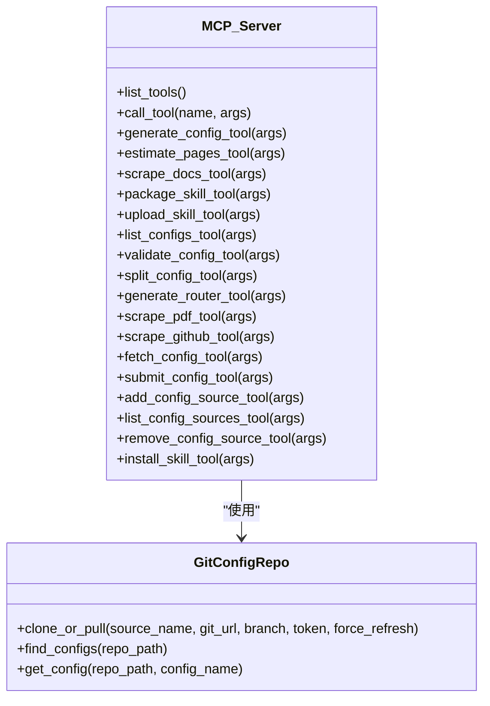
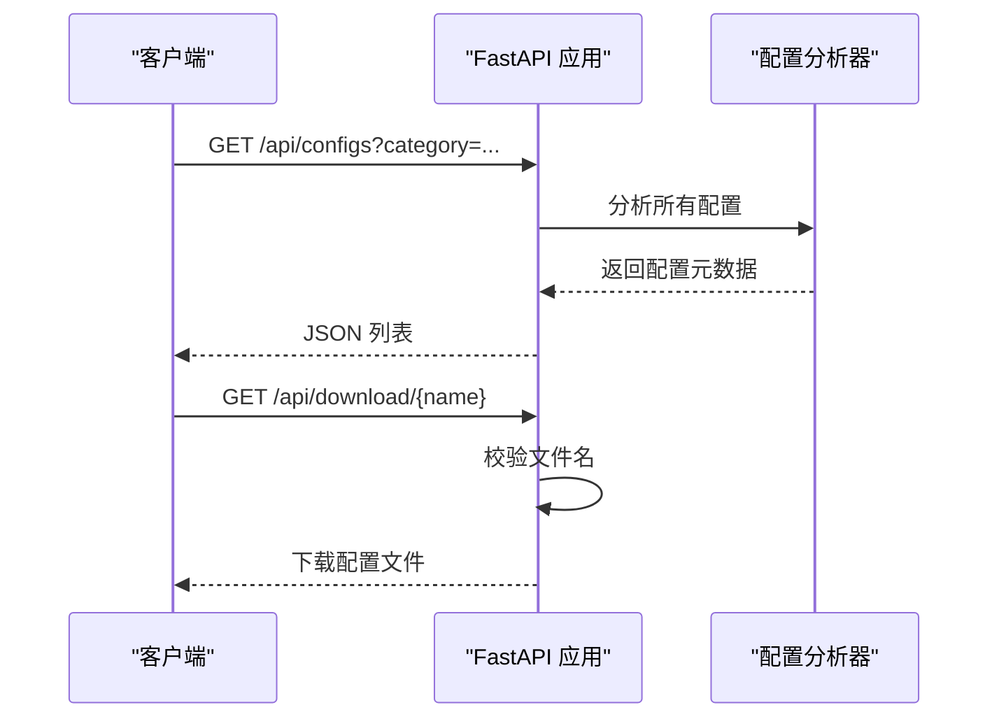
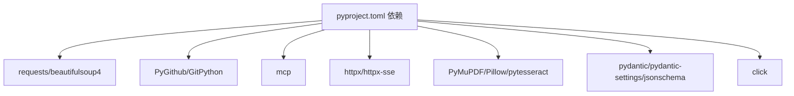

# 项目概述

<cite>
**本文引用的文件**
- [README.md](file://README.md)
- [pyproject.toml](file://pyproject.toml)
- [requirements.txt](file://requirements.txt)
- [src/skill_seekers/cli/main.py](file://src/skill_seekers/cli/main.py)
- [src/skill_seekers/cli/unified_scraper.py](file://src/skill_seekers/cli/unified_scraper.py)
- [src/skill_seekers/cli/enhance_skill_local.py](file://src/skill_seekers/cli/enhance_skill_local.py)
- [src/skill_seekers/mcp/server.py](file://src/skill_seekers/mcp/server.py)
- [src/skill_seekers/mcp/git_repo.py](file://src/skill_seekers/mcp/git_repo.py)
- [api/main.py](file://api/main.py)
- [configs/react_unified.json](file://configs/react_unified.json)
- [configs/fastapi_unified.json](file://configs/fastapi_unified.json)
- [docs/UNIFIED_SCRAPING.md](file://docs/UNIFIED_SCRAPING.md)
- [docs/ENHANCEMENT.md](file://docs/ENHANCEMENT.md)
</cite>

## 目录
1. [引言](#引言)
2. [项目结构](#项目结构)
3. [核心组件](#核心组件)
4. [架构总览](#架构总览)
5. [详细组件分析](#详细组件分析)
6. [依赖关系分析](#依赖关系分析)
7. [性能考量](#性能考量)
8. [故障排查指南](#故障排查指南)
9. [结论](#结论)
10. [附录](#附录)

## 引言
Skill Seekers 是一个面向开发者与团队的自动化工具，目标是将文档网站、GitHub 仓库与 PDF 文件快速转化为可直接上传到 Claude AI 的“技能”（Claude Skills）。它通过统一的命令行界面（CLI）、Model Context Protocol（MCP）服务器以及 FastAPI 后端，形成“文档抓取—代码分析—PDF 内容提取—多源整合—冲突检测—质量增强—打包上传”的完整工作流，显著缩短从资料到可用技能的时间成本，并提升技能质量与一致性。

本项目在开发者工作流中的定位：
- 将分散于文档、代码与 PDF 的知识整合为单一“真相来源”，帮助开发者在 Claude 中获得更准确、更实用的参考。
- 提供冲突检测与透明报告，帮助识别文档过时、API 变更未同步等问题。
- 支持本地增强（无需 API Key）与一键安装到多种 AI 编辑器，降低使用门槛。

## 项目结构
项目采用模块化分层组织：
- CLI 层：统一入口与子命令，负责文档抓取、GitHub 抓取、PDF 提取、统一多源抓取、增强、打包、上传、估算页数、安装代理等。
- MCP 层：基于 Model Context Protocol 的服务器，提供 9 个工具，可在 Claude Code 中以自然语言调用，实现端到端自动化。
- API 层：FastAPI 后端，提供配置列表、分类、下载与健康检查接口，支持从官方或私有 Git 源获取配置。
- 配置与示例：预置大量框架/工具的配置样例，覆盖文档、GitHub、PDF 与统一多源场景。
- 文档与研究：包含统一抓取、增强、PDF 提取、MCP 设置等专题文档，指导用户正确使用与扩展。

图表来源
- [src/skill_seekers/cli/main.py](file://src/skill_seekers/cli/main.py#L1-L370)
- [src/skill_seekers/cli/unified_scraper.py](file://src/skill_seekers/cli/unified_scraper.py#L1-L200)
- [src/skill_seekers/cli/enhance_skill_local.py](file://src/skill_seekers/cli/enhance_skill_local.py#L1-L200)
- [src/skill_seekers/mcp/server.py](file://src/skill_seekers/mcp/server.py#L1-L200)
- [src/skill_seekers/mcp/git_repo.py](file://src/skill_seekers/mcp/git_repo.py#L1-L200)
- [api/main.py](file://api/main.py#L1-L220)
- [configs/react_unified.json](file://configs/react_unified.json#L1-L45)
- [configs/fastapi_unified.json](file://configs/fastapi_unified.json#L1-L46)

章节来源
- [README.md](file://README.md#L510-L580)
- [pyproject.toml](file://pyproject.toml#L100-L114)

## 核心组件
- 统一 CLI 入口：提供 git 风格的子命令，将各功能模块串联，支持 dry-run、异步、并发、增强等选项。
- 统一多源抓取器：支持文档、GitHub、PDF 多源组合，自动检测冲突、智能合并，并输出透明报告。
- 本地增强器：无需 API Key，借助 Claude Code Max 在本地生成高质量 SKILL.md。
- MCP 服务器：提供 9 个工具，覆盖配置生成、估算页数、抓取文档/PDF/GitHub、拆分配置、路由技能、打包上传、配置源管理等。
- FastAPI 配置 API：提供配置列表、分类、下载与健康检查，支持从官方或私有 Git 源获取配置。
- 配置样例：内置大量框架/工具的统一配置示例，便于快速上手与二次开发。

章节来源
- [src/skill_seekers/cli/main.py](file://src/skill_seekers/cli/main.py#L1-L370)
- [src/skill_seekers/cli/unified_scraper.py](file://src/skill_seekers/cli/unified_scraper.py#L1-L200)
- [src/skill_seekers/cli/enhance_skill_local.py](file://src/skill_seekers/cli/enhance_skill_local.py#L1-L200)
- [src/skill_seekers/mcp/server.py](file://src/skill_seekers/mcp/server.py#L1-L200)
- [api/main.py](file://api/main.py#L1-L220)
- [configs/react_unified.json](file://configs/react_unified.json#L1-L45)
- [configs/fastapi_unified.json](file://configs/fastapi_unified.json#L1-L46)

## 架构总览
Skill Seekers 的高层架构由三部分组成：
- 命令行工具（CLI）：统一入口，封装所有功能；适合脚本化与批处理。
- MCP 服务器：面向 Claude Code 的自然语言交互入口，提供端到端自动化体验。
- FastAPI 后端：提供配置发现与下载服务，支持官方与私有 Git 源，便于团队共享与规模化使用。

图表来源
- [src/skill_seekers/cli/main.py](file://src/skill_seekers/cli/main.py#L1-L370)
- [src/skill_seekers/mcp/server.py](file://src/skill_seekers/mcp/server.py#L1-L200)
- [api/main.py](file://api/main.py#L1-L220)

## 详细组件分析

### 统一 CLI 入口与控制流
- 功能：解析子命令，按需转发到具体工具（文档抓取、GitHub 抓取、PDF 抓取、统一抓取、增强、打包、上传、估算页数、安装代理、一键安装）。
- 关键点：参数透传、异常处理、键盘中断优雅退出、dry-run 预览模式。
- 优势：统一入口简化学习曲线，便于集成到 CI/CD 与自动化流程。

图表来源
- [src/skill_seekers/cli/main.py](file://src/skill_seekers/cli/main.py#L222-L370)

章节来源
- [src/skill_seekers/cli/main.py](file://src/skill_seekers/cli/main.py#L1-L370)

### 统一多源抓取器（unified_scraper）
- 功能：加载统一配置，按源类型分别抓取（文档、GitHub、PDF），检测冲突，智能合并，构建统一技能。
- 关键点：支持规则合并与 Claude 增强合并两种模式；对文档源调用独立抓取器；对 GitHub 源进行代码分析与元数据提取；对 PDF 源进行文本/表格/图像提取。
- 实现要点：子进程调用现有抓取器，避免重复耦合；统一输出目录与数据归档；日志与错误处理。

图表来源
- [src/skill_seekers/cli/unified_scraper.py](file://src/skill_seekers/cli/unified_scraper.py#L1-L200)
- [docs/UNIFIED_SCRAPING.md](file://docs/UNIFIED_SCRAPING.md#L1-L200)

章节来源
- [src/skill_seekers/cli/unified_scraper.py](file://src/skill_seekers/cli/unified_scraper.py#L1-L200)
- [docs/UNIFIED_SCRAPING.md](file://docs/UNIFIED_SCRAPING.md#L1-L200)

### 本地增强器（enhance_skill_local）
- 功能：在本地打开终端运行 Claude Code，读取参考文件，生成高质量 SKILL.md，无需 API Key。
- 关键点：自动检测终端类型（优先环境变量、当前终端、回退到默认），限制输入大小，生成增强提示词，备份原文件，保存增强结果。
- 优势：与现有抓取流程无缝衔接，显著提升技能可读性与实用性。

图表来源
- [src/skill_seekers/cli/enhance_skill_local.py](file://src/skill_seekers/cli/enhance_skill_local.py#L1-L200)
- [docs/ENHANCEMENT.md](file://docs/ENHANCEMENT.md#L1-L200)

章节来源
- [src/skill_seekers/cli/enhance_skill_local.py](file://src/skill_seekers/cli/enhance_skill_local.py#L1-L200)
- [docs/ENHANCEMENT.md](file://docs/ENHANCEMENT.md#L1-L200)

### MCP 服务器与工具集
- 功能：提供 9 个工具，覆盖配置生成、估算页数、抓取文档/PDF/GitHub、拆分配置、路由技能、打包上传、配置源管理等。
- 关键点：实时输出流式传输，避免长时间阻塞；支持 unlimited 模式与 dry-run；与 CLI 子命令保持一致的参数语义。
- 优势：在 Claude Code 中以自然语言完成端到端流程，降低使用门槛。

图表来源
- [src/skill_seekers/mcp/server.py](file://src/skill_seekers/mcp/server.py#L1-L200)
- [src/skill_seekers/mcp/git_repo.py](file://src/skill_seekers/mcp/git_repo.py#L1-L200)

章节来源
- [src/skill_seekers/mcp/server.py](file://src/skill_seekers/mcp/server.py#L1-L200)
- [src/skill_seekers/mcp/git_repo.py](file://src/skill_seekers/mcp/git_repo.py#L1-L200)

### FastAPI 配置 API
- 功能：提供配置列表、分类统计、按名称下载配置文件、健康检查等接口；支持从官方或私有 Git 源获取配置。
- 关键点：CORS 放通，路径安全校验，递归搜索配置文件，错误统一处理。
- 优势：便于前端或外部工具发现与下载配置，支撑团队协作与规模化部署。

图表来源
- [api/main.py](file://api/main.py#L1-L220)

章节来源
- [api/main.py](file://api/main.py#L1-L220)

### 实际用例与技术优势
- 统一抓取（unified）：以 React/FastAPI 统一配置为例，同时抓取官方文档与 GitHub 代码，自动检测缺失/签名不匹配等冲突，输出透明报告，帮助团队建立“文档意图 + 代码现实”的单一真相来源。
- 增强（enhance）：本地增强器读取参考文件，生成高质量 SKILL.md，显著提升技能可读性与实用性，且无需 API Key。
- 私有配置源：通过 MCP 的配置源管理工具，注册团队私有 Git 仓库，实现配置共享与优先级解析，满足企业级协作需求。

章节来源
- [configs/react_unified.json](file://configs/react_unified.json#L1-L45)
- [configs/fastapi_unified.json](file://configs/fastapi_unified.json#L1-L46)
- [docs/UNIFIED_SCRAPING.md](file://docs/UNIFIED_SCRAPING.md#L1-L200)
- [docs/ENHANCEMENT.md](file://docs/ENHANCEMENT.md#L1-L200)

## 依赖关系分析
- 核心依赖（来自 pyproject.toml）：
  - 请求与解析：requests、beautifulsoup4
  - 版本控制：PyGithub、GitPython
  - MCP 协议：mcp
  - HTTP 客户端：httpx、httpx-sse
  - PDF 处理：PyMuPDF、Pillow、pytesseract
  - 结构验证：pydantic、pydantic-settings、jsonschema
  - 命令行：click
  - 语法高亮：Pygments
- CLI 入口：skill-seekers 与多个子命令入口，便于独立使用与集成。
- MCP 服务器：依赖外部 mcp 包，提供工具清单与调用逻辑。
- API 服务：FastAPI + CORS + 文件响应，支持配置下载与健康检查。

图表来源
- [pyproject.toml](file://pyproject.toml#L41-L58)
- [requirements.txt](file://requirements.txt#L1-L44)

章节来源
- [pyproject.toml](file://pyproject.toml#L41-L58)
- [requirements.txt](file://requirements.txt#L1-L44)

## 性能考量
- 异步与并发：CLI 支持异步抓取与多工作线程，显著提升大规模文档抓取效率。
- 缓存与复用：MCP 服务器与 Git 配置管理均提供缓存机制，减少重复下载与克隆。
- 大文档拆分：支持将大型文档拆分为多个子技能并通过路由技能智能分发。
- OCR 与并行 PDF 处理：PDF 提取支持并行与 OCR，加速扫描版与复杂表格提取。
- 估算页数：先估算再抓取，避免无谓的资源消耗。

章节来源
- [README.md](file://README.md#L90-L120)
- [src/skill_seekers/mcp/server.py](file://src/skill_seekers/mcp/server.py#L1-L200)
- [src/skill_seekers/mcp/git_repo.py](file://src/skill_seekers/mcp/git_repo.py#L1-L200)

## 故障排查指南
- MCP 未安装：MCP 服务器需要安装外部包，若导入失败会提示安装方式与错误原因。
- Git 认证失败：私有仓库拉取失败通常因认证问题，检查 token 与权限。
- 配置下载失败：确保配置名合法且存在，API 会对非法路径进行拦截。
- 增强失败：确认已运行抓取流程生成参考文件，本地增强依赖 Claude Code Max。
- 上传失败：检查 Anthropic API Key 是否设置，或改用手动上传流程。

章节来源
- [src/skill_seekers/mcp/server.py](file://src/skill_seekers/mcp/server.py#L1-L120)
- [src/skill_seekers/mcp/git_repo.py](file://src/skill_seekers/mcp/git_repo.py#L1-L132)
- [api/main.py](file://api/main.py#L167-L209)
- [docs/ENHANCEMENT.md](file://docs/ENHANCEMENT.md#L135-L169)

## 结论
Skill Seekers 通过 CLI、MCP 与 FastAPI 的协同，构建了从“资料抓取—冲突检测—智能合并—质量增强—打包上传”的全链路自动化体系。其统一多源抓取与本地增强能力，显著提升了技能质量与可维护性；MCP 的自然语言交互进一步降低了使用门槛；私有配置源与 API 支持团队协作与规模化应用。对于初学者，建议从预置配置与 MCP 工具入手；对于高级用户，可通过自定义配置与工具扩展实现更复杂的业务场景。

## 附录
- 快速开始与安装：参见 README 的 PyPI 安装与 MCP 集成说明。
- 配置示例：参考 configs/react_unified.json 与 configs/fastapi_unified.json。
- 专题文档：统一抓取、增强、PDF 提取、MCP 设置等。

章节来源
- [README.md](file://README.md#L103-L175)
- [configs/react_unified.json](file://configs/react_unified.json#L1-L45)
- [configs/fastapi_unified.json](file://configs/fastapi_unified.json#L1-L46)
- [docs/UNIFIED_SCRAPING.md](file://docs/UNIFIED_SCRAPING.md#L1-L200)
- [docs/ENHANCEMENT.md](file://docs/ENHANCEMENT.md#L1-L200)