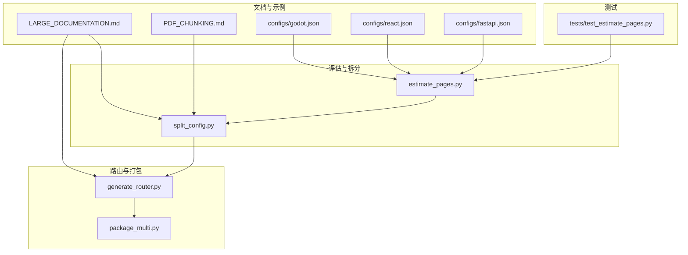
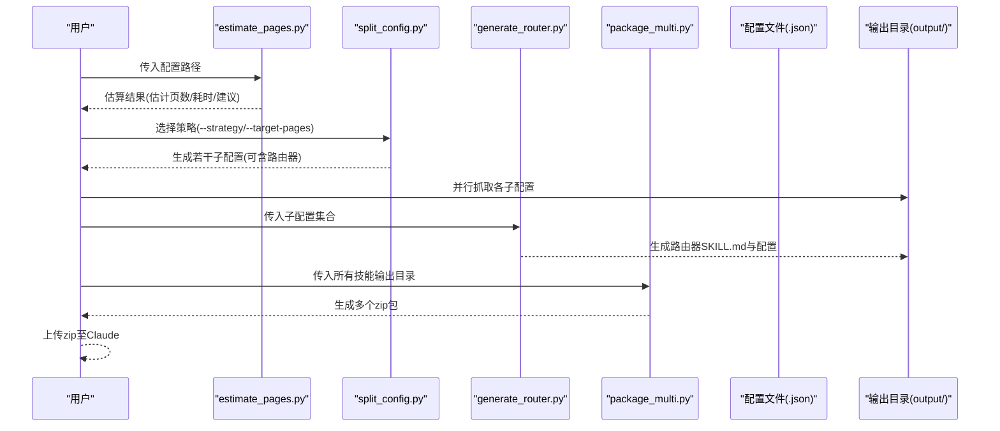
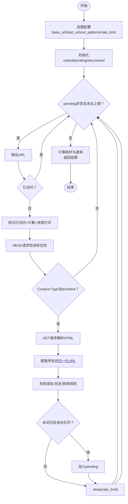
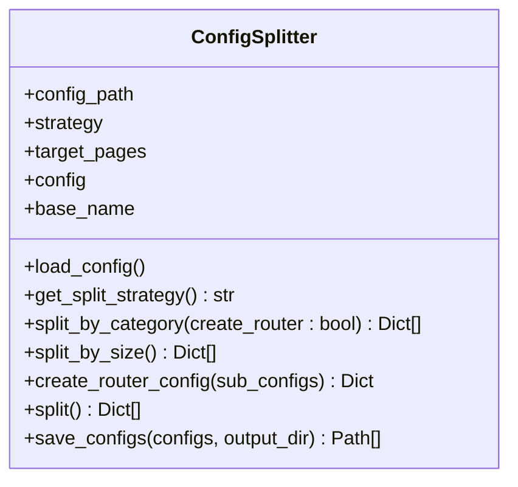
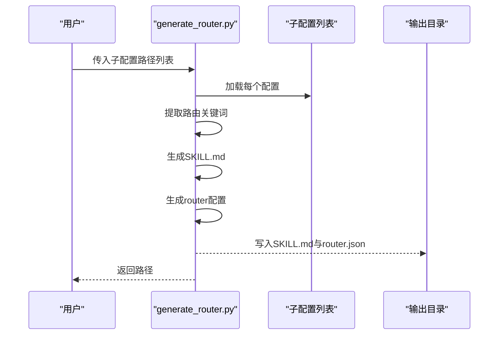
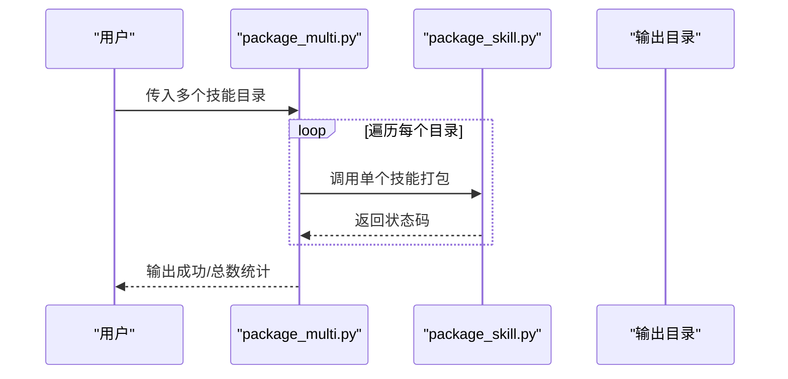
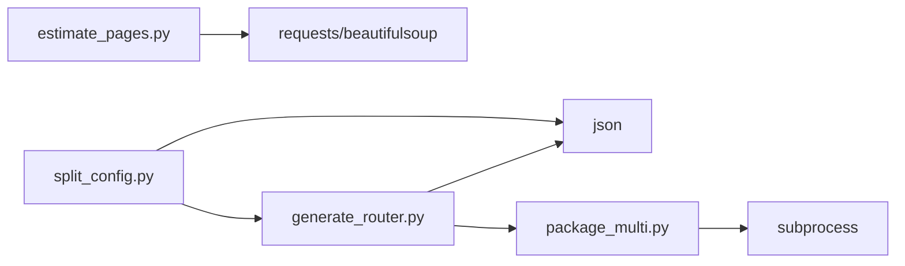

# 大文档支持

<cite>
**本文引用的文件**
- [estimate_pages.py](file://src/skill_seekers/cli/estimate_pages.py)
- [split_config.py](file://src/skill_seekers/cli/split_config.py)
- [generate_router.py](file://src/skill_seekers/cli/generate_router.py)
- [package_multi.py](file://src/skill_seekers/cli/package_multi.py)
- [LARGE_DOCUMENTATION.md](file://docs/LARGE_DOCUMENTATION.md)
- [PDF_CHUNKING.md](file://docs/PDF_CHUNKING.md)
- [godot.json](file://configs/godot.json)
- [react.json](file://configs/react.json)
- [fastapi.json](file://configs/fastapi.json)
- [test_estimate_pages.py](file://tests/test_estimate_pages.py)
</cite>

## 目录
1. [简介](#简介)
2. [项目结构](#项目结构)
3. [核心组件](#核心组件)
4. [架构总览](#架构总览)
5. [详细组件分析](#详细组件分析)
6. [依赖关系分析](#依赖关系分析)
7. [性能考量](#性能考量)
8. [故障排查指南](#故障排查指南)
9. [结论](#结论)
10. [附录](#附录)

## 简介
本文件系统化阐述如何在 Skill Seekers 中高效处理超大规模文档（如 10K+ 页面）。内容覆盖：
- 通过 estimate_pages.py 对配置进行页面估算，判断是否需要拆分；
- 四种拆分策略：无拆分、按类别拆分、基于大小拆分、推荐的“路由器 + 类别”模式；
- 通过 split_config.py 配置字段或命令行参数选择策略；
- 从评估、拆分、并行抓取到最终打包的完整工作流；
- 拆分后的技能维护与更新策略，以及如何平衡技能粒度与管理复杂度。

## 项目结构
围绕“大文档支持”的关键文件与模块如下：
- 评估与估算：estimate_pages.py
- 拆分策略与生成：split_config.py
- 路由器生成：generate_router.py
- 批量打包：package_multi.py
- 文档指南：LARGE_DOCUMENTATION.md、PDF_CHUNKING.md
- 示例配置：godot.json、react.json、fastapi.json
- 测试用例：test_estimate_pages.py

图表来源
- [estimate_pages.py](file://src/skill_seekers/cli/estimate_pages.py#L1-L289)
- [split_config.py](file://src/skill_seekers/cli/split_config.py#L1-L321)
- [generate_router.py](file://src/skill_seekers/cli/generate_router.py#L1-L275)
- [package_multi.py](file://src/skill_seekers/cli/package_multi.py#L1-L82)
- [LARGE_DOCUMENTATION.md](file://docs/LARGE_DOCUMENTATION.md#L1-L432)
- [PDF_CHUNKING.md](file://docs/PDF_CHUNKING.md#L1-L522)
- [godot.json](file://configs/godot.json#L1-L48)
- [react.json](file://configs/react.json#L1-L32)
- [fastapi.json](file://configs/fastapi.json#L1-L34)
- [test_estimate_pages.py](file://tests/test_estimate_pages.py#L1-L161)

章节来源
- [estimate_pages.py](file://src/skill_seekers/cli/estimate_pages.py#L1-L289)
- [split_config.py](file://src/skill_seekers/cli/split_config.py#L1-L321)
- [generate_router.py](file://src/skill_seekers/cli/generate_router.py#L1-L275)
- [package_multi.py](file://src/skill_seekers/cli/package_multi.py#L1-L82)
- [LARGE_DOCUMENTATION.md](file://docs/LARGE_DOCUMENTATION.md#L1-L432)
- [PDF_CHUNKING.md](file://docs/PDF_CHUNKING.md#L1-L522)
- [godot.json](file://configs/godot.json#L1-L48)
- [react.json](file://configs/react.json#L1-L32)
- [fastapi.json](file://configs/fastapi.json#L1-L34)
- [test_estimate_pages.py](file://tests/test_estimate_pages.py#L1-L161)

## 核心组件
- 页面估算器（estimate_pages.py）
  - 基于配置的 base_url/start_urls/url_patterns 进行发现式估算；
  - 支持最大发现数限制、速率限制、HEAD/GET 请求组合；
  - 输出已发现页数、待发现页数、估计总数、耗时、发现速率等指标，并给出建议。
- 配置拆分器（split_config.py）
  - 支持策略：none/auto/category/router/size；
  - 自动策略依据 max_pages 与是否存在 categories 决定；
  - 可生成路由器配置（_router 标记），并为子技能注入路由关键词。
- 路由器生成器（generate_router.py）
  - 从多个子技能配置提取路由关键词，生成 SKILL.md 与 router 配置；
  - 自动生成 _sub_skills 与 _routing_keywords 字段。
- 批量打包器（package_multi.py）
  - 并行调用单个技能打包脚本，批量输出 zip 包，便于上传至 Claude。

章节来源
- [estimate_pages.py](file://src/skill_seekers/cli/estimate_pages.py#L25-L139)
- [split_config.py](file://src/skill_seekers/cli/split_config.py#L39-L199)
- [generate_router.py](file://src/skill_seekers/cli/generate_router.py#L47-L171)
- [package_multi.py](file://src/skill_seekers/cli/package_multi.py#L14-L82)

## 架构总览
下图展示从“评估-拆分-抓取-路由-打包”的端到端流程，映射到实际代码模块与配置文件。

图表来源
- [estimate_pages.py](file://src/skill_seekers/cli/estimate_pages.py#L25-L139)
- [split_config.py](file://src/skill_seekers/cli/split_config.py#L172-L221)
- [generate_router.py](file://src/skill_seekers/cli/generate_router.py#L172-L195)
- [package_multi.py](file://src/skill_seekers/cli/package_multi.py#L28-L82)
- [godot.json](file://configs/godot.json#L1-L48)

## 详细组件分析

### 组件A：页面估算（estimate_pages.py）
- 功能要点
  - 读取配置中的 base_url/start_urls/url_patterns/rate_limit/max_discovery；
  - 使用队列式广度优先探索，HEAD 快速探测 + GET 提取链接；
  - URL 合法性校验：同域、排除/包含规则；
  - 速率限制 sleep；异常静默跳过，保证稳健性；
  - 结果包含 discovered/pending/estimated_total/elapsed/discovery_rate/hit_limit/unlimited。
- 关键流程图

图表来源
- [estimate_pages.py](file://src/skill_seekers/cli/estimate_pages.py#L25-L139)

章节来源
- [estimate_pages.py](file://src/skill_seekers/cli/estimate_pages.py#L25-L139)
- [test_estimate_pages.py](file://tests/test_estimate_pages.py#L1-L161)

### 组件B：配置拆分（split_config.py）
- 策略选择逻辑
  - 若配置中定义 split_strategy 且不为 none，则优先使用；
  - auto 模式下：
    - max_pages < 5000：无拆分；
    - 5000 ≤ max_pages < 10000 且存在 categories：类别拆分；
    - max_pages ≥ 10000 且存在 categories 且类别数量≥3：路由器 + 类别；
    - 其他：按大小拆分。
- 四种策略
  - 无拆分（none）：直接返回原配置；
  - 类别拆分（category）：按 categories 键名生成子配置，保留该类别的 include 关键词；
  - 路由器 + 类别（router）：在类别拆分基础上插入一个 _router 配置，包含 _sub_skills 与 _routing_keywords；
  - 基于大小拆分（size）：按 max_pages/target_pages 计算份数，生成带 -partN 的子配置。
- 关键类图

图表来源
- [split_config.py](file://src/skill_seekers/cli/split_config.py#L17-L221)

章节来源
- [split_config.py](file://src/skill_seekers/cli/split_config.py#L39-L199)
- [LARGE_DOCUMENTATION.md](file://docs/LARGE_DOCUMENTATION.md#L19-L116)

### 组件C：路由器生成（generate_router.py）
- 关键点
  - 从子配置提取路由关键词：来自 categories 键名与子配置名称（- 后部分）；
  - 生成 SKILL.md：包含“何时使用”“如何工作”“路由逻辑”“快速参考”等；
  - 生成 router 配置：设置 _router=true、_sub_skills、_routing_keywords、max_pages 较小用于概览。
- 序列图（生成路由器）

图表来源
- [generate_router.py](file://src/skill_seekers/cli/generate_router.py#L47-L171)

章节来源
- [generate_router.py](file://src/skill_seekers/cli/generate_router.py#L47-L171)

### 组件D：批量打包（package_multi.py）
- 关键点
  - 接收多个技能输出目录，逐一调用单个打包脚本；
  - 统计成功/失败数量，输出汇总报告；
  - 适合打包 router 与多个子技能。
- 序列图（批量打包）

图表来源
- [package_multi.py](file://src/skill_seekers/cli/package_multi.py#L14-L82)

章节来源
- [package_multi.py](file://src/skill_seekers/cli/package_multi.py#L14-L82)

## 依赖关系分析
- 模块耦合
  - estimate_pages.py 仅依赖标准库与第三方 HTTP 解析库，低耦合；
  - split_config.py 依赖 JSON、路径与类型提示，策略逻辑集中；
  - generate_router.py 依赖 JSON 与路径，路由关键词抽取逻辑清晰；
  - package_multi.py 依赖子进程调用，封装性强。
- 外部依赖
  - requests/beautifulsoup 用于网页抓取与解析；
  - 子进程调用 package_skill.py 进行打包。
- 潜在循环依赖
  - 无直接循环；各模块职责单一，通过配置文件与输出目录解耦。

图表来源
- [estimate_pages.py](file://src/skill_seekers/cli/estimate_pages.py#L1-L20)
- [split_config.py](file://src/skill_seekers/cli/split_config.py#L1-L20)
- [generate_router.py](file://src/skill_seekers/cli/generate_router.py#L1-L20)
- [package_multi.py](file://src/skill_seekers/cli/package_multi.py#L1-L20)

章节来源
- [estimate_pages.py](file://src/skill_seekers/cli/estimate_pages.py#L1-L20)
- [split_config.py](file://src/skill_seekers/cli/split_config.py#L1-L20)
- [generate_router.py](file://src/skill_seekers/cli/generate_router.py#L1-L20)
- [package_multi.py](file://src/skill_seekers/cli/package_multi.py#L1-L20)

## 性能考量
- 估算阶段
  - HEAD + GET 组合减少数据传输；
  - 速率限制避免对目标站点造成压力；
  - 限定最大发现数，防止无限扩展。
- 抓取阶段
  - 并行抓取多子技能显著缩短总时间；
  - checkpoint 机制（见最佳实践）可提升长任务鲁棒性。
- 路由器与打包
  - 路由器仅需少量概览页（max_pages 较小）；
  - 批量打包减少重复开销。

[本节为通用指导，无需列出具体文件来源]

## 故障排查指南
- 估算命中上限
  - 现象：hit_limit 为真，建议提高 max_discovery 或使用 unlimited；
  - 处理：增大 --max-discovery 或使用 --unlimited。
- 拆分策略错误
  - 现象：出现“未知策略”或“无 categories 定义”；
  - 处理：检查 split_strategy 与 categories 字段；确保配置合法。
- 路由器未正确路由
  - 现象：问题未被定向到对应子技能；
  - 处理：检查生成的 SKILL.md 中路由关键词，必要时手动调整。
- 并行抓取失败
  - 现象：网络波动导致部分失败；
  - 处理：降低并发度或增加重试；启用 checkpoint 与断点续跑。
- 打包失败
  - 现象：缺少 SKILL.md 或目录不存在；
  - 处理：确认输出目录存在 SKILL.md；重新执行打包。

章节来源
- [estimate_pages.py](file://src/skill_seekers/cli/estimate_pages.py#L233-L289)
- [split_config.py](file://src/skill_seekers/cli/split_config.py#L172-L221)
- [generate_router.py](file://src/skill_seekers/cli/generate_router.py#L172-L195)
- [package_multi.py](file://src/skill_seekers/cli/package_multi.py#L54-L82)
- [LARGE_DOCUMENTATION.md](file://docs/LARGE_DOCUMENTATION.md#L371-L410)

## 结论
- 对于 10K+ 页面的大文档，推荐采用“路由器 + 类别”拆分策略，兼顾用户体验与维护成本；
- 通过 estimate_pages.py 先行评估，再用 split_config.py 自动/手动拆分，最后并行抓取、生成路由器、批量打包；
- 保持技能粒度适中（建议 5K-8K 页/技能），既保证聚焦又控制管理复杂度；
- 借助 checkpoint、并行抓取与批量打包，显著提升整体效率与稳定性。

[本节为总结性内容，无需列出具体文件来源]

## 附录

### 四种拆分策略详解与适用场景
- 无拆分（none）
  - 适用：文档规模较小（<5K 页），无需拆分；
  - 优点：简单，一个技能维护；
  - 缺点：大文档可能慢、易超限。
- 类别拆分（category）
  - 适用：中等规模（5K-15K 页）且有明确主题分类；
  - 优点：技能聚焦、边界清晰；
  - 缺点：用户需知道使用哪个技能。
- 路由器 + 类别（router）
  - 适用：10K+ 页，追求自然交互体验；
  - 优点：智能路由、自然问答、最佳用户体验；
  - 缺点：初始设置稍复杂，多一个路由器技能。
- 基于大小拆分（size）
  - 适用：无明确分类或希望均匀切分；
  - 优点：简单、可预测；
  - 缺点：可能把相关主题割裂。

章节来源
- [LARGE_DOCUMENTATION.md](file://docs/LARGE_DOCUMENTATION.md#L46-L116)
- [split_config.py](file://src/skill_seekers/cli/split_config.py#L39-L199)

### 通过配置字段与命令行实现策略
- 配置字段
  - split_strategy：可选 none/auto/category/router/size；
  - split_config：可包含 router_name、create_router、split_by_categories 等；
  - categories：用于类别拆分与路由器关键词抽取。
- 命令行
  - split_config.py 支持 --strategy/--target-pages/--output-dir/--dry-run；
  - estimate_pages.py 支持 --max-discovery/--unlimited/--timeout。

章节来源
- [split_config.py](file://src/skill_seekers/cli/split_config.py#L20-L63)
- [split_config.py](file://src/skill_seekers/cli/split_config.py#L224-L321)
- [estimate_pages.py](file://src/skill_seekers/cli/estimate_pages.py#L233-L289)
- [godot.json](file://configs/godot.json#L32-L44)
- [react.json](file://configs/react.json#L22-L28)
- [fastapi.json](file://configs/fastapi.json#L23-L30)

### 从评估、拆分、并行抓取到打包的完整工作流示例
- 评估
  - 使用 estimate_pages.py 估算页数，根据结果决定是否拆分与策略。
- 拆分
  - 使用 split_config.py 选择策略（auto/category/router/size），生成子配置（可含路由器）。
- 抓取
  - 并行运行子配置抓取，充分利用 CPU/网络资源。
- 路由器
  - 使用 generate_router.py 生成路由器 SKILL.md 与配置。
- 打包
  - 使用 package_multi.py 批量打包，得到 zip 文件供上传。

章节来源
- [LARGE_DOCUMENTATION.md](file://docs/LARGE_DOCUMENTATION.md#L118-L270)
- [estimate_pages.py](file://src/skill_seekers/cli/estimate_pages.py#L233-L289)
- [split_config.py](file://src/skill_seekers/cli/split_config.py#L172-L221)
- [generate_router.py](file://src/skill_seekers/cli/generate_router.py#L172-L195)
- [package_multi.py](file://src/skill_seekers/cli/package_multi.py#L28-L82)

### 拆分后技能的维护与更新策略
- 粒度平衡
  - 保持每技能 5K-8K 页为宜，既能聚焦又能控制数量；
  - 如需扩大覆盖面，优先合并相近主题而非无序拆分。
- 更新策略
  - 分类变更：在父配置 categories 中统一调整，再重新拆分；
  - 路由关键词：在生成的 SKILL.md 中核对关键词，必要时微调；
  - 版本化：为不同版本的文档维护独立配置文件，便于回溯。
- 并发与稳定性
  - 抓取阶段开启 checkpoint，支持断点续跑；
  - 并行抓取时控制并发度，避免对源站与本地资源造成过大压力。

章节来源
- [LARGE_DOCUMENTATION.md](file://docs/LARGE_DOCUMENTATION.md#L272-L331)
- [generate_router.py](file://src/skill_seekers/cli/generate_router.py#L47-L111)

### PDF 大文档处理补充
- 页块检测与章节识别：有助于将大型 PDF 切分为逻辑段落；
- 代码块跨页合并：提升代码片段完整性；
- 为后续“按章节构建技能”打下基础。

章节来源
- [PDF_CHUNKING.md](file://docs/PDF_CHUNKING.md#L1-L120)
- [PDF_CHUNKING.md](file://docs/PDF_CHUNKING.md#L140-L255)