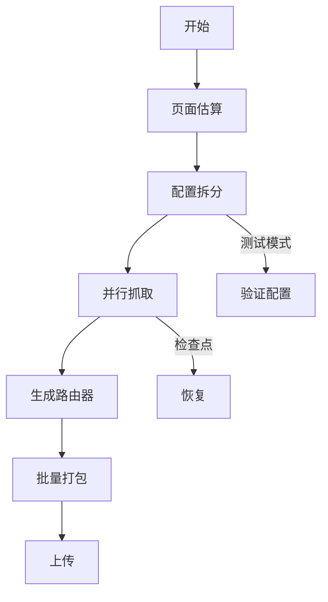
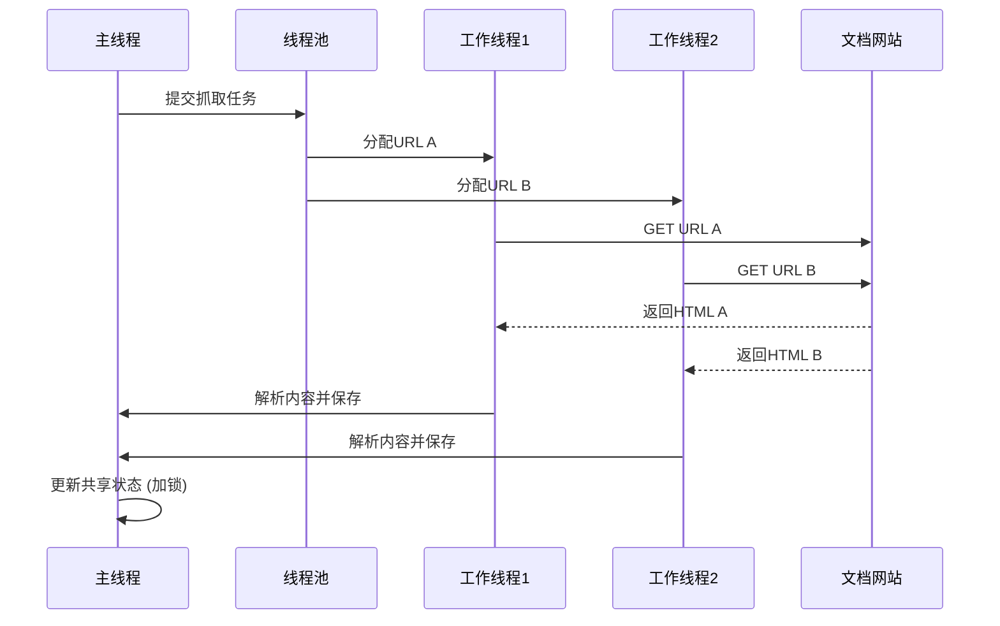

# 工作流编排

<cite>
**本文档引用的文件**  
- [generate_router.py](file://src/skill_seekers/cli/generate_router.py)
- [package_multi.py](file://src/skill_seekers/cli/package_multi.py)
- [estimate_pages.py](file://src/skill_seekers/cli/estimate_pages.py)
- [split_config.py](file://src/skill_seekers/cli/split_config.py)
- [doc_scraper.py](file://src/skill_seekers/cli/doc_scraper.py)
- [package_skill.py](file://src/skill_seekers/cli/package_skill.py)
- [main.py](file://src/skill_seekers/cli/main.py)
- [constants.py](file://src/skill_seekers/cli/constants.py)
- [godot.json](file://configs/godot.json)
- [react.json](file://configs/react.json)
- [ASYNC_SUPPORT.md](file://ASYNC_SUPPORT.md)
</cite>

## 目录
1. [引言](#引言)
2. [端到端工作流概述](#端到端工作流概述)
3. [页面估算](#页面估算)
4. [配置拆分](#配置拆分)
5. [并行抓取](#并行抓取)
6. [路由器生成](#路由器生成)
7. [批量打包](#批量打包)
8. [检查点恢复与测试模式](#检查点恢复与测试模式)
9. [完整Bash脚本示例](#完整bash脚本示例)
10. [结论](#结论)

## 引言

本文档全面描述了大规模文档处理的端到端工作流编排。该工作流旨在高效地将大型文档网站转换为适用于Claude AI的高质量技能包。流程从页面估算开始，经过配置拆分、并行抓取、路由器生成，最终到批量打包上传。核心是利用`generate_router.py`根据子技能配置自动生成智能路由器技能，以及使用`package_multi.py`批量处理多个输出目录。整个流程强调通过并行执行和检查点机制来优化性能和可靠性。

## 端到端工作流概述

大规模文档处理的工作流是一个多阶段、高度自动化的过程。其主要目标是将一个庞大的文档网站（如Godot或React的官方文档）分割成多个专注的子技能，并通过一个智能路由器进行统一管理，从而为AI提供高效、精准的知识检索能力。

该工作流的关键优势在于：
- **可扩展性**：通过拆分和并行处理，能够处理包含数千页的大型文档。
- **智能化**：生成的路由器能根据查询内容自动分发到最相关的子技能。
- **可靠性**：支持检查点恢复，确保长时间任务不会因意外中断而前功尽弃。
- **效率**：利用后台并行执行，显著缩短总处理时间。



**Diagram sources**
- [main.py](file://src/skill_seekers/cli/main.py)
- [split_config.py](file://src/skill_seekers/cli/split_config.py)
- [doc_scraper.py](file://src/skill_seekers/cli/doc_scraper.py)

## 页面估算

在开始大规模抓取之前，进行页面估算是至关重要的第一步。`estimate_pages.py`工具通过分析配置文件中的URL模式，模拟爬虫的发现过程，从而在不实际下载内容的情况下，快速估算出需要抓取的总页数。

### 工作原理
1.  **加载配置**：读取JSON配置文件，获取`base_url`、`start_urls`和`url_patterns`。
2.  **发现页面**：从`start_urls`开始，发送HEAD请求检查页面是否存在，并使用GET请求获取HTML内容以提取所有链接。
3.  **过滤链接**：根据`url_patterns`中的`include`和`exclude`规则，筛选出需要抓取的有效URL。
4.  **统计估算**：持续发现新页面，直到达到`max_discovery`限制或发现所有可达页面，最终给出总页数的估算值。

### 输出与建议
该工具不仅提供估算结果，还会根据估算值给出配置建议：
- **推荐`max_pages`**：如果估算值超过当前配置的`max_pages`，会建议一个更合适的值。
- **预估抓取时间**：根据`rate_limit`和估算的总页数，计算出完成抓取所需的大概时间。

**Section sources**
- [estimate_pages.py](file://src/skill_seekers/cli/estimate_pages.py)
- [constants.py](file://src/skill_seekers/cli/constants.py)

## 配置拆分

对于大型文档，单一技能包可能过大，导致AI处理效率低下。`split_config.py`工具通过多种策略将一个大型配置文件拆分为多个更小、更专注的子技能配置。

### 拆分策略
- **按类别拆分 (category)**：利用配置文件中的`categories`字段，为每个类别（如“2D”、“3D”、“脚本”）创建一个独立的子技能。这是最推荐的策略，因为它能产生语义清晰的子技能。
- **按大小拆分 (size)**：当文档没有明确分类时，此策略会根据`max_pages`目标值将文档平均分割成多个部分。
- **路由器模式 (router)**：此策略结合了类别拆分和路由器生成。它会为每个类别创建子技能，并额外生成一个路由器配置文件，用于智能分发查询。

### 自动化决策
`split_config.py`支持`auto`模式，能根据文档的`max_pages`和`categories`存在与否，自动选择最佳策略：
- 小型文档（<5000页）：无需拆分。
- 中型文档（5000-10000页）：推荐按类别拆分。
- 大型文档（>10000页）：推荐使用路由器模式。

**Section sources**
- [split_config.py](file://src/skill_seekers/cli/split_config.py)
- [godot.json](file://configs/godot.json)

## 并行抓取

并行抓取是缩短大规模文档处理时间的核心。`doc_scraper.py`通过多线程实现了并行化，允许同时抓取多个网页。

### 实现机制
- **多线程池**：使用`concurrent.futures.ThreadPoolExecutor`创建一个线程池，线程数量由配置文件中的`workers`参数控制。
- **共享状态**：`visited_urls`、`pending_urls`和`pages_scraped`等状态变量被所有线程共享。
- **线程安全**：通过`threading.Lock`确保对共享状态的修改是线程安全的，防止数据竞争。

### 性能与限制
- **性能提升**：并行抓取可以显著提高页面抓取速率，尤其是在网络延迟较高的情况下。
- **速率限制**：每个工作线程都会遵守`rate_limit`设置，确保对目标服务器的请求不会过于频繁。
- **资源消耗**：增加工作线程数会提高CPU和内存使用率，需根据系统资源进行权衡。



**Diagram sources**
- [doc_scraper.py](file://src/skill_seekers/cli/doc_scraper.py)
- [constants.py](file://src/skill_seekers/cli/constants.py)

## 路由器生成

`generate_router.py`是实现智能查询分发的关键组件。它读取一组子技能的配置文件，并自动生成一个“路由器”技能，该技能能够根据用户查询的关键词，自动激活最相关的子技能。

### 核心功能
1.  **推断路由器名称**：通过分析子技能名称的公共前缀（如`godot-2d`, `godot-3d`中的`godot`）来自动确定路由器名称。
2.  **提取路由关键词**：从子技能的`categories`和名称中提取关键词，建立“关键词 -> 子技能”的映射关系。
3.  **生成路由器配置**：创建一个包含`_router: true`标记和`_sub_skills`列表的特殊JSON配置文件。
4.  **生成路由器文档**：创建一个`SKILL.md`文件，其中包含：
    - **何时使用**：说明路由器的用途。
    - **工作原理**：解释路由逻辑。
    - **快速参考**：提供查询示例，如“如何创建2D精灵？”会激活`godot-2d`技能。

### 使用示例
```bash
python3 generate_router.py configs/godot-*.json --name godot-hub
```
此命令会生成一个名为`godot-hub`的路由器，它可以智能地将关于“2D精灵”的查询路由到`godot-2d`技能，而将关于“GDScript语法”的查询路由到`godot-scripting`技能。

**Section sources**
- [generate_router.py](file://src/skill_seekers/cli/generate_router.py)
- [godot.json](file://configs/godot.json)

## 批量打包

`package_multi.py`工具用于将多个技能目录一次性打包成ZIP文件，极大地简化了上传前的准备工作。

### 工作流程
1.  **接收输入**：接受一个或多个技能目录的路径作为参数。
2.  **验证与打包**：对每个目录，调用`package_skill.py`进行质量检查和打包。
3.  **汇总结果**：输出一个包含所有打包结果的摘要，显示成功和失败的数量。

### 优势
- **效率**：避免了为每个技能单独运行打包命令的繁琐操作。
- **一致性**：确保所有技能都经过相同的打包流程。
- **集成性**：与`package_skill.py`的质量检查功能无缝集成，保证输出的ZIP包符合标准。

**Section sources**
- [package_multi.py](file://src/skill_seekers/cli/package_multi.py)
- [package_skill.py](file://src/skill_seekers/cli/package_skill.py)

## 检查点恢复与测试模式

为了确保长时间运行的抓取任务的可靠性，系统提供了检查点恢复和测试模式。

### 检查点恢复 (`--resume`)
- **机制**：在抓取过程中，系统会定期（默认每1000页）将当前的`visited_urls`、`pending_urls`和`pages_scraped`状态保存到一个`checkpoint.json`文件中。
- **恢复**：当抓取任务因意外中断后，可以通过`--resume`参数重新启动。程序会加载检查点文件，从上次中断的地方继续抓取，避免了重复工作。

### 测试模式 (`max_pages`)
- **目的**：在进行全量抓取前，验证配置文件的正确性。
- **方法**：将配置文件中的`max_pages`设置为一个很小的值（如10或50）。
- **作用**：可以快速运行整个流程，检查：
    - URL模式是否正确匹配了目标页面。
    - 选择器是否能准确提取内容。
    - 抓取流程是否正常，而无需等待数小时。

**Section sources**
- [doc_scraper.py](file://src/skill_seekers/cli/doc_scraper.py)
- [constants.py](file://src/skill_seekers/cli/constants.py)

## 完整bash脚本示例

以下是一个完整的Bash脚本示例，展示了如何将上述所有步骤串联起来，实现一个全自动化的端到端工作流。

```bash
#!/bin/bash

# 大规模文档处理端到端工作流示例
# 以Godot文档为例

CONFIG_NAME="godot"
CONFIG_GLOB="configs/${CONFIG_NAME}-*.json"

echo "🚀 开始处理 ${CONFIG_NAME} 文档..."

# 1. 页面估算 (使用测试模式)
echo "🔍 步骤1: 估算页面数量..."
skill-seekers estimate configs/${CONFIG_NAME}.json --max-discovery 200
# 根据估算结果，手动或自动调整配置文件中的 max_pages

# 2. 配置拆分 (使用路由器模式)
echo "✂️  步骤2: 拆分配置文件..."
python3 src/skill_seekers/cli/split_config.py \
  configs/${CONFIG_NAME}.json \
  --strategy router \
  --target-pages 5000 \
  --output-dir configs/split/

# 3. 并行抓取 (使用后台运行 & 和并行执行)
echo "🌐 步骤3: 开始并行抓取... (后台运行)"
# 为每个子技能配置启动一个抓取任务
for config in configs/split/${CONFIG_NAME}-*.json; do
  # 提取技能名称
  skill_name=$(basename "$config" .json)
  # 在后台并行启动抓取任务
  python3 src/skill_seekers/cli/doc_scraper.py \
    --config "$config" \
    --async \
    --workers 8 \
    --resume & # 后台运行
done

# 等待所有后台抓取任务完成
echo "⏳ 等待所有抓取任务完成..."
wait
echo "✅ 所有抓取任务已完成！"

# 4. 生成路由器
echo "🧠 步骤4: 生成路由器技能..."
python3 src/skill_seekers/cli/generate_router.py \
  configs/split/${CONFIG_NAME}-*.json \
  --name ${CONFIG_NAME}-router \
  --output-dir configs/routers/

# 抓取路由器 (可选，用于获取概述页面)
python3 src/skill_seekers/cli/doc_scraper.py \
  --config configs/routers/${CONFIG_NAME}-router.json

# 5. 批量打包
echo "📦 步骤5: 批量打包所有技能..."
python3 src/skill_seekers/cli/package_multi.py \
  output/${CONFIG_NAME}-*/ \
  output/${CONFIG_NAME}-router/

echo "🎉 工作流完成！ZIP包已生成在 output/ 目录下。"
```

## 结论

本文档详细阐述了从页面估算到批量打包的完整工作流。通过`estimate_pages.py`进行预估，`split_config.py`进行智能拆分，`doc_scraper.py`进行并行抓取，`generate_router.py`实现智能路由，以及`package_multi.py`完成批量打包，形成了一套高效、可靠的大规模文档处理解决方案。利用`&`后台运行和`wait`命令，可以轻松实现任务的并行化，极大地缩短了总处理时间。检查点恢复和测试模式则为长时间运行的任务提供了必要的容错和验证机制。这套工作流为构建高质量、可扩展的AI技能提供了坚实的基础。