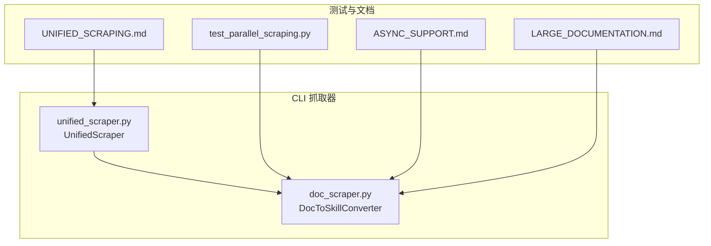
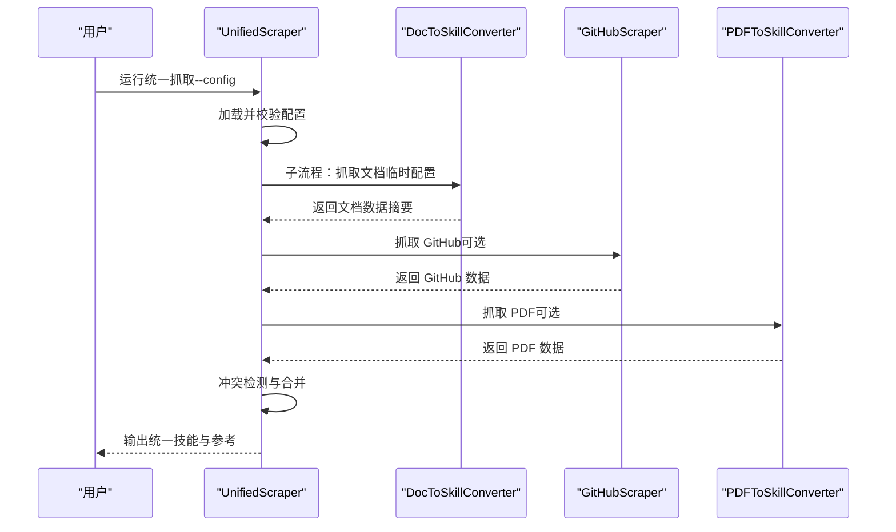
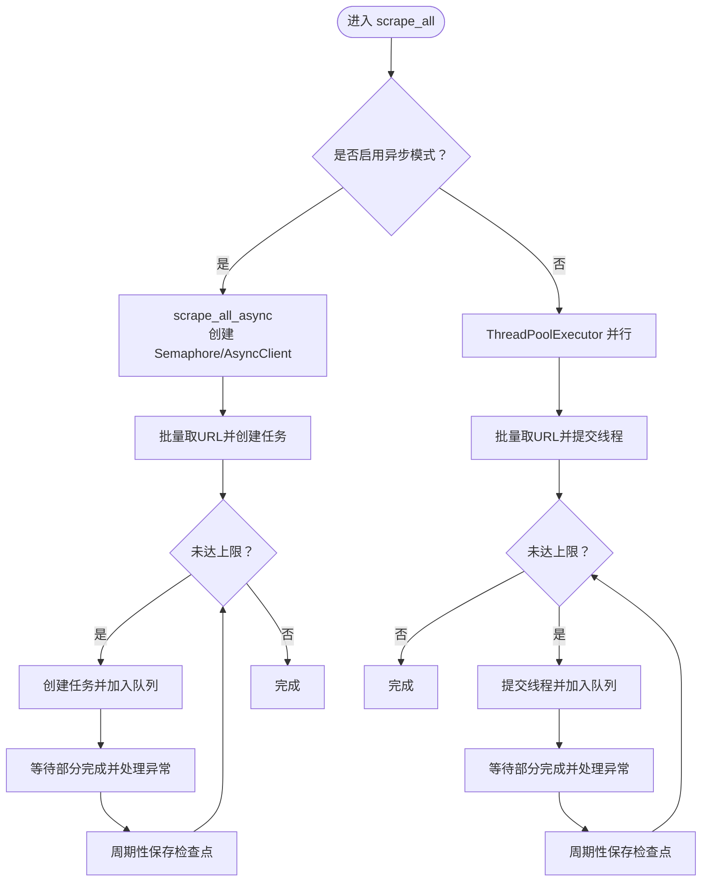
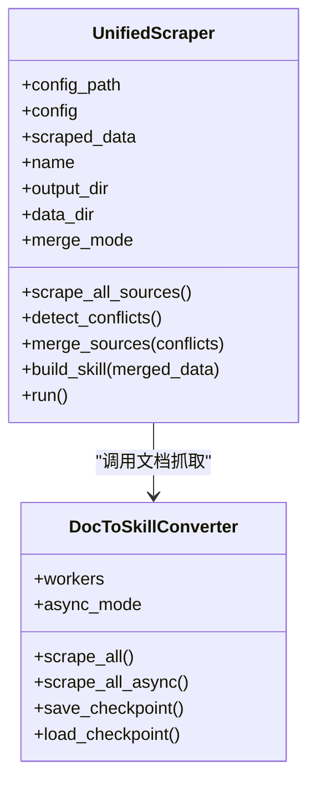
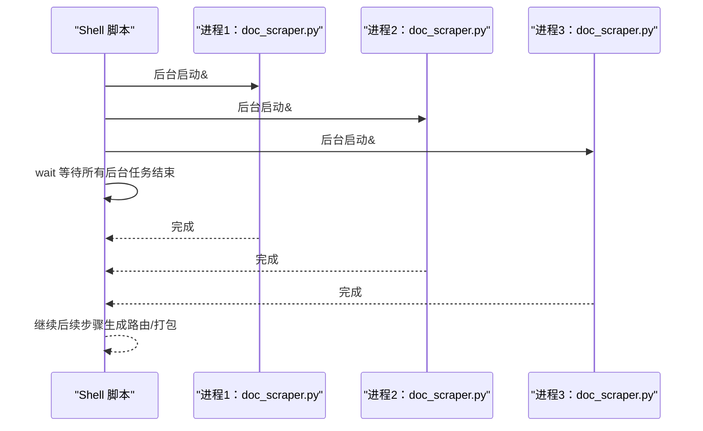
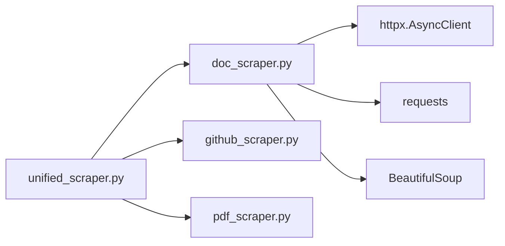

# 并行抓取

<cite>
**本文引用的文件**
- [doc_scraper.py](file://src/skill_seekers/cli/doc_scraper.py)
- [unified_scraper.py](file://src/skill_seekers/cli/unified_scraper.py)
- [test_parallel_scraping.py](file://tests/test_parallel_scraping.py)
- [ASYNC_SUPPORT.md](file://ASYNC_SUPPORT.md)
- [LARGE_DOCUMENTATION.md](file://docs/LARGE_DOCUMENTATION.md)
- [UNIFIED_SCRAPING.md](file://docs/UNIFIED_SCRAPING.md)
</cite>

## 目录
1. [引言](#引言)
2. [项目结构](#项目结构)
3. [核心组件](#核心组件)
4. [架构总览](#架构总览)
5. [详细组件分析](#详细组件分析)
6. [依赖关系分析](#依赖关系分析)
7. [性能考量](#性能考量)
8. [故障排查指南](#故障排查指南)
9. [结论](#结论)
10. [附录](#附录)

## 引言
本文件系统性阐述并行抓取机制在大规模文档处理中的关键作用，重点说明如何通过 shell 脚本结合 & 操作符实现多个抓取进程并发执行，并通过 wait 命令进行完成状态同步；同时对比串行与并行抓取的时间成本差异（例如 40 小时 vs 8 小时），突出性能优势。文档还覆盖错误处理、日志隔离、资源竞争等实际问题的解决方案，并强调使用 --resume 参数实现断点续传的重要性。

## 项目结构
围绕并行抓取的相关模块与文档如下：
- 文档抓取器：支持线程并行与异步并行两种模式，具备检查点与限速控制。
- 统一抓取器：可协调多来源（文档、GitHub、PDF）抓取，并调用文档抓取器作为子流程。
- 测试：验证并行配置、无限模式、速率限制、线程安全与干跑模式。
- 文档：提供并行抓取工作流示例、时间成本对比与最佳实践。

图表来源
- [doc_scraper.py](file://src/skill_seekers/cli/doc_scraper.py#L561-L800)
- [unified_scraper.py](file://src/skill_seekers/cli/unified_scraper.py#L120-L168)
- [test_parallel_scraping.py](file://tests/test_parallel_scraping.py#L1-L120)
- [ASYNC_SUPPORT.md](file://ASYNC_SUPPORT.md#L1-L120)
- [LARGE_DOCUMENTATION.md](file://docs/LARGE_DOCUMENTATION.md#L138-L150)
- [UNIFIED_SCRAPING.md](file://docs/UNIFIED_SCRAPING.md#L493-L543)

章节来源
- [doc_scraper.py](file://src/skill_seekers/cli/doc_scraper.py#L561-L800)
- [unified_scraper.py](file://src/skill_seekers/cli/unified_scraper.py#L120-L168)
- [test_parallel_scraping.py](file://tests/test_parallel_scraping.py#L1-L120)
- [ASYNC_SUPPORT.md](file://ASYNC_SUPPORT.md#L1-L120)
- [LARGE_DOCUMENTATION.md](file://docs/LARGE_DOCUMENTATION.md#L138-L150)
- [UNIFIED_SCRAPING.md](file://docs/UNIFIED_SCRAPING.md#L493-L543)

## 核心组件
- 文档抓取器（DocToSkillConverter）
  - 支持 workers 线程数配置，启用时创建线程锁保护共享状态。
  - 提供 scrape_all 与 scrape_all_async 两种抓取路径，后者基于 asyncio/httpx 实现更高并发与更低内存占用。
  - 支持检查点（checkpoint）持久化与恢复（--resume），避免长时间抓取中断导致的重复劳动。
  - 支持无限模式（max_pages 为 None 或 -1）与速率限制（rate_limit）。
- 统一抓取器（UnifiedScraper）
  - 针对多来源（文档、GitHub、PDF）的编排入口，内部可调用文档抓取器作为子流程。
  - 提供冲突检测与合并策略（规则合并/Claude 增强合并），最终构建统一技能。
- 测试与文档
  - 测试覆盖并行配置、无限模式、速率限制、线程安全与干跑模式。
  - 文档提供并行抓取工作流、时间成本对比与最佳实践。

章节来源
- [doc_scraper.py](file://src/skill_seekers/cli/doc_scraper.py#L71-L120)
- [doc_scraper.py](file://src/skill_seekers/cli/doc_scraper.py#L561-L800)
- [doc_scraper.py](file://src/skill_seekers/cli/doc_scraper.py#L158-L212)
- [unified_scraper.py](file://src/skill_seekers/cli/unified_scraper.py#L120-L168)
- [test_parallel_scraping.py](file://tests/test_parallel_scraping.py#L1-L120)
- [ASYNC_SUPPORT.md](file://ASYNC_SUPPORT.md#L1-L120)
- [LARGE_DOCUMENTATION.md](file://docs/LARGE_DOCUMENTATION.md#L138-L150)

## 架构总览
下图展示统一抓取器如何协调文档抓取器与其他来源，并给出并行抓取的总体流程。

图表来源
- [unified_scraper.py](file://src/skill_seekers/cli/unified_scraper.py#L120-L168)
- [unified_scraper.py](file://src/skill_seekers/cli/unified_scraper.py#L380-L418)
- [doc_scraper.py](file://src/skill_seekers/cli/doc_scraper.py#L561-L800)

章节来源
- [unified_scraper.py](file://src/skill_seekers/cli/unified_scraper.py#L120-L168)
- [unified_scraper.py](file://src/skill_seekers/cli/unified_scraper.py#L380-L418)

## 详细组件分析

### 文档抓取器（DocToSkillConverter）并行机制
- 线程并行（ThreadPoolExecutor）
  - 当 workers > 1 时，使用线程池并发提交任务；通过线程锁保护 visited_urls/pending_urls/pages 等共享状态。
  - 批量获取 URL 并提交，完成后等待部分任务完成再继续提交，减少内存峰值与服务器压力。
- 异步并行（asyncio/httpx.AsyncClient）
  - 使用 asyncio.Semaphore 控制并发度，httpx.AsyncClient 提供连接池与非阻塞超时。
  - 相比线程并行，异步模式具有更高的吞吐与更低的内存占用，适合大规模站点。
- 检查点与断点续传
  - 支持周期性保存 checkpoint.json，包含已访问 URL、待处理队列、页面计数等。
  - 启动时可加载 checkpoint 并从上次进度继续（--resume），避免长时间抓取失败重头开始。
- 速率限制与无限模式
  - rate_limit 可按需设置，避免对目标服务器造成过大压力。
  - max_pages 支持 None/-1 表示无限模式，适合全站抓取。

图表来源
- [doc_scraper.py](file://src/skill_seekers/cli/doc_scraper.py#L722-L800)
- [doc_scraper.py](file://src/skill_seekers/cli/doc_scraper.py#L648-L713)

章节来源
- [doc_scraper.py](file://src/skill_seekers/cli/doc_scraper.py#L71-L120)
- [doc_scraper.py](file://src/skill_seekers/cli/doc_scraper.py#L561-L800)
- [doc_scraper.py](file://src/skill_seekers/cli/doc_scraper.py#L158-L212)
- [ASYNC_SUPPORT.md](file://ASYNC_SUPPORT.md#L1-L120)

### 统一抓取器（UnifiedScraper）多来源编排
- 多来源抓取：根据配置类型分别调用文档抓取器、GitHub 抓取器或 PDF 抓取器。
- 冲突检测与合并：当存在多个来源且需要 API 对齐时，自动检测冲突并进行规则合并或 Claude 增强合并。
- 输出结构：生成统一技能目录与参考文件，便于后续打包与上传。

图表来源
- [unified_scraper.py](file://src/skill_seekers/cli/unified_scraper.py#L42-L118)
- [doc_scraper.py](file://src/skill_seekers/cli/doc_scraper.py#L561-L800)

章节来源
- [unified_scraper.py](file://src/skill_seekers/cli/unified_scraper.py#L42-L118)
- [unified_scraper.py](file://src/skill_seekers/cli/unified_scraper.py#L380-L418)

### Shell 并行抓取工作流与 wait 同步
- 工作流要点
  - 使用 & 在后台启动多个文档抓取进程，每个进程独立处理一个拆分后的配置。
  - 使用 wait 等待所有后台任务完成，确保主流程在全部任务结束后再进行后续步骤（如生成路由、打包等）。
- 时间成本对比
  - 文档明确给出：串行约 40 小时，使用并行可在 8 小时左右完成（具体取决于站点规模与网络条件）。
- 断点续传
  - 配置启用检查点后，抓取器会在周期性间隔保存进度；若中途失败，可使用 --resume 从上次进度继续，避免重复抓取。

图表来源
- [LARGE_DOCUMENTATION.md](file://docs/LARGE_DOCUMENTATION.md#L138-L150)
- [LARGE_DOCUMENTATION.md](file://docs/LARGE_DOCUMENTATION.md#L287-L301)
- [doc_scraper.py](file://src/skill_seekers/cli/doc_scraper.py#L158-L212)

章节来源
- [LARGE_DOCUMENTATION.md](file://docs/LARGE_DOCUMENTATION.md#L138-L150)
- [LARGE_DOCUMENTATION.md](file://docs/LARGE_DOCUMENTATION.md#L287-L301)
- [doc_scraper.py](file://src/skill_seekers/cli/doc_scraper.py#L158-L212)

### 错误处理、日志隔离与资源竞争
- 错误处理
  - 并行场景中，异常通过 as_completed 的 future.result() 捕获并记录，避免单个任务崩溃影响整体流程。
  - 统一抓取器对各来源抓取过程进行 try-except 包裹，出现异常会记录并继续其他来源。
- 日志隔离
  - 并行抓取时，建议为不同进程输出不同的日志文件或使用不同的输出目录，避免日志混杂。
  - 文档抓取器内部使用标准 logging，配合 --verbose/--quiet 控制日志级别。
- 资源竞争
  - 线程并行通过 threading.Lock 保护共享状态（visited_urls、pending_urls、pages 等）。
  - 异步并行通过 asyncio.Semaphore 控制并发度，避免过度占用连接与内存。
  - 速率限制（rate_limit）与连接池（httpx.AsyncClient）有助于缓解服务器压力与资源争用。

章节来源
- [doc_scraper.py](file://src/skill_seekers/cli/doc_scraper.py#L389-L428)
- [doc_scraper.py](file://src/skill_seekers/cli/doc_scraper.py#L648-L713)
- [unified_scraper.py](file://src/skill_seekers/cli/unified_scraper.py#L104-L116)
- [ASYNC_SUPPORT.md](file://ASYNC_SUPPORT.md#L1-L120)

## 依赖关系分析
- 组件耦合
  - UnifiedScraper 依赖 DocToSkillConverter（文档来源）、GitHubScraper（代码来源）、PDFToSkillConverter（PDF 来源）。
  - DocToSkillConverter 内部依赖 httpx（异步）、requests（同步）、BeautifulSoup（解析）、语言检测器等。
- 外部依赖
  - httpx.AsyncClient、asyncio.Semaphore、concurrent.futures.ThreadPoolExecutor 等为并行抓取提供基础能力。
- 潜在循环依赖
  - 代码中未发现循环导入；各模块职责清晰，通过函数/类接口交互。

图表来源
- [unified_scraper.py](file://src/skill_seekers/cli/unified_scraper.py#L120-L168)
- [doc_scraper.py](file://src/skill_seekers/cli/doc_scraper.py#L561-L800)

章节来源
- [unified_scraper.py](file://src/skill_seekers/cli/unified_scraper.py#L120-L168)
- [doc_scraper.py](file://src/skill_seekers/cli/doc_scraper.py#L561-L800)

## 性能考量
- 线程并行 vs 异步并行
  - 异步模式在高并发场景下具有更优的吞吐与更低的内存占用，适合大规模站点。
  - 线程并行受 GIL 影响，但实现简单，适合中小规模站点或本地环境。
- 并发度选择
  - workers 数量应结合 CPU 核心数与网络带宽进行权衡，过高会导致服务器限流或本地资源紧张。
- 速率限制与连接池
  - 合理设置 rate_limit 与 httpx.AsyncClient 的连接池上限，避免对目标服务器造成过大压力。
- 检查点与断点续传
  - 长时间抓取建议开启检查点并定期保存，失败后使用 --resume 继续，显著降低重抓成本。

章节来源
- [ASYNC_SUPPORT.md](file://ASYNC_SUPPORT.md#L1-L120)
- [doc_scraper.py](file://src/skill_seekers/cli/doc_scraper.py#L722-L800)
- [doc_scraper.py](file://src/skill_seekers/cli/doc_scraper.py#L158-L212)

## 故障排查指南
- 并行抓取失败
  - 使用 wait 等待所有后台任务完成，检查各进程返回码与日志，定位失败原因。
  - 若某进程频繁失败，适当降低 workers 或增加 rate_limit。
- 检查点无效或无法恢复
  - 确认配置中启用了检查点并设置了合理的 interval；使用 --resume 启动时确保 checkpoint 文件存在。
- 日志混乱
  - 为不同进程指定独立的日志文件或输出目录，避免多进程写入同一文件导致竞争。
- 服务器限流
  - 提升 rate_limit 或降低 workers；必要时分批抓取，避免短时间内大量请求。

章节来源
- [LARGE_DOCUMENTATION.md](file://docs/LARGE_DOCUMENTATION.md#L396-L410)
- [doc_scraper.py](file://src/skill_seekers/cli/doc_scraper.py#L158-L212)

## 结论
并行抓取是大规模文档处理的关键手段。通过 shell 脚本结合 & 与 wait，可以将多个抓取进程并行调度并在完成后统一收尾；异步并行进一步提升了吞吐与资源利用率。配合检查点与断点续传、速率限制与连接池优化，能够在保证稳定性的同时显著缩短抓取时间（例如从 40 小时降至 8 小时）。统一抓取器则提供了多来源整合与冲突治理的能力，使最终技能更加完整与可信。

## 附录
- 相关文档与测试
  - 并行抓取工作流与时间成本对比：参见 [LARGE_DOCUMENTATION.md](file://docs/LARGE_DOCUMENTATION.md#L138-L150)、[LARGE_DOCUMENTATION.md](file://docs/LARGE_DOCUMENTATION.md#L287-L301)
  - 异步模式性能与配置：参见 [ASYNC_SUPPORT.md](file://ASYNC_SUPPORT.md#L1-L120)
  - 统一抓取器架构与流程：参见 [UNIFIED_SCRAPING.md](file://docs/UNIFIED_SCRAPING.md#L493-L543)
  - 并行抓取测试用例：参见 [test_parallel_scraping.py](file://tests/test_parallel_scraping.py#L1-L120)