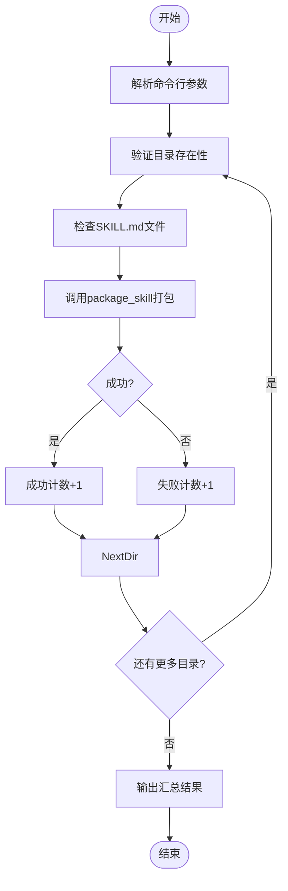
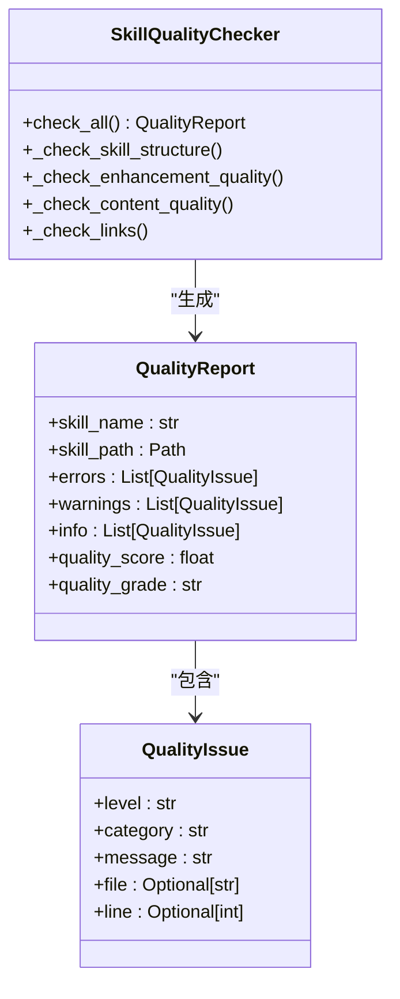

# 批量打包

<cite>
**本文档中引用的文件**  
- [package_multi.py](file://src/skill_seekers/cli/package_multi.py)
- [package_skill.py](file://src/skill_seekers/cli/package_skill.py)
- [utils.py](file://src/skill_seekers/cli/utils.py)
- [quality_checker.py](file://src/skill_seekers/cli/quality_checker.py)
</cite>

## 目录
1. [简介](#简介)
2. [核心功能分析](#核心功能分析)
3. [批量打包流程](#批量打包流程)
4. [输出文件命名规则](#输出文件命名规则)
5. [命令行使用示例](#命令行使用示例)
6. [质量检查机制](#质量检查机制)
7. [简化上传流程的价值](#简化上传流程的价值)
8. [结论](#结论)

## 简介
`package_multi.py` 是一个用于批量打包多个技能目录的工具，特别适用于将路由器技能与其子技能一起打包的场景。该工具能够遍历指定路径下的每个子技能目录，分别生成独立的ZIP文件，并确保符合Claude技能上传格式要求。通过自动化批量处理，显著简化了上传流程，减少了人为错误。

## 核心功能分析

`package_multi.py` 的主要功能是批量处理多个技能目录的打包操作。它通过调用 `package_skill.py` 来实现单个技能的打包，并在批量模式下依次处理所有指定的技能目录。

**Section sources**
- [package_multi.py](file://src/skill_seekers/cli/package_multi.py#L1-L82)

## 批量打包流程

`package_multi.py` 的工作流程如下：

1. **解析命令行参数**：接受一个或多个技能目录路径作为输入参数。
2. **验证目录存在性**：检查每个指定的技能目录是否存在。
3. **验证SKILL.md文件**：确保每个技能目录中包含必需的 `SKILL.md` 文件。
4. **调用单个打包函数**：对每个有效的技能目录调用 `package_skill()` 函数进行打包。
5. **汇总结果**：统计成功和失败的打包数量，并输出最终摘要。

该工具通过 `subprocess.run()` 调用 `package_skill.py` 来执行实际的打包操作，实现了功能的模块化和复用。



**Diagram sources**
- [package_multi.py](file://src/skill_seekers/cli/package_multi.py#L28-L82)

**Section sources**
- [package_multi.py](file://src/skill_seekers/cli/package_multi.py#L1-L82)

## 输出文件命名规则

`package_multi.py` 本身不直接创建ZIP文件，而是调用 `package_skill.py` 来完成打包。`package_skill.py` 中的输出文件命名规则如下：

- **文件名**：使用技能目录的名称作为ZIP文件的名称
- **扩展名**：`.zip`
- **位置**：与技能目录相同的父目录下

例如，如果技能目录为 `output/godot-2d/`，则生成的ZIP文件为 `output/godot-2d.zip`。

```python
skill_name = skill_path.name
zip_path = skill_path.parent / f"{skill_name}.zip"
```

**Section sources**
- [package_skill.py](file://src/skill_seekers/cli/package_skill.py#L84-L85)

## 命令行使用示例

以下是 `package_multi.py` 的典型使用示例：

```bash
# 打包所有godot技能
python3 package_multi.py output/godot*/

# 打包特定技能
python3 package_multi.py output/godot-2d/ output/godot-3d/ output/godot-scripting/
```

这些命令行示例展示了如何使用通配符批量处理多个目录，或显式指定需要打包的特定目录。

**Section sources**
- [package_multi.py](file://src/skill_seekers/cli/package_multi.py#L34-L38)

## 质量检查机制

为了确保生成的ZIP文件符合Claude技能上传格式要求，`package_multi.py` 依赖于 `package_skill.py` 中的质量检查机制：

1. **基本验证**：通过 `validate_skill_directory()` 函数验证技能目录的有效性，确保目录存在且包含 `SKILL.md` 文件。
2. **质量检查**：运行 `SkillQualityChecker` 对技能进行全面检查，包括：
   - 结构完整性检查
   - 内容质量评估
   - 链接有效性验证
   - 增强质量检查

如果发现错误或警告，工具会提示用户确认是否继续打包，从而确保上传的技能质量。



**Diagram sources**
- [quality_checker.py](file://src/skill_seekers/cli/quality_checker.py#L94-L481)
- [package_skill.py](file://src/skill_seekers/cli/package_skill.py#L54-L81)

**Section sources**
- [quality_checker.py](file://src/skill_seekers/cli/quality_checker.py#L94-L481)
- [package_skill.py](file://src/skill_seekers/cli/package_skill.py#L54-L81)
- [utils.py](file://src/skill_seekers/cli/utils.py#L133-L155)

## 简化上传流程的价值

`package_multi.py` 在简化上传流程、减少人为错误方面具有重要价值：

1. **批量处理效率**：一次性处理多个技能目录，避免了重复的手动操作。
2. **一致性保证**：通过统一的打包流程，确保所有生成的ZIP文件遵循相同的格式和质量标准。
3. **错误预防**：自动验证每个技能目录的完整性，防止因缺少必要文件而导致的上传失败。
4. **时间节省**：对于大型项目（如40K+页面的文档），可以将原本需要20-40小时的工作缩短至4-8小时。
5. **无缝集成**：与 `split_config.py` 和 `generate_router.py` 等工具配合使用，形成完整的大型文档处理工作流。

这种自动化批量打包能力特别适用于需要处理多个子技能的复杂项目，如Godot引擎的不同模块（2D、3D、脚本等）。

**Section sources**
- [package_multi.py](file://src/skill_seekers/cli/package_multi.py#L1-L82)
- [README.md](file://README.md#L282-L306)

## 结论
`package_multi.py` 是一个高效、可靠的批量打包工具，通过自动化处理多个技能目录的打包操作，显著提升了工作效率。它不仅简化了上传流程，还通过严格的质量检查机制确保了输出文件的合规性。该工具与项目中的其他组件（如 `package_skill.py`、`quality_checker.py` 等）紧密协作，形成了一个完整的技能生成和打包生态系统，为用户提供了从文档到可上传技能的一站式解决方案。