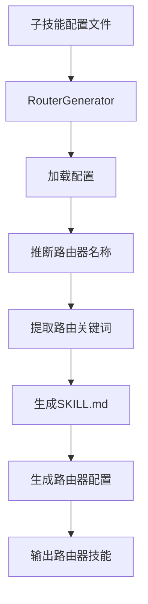
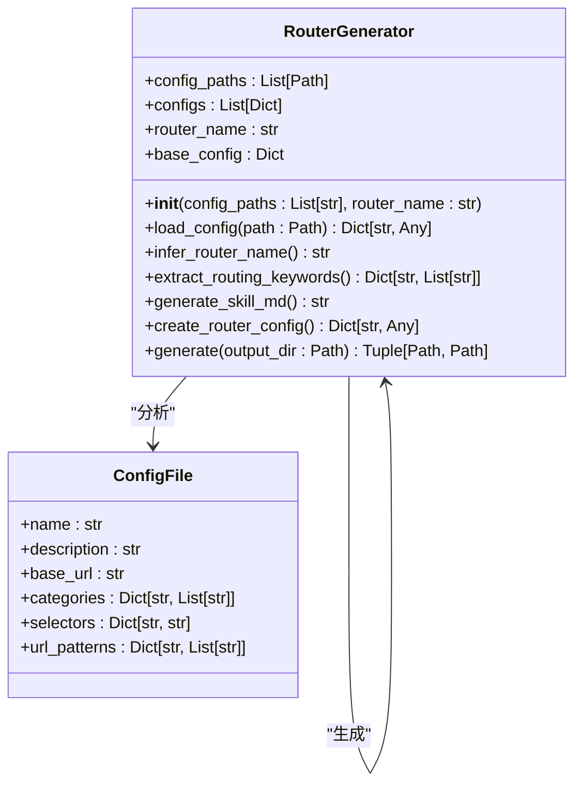
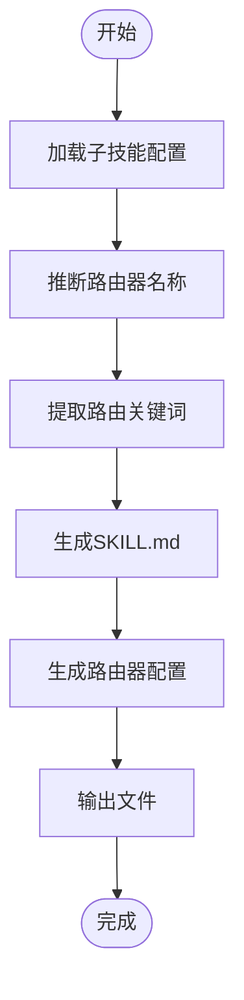
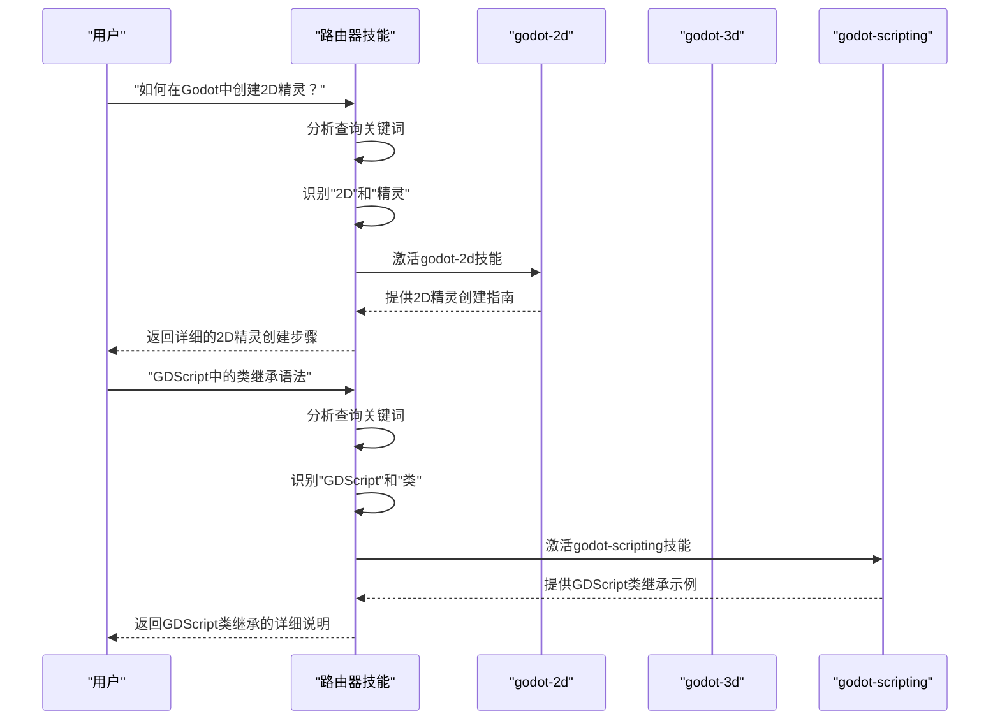
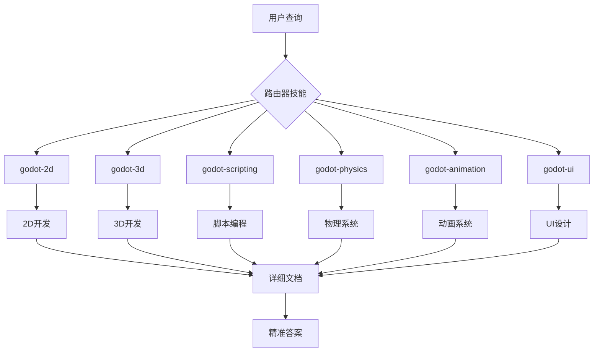

# 路由器生成

<cite>
**本文档中引用的文件**
- [generate_router.py](file://src/skill_seekers/cli/generate_router.py)
- [godot.json](file://configs/godot.json)
- [godot_unified.json](file://configs/godot_unified.json)
- [godot_github.json](file://configs/godot_github.json)
</cite>

## 目录
1. [简介](#简介)
2. [路由器生成机制](#路由器生成机制)
3. [元数据提取与路由规则](#元数据提取与路由规则)
4. [文件结构示例](#文件结构示例)
5. [Claude中的实际路由效果](#claude中的实际路由效果)
6. [子技能管理的必要性](#子技能管理的必要性)

## 简介
路由器生成器（Router Generator）是一种智能技能路由系统，用于管理大型文档站点拆分为多个专注子技能的场景。该系统通过分析output/godot*/等子目录的元数据（如技能名称、描述、类别），自动构建统一的SKILL.md入口文件，实现智能查询路由。这种机制在处理大量子技能时至关重要，确保用户查询能被准确分发到最相关的子技能。

## 路由器生成机制
路由器生成器通过`generate_router.py`脚本实现，该脚本创建一个集线器技能，智能地将查询定向到专门的子技能。系统使用多个子技能配置文件作为输入，自动推断路由器名称，并生成相应的配置文件和SKILL.md文档。

核心工作流程包括：
1. 加载所有子技能配置文件
2. 推断路由器名称（基于子技能名称的公共前缀）
3. 提取每个子技能的路由关键词
4. 生成路由器配置文件和SKILL.md文档



**图示来源**
- [generate_router.py](file://src/skill_seekers/cli/generate_router.py#L16-L274)

**本节来源**
- [generate_router.py](file://src/skill_seekers/cli/generate_router.py#L1-L274)

## 元数据提取与路由规则
路由器生成器从子技能配置文件中提取关键元数据，构建智能路由逻辑。主要元数据来源包括：

### 配置文件元数据
| 元数据类型 | 提取来源 | 说明 |
|-----------|---------|------|
| 技能名称 | `name` 字段 | 用于标识子技能 |
| 描述信息 | `description` 字段 | 提供子技能的详细说明 |
| 分类信息 | `categories` 字段 | 定义技能的主题分类 |
| 基础URL | `base_url` 字段 | 子技能的文档基础地址 |

### 路由关键词提取
系统通过`extract_routing_keywords`方法提取路由关键词，主要来源包括：

1. **分类关键词**：从配置文件的`categories`字段提取所有分类键
2. **名称关键词**：从技能名称中提取连字符后的主题部分

例如，对于名为`godot-2d`的技能：
- 分类关键词：`2d`, `sprite`, `canvas`, `tilemap`
- 名称关键词：`2d`



**图示来源**
- [generate_router.py](file://src/skill_seekers/cli/generate_router.py#L47-L66)
- [godot.json](file://configs/godot.json#L1-L48)

**本节来源**
- [generate_router.py](file://src/skill_seekers/cli/generate_router.py#L47-L171)
- [godot.json](file://configs/godot.json#L1-L48)

## 文件结构示例
路由器生成器创建的文件结构遵循标准化模式，确保一致性和可维护性。

### 输出目录结构
```
output/
└── {router_name}/
    ├── SKILL.md
    └── data/
        └── ... (抓取的内容)
```

### 路由器配置文件
```json
{
  "name": "godot",
  "description": "Godot Engine documentation router",
  "base_url": "https://docs.godotengine.org/en/stable/",
  "selectors": { ... },
  "url_patterns": { ... },
  "rate_limit": 0.5,
  "max_pages": 500,
  "_router": true,
  "_sub_skills": ["godot-2d", "godot-3d", "godot-scripting"],
  "_routing_keywords": {
    "godot-2d": ["2d", "sprite", "canvas"],
    "godot-3d": ["3d", "spatial", "mesh"],
    "godot-scripting": ["scripting", "gdscript", "c#"]
  }
}
```

### SKILL.md内容结构
```markdown
# Godot 文档 (路由器)

## 何时使用此技能
使用此技能获取Godot引擎开发和编程的帮助。这是路由器技能，将您的问题定向到专门的子技能以获得高效、专注的协助。

## 工作原理
此技能分析您的问题并激活适当的专门技能：

### godot-2d
2D开发相关功能...

### godot-3d
3D开发相关功能...

## 路由逻辑
路由器分析您的问题中的主题关键词并激活相关技能：

**关键词 → 技能：**
- 2d, sprite, canvas → **godot-2d**
- 3d, spatial, mesh → **godot-3d**
- scripting, gdscript → **godot-scripting**
```



**图示来源**
- [generate_router.py](file://src/skill_seekers/cli/generate_router.py#L172-L194)
- [godot.json](file://configs/godot.json#L1-L48)

**本节来源**
- [generate_router.py](file://src/skill_seekers/cli/generate_router.py#L172-L194)
- [godot.json](file://configs/godot.json#L1-L48)

## Claude中的实际路由效果
在Claude中，路由器技能通过智能分析用户查询的关键词，自动激活最相关的子技能，提供精准的响应。

### 路由示例
| 用户查询 | 激活的技能 | 匹配关键词 |
|---------|-----------|-----------|
| "如何创建2D精灵？" | godot-2d | 2d, sprite |
| "GDScript函数语法" | godot-scripting | gdscript, scripting |
| "3D中的物理碰撞处理" | godot-3d + godot-physics | 3d, physics |
| "UI界面设计指南" | godot-ui | ui, interface |

### 路由逻辑流程


**图示来源**
- [generate_router.py](file://src/skill_seekers/cli/generate_router.py#L72-L149)
- [godot.json](file://configs/godot.json#L33-L43)

**本节来源**
- [generate_router.py](file://src/skill_seekers/cli/generate_router.py#L72-L149)
- [godot.json](file://configs/godot.json#L33-L43)

## 子技能管理的必要性
在管理大量子技能时，路由器技能的必要性体现在以下几个方面：

### 1. 查询效率提升
- **精准路由**：避免用户在多个子技能间手动切换
- **快速响应**：直接定位到最相关的知识库
- **减少冗余**：避免在不相关的技能中搜索

### 2. 知识体系整合
- **统一入口**：提供单一访问点，简化用户体验
- **智能分发**：自动将查询路由到最合适的子技能
- **无缝集成**：保持各子技能独立性的同时实现协同工作

### 3. 维护与扩展性
- **模块化设计**：新增子技能只需更新路由器配置
- **易于维护**：独立更新子技能不影响整体系统
- **灵活扩展**：支持无限数量的子技能集成

### 4. 用户体验优化
- **自然语言交互**：用户无需了解底层技能结构
- **智能提示**：提供可用技能的快速参考
- **渐进式披露**：先提供概述，再深入细节



**图示来源**
- [generate_router.py](file://src/skill_seekers/cli/generate_router.py#L1-L274)
- [godot.json](file://configs/godot.json#L1-L48)
- [godot_unified.json](file://configs/godot_unified.json#L1-L51)

**本节来源**
- [generate_router.py](file://src/skill_seekers/cli/generate_router.py#L1-L274)
- [godot.json](file://configs/godot.json#L1-L48)
- [godot_unified.json](file://configs/godot_unified.json#L1-L51)