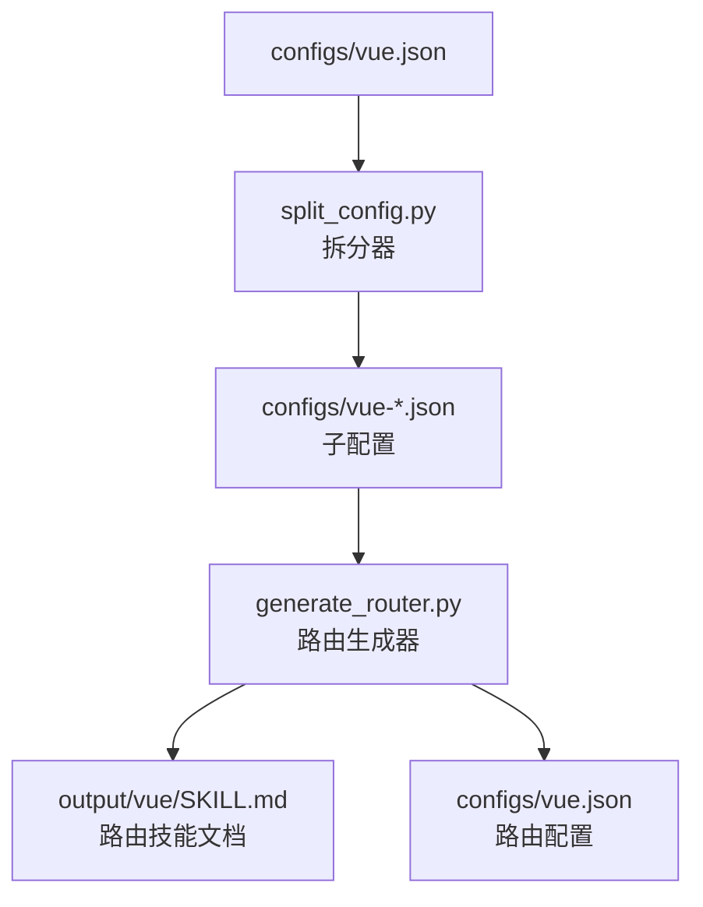
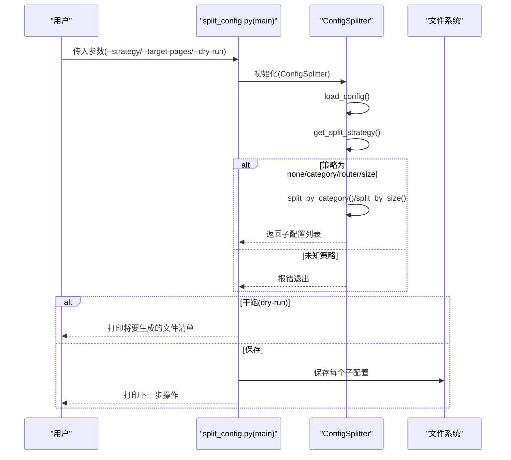
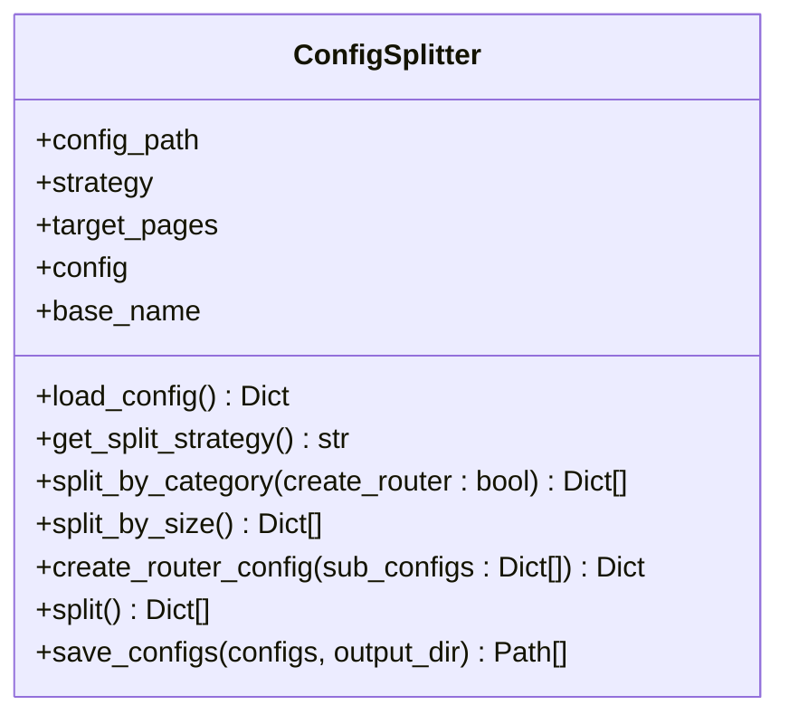
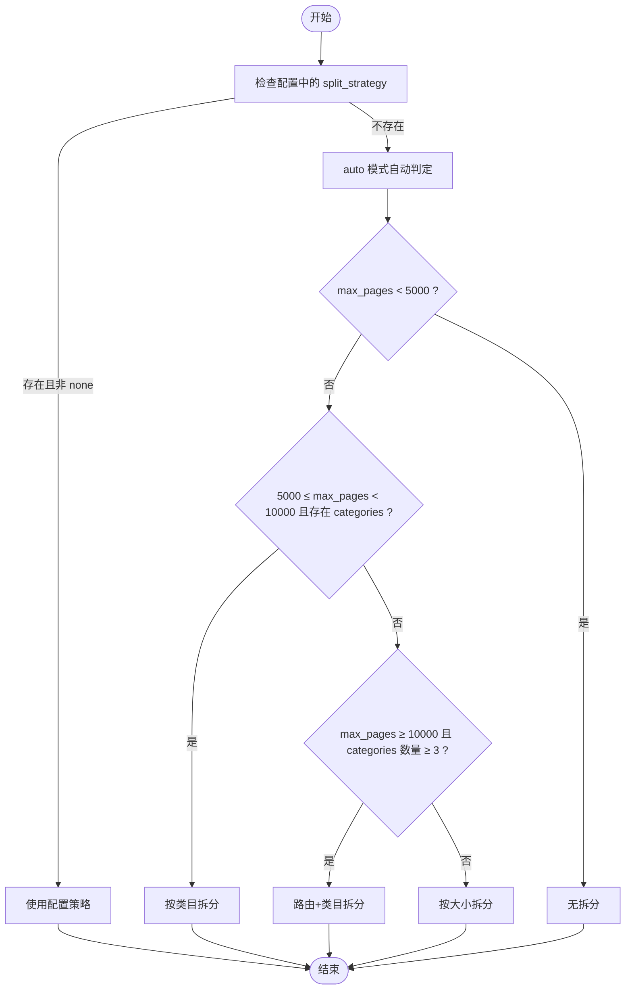
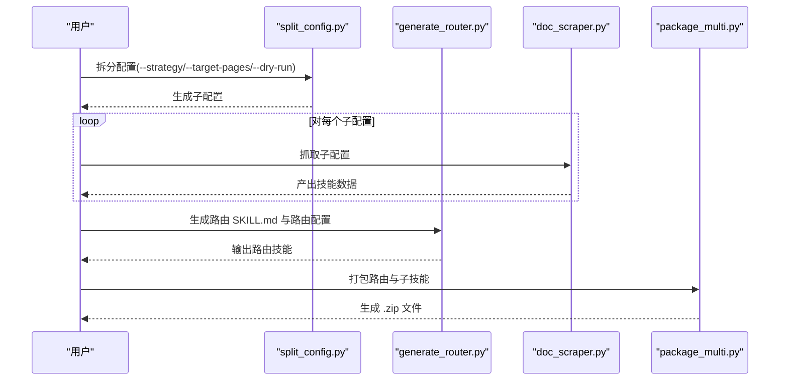
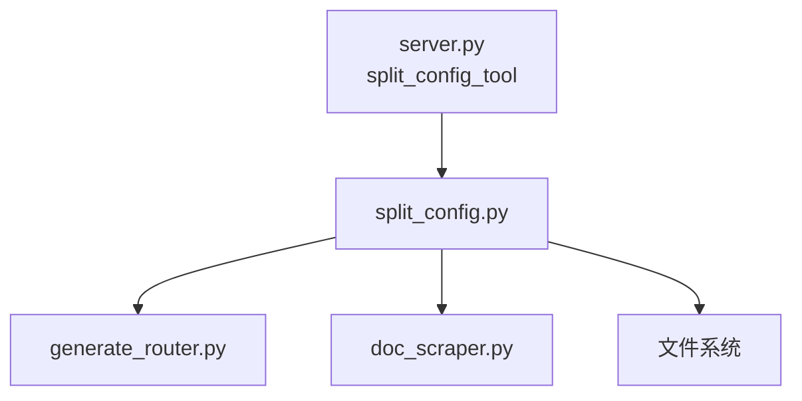

# 配置拆分

<cite>
**本文引用的文件**
- [split_config.py](file://src/skill_seekers/cli/split_config.py)
- [LARGE_DOCUMENTATION.md](file://docs/LARGE_DOCUMENTATION.md)
- [vue.json](file://configs/vue.json)
- [godot.json](file://configs/godot.json)
- [react.json](file://configs/react.json)
- [fastapi.json](file://configs/fastapi.json)
- [generate_router.py](file://src/skill_seekers/cli/generate_router.py)
- [server.py](file://src/skill_seekers/mcp/server.py)
</cite>

## 目录
1. [简介](#简介)
2. [项目结构](#项目结构)
3. [核心组件](#核心组件)
4. [架构总览](#架构总览)
5. [详细组件分析](#详细组件分析)
6. [依赖关系分析](#依赖关系分析)
7. [性能考量](#性能考量)
8. [故障排查指南](#故障排查指南)
9. [结论](#结论)
10. [附录](#附录)

## 简介
本篇文档围绕 split_config.py 的工作原理与使用场景展开，系统讲解其如何将大型配置文件（如 vue.json）按策略拆分为多个子配置文件（如 vue-components.json、vue-reactivity.json 等），并说明不同拆分策略的适用场景与最佳实践。同时给出命令行示例、配置文件生成规则，以及拆分后与后续抓取流程的集成方式。

## 项目结构
split_config.py 位于 CLI 子模块中，负责将单个“技能配置”拆分为多个更小、更聚焦的子配置；配合 generate_router.py 可生成路由型“枢纽技能”，实现智能分流到各子技能。相关文档在 docs 中提供了完整的策略说明与工作流。

图表来源
- [split_config.py](file://src/skill_seekers/cli/split_config.py#L1-L221)
- [generate_router.py](file://src/skill_seekers/cli/generate_router.py#L1-L195)
- [vue.json](file://configs/vue.json#L1-L32)

章节来源
- [split_config.py](file://src/skill_seekers/cli/split_config.py#L1-L221)
- [LARGE_DOCUMENTATION.md](file://docs/LARGE_DOCUMENTATION.md#L1-L120)

## 核心组件
- ConfigSplitter 类：封装加载配置、自动策略判定、按类目拆分、按大小拆分、保存配置、生成路由配置等能力。
- 命令行入口：解析参数（策略、目标页数、输出目录、是否干跑）、执行拆分、打印下一步操作提示。
- 路由生成器：从子配置集合生成路由配置与 SKILL.md 文档，用于智能分流。

章节来源
- [split_config.py](file://src/skill_seekers/cli/split_config.py#L17-L221)
- [generate_router.py](file://src/skill_seekers/cli/generate_router.py#L1-L195)

## 架构总览
split_config.py 的执行流程如下：
- 加载输入配置
- 自动判定策略（优先读取配置中的 split_strategy，否则根据 max_pages 与是否存在 categories 自动选择）
- 按策略拆分：无拆分、按类目、按大小、或创建路由+按类目
- 保存子配置（可干跑仅预览不落盘）
- 输出下一步操作建议（逐个抓取、打包上传）

图表来源
- [split_config.py](file://src/skill_seekers/cli/split_config.py#L172-L221)
- [split_config.py](file://src/skill_seekers/cli/split_config.py#L224-L321)

## 详细组件分析

### ConfigSplitter 类
- 职责
  - 加载配置并校验
  - 自动策略判定：依据配置中的 split_strategy 与 max_pages、categories 字段决定策略
  - 拆分策略
    - 无拆分：返回原配置
    - 按类目：基于 categories 生成若干子配置，每个子配置仅保留对应类目关键词与 include 规则
    - 按大小：根据 max_pages 与目标页数 target_pages 计算拆分数，生成若干 partX 子配置
    - 路由+类目：在按类目拆分基础上，额外生成一个路由配置，包含 _router 标记、_sub_skills 与 _routing_keywords
  - 保存配置：统一写入同目录或指定输出目录
  - 路由配置生成：复制基础字段，设置 _router、_sub_skills、_routing_keywords，限制 max_pages 为较小值以仅抓取概览

- 关键数据结构与复杂度
  - 类目拆分：对 categories 进行一次遍历，时间复杂度 O(N)，N 为类目数量
  - 大小拆分：计算拆分数，时间复杂度 O(1)
  - 路由配置：对子配置列表进行一次遍历构造关键字映射，时间复杂度 O(S)，S 为子配置数量

- 错误处理
  - 配置文件不存在或 JSON 解析失败时直接退出
  - 未定义 categories 时按类目拆分会报错退出
  - 未知策略时报错退出

- 性能与优化
  - 拆分过程均为浅拷贝与字典更新，内存开销与时间开销均较低
  - 路由配置仅包含必要字段，避免冗余

图表来源
- [split_config.py](file://src/skill_seekers/cli/split_config.py#L17-L221)

章节来源
- [split_config.py](file://src/skill_seekers/cli/split_config.py#L17-L221)

### 命令行接口与策略说明
- 参数
  - --strategy：auto/none/category/router/size，默认 auto
  - --target-pages：每子技能的目标页数，默认 5000
  - --output-dir：输出目录，默认与输入相同
  - --dry-run：仅预览不保存
- 策略判定逻辑
  - 若配置中存在 split_strategy 且非 none，则优先采用配置策略
  - auto 模式下：
    - max_pages < 5000：无拆分
    - 5000 ≤ max_pages < 10000 且存在 categories：按类目拆分
    - max_pages ≥ 10000 且存在 categories 且类目数量 ≥ 3：路由+类目拆分
    - 否则：按大小拆分
- 干跑输出
  - 列出将要生成的文件名及是否为路由配置

章节来源
- [split_config.py](file://src/skill_seekers/cli/split_config.py#L224-L321)
- [LARGE_DOCUMENTATION.md](file://docs/LARGE_DOCUMENTATION.md#L19-L118)

### 拆分策略详解与适用场景

- 无拆分（none）
  - 适用：小型文档（<5000 页），无需拆分
  - 特点：简单，维护成本低

- 按类目拆分（category）
  - 适用：结构清晰、有明确主题划分的文档（5K-15K 页）
  - 特点：每个子技能聚焦某一类目，便于并行抓取与维护
  - 生成规则：为每个类目生成独立配置，仅保留该类目的 include 关键词，移除 split 相关字段，调整 max_pages 为目标值

- 路由+类目拆分（router）
  - 适用：大型文档（10K+ 页），追求更好的用户体验
  - 特点：生成一个路由配置作为枢纽，指向多个子技能；用户提问时由路由自动分流
  - 生成规则：在按类目拆分结果上，额外生成路由配置，包含 _router、_sub_skills、_routing_keywords，max_pages 设为较小值

- 按大小拆分（size）
  - 适用：线性内容分布或无明显类目划分的文档
  - 特点：按页数均匀切分，简单可预测
  - 生成规则：根据 max_pages 与 target_pages 计算拆分数，生成若干 partX 子配置，每个子配置 max_pages 目标一致

图表来源
- [split_config.py](file://src/skill_seekers/cli/split_config.py#L39-L64)

章节来源
- [split_config.py](file://src/skill_seekers/cli/split_config.py#L39-L64)
- [LARGE_DOCUMENTATION.md](file://docs/LARGE_DOCUMENTATION.md#L19-L118)

### 配置文件生成规则
- 子配置命名
  - 按类目：name-<category>
  - 按大小：name-partX
- 子配置关键字段
  - name/description/base_url/selectors/url_patterns/rate_limit/max_pages
  - categories（仅按类目拆分时保留）
  - 移除 split_strategy 与 split_config（避免递归拆分）
- 路由配置
  - 添加 _router 标记
  - _sub_skills：所有子配置名称列表
  - _routing_keywords：从子配置的 categories 名称推导关键词映射
  - max_pages 设置为较小值（仅抓取概览）

章节来源
- [split_config.py](file://src/skill_seekers/cli/split_config.py#L66-L171)
- [generate_router.py](file://src/skill_seekers/cli/generate_router.py#L153-L171)

### 命令行示例与使用场景

- 示例 1：Vue.js（按类目拆分）
  - 场景：文档结构清晰，有明确类目（如 getting_started、components、reactivity、composition_api、api）
  - 命令：按类目拆分
  - 结果：生成若干子配置，每个聚焦一个类目
  - 下一步：逐个抓取子配置，打包上传

- 示例 2：Godot（路由+类目拆分）
  - 场景：文档规模大（示例中约 40K 页），存在多个类目
  - 命令：自动策略或显式 router
  - 结果：生成路由配置与多个子配置
  - 下一步：并行抓取子配置，生成路由 SKILL.md，打包上传

- 示例 3：React/FastAPI（按大小拆分）
  - 场景：文档线性分布或无明显类目划分
  - 命令：size 策略 + 自定义 target-pages
  - 结果：按页数均匀切分

章节来源
- [vue.json](file://configs/vue.json#L1-L32)
- [godot.json](file://configs/godot.json#L1-L48)
- [react.json](file://configs/react.json#L1-L32)
- [fastapi.json](file://configs/fastapi.json#L1-L34)
- [LARGE_DOCUMENTATION.md](file://docs/LARGE_DOCUMENTATION.md#L119-L270)

### 与后续抓取流程的集成
- 干跑预览：--dry-run 查看将生成的文件清单，确认拆分效果
- 逐个抓取：对每个子配置运行抓取脚本，支持并行加速
- 路由生成：使用 generate_router.py 将子配置集合转为路由 SKILL.md 与路由配置
- 打包上传：对路由与各子技能分别打包，上传至平台

图表来源
- [split_config.py](file://src/skill_seekers/cli/split_config.py#L224-L321)
- [generate_router.py](file://src/skill_seekers/cli/generate_router.py#L197-L274)
- [LARGE_DOCUMENTATION.md](file://docs/LARGE_DOCUMENTATION.md#L178-L270)

章节来源
- [split_config.py](file://src/skill_seekers/cli/split_config.py#L224-L321)
- [generate_router.py](file://src/skill_seekers/cli/generate_router.py#L197-L274)
- [LARGE_DOCUMENTATION.md](file://docs/LARGE_DOCUMENTATION.md#L178-L270)

## 依赖关系分析
- 内部依赖
  - split_config.py 依赖 Python 标准库（json、argparse、pathlib、collections）
  - 通过命令行调用 generate_router.py 生成路由
- 外部依赖
  - 与抓取流程（doc_scraper.py）解耦，拆分后的配置可直接复用
  - 与 MCP 工具链集成：server.py 提供 split_config_tool，支持在 MCP 环境中调用

图表来源
- [split_config.py](file://src/skill_seekers/cli/split_config.py#L1-L221)
- [generate_router.py](file://src/skill_seekers/cli/generate_router.py#L1-L195)
- [server.py](file://src/skill_seekers/mcp/server.py#L1077-L1109)

章节来源
- [server.py](file://src/skill_seekers/mcp/server.py#L1077-L1109)

## 性能考量
- 拆分算法为线性扫描，时间复杂度低，适合大规模文档
- 路由配置仅包含必要字段，避免冗余
- 并行抓取子技能可显著缩短整体耗时

[本节为通用指导，无需列出具体文件来源]

## 故障排查指南
- 配置文件不存在或 JSON 不合法
  - 现象：程序直接退出并提示错误
  - 排查：检查路径与 JSON 语法
- 未定义 categories 却选择按类目拆分
  - 现象：报错退出
  - 排查：在配置中添加 categories 或改用其他策略
- 未知策略
  - 现象：报错退出
  - 排查：确认 --strategy 选项值
- 干跑模式
  - 现象：不保存文件，仅打印将要生成的文件清单
  - 使用：先预览再决定是否保存

章节来源
- [split_config.py](file://src/skill_seekers/cli/split_config.py#L27-L38)
- [split_config.py](file://src/skill_seekers/cli/split_config.py#L66-L71)
- [split_config.py](file://src/skill_seekers/cli/split_config.py#L197-L199)
- [split_config.py](file://src/skill_seekers/cli/split_config.py#L224-L321)

## 结论
split_config.py 提供了灵活、可扩展的配置拆分能力，既能满足结构清晰文档的按类目拆分，也能覆盖线性内容的按大小拆分，并通过路由+类目拆分实现“枢纽+子技能”的智能分流体验。结合 generate_router.py 与并行抓取，可高效构建高质量、易维护的技能体系。

[本节为总结性内容，无需列出具体文件来源]

## 附录

### 常见命令速查
- 自动策略拆分：python3 split_config.py configs/godot.json
- 按类目拆分：python3 split_config.py configs/godot.json --strategy category
- 路由+类目拆分：python3 split_config.py configs/godot.json --strategy router
- 自定义目标页数：python3 split_config.py configs/godot.json --target-pages 3000
- 干跑预览：python3 split_config.py configs/godot.json --dry-run

章节来源
- [split_config.py](file://src/skill_seekers/cli/split_config.py#L224-L321)
- [LARGE_DOCUMENTATION.md](file://docs/LARGE_DOCUMENTATION.md#L119-L270)