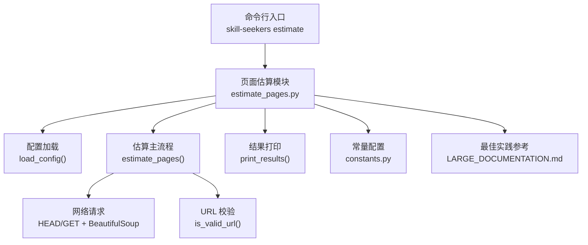
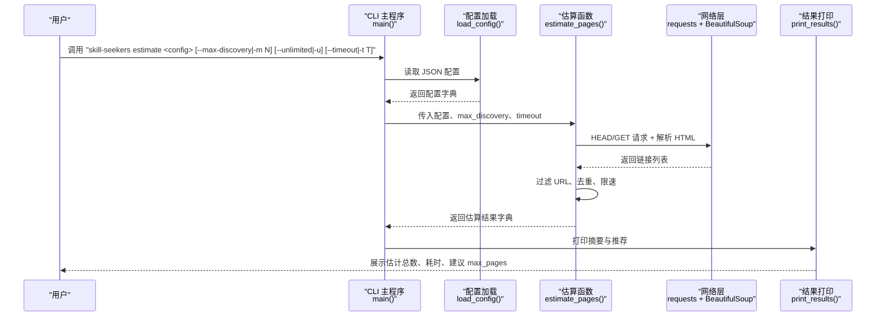
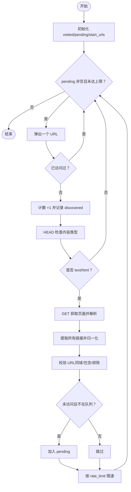
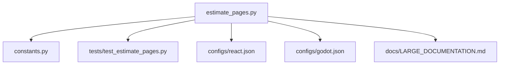

# 页面估算

<cite>
**本文引用的文件**
- [src/skill_seekers/cli/estimate_pages.py](file://src/skill_seekers/cli/estimate_pages.py)
- [src/skill_seekers/cli/constants.py](file://src/skill_seekers/cli/constants.py)
- [tests/test_estimate_pages.py](file://tests/test_estimate_pages.py)
- [configs/react.json](file://configs/react.json)
- [configs/godot.json](file://configs/godot.json)
- [docs/LARGE_DOCUMENTATION.md](file://docs/LARGE_DOCUMENTATION.md)
- [README.md](file://README.md)
</cite>

## 目录
1. [简介](#简介)
2. [项目结构](#项目结构)
3. [核心组件](#核心组件)
4. [架构概览](#架构概览)
5. [详细组件分析](#详细组件分析)
6. [依赖关系分析](#依赖关系分析)
7. [性能考量](#性能考量)
8. [故障排查指南](#故障排查指南)
9. [结论](#结论)
10. [附录](#附录)

## 简介
本章节面向需要对大型文档站点进行页面数量预估的用户，系统性说明如何使用页面估算工具 estimate_pages.py 来快速探测目标站点的链接结构与规模，并据此制定合理的技能拆分策略。该工具通过“无内容下载”的方式发现可访问页面，给出估计总数、剩余待发现页面、耗时与发现速率等指标，帮助在大规模抓取前规避超时与资源浪费风险。

## 项目结构
页面估算功能位于 CLI 子模块中，配合常量配置与测试用例共同构成完整的估算链路。典型使用路径如下：
- 命令入口：通过统一 CLI 的子命令触发页面估算
- 核心逻辑：estimate_pages.py 提供估算函数与 CLI 主程序
- 配置来源：JSON 配置文件（如 configs/react.json、configs/godot.json）
- 最佳实践：LARGE_DOCUMENTATION.md 提供拆分策略与工作流建议
- 常量参数：constants.py 定义默认最大发现数、阈值等

图表来源
- [src/skill_seekers/cli/estimate_pages.py](file://src/skill_seekers/cli/estimate_pages.py#L1-L289)
- [src/skill_seekers/cli/constants.py](file://src/skill_seekers/cli/constants.py#L1-L73)
- [docs/LARGE_DOCUMENTATION.md](file://docs/LARGE_DOCUMENTATION.md#L1-L432)

章节来源
- [src/skill_seekers/cli/estimate_pages.py](file://src/skill_seekers/cli/estimate_pages.py#L1-L289)
- [src/skill_seekers/cli/constants.py](file://src/skill_seekers/cli/constants.py#L1-L73)
- [README.md](file://README.md#L580-L720)

## 核心组件
- 估算函数 estimate_pages(config, max_discovery, timeout)
  - 输入：配置字典、最大发现数、请求超时
  - 行为：从起始 URL 开始广度优先探索，过滤非 HTML 内容，基于 include/exclude 模式与同域规则筛选链接，统计已发现与待发现页面，返回包含估计总数、耗时、发现速率等的结果字典
- URL 校验 is_valid_url(url, base_url, include_patterns, exclude_patterns)
  - 同域限制、排除模式优先、包含模式兜底
- 结果打印 print_results(results, config)
  - 输出摘要、命中上限提示、推荐 max_pages、估算全量抓取耗时
- CLI 主程序 main()
  - 解析参数（配置路径、最大发现数、是否不限制、超时），加载配置，执行估算并返回退出码
- 常量 DEFAULT_MAX_DISCOVERY、DISCOVERY_THRESHOLD
  - 默认最大发现数与警告阈值，用于 CLI 默认行为与推荐逻辑

章节来源
- [src/skill_seekers/cli/estimate_pages.py](file://src/skill_seekers/cli/estimate_pages.py#L25-L218)
- [src/skill_seekers/cli/estimate_pages.py](file://src/skill_seekers/cli/estimate_pages.py#L219-L289)
- [src/skill_seekers/cli/constants.py](file://src/skill_seekers/cli/constants.py#L35-L40)

## 架构概览
下图展示从 CLI 到估算模块、网络请求与结果输出的整体流程。

图表来源
- [src/skill_seekers/cli/estimate_pages.py](file://src/skill_seekers/cli/estimate_pages.py#L233-L289)
- [src/skill_seekers/cli/estimate_pages.py](file://src/skill_seekers/cli/estimate_pages.py#L25-L164)

## 详细组件分析

### 组件一：页面估算主流程
- 发现策略
  - 广度优先：从 start_urls 或 base_url 出发，逐页解析链接
  - 内容类型过滤：仅对 text/html 页面进行链接提取
  - URL 规则：同域限制；先排除后包含（若配置了包含模式）
- 限速与超时
  - rate_limit 控制请求间隔
  - timeout 控制单次请求超时
- 估算指标
  - 已发现 discovered、待发现 pending、估计总数 estimated_total
  - 耗时 elapsed_seconds、发现速率 discovery_rate
  - 是否命中上限 hit_limit、是否不限制 unlimited

图表来源
- [src/skill_seekers/cli/estimate_pages.py](file://src/skill_seekers/cli/estimate_pages.py#L25-L164)

章节来源
- [src/skill_seekers/cli/estimate_pages.py](file://src/skill_seekers/cli/estimate_pages.py#L25-L164)

### 组件二：URL 校验与模式匹配
- 同域要求：必须以 base_url 开头
- 排除优先：exclude_patterns 中出现即丢弃
- 包含兜底：若配置 include_patterns，则仅保留匹配项；否则默认接受

章节来源
- [src/skill_seekers/cli/estimate_pages.py](file://src/skill_seekers/cli/estimate_pages.py#L142-L163)

### 组件三：结果输出与推荐
- 输出摘要：已发现、待发现、估计总数、耗时、发现速率
- 命中上限提示：当 hit_limit 为真时提醒提高 max_discovery
- 推荐 max_pages：基于 estimated_total 加缓冲并受 DISCOVERY_THRESHOLD 限制
- 估算全量耗时：基于 rate_limit 计算分钟数

章节来源
- [src/skill_seekers/cli/estimate_pages.py](file://src/skill_seekers/cli/estimate_pages.py#L165-L218)
- [src/skill_seekers/cli/constants.py](file://src/skill_seekers/cli/constants.py#L35-L40)

### 组件四：CLI 参数与交互
- 必选参数：配置文件路径
- 可选参数：
  - --max-discovery/-m：最大发现数，默认来自常量
  - --unlimited/-u：不限制发现数（等价于 -m -1）
  - --timeout/-t：HTTP 超时秒数
- 退出码：
  - 成功：0
  - 命中上限：2（便于脚本判断）
  - 用户中断：1
  - 其他异常：1

章节来源
- [src/skill_seekers/cli/estimate_pages.py](file://src/skill_seekers/cli/estimate_pages.py#L233-L289)

### 组件五：测试与验证
- 单元测试覆盖：
  - 最小配置估算、返回结构完整性
  - max_discovery 限制生效
  - 自定义 start_urls 生效
  - CLI 帮助输出、参数缺失检测
  - 使用真实配置文件进行估算（若存在）

章节来源
- [tests/test_estimate_pages.py](file://tests/test_estimate_pages.py#L1-L161)

## 依赖关系分析
- estimate_pages.py 依赖 constants.py 中的 DEFAULT_MAX_DISCOVERY 与 DISCOVERY_THRESHOLD
- CLI 主程序依赖 argparse 与内置的 print_results/load_config/estimate_pages
- 测试模块依赖 estimate_pages 函数与 subprocess（用于 CLI 行为验证）

图表来源
- [src/skill_seekers/cli/estimate_pages.py](file://src/skill_seekers/cli/estimate_pages.py#L1-L289)
- [src/skill_seekers/cli/constants.py](file://src/skill_seekers/cli/constants.py#L1-L73)
- [tests/test_estimate_pages.py](file://tests/test_estimate_pages.py#L1-L161)
- [configs/react.json](file://configs/react.json#L1-L32)
- [configs/godot.json](file://configs/godot.json#L1-L48)
- [docs/LARGE_DOCUMENTATION.md](file://docs/LARGE_DOCUMENTATION.md#L1-L432)

章节来源
- [src/skill_seekers/cli/estimate_pages.py](file://src/skill_seekers/cli/estimate_pages.py#L1-L289)
- [src/skill_seekers/cli/constants.py](file://src/skill_seekers/cli/constants.py#L1-L73)
- [tests/test_estimate_pages.py](file://tests/test_estimate_pages.py#L1-L161)

## 性能考量
- 估算阶段不下载页面内容，仅 HEAD/GET 一次以判定内容类型，随后解析 HTML 提取链接，整体开销较低
- 通过 rate_limit 控制请求频率，避免对目标站点造成压力
- 通过 max_discovery 限制探索范围，防止无限扩展导致资源浪费
- 对非 HTML 内容直接跳过，减少无效 IO
- 建议在大规模站点上使用较小的 max_discovery 进行快速预估，再决定是否扩大范围

章节来源
- [src/skill_seekers/cli/estimate_pages.py](file://src/skill_seekers/cli/estimate_pages.py#L84-L125)
- [src/skill_seekers/cli/estimate_pages.py](file://src/skill_seekers/cli/estimate_pages.py#L117-L125)

## 故障排查指南
- 无法连接或超时
  - 提高 --timeout 参数，检查网络与代理设置
  - 适当增大 rate_limit 降低被限速或封禁的风险
- 估算结果过低或过高
  - 若命中上限（hit_limit 为真），提高 --max-discovery
  - 检查 url_patterns.include/exclude 是否过于严格或宽松
- 配置文件错误
  - 确认 JSON 格式正确，字段完整（name/base_url/rate_limit 等）
- CLI 未安装或命令不可用
  - 确保已安装包并在 PATH 中可用；或使用 Python 直接运行脚本

章节来源
- [src/skill_seekers/cli/estimate_pages.py](file://src/skill_seekers/cli/estimate_pages.py#L233-L289)
- [tests/test_estimate_pages.py](file://tests/test_estimate_pages.py#L78-L136)

## 结论
页面估算工具通过“轻量级”链接发现与统计，为大规模文档站点提供了可靠的预评估手段。它能在抓取前帮助用户：
- 合理设定 max_pages，避免超时与资源浪费
- 依据估计结果选择拆分策略（按类别或目标页数）
- 为后续并行抓取与路由设计提供数据支撑

## 附录

### 实际使用示例
- 基本估算
  - 命令：skill-seekers estimate configs/react.json
  - 说明：使用默认最大发现数进行快速估算
- 提高发现上限
  - 命令：skill-seekers estimate configs/godot.json --max-discovery 2000
  - 说明：扩大发现范围以获得更准确估计
- 不限制发现
  - 命令：skill-seekers estimate configs/vue.json --unlimited
  - 说明：发现全部可达页面（注意耗时与资源消耗）
- 设置超时
  - 命令：skill-seekers estimate configs/react.json --timeout 60
  - 说明：在网络较慢或站点响应较慢时提升超时

章节来源
- [src/skill_seekers/cli/estimate_pages.py](file://src/skill_seekers/cli/estimate_pages.py#L233-L289)
- [README.md](file://README.md#L618-L631)

### 输出结果解读
- 已发现 discovered：估算阶段实际访问的页面数
- 待发现 pending：仍在队列中等待访问的页面数
- 估计总数 estimated_total：discovered + pending
- 耗时 elapsed_seconds：估算阶段总耗时
- 发现速率 discovery_rate：平均每秒发现的页面数
- 命中上限 hit_limit：是否达到 max_discovery 上限
- 推荐 max_pages：基于估计结果加缓冲并受阈值限制
- 估算全量耗时：基于 rate_limit 的分钟数

章节来源
- [src/skill_seekers/cli/estimate_pages.py](file://src/skill_seekers/cli/estimate_pages.py#L165-L218)
- [src/skill_seekers/cli/constants.py](file://src/skill_seekers/cli/constants.py#L35-L40)

### 与最佳实践结合的拆分策略
- 依据估计结果选择策略
  - 小于 5,000 页：无需拆分，直接抓取
  - 5,000 - 10,000 页：考虑按类别拆分
  - 10,000 - 30,000 页：推荐使用路由器 + 类别拆分
  - 30,000+ 页：强烈建议路由器 + 类别拆分
- 目标页数选择
  - 小型聚焦技能（3K-5K 页）：更多技能，更聚焦
  - 中型技能（5K-8K 页）：平衡推荐
  - 大型技能（8K-10K 页）：较少技能，覆盖面更广
- 并行抓取与检查点
  - 在大规模拆分后并行抓取多个子技能
  - 使用检查点与断点续跑，保障长任务稳定性

章节来源
- [docs/LARGE_DOCUMENTATION.md](file://docs/LARGE_DOCUMENTATION.md#L19-L116)
- [docs/LARGE_DOCUMENTATION.md](file://docs/LARGE_DOCUMENTATION.md#L178-L244)
- [docs/LARGE_DOCUMENTATION.md](file://docs/LARGE_DOCUMENTATION.md#L272-L328)

### 配置文件要点（示例）
- react.json
  - base_url、start_urls、url_patterns（include/exclude）、categories、rate_limit、max_pages
- godot.json
  - base_url、start_urls、url_patterns（include/exclude）、categories、rate_limit、max_pages

章节来源
- [configs/react.json](file://configs/react.json#L1-L32)
- [configs/godot.json](file://configs/godot.json#L1-L48)