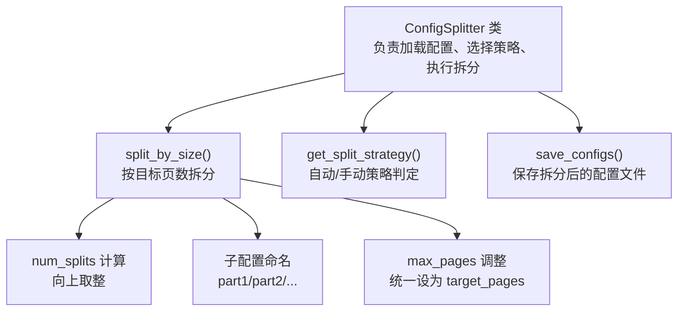
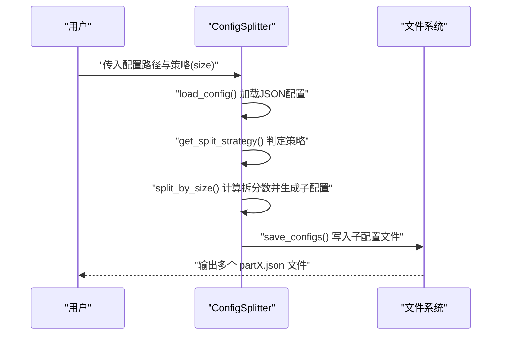
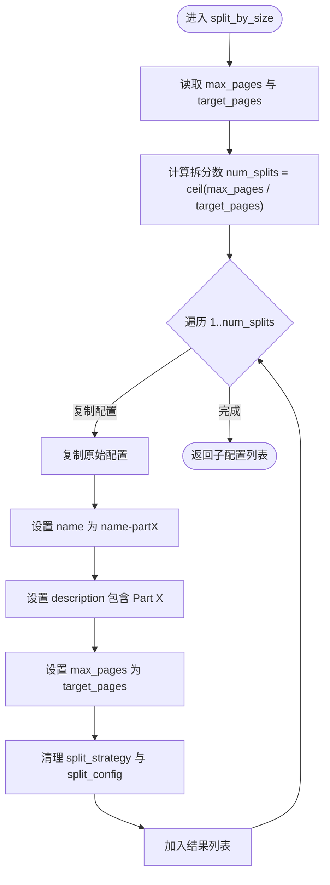
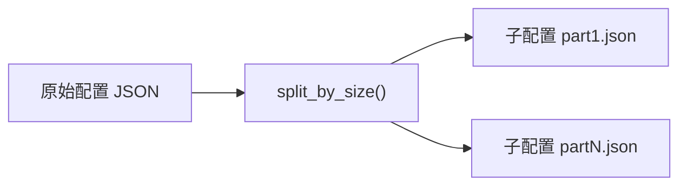

# 基于大小的拆分策略

<cite>
**本文引用的文件**
- [split_config.py](file://src/skill_seekers/cli/split_config.py)
- [LARGE_DOCUMENTATION.md](file://docs/LARGE_DOCUMENTATION.md)
</cite>

## 目录
1. [引言](#引言)
2. [项目结构](#项目结构)
3. [核心组件](#核心组件)
4. [架构总览](#架构总览)
5. [详细组件分析](#详细组件分析)
6. [依赖关系分析](#依赖关系分析)
7. [性能考量](#性能考量)
8. [故障排查指南](#故障排查指南)
9. [结论](#结论)
10. [附录](#附录)

## 引言
本文件系统性介绍“基于大小”的拆分策略，专门用于缺乏清晰类别结构的大型文档。目标是通过统一的目标页数阈值，将一个大文档配置拆分为多个子配置，每个子配置以“part1”、“part2”等顺序命名，便于并行处理与管理。本文聚焦于 split_config.py 中的 split_by_size() 方法，解释其算法逻辑、输出产物与使用建议，并结合 LARGE_DOCUMENTATION.md 的示例说明在无结构化大型文档中的应用。

## 项目结构
围绕“基于大小”的拆分策略，涉及以下关键文件：
- CLI 拆分器：src/skill_seekers/cli/split_config.py
- 使用指南与示例：docs/LARGE_DOCUMENTATION.md

下图给出与本策略相关的代码结构概览（仅映射实际存在的类与方法）：

图表来源
- [split_config.py](file://src/skill_seekers/cli/split_config.py#L16-L220)

章节来源
- [split_config.py](file://src/skill_seekers/cli/split_config.py#L16-L220)

## 核心组件
- ConfigSplitter：封装配置加载、策略选择、拆分执行与保存。
- split_by_size()：核心算法，依据 max_pages 与 target_pages 计算拆分数，生成顺序命名的子配置，并将每个子配置的 max_pages 设为目标值。
- get_split_strategy()：在 auto 策略下，根据 max_pages 与是否存在 categories 决定是否采用 size 拆分。
- save_configs()：将拆分后的配置写入同目录或指定目录，文件名形如 name-partX.json。

章节来源
- [split_config.py](file://src/skill_seekers/cli/split_config.py#L16-L220)

## 架构总览
下图展示“基于大小”的拆分流程，从输入配置到输出多个子配置文件的整体视图：

图表来源
- [split_config.py](file://src/skill_seekers/cli/split_config.py#L16-L220)

## 详细组件分析

### split_by_size() 算法详解
- 输入参数
  - 配置字典中的 max_pages：文档预估页数
  - target_pages：目标页数阈值，默认 5000
- 计算拆分数
  - 使用向上取整公式：num_splits = ceil(max_pages / target_pages)
  - 当 max_pages 无法被 target_pages 整除时，确保覆盖全部内容
- 子配置生成
  - 复制原始配置，逐个子配置命名为 “name-part1”、“name-part2”，依此类推
  - 将每个子配置的 max_pages 设置为 target_pages
  - 清理子配置中的 split_strategy 与 split_config 字段，避免递归拆分
- 输出
  - 返回包含若干子配置的列表；若 dry-run，则不落盘，仅打印将要创建的文件清单

图表来源
- [split_config.py](file://src/skill_seekers/cli/split_config.py#L124-L147)

章节来源
- [split_config.py](file://src/skill_seekers/cli/split_config.py#L124-L147)

### 自动策略与 size 拆分触发条件
在 auto 策略下，get_split_strategy() 会综合 max_pages 与是否存在 categories 来决定是否采用 size 拆分：
- 若 max_pages < 5000：不拆分（none）
- 若 5000 ≤ max_pages < 10000 且存在 categories：推荐按类别拆分（category）
- 若存在 categories 且类别数量 ≥ 3：推荐路由器 + 分类（router）
- 其他情况：采用 size 拆分（适合无明确分类的大文档）

章节来源
- [split_config.py](file://src/skill_seekers/cli/split_config.py#L39-L64)

### 与文档指南的对应关系
- LARGE_DOCUMENTATION.md 明确了“Size-Based Split”的适用场景：适用于没有清晰类别的文档，优点是简单、可预测；缺点是可能把相关主题拆散到不同文件中。
- 文档还提供了示例命令：以 --strategy size 与 --target-pages 5000 进行拆分，生成如 bigdocs-part1.json、bigdocs-part2.json 等文件。

章节来源
- [LARGE_DOCUMENTATION.md](file://docs/LARGE_DOCUMENTATION.md#L100-L118)

### 使用建议与最佳实践（关于 --target-pages）
- 合理范围
  - 小型专注技能：3000-5000 页
  - 平衡型技能：5000-8000 页
  - 较大技能：8000-10000 页
- 选择原则
  - 目标页数越小，技能越聚焦，但数量越多，管理成本越高
  - 目标页数越大，技能越宽泛，数量越少，但更易接近上下文窗口限制
- 实践建议
  - 先用较小目标页数进行小规模测试，确认抓取质量后再扩大
  - 对无明确分类的大文档优先考虑 size 拆分，再配合并行抓取提升效率

章节来源
- [LARGE_DOCUMENTATION.md](file://docs/LARGE_DOCUMENTATION.md#L272-L286)

## 依赖关系分析
- split_by_size() 依赖于：
  - 配置字典中的 max_pages 字段（来自 load_config() 读取）
  - target_pages 参数（CLI 默认 5000）
  - 无外部库依赖，纯 Python 实现
- 输出产物：
  - 多个 JSON 子配置文件，文件名以 “name-partX.json” 命名
  - 保存位置默认与原配置相同目录，可通过 --output-dir 指定

图表来源
- [split_config.py](file://src/skill_seekers/cli/split_config.py#L124-L147)
- [split_config.py](file://src/skill_seekers/cli/split_config.py#L201-L221)

章节来源
- [split_config.py](file://src/skill_seekers/cli/split_config.py#L124-L147)
- [split_config.py](file://src/skill_seekers/cli/split_config.py#L201-L221)

## 性能考量
- 时间复杂度
  - 单次拆分的时间复杂度为 O(N)，其中 N 为拆分数（由 ceil(max_pages/target_pages) 决定）
  - 空间复杂度为 O(N)，用于存储生成的子配置对象
- 并行抓取
  - 通过拆分后生成的多个子配置，可并行抓取，显著缩短总耗时
- 上下文窗口与稳定性
  - 合理的目标页数有助于避免单次抓取过大导致的上下文溢出或稳定性问题
  - 若文档内容高度相关，建议适当增大目标页数，减少跨文件的主题割裂

## 故障排查指南
- 常见问题
  - 配置文件不存在或 JSON 不合法：load_config() 会在错误时直接退出
  - 未设置 max_pages：算法使用默认 500，可能导致拆分数异常
  - 目标页数过小导致子配置过多：可调大 --target-pages 或合并部分子配置
- 排查步骤
  - 先运行 dry-run 查看将要生成的文件清单
  - 使用较小目标页数进行小规模测试，确认抓取质量与路由效果
  - 如出现“拆分过多”的问题，提高 --target-pages 或在配置中调整 split_config

章节来源
- [split_config.py](file://src/skill_seekers/cli/split_config.py#L24-L37)
- [split_config.py](file://src/skill_seekers/cli/split_config.py#L224-L321)

## 结论
基于大小的拆分策略以“目标页数”为核心参数，通过简单的向上取整计算实现稳定、可预测的拆分。它特别适合缺乏清晰类别结构的大型文档，能够快速生成顺序命名的子配置，便于并行抓取与打包。其主要优势是实现简单、结果可预期；主要缺点是可能将相关主题分散到不同文件中。结合 LARGE_DOCUMENTATION.md 的示例与最佳实践，建议在 3000-8000 页范围内选择合适的 --target-pages，并配合并行抓取与必要的测试，获得高质量的多技能体系。

## 附录
- 示例命令参考（来自文档）
  - 使用 size 策略与 5000 目标页数进行拆分
  - 生成如 bigdocs-part1.json、bigdocs-part2.json 等文件
- CLI 参数要点
  - --strategy size：强制使用基于大小的拆分
  - --target-pages：设置每份子配置的目标页数（默认 5000）
  - --dry-run：预览拆分结果而不保存文件
  - --output-dir：指定输出目录

章节来源
- [LARGE_DOCUMENTATION.md](file://docs/LARGE_DOCUMENTATION.md#L100-L118)
- [split_config.py](file://src/skill_seekers/cli/split_config.py#L224-L321)