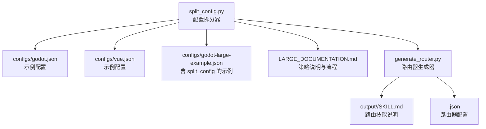
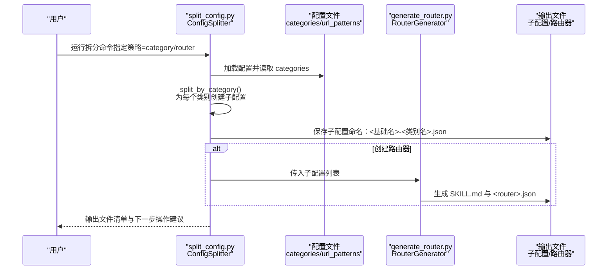
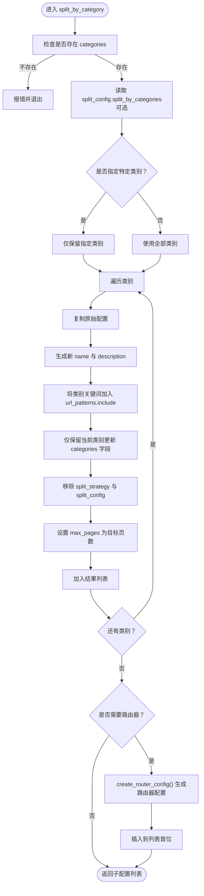
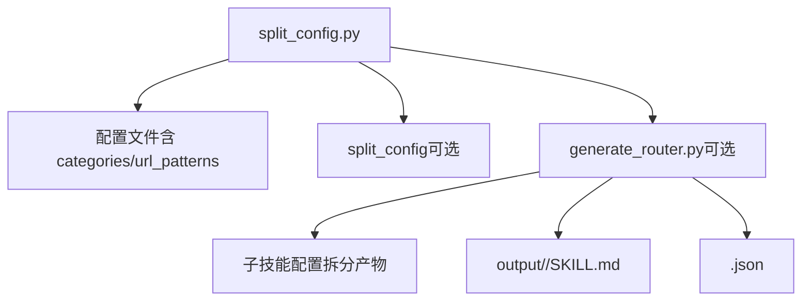

# 按类别拆分策略

<cite>
**本文引用的文件**
- [split_config.py](file://src/skill_seekers/cli/split_config.py)
- [LARGE_DOCUMENTATION.md](file://docs/LARGE_DOCUMENTATION.md)
- [generate_router.py](file://src/skill_seekers/cli/generate_router.py)
- [godot.json](file://configs/godot.json)
- [vue.json](file://configs/vue.json)
- [godot-large-example.json](file://configs/godot-large-example.json)
- [react.json](file://configs/react.json)
- [fastapi.json](file://configs/fastapi.json)
- [vue-internal.json](file://configs/example-team/vue-internal.json)
</cite>

## 目录
1. [引言](#引言)
2. [项目结构](#项目结构)
3. [核心组件](#核心组件)
4. [架构总览](#架构总览)
5. [详细组件分析](#详细组件分析)
6. [依赖关系分析](#依赖关系分析)
7. [性能考量](#性能考量)
8. [故障排查指南](#故障排查指南)
9. [结论](#结论)
10. [附录](#附录)

## 引言
本文件深入解析“按类别拆分策略”的实现机制，聚焦于 split_config.py 中的 split_by_category() 方法。该策略适用于 5000–15000 页且具备明确主题划分的大型文档，通过读取配置文件中的 categories 字段，为每个类别生成独立的子配置文件，并利用 URL 模式中的 include 关键字限定抓取范围。同时解释 split_config 字段中 split_by_categories 的过滤能力、新配置文件的命名规则（如 godot-2d.json）与描述生成方式，并结合 LARGE_DOCUMENTATION.md 的示例展示该策略在 Vue.js 文档中的应用，最后对比其与“路由器模式”的差异，强调其适合用户已知查询目标类别的场景。

## 项目结构
围绕“按类别拆分策略”，涉及以下关键文件：
- 配置拆分器：src/skill_seekers/cli/split_config.py
- 路由器生成器：src/skill_seekers/cli/generate_router.py
- 大型文档处理指南：docs/LARGE_DOCUMENTATION.md
- 示例配置：configs/godot.json、configs/vue.json、configs/godot-large-example.json、configs/react.json、configs/fastapi.json、configs/example-team/vue-internal.json

图表来源
- [split_config.py](file://src/skill_seekers/cli/split_config.py#L1-L321)
- [LARGE_DOCUMENTATION.md](file://docs/LARGE_DOCUMENTATION.md#L1-L432)
- [generate_router.py](file://src/skill_seekers/cli/generate_router.py#L1-L275)
- [godot.json](file://configs/godot.json#L1-L48)
- [vue.json](file://configs/vue.json#L1-L32)
- [godot-large-example.json](file://configs/godot-large-example.json#L1-L64)

章节来源
- [split_config.py](file://src/skill_seekers/cli/split_config.py#L1-L321)
- [LARGE_DOCUMENTATION.md](file://docs/LARGE_DOCUMENTATION.md#L1-L432)

## 核心组件
- 配置拆分器 ConfigSplitter：负责加载配置、自动选择拆分策略、执行按类别拆分、生成路由器配置以及保存结果。
- 路由器生成器 RouterGenerator：用于从多个子技能配置生成一个路由器技能，包含 SKILL.md 和路由器配置文件。
- 示例配置：包含 categories 字段与 url_patterns 的配置样例，用于演示 split_by_category() 的行为。

章节来源
- [split_config.py](file://src/skill_seekers/cli/split_config.py#L17-L222)
- [generate_router.py](file://src/skill_seekers/cli/generate_router.py#L16-L171)
- [godot.json](file://configs/godot.json#L1-L48)
- [vue.json](file://configs/vue.json#L1-L32)
- [godot-large-example.json](file://configs/godot-large-example.json#L1-L64)

## 架构总览
下图展示了“按类别拆分策略”的整体工作流：输入一个包含 categories 的配置文件，拆分器读取 categories 并为每个类别生成独立配置；可选地生成一个路由器配置，将这些子技能组织为统一入口。

图表来源
- [split_config.py](file://src/skill_seekers/cli/split_config.py#L66-L123)
- [split_config.py](file://src/skill_seekers/cli/split_config.py#L150-L171)
- [generate_router.py](file://src/skill_seekers/cli/generate_router.py#L16-L171)

## 详细组件分析

### split_by_category() 方法工作机制
- 输入与准备
  - 从配置中读取 categories 字段，作为拆分依据。
  - 若 split_config 中存在 split_by_categories，则仅对其中列出的类别进行拆分，实现过滤功能。
- 子配置生成
  - 对每个类别复制原始配置，设置新的 name 与 description。
  - 新的 name 规则为“<基础名>-<类别名>”，例如 godot-2d.json。
  - 新的 description 由“<基础名首字母大写> - <类别名标题化>. 原描述”组成。
- URL 模式限定
  - 将类别关键词加入 url_patterns.include，以限定抓取范围。
  - 若关键词以“/”开头，视为路径前缀，直接加入 include 列表。
- 结构清理与估算
  - 移除子配置中的 split_strategy 与 split_config，避免递归拆分。
  - 将 max_pages 设为目标页数（target_pages），便于后续估算与打包。
- 可选路由器
  - 当策略为 router 或显式要求时，调用 create_router_config() 生成路由器配置，并插入到返回列表首位。

图表来源
- [split_config.py](file://src/skill_seekers/cli/split_config.py#L66-L123)
- [split_config.py](file://src/skill_seekers/cli/split_config.py#L150-L171)

章节来源
- [split_config.py](file://src/skill_seekers/cli/split_config.py#L66-L123)
- [split_config.py](file://src/skill_seekers/cli/split_config.py#L150-L171)

### split_config 字段中的 split_by_categories 过滤功能
- 作用：在 split_by_category() 执行前，对 categories 字典进行过滤，仅处理 split_by_categories 中列出的类别键。
- 使用场景：当大型文档的 categories 过多或部分类别不希望参与拆分时，可通过该字段精确控制拆分范围。
- 与策略选择的关系：即使配置中定义了 split_strategy 为 router，split_by_categories 仍会优先生效，确保只生成选定类别的子配置。

章节来源
- [split_config.py](file://src/skill_seekers/cli/split_config.py#L72-L78)
- [godot-large-example.json](file://configs/godot-large-example.json#L49-L56)

### 新配置文件的命名规则与描述生成
- 命名规则：基础名 + “-” + 类别名。例如 godot-2d.json、godot-scripting.json。
- 描述生成：在原描述前加上“<基础名首字母大写> - <类别名标题化>. ”，使每个子技能的描述更聚焦。
- 举例：
  - godot.json 中 categories 包含 "2d"、"3d" 等类别，拆分后生成 godot-2d.json、godot-3d.json 等。
  - vue.json 中 categories 包含 "getting_started"、"components" 等，拆分后生成 vue-getting_started.json、vue-components.json 等。

章节来源
- [split_config.py](file://src/skill_seekers/cli/split_config.py#L83-L86)
- [godot.json](file://configs/godot.json#L32-L44)
- [vue.json](file://configs/vue.json#L22-L29)

### URL 模式与关键字的抓取范围限定
- include 关键字：将类别关键词加入 url_patterns.include，从而限制抓取范围，提高抓取效率与准确性。
- 路径前缀匹配：以“/”开头的关键词被视为路径前缀，直接加入 include，有助于精准限定页面范围。
- 示例：
  - godot.json 中 categories 的 "2d"、"3d" 等包含路径前缀 "/2d/"、"/3d/"，拆分后会加入 include，仅抓取对应路径下的页面。
  - vue.json 中 categories 的 "guide"、"api" 等关键词，拆分后也会被加入 include，限定抓取范围。

章节来源
- [split_config.py](file://src/skill_seekers/cli/split_config.py#L90-L98)
- [godot.json](file://configs/godot.json#L32-L44)
- [vue.json](file://configs/vue.json#L18-L21)

### 与路由器模式的对比（router + categories）
- 路由器模式：在按类别拆分的基础上，额外生成一个路由器配置，包含 _router 标记、_sub_skills 与 _routing_keywords，用于智能路由到合适的子技能。
- 适用场景差异：
  - 按类别拆分（category）：适合用户明确知道查询目标类别的场景，直接使用对应的子技能即可获得精准答案。
  - 路由器模式（router）：适合用户不确定具体类别或希望自然问答的场景，路由器根据关键词自动激活最相关的子技能。
- 在 LARGE_DOCUMENTATION.md 中的示例：
  - Vue.js 文档（约 15000 页）：采用“按类别拆分（category）”策略，生成多个聚焦子技能（components、reactivity、routing 等），无需额外路由器。
  - Godot 文档（约 40000 页）：采用“路由器 + 分类（router + categories）”策略，先拆分为多个子技能，再生成路由器，提升用户体验。

章节来源
- [LARGE_DOCUMENTATION.md](file://docs/LARGE_DOCUMENTATION.md#L247-L269)
- [LARGE_DOCUMENTATION.md](file://docs/LARGE_DOCUMENTATION.md#L180-L245)
- [split_config.py](file://src/skill_seekers/cli/split_config.py#L172-L192)
- [generate_router.py](file://src/skill_seekers/cli/generate_router.py#L153-L171)

### 实际应用示例：Vue.js 文档
- 配置要点：
  - vue.json 定义了 categories，包含 "getting_started"、"components"、"reactivity"、"composition_api"、"api" 等。
  - url_patterns.include 包含 "/guide/"、"/api/"、"/examples/" 等，限定抓取范围。
- 拆分流程：
  - 使用 split_config.py --strategy category 对 vue.json 进行拆分，生成多个子配置（如 vue-getting_started.json、vue-components.json 等）。
  - 每个子配置仅保留对应类别的关键词，加入 url_patterns.include，确保抓取范围聚焦。
- 与路由器模式的差异：
  - Vue.js 场景下，由于用户通常能明确目标类别（如“组件”、“响应式”等），直接使用子技能即可获得精准答案，无需路由器。
  - 若用户希望自然问答体验，也可选择 router 策略，但本示例强调 category 策略更适合明确目标类别的场景。

章节来源
- [vue.json](file://configs/vue.json#L1-L32)
- [LARGE_DOCUMENTATION.md](file://docs/LARGE_DOCUMENTATION.md#L247-L269)

### 与其他配置的对比参考
- godot.json：包含丰富的 categories（如 2d、3d、physics、shaders 等），适合按类别拆分；其 split_strategy 与 split_config 在 godot-large-example.json 中得到完整示范。
- react.json、fastapi.json：均包含 categories 字段，可作为按类别拆分的参考配置。
- vue-internal.json：团队内部配置示例，展示 categories 的组织方式与 url_patterns.include 的使用。

章节来源
- [godot.json](file://configs/godot.json#L1-L48)
- [godot-large-example.json](file://configs/godot-large-example.json#L1-L64)
- [react.json](file://configs/react.json#L1-L32)
- [fastapi.json](file://configs/fastapi.json#L1-L34)
- [vue-internal.json](file://configs/example-team/vue-internal.json#L1-L37)

## 依赖关系分析
- split_config.py 依赖：
  - 配置文件（包含 categories 与 url_patterns）。
  - 可选的 split_config 字段（split_by_categories、create_router 等）。
  - 可选的 generate_router.py（当策略为 router 或显式要求时）。
- generate_router.py 依赖：
  - 多个子技能配置文件（拆分后生成的若干子配置）。
  - 提取每个子配置的 categories 与名称，构建路由关键词映射。

图表来源
- [split_config.py](file://src/skill_seekers/cli/split_config.py#L66-L123)
- [split_config.py](file://src/skill_seekers/cli/split_config.py#L150-L171)
- [generate_router.py](file://src/skill_seekers/cli/generate_router.py#L16-L171)

章节来源
- [split_config.py](file://src/skill_seekers/cli/split_config.py#L66-L123)
- [generate_router.py](file://src/skill_seekers/cli/generate_router.py#L16-L171)

## 性能考量
- 抓取范围收敛：通过将类别关键词加入 url_patterns.include，显著减少无关页面抓取，提升抓取效率与准确性。
- 并行抓取：拆分为多个子技能后，可并行抓取各子技能，缩短整体耗时。
- 页面规模控制：通过 target_pages 控制每个子技能的目标页数，平衡聚焦度与管理复杂度。
- 路由器开销：路由器模式会增加一个额外的“概览”技能，但能提供更好的用户体验；对于明确目标类别的场景，category 策略更轻量。

[本节为通用性能讨论，不直接分析具体文件]

## 故障排查指南
- 无 categories 配置
  - 现象：split_by_category() 报错并退出。
  - 处理：在配置中添加 categories 字段，并确保包含至少一个类别。
- split_by_categories 指定的类别不存在
  - 现象：最终仅生成指定类别对应的子配置。
  - 处理：确认类别键名与配置中的 categories 键一致。
- URL 模式未生效
  - 现象：抓取范围过大或包含无关页面。
  - 处理：检查 url_patterns.include 是否包含类别关键词；若为路径前缀，请确保以“/”开头。
- 路由器未正确路由
  - 现象：路由器无法激活正确的子技能。
  - 处理：检查 _routing_keywords 与子技能名称；必要时手动调整关键词或名称。

章节来源
- [split_config.py](file://src/skill_seekers/cli/split_config.py#L66-L123)
- [generate_router.py](file://src/skill_seekers/cli/generate_router.py#L47-L67)

## 结论
按类别拆分策略通过读取配置中的 categories 字段，为每个类别生成独立的子配置文件，并利用 URL 模式中的 include 关键字限定抓取范围，从而实现高效、聚焦的文档抓取。split_by_categories 提供了精细的过滤能力，支持仅拆分选定类别。新配置文件采用“基础名-类别名”的命名规则，并生成更聚焦的描述。结合 LARGE_DOCUMENTATION.md 的示例可知，该策略特别适合用户已知查询目标类别的场景；而路由器模式则更适合自然问答与广泛覆盖的场景。对于 5000–15000 页且主题清晰的文档，按类别拆分是兼顾效率与聚焦度的优选方案。

[本节为总结性内容，不直接分析具体文件]

## 附录
- 命名与描述生成规则
  - 新配置文件名：基础名 + “-” + 类别名（如 godot-2d.json、vue-getting_started.json）。
  - 新配置描述：在原描述前加上“<基础名首字母大写> - <类别名标题化>. ”。
- URL 模式限定
  - 将类别关键词加入 url_patterns.include；路径前缀以“/”开头，直接加入 include。
- 策略选择参考
  - 小文档（<5000 页）：无需拆分。
  - 中等文档（5000–10000 页）：考虑按类别拆分。
  - 大文档（10000+ 页）：推荐路由器 + 分类策略。
  - 明确目标类别：优先按类别拆分（category）。
  - 自然问答需求：优先路由器 + 分类（router）。

章节来源
- [split_config.py](file://src/skill_seekers/cli/split_config.py#L83-L86)
- [split_config.py](file://src/skill_seekers/cli/split_config.py#L90-L98)
- [LARGE_DOCUMENTATION.md](file://docs/LARGE_DOCUMENTATION.md#L19-L43)
- [LARGE_DOCUMENTATION.md](file://docs/LARGE_DOCUMENTATION.md#L46-L116)