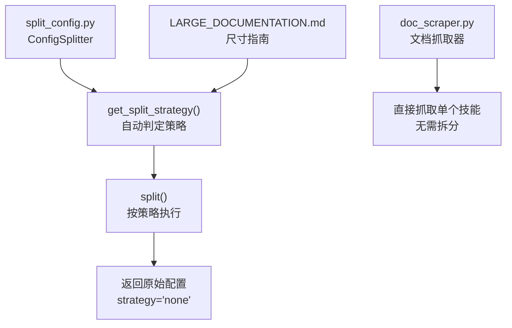
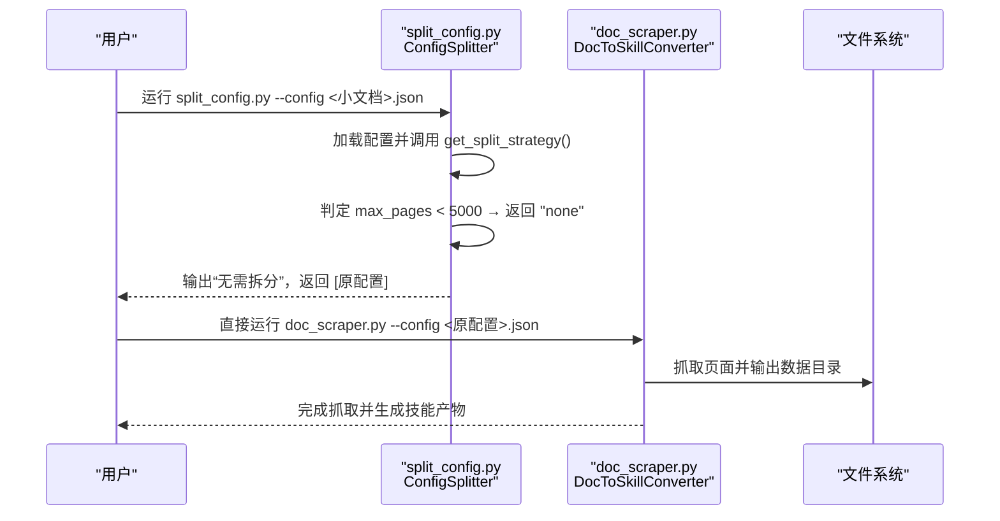
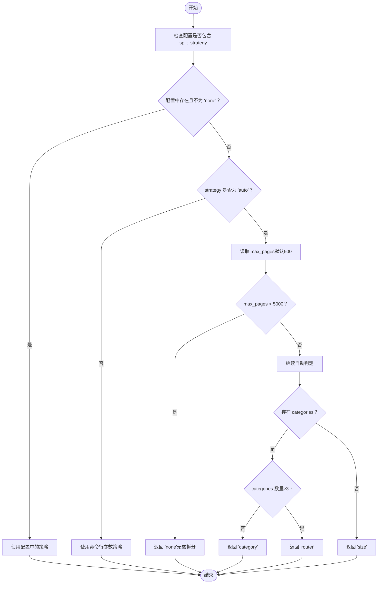
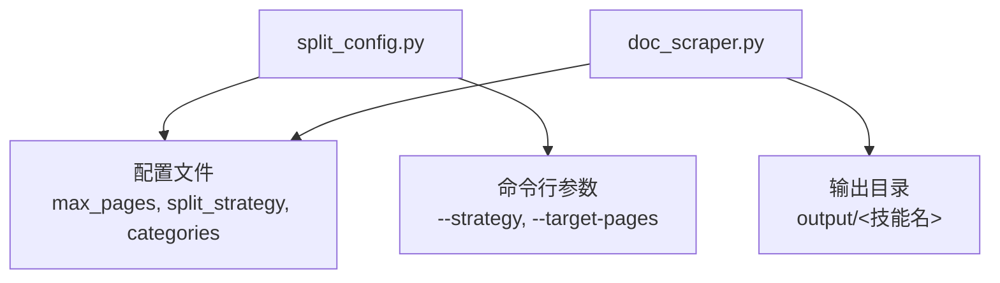

# 无拆分策略

<cite>
**本文引用的文件列表**
- [split_config.py](file://src/skill_seekers/cli/split_config.py)
- [doc_scraper.py](file://src/skill_seekers/cli/doc_scraper.py)
- [LARGE_DOCUMENTATION.md](file://docs/LARGE_DOCUMENTATION.md)
- [react.json](file://configs/react.json)
- [fastapi.json](file://configs/fastapi.json)
- [react-custom.json](file://configs/example-team/react-custom.json)
</cite>

## 目录
1. [简介](#简介)
2. [项目结构](#项目结构)
3. [核心组件](#核心组件)
4. [架构总览](#架构总览)
5. [详细组件分析](#详细组件分析)
6. [依赖关系分析](#依赖关系分析)
7. [性能考量](#性能考量)
8. [故障排查指南](#故障排查指南)
9. [结论](#结论)
10. [附录](#附录)

## 简介
本节聚焦“无拆分策略”（strategy=none），即当文档规模小于5000页时，ConfigSplitter自动选择不进行任何拆分，直接返回原始配置。该策略适用于小型文档，具有“简单易用”的优势；但不适合大型文档，因为可能超出上下文窗口限制、影响检索效率与响应速度。本文将结合 split_config.py 中的 get_split_strategy() 与 split() 方法，系统阐述其判定流程，并给出命令行使用示例与局限性说明，同时引用 LARGE_DOCUMENTATION.md 的尺寸指南作为决策依据。

## 项目结构
围绕无拆分策略的相关文件与职责如下：
- split_config.py：实现 ConfigSplitter 类，负责根据配置与自动检测结果选择拆分策略，其中当 max_pages < 5000 时返回 "none" 并直接返回原配置。
- doc_scraper.py：文档抓取主程序，支持同步/异步模式、llms.txt 优先策略、断点续爬等能力，适合直接对小型文档执行单技能抓取。
- LARGE_DOCUMENTATION.md：提供“文档规模与推荐策略”的尺寸指南，明确“<5000页”应采用“一个技能（无需拆分）”。

图表来源
- [split_config.py](file://src/skill_seekers/cli/split_config.py#L39-L65)
- [split_config.py](file://src/skill_seekers/cli/split_config.py#L172-L200)
- [doc_scraper.py](file://src/skill_seekers/cli/doc_scraper.py#L561-L721)
- [LARGE_DOCUMENTATION.md](file://docs/LARGE_DOCUMENTATION.md#L23-L29)

章节来源
- [split_config.py](file://src/skill_seekers/cli/split_config.py#L39-L65)
- [doc_scraper.py](file://src/skill_seekers/cli/doc_scraper.py#L561-L721)
- [LARGE_DOCUMENTATION.md](file://docs/LARGE_DOCUMENTATION.md#L23-L29)

## 核心组件
- ConfigSplitter：负责加载配置、确定拆分策略、执行拆分并保存子配置。
- get_split_strategy()：优先读取配置中的 split_strategy；若未显式指定且 strategy=auto，则基于 max_pages 自动选择策略；当 max_pages < 5000 时返回 "none"。
- split()：根据策略执行拆分逻辑；当 strategy="none" 时直接返回 [self.config]，不生成任何子配置。
- doc_scraper：用于直接抓取单个技能配置，适合小型文档一次性完成。

章节来源
- [split_config.py](file://src/skill_seekers/cli/split_config.py#L39-L65)
- [split_config.py](file://src/skill_seekers/cli/split_config.py#L172-L200)
- [doc_scraper.py](file://src/skill_seekers/cli/doc_scraper.py#L561-L721)

## 架构总览
下图展示从配置到抓取的整体流程，重点标注无拆分策略的路径。

图表来源
- [split_config.py](file://src/skill_seekers/cli/split_config.py#L39-L65)
- [split_config.py](file://src/skill_seekers/cli/split_config.py#L172-L200)
- [doc_scraper.py](file://src/skill_seekers/cli/doc_scraper.py#L561-L721)

## 详细组件分析

### 无拆分策略判定流程
- 配置优先：若配置中包含 split_strategy 且不等于 "none"，则使用该策略。
- 自动检测：若 strategy=auto 或未在配置中指定，则读取 max_pages：
  - 若 max_pages < 5000：返回 "none"（无需拆分）
  - 否则根据是否存在 categories 与数量选择 "category"、"router" 或 "size"
- 执行拆分：当 strategy="none" 时，split() 直接返回 [self.config]，不创建任何子配置。

图表来源
- [split_config.py](file://src/skill_seekers/cli/split_config.py#L39-L65)

章节来源
- [split_config.py](file://src/skill_seekers/cli/split_config.py#L39-L65)
- [split_config.py](file://src/skill_seekers/cli/split_config.py#L172-L200)

### 无拆分策略下的拆分执行
- 当策略为 "none" 时，split() 直接返回 [self.config]，表示不生成任何子配置。
- 该行为确保小型文档保持“单技能”形态，便于直接抓取与后续打包上传。

章节来源
- [split_config.py](file://src/skill_seekers/cli/split_config.py#L172-L200)

### 命令行使用示例
- 直接抓取小型文档（无需拆分）：
  - 使用 doc_scraper.py 对小型文档配置进行抓取，例如：
    - python3 cli/doc_scraper.py --config configs/react.json
    - python3 cli/doc_scraper.py --config configs/fastapi.json
    - python3 cli/doc_scraper.py --config configs/example-team/react-custom.json
- 上述配置均包含较小的 max_pages（如 200~300），符合“无需拆分”的条件。

章节来源
- [doc_scraper.py](file://src/skill_seekers/cli/doc_scraper.py#L561-L721)
- [react.json](file://configs/react.json#L1-L32)
- [fastapi.json](file://configs/fastapi.json#L1-L34)
- [react-custom.json](file://configs/example-team/react-custom.json#L1-L36)

### 尺寸指南与决策依据
- 文档规模与推荐策略（摘自 LARGE_DOCUMENTATION.md）：
  - <5000页：建议“一个技能”，无需拆分
  - 5000-10000页：考虑拆分，推荐“按类别拆分”
  - 10000-30000页：推荐“路由器+分类”
  - 30000+页：强烈推荐“路由器+分类”

章节来源
- [LARGE_DOCUMENTATION.md](file://docs/LARGE_DOCUMENTATION.md#L23-L29)

## 依赖关系分析
- split_config.py 依赖：
  - 配置文件（含 max_pages、split_strategy、categories 等字段）
  - 命令行参数（strategy、target-pages 等）
- doc_scraper.py 依赖：
  - 配置文件（base_url、selectors、url_patterns、max_pages 等）
  - 抓取逻辑（同步/异步、llms.txt 优先、断点续爬）

图表来源
- [split_config.py](file://src/skill_seekers/cli/split_config.py#L20-L26)
- [split_config.py](file://src/skill_seekers/cli/split_config.py#L224-L321)
- [doc_scraper.py](file://src/skill_seekers/cli/doc_scraper.py#L561-L721)

章节来源
- [split_config.py](file://src/skill_seekers/cli/split_config.py#L20-L26)
- [split_config.py](file://src/skill_seekers/cli/split_config.py#L224-L321)
- [doc_scraper.py](file://src/skill_seekers/cli/doc_scraper.py#L561-L721)

## 性能考量
- 无拆分策略的优势：
  - 简单易用：无需拆分、无需生成子配置、无需额外路由管理
  - 单技能抓取：减少并发与管理复杂度，适合小型文档快速落地
- 局限性：
  - 不适合大型文档：可能超过上下文窗口限制，影响检索质量与响应速度
  - 维护成本：单技能体量过大时，更新与调试成本上升
- 参考尺寸指南：当 max_pages < 5000 时，无需拆分；当 5000 ≤ max_pages < 10000 时可考虑按类别拆分；更大体量建议使用路由器+分类策略。

章节来源
- [LARGE_DOCUMENTATION.md](file://docs/LARGE_DOCUMENTATION.md#L23-L29)
- [LARGE_DOCUMENTATION.md](file://docs/LARGE_DOCUMENTATION.md#L48-L58)

## 故障排查指南
- 配置文件格式错误：
  - 现象：split_config.py 在加载配置时抛出 JSON 解析异常
  - 处理：修正 JSON 语法或检查文件路径
- 缺少 categories 字段：
  - 现象：当策略为 "category" 或 "router" 时提示未定义 categories
  - 处理：为配置添加 categories 字段或切换到 "none" 或 "size"
- max_pages 设置不当：
  - 现象：自动判定不符合预期
  - 处理：在配置中显式设置 split_strategy 或调整 max_pages

章节来源
- [split_config.py](file://src/skill_seekers/cli/split_config.py#L27-L39)
- [split_config.py](file://src/skill_seekers/cli/split_config.py#L66-L75)
- [split_config.py](file://src/skill_seekers/cli/split_config.py#L172-L200)

## 结论
无拆分策略适用于文档规模小于5000页的小型文档。ConfigSplitter 在自动检测阶段会基于 max_pages 与配置信息返回 "none"，split() 直接返回原始配置，避免不必要的拆分与管理开销。对于小型文档，直接使用 doc_scraper.py 抓取单技能即可高效完成任务；当文档规模扩大时，应参考 LARGE_DOCUMENTATION.md 的尺寸指南，选择更合适的拆分策略以提升检索质量与用户体验。

## 附录
- 常用命令示例（小型文档）：
  - python3 cli/doc_scraper.py --config configs/react.json
  - python3 cli/doc_scraper.py --config configs/fastapi.json
  - python3 cli/doc_scraper.py --config configs/example-team/react-custom.json
- 尺寸指南摘要：
  - <5000页：一个技能（无需拆分）
  - 5000-10000页：考虑按类别拆分
  - 10000-30000页：推荐路由器+分类
  - 30000+页：强烈推荐路由器+分类

章节来源
- [doc_scraper.py](file://src/skill_seekers/cli/doc_scraper.py#L561-L721)
- [LARGE_DOCUMENTATION.md](file://docs/LARGE_DOCUMENTATION.md#L23-L29)
- [react.json](file://configs/react.json#L1-L32)
- [fastapi.json](file://configs/fastapi.json#L1-L34)
- [react-custom.json](file://configs/example-team/react-custom.json#L1-L36)