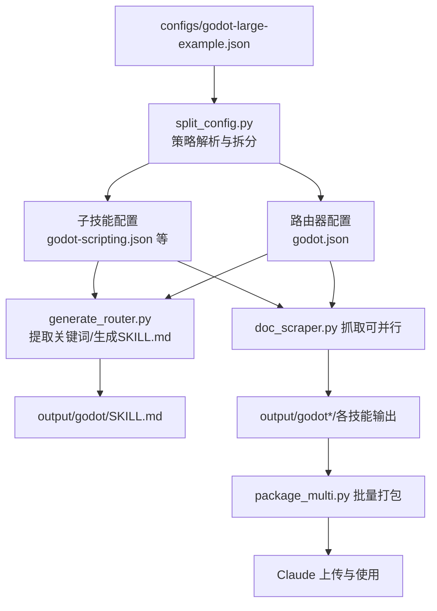
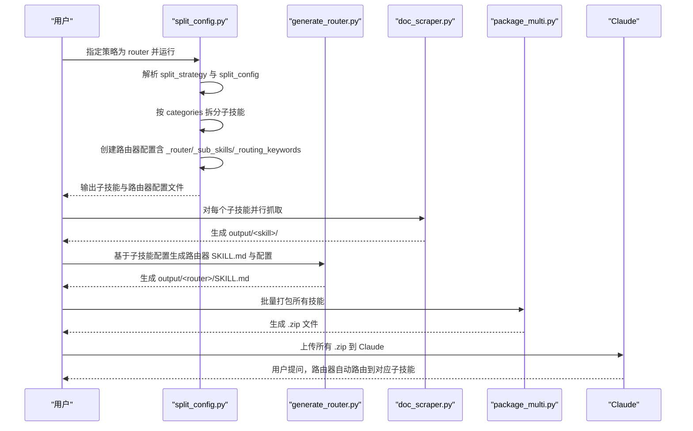
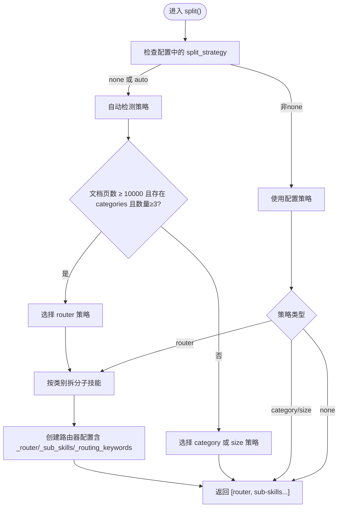
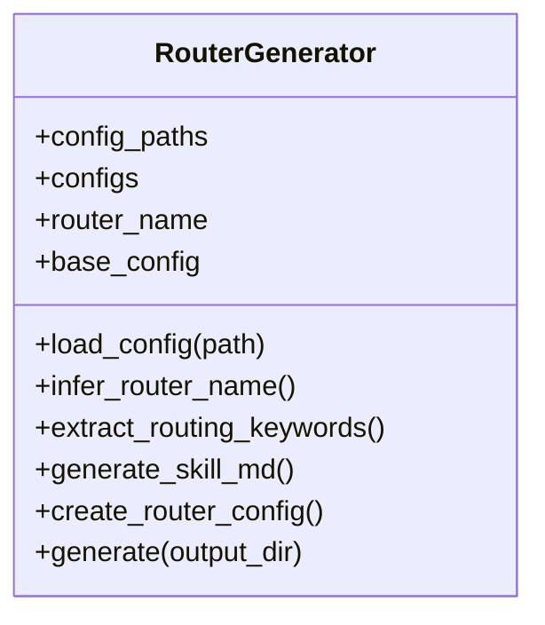
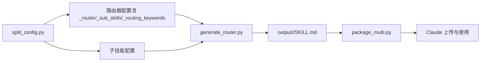

# 路由器+类别混合策略

<cite>
**本文引用的文件**
- [split_config.py](file://src/skill_seekers/cli/split_config.py)
- [generate_router.py](file://src/skill_seekers/cli/generate_router.py)
- [LARGE_DOCUMENTATION.md](file://docs/LARGE_DOCUMENTATION.md)
- [godot-large-example.json](file://configs/godot-large-example.json)
- [CLAUDE.md](file://docs/CLAUDE.md)
- [package_multi.py](file://src/skill_seekers/cli/package_multi.py)
</cite>

## 目录
1. [引言](#引言)
2. [项目结构](#项目结构)
3. [核心组件](#核心组件)
4. [架构总览](#架构总览)
5. [详细组件分析](#详细组件分析)
6. [依赖关系分析](#依赖关系分析)
7. [性能考量](#性能考量)
8. [故障排查指南](#故障排查指南)
9. [结论](#结论)
10. [附录](#附录)

## 引言
本文件系统化剖析“路由器+类别混合策略”，面向10000页以上超大文档场景，重点解释split_config.py中当策略为“router”时的完整处理流程：先按类别拆分生成多个子技能，再通过create_router_config创建包含路由元数据的主配置文件。文档深入说明路由器配置中的特殊字段（_router、_sub_skills、_routing_keywords）的作用机制，并结合LARGE_DOCUMENTATION.md中的Godot示例，阐明该策略如何实现智能路由与并行抓取，最终形成可在Claude中协同工作的技能包。

## 项目结构
围绕“路由器+类别混合策略”的关键文件与职责如下：
- split_config.py：负责根据策略自动选择拆分方式；当策略为router时，先按categories拆分子技能，再创建包含路由元数据的路由器配置。
- generate_router.py：从已生成的子技能配置集合中提取关键词，生成路由器配置与SKILL.md，用于在Claude中进行自然语言路由。
- LARGE_DOCUMENTATION.md：提供大文档拆分的策略建议、工作流与最佳实践，明确推荐使用“路由器+分类”策略。
- godot-large-example.json：展示如何在配置中声明split_strategy为router，并指定split_config参数。
- CLAUDE.md：说明在Claude中上传与使用技能包的流程，以及与MCP工具链的集成。
- package_multi.py：批量打包多个技能目录，便于一次性上传到Claude。

图表来源
- [split_config.py](file://src/skill_seekers/cli/split_config.py#L172-L200)
- [generate_router.py](file://src/skill_seekers/cli/generate_router.py#L153-L171)
- [LARGE_DOCUMENTATION.md](file://docs/LARGE_DOCUMENTATION.md#L180-L245)
- [godot-large-example.json](file://configs/godot-large-example.json#L48-L64)
- [CLAUDE.md](file://docs/CLAUDE.md#L50-L64)

章节来源
- [split_config.py](file://src/skill_seekers/cli/split_config.py#L172-L200)
- [generate_router.py](file://src/skill_seekers/cli/generate_router.py#L153-L171)
- [LARGE_DOCUMENTATION.md](file://docs/LARGE_DOCUMENTATION.md#L180-L245)
- [godot-large-example.json](file://configs/godot-large-example.json#L48-L64)
- [CLAUDE.md](file://docs/CLAUDE.md#L50-L64)

## 核心组件
- ConfigSplitter（split_config.py）
  - 负责加载配置、判定拆分策略、按类别拆分子技能，并在需要时创建路由器配置。
  - 关键方法：get_split_strategy、split_by_category、create_router_config、split。
- RouterGenerator（generate_router.py）
  - 从子技能配置集合中推断路由器名称、提取路由关键词、生成SKILL.md与路由器配置。
  - 关键方法：infer_router_name、extract_routing_keywords、generate_skill_md、create_router_config。
- 配置与工作流
  - 在godot-large-example.json中声明split_strategy为router，并设置split_config（目标页数、是否创建路由器、按类别拆分等）。
  - 使用LARGE_DOCUMENTATION.md提供的工作流，先拆分、并行抓取子技能，再生成路由器，最后打包上传。

章节来源
- [split_config.py](file://src/skill_seekers/cli/split_config.py#L17-L38)
- [generate_router.py](file://src/skill_seekers/cli/generate_router.py#L16-L33)
- [godot-large-example.json](file://configs/godot-large-example.json#L48-L64)

## 架构总览
路由器+类别混合策略的核心在于“先细后整”：以类别聚焦子技能，以路由器统一入口。下图展示了从配置到最终在Claude使用的端到端流程。

图表来源
- [split_config.py](file://src/skill_seekers/cli/split_config.py#L172-L200)
- [generate_router.py](file://src/skill_seekers/cli/generate_router.py#L197-L273)
- [LARGE_DOCUMENTATION.md](file://docs/LARGE_DOCUMENTATION.md#L180-L245)
- [CLAUDE.md](file://docs/CLAUDE.md#L50-L64)

## 详细组件分析

### 组件A：ConfigSplitter（路由器+类别混合策略执行器）
- 策略判定
  - 若配置中存在split_strategy且非none，则优先使用配置值。
  - 否则根据max_pages与是否存在categories等条件自动选择策略。
  - 当满足“大文档且存在categories且数量≥3”时，推荐router策略。
- 类别拆分
  - 读取配置中的categories字典，逐个类别生成独立子配置。
  - 将类别关键词加入url_patterns.include，缩小抓取范围，提升专注度。
  - 子配置移除split相关字段，避免递归拆分。
- 路由器配置生成
  - create_router_config会添加三个关键字段：
    - _router：标记该配置为路由器。
    - _sub_skills：列出所有子技能名称，供路由器调度使用。
    - _routing_keywords：以子技能名为键，值为该子技能对应的类别关键词列表，用于自然语言路由匹配。
  - 路由器配置的max_pages设为较小值（仅需概览），base_url、selectors、url_patterns等沿用模板配置。
- 执行流程
  - split()根据策略分支：none/category/router/size。
  - router策略下，若create_router为true，则在返回的子技能列表前插入路由器配置。

图表来源
- [split_config.py](file://src/skill_seekers/cli/split_config.py#L39-L64)
- [split_config.py](file://src/skill_seekers/cli/split_config.py#L172-L200)
- [split_config.py](file://src/skill_seekers/cli/split_config.py#L150-L171)

章节来源
- [split_config.py](file://src/skill_seekers/cli/split_config.py#L39-L64)
- [split_config.py](file://src/skill_seekers/cli/split_config.py#L66-L124)
- [split_config.py](file://src/skill_seekers/cli/split_config.py#L150-L171)
- [split_config.py](file://src/skill_seekers/cli/split_config.py#L172-L200)

### 组件B：RouterGenerator（路由器生成器）
- 路由器名称推断
  - 从子技能名称集合中提取公共前缀（第一个短横线之前的片段），作为路由器名称。
- 路由关键词提取
  - 从每个子技能的categories键中提取类别名作为关键词。
  - 同时从子技能名称（短横线后的部分）提取主题词作为关键词。
- 路由器配置与SKILL.md
  - create_router_config生成包含_router、_sub_skills、_routing_keywords的路由器配置。
  - generate_skill_md生成面向用户的SKILL.md，描述如何工作、路由逻辑与可用子技能清单。
- 工作流衔接
  - 生成的SKILL.md与路由器配置可用于后续的doc_scraper抓取与package_multi打包。

图表来源
- [generate_router.py](file://src/skill_seekers/cli/generate_router.py#L16-L33)
- [generate_router.py](file://src/skill_seekers/cli/generate_router.py#L34-L46)
- [generate_router.py](file://src/skill_seekers/cli/generate_router.py#L47-L66)
- [generate_router.py](file://src/skill_seekers/cli/generate_router.py#L153-L171)

章节来源
- [generate_router.py](file://src/skill_seekers/cli/generate_router.py#L16-L33)
- [generate_router.py](file://src/skill_seekers/cli/generate_router.py#L47-L66)
- [generate_router.py](file://src/skill_seekers/cli/generate_router.py#L153-L171)

### 组件C：Godot示例与工作流
- 配置声明
  - 在godot-large-example.json中设置split_strategy为router，并通过split_config指定目标页数、是否创建路由器、按类别拆分的具体类别、路由器名称等。
- 推荐工作流
  - 先估算页数，再按router策略拆分，随后对子技能并行抓取，生成路由器SKILL.md，最后批量打包并上传到Claude。
- 并行抓取与时间节省
  - LARGE_DOCUMENTATION.md强调：并行抓取可将耗时从20-40小时降至4-8小时。

章节来源
- [godot-large-example.json](file://configs/godot-large-example.json#L48-L64)
- [LARGE_DOCUMENTATION.md](file://docs/LARGE_DOCUMENTATION.md#L180-L245)
- [CLAUDE.md](file://docs/CLAUDE.md#L50-L64)

## 依赖关系分析
- split_config.py与generate_router.py的协作
  - split_config.py生成子技能配置与路由器配置（含_router/_sub_skills/_routing_keywords）。
  - generate_router.py基于子技能配置提取关键词，生成SKILL.md与路由器配置，二者共同构成“路由器+类别混合策略”的闭环。
- 与打包与上传流程的衔接
  - package_multi.py批量打包output/<router>与各子技能目录，便于一次性上传至Claude。
- 与CLAUDE.md的集成
  - CLAUDE.md提供了在Claude中使用技能包的步骤，包括上传与自然语言交互。

图表来源
- [split_config.py](file://src/skill_seekers/cli/split_config.py#L150-L171)
- [generate_router.py](file://src/skill_seekers/cli/generate_router.py#L153-L171)
- [package_multi.py](file://src/skill_seekers/cli/package_multi.py#L1-L82)
- [CLAUDE.md](file://docs/CLAUDE.md#L50-L64)

章节来源
- [split_config.py](file://src/skill_seekers/cli/split_config.py#L150-L171)
- [generate_router.py](file://src/skill_seekers/cli/generate_router.py#L153-L171)
- [package_multi.py](file://src/skill_seekers/cli/package_multi.py#L1-L82)
- [CLAUDE.md](file://docs/CLAUDE.md#L50-L64)

## 性能考量
- 并行抓取显著缩短总耗时：LARGE_DOCUMENTATION.md指出，对子技能并行抓取可将总时间从20-40小时降至4-8小时。
- 路由器仅抓取概览内容：路由器配置的max_pages较小，避免不必要的资源消耗。
- 专注性与上下文窗口：拆分为多个子技能有助于避免上下文窗口限制，提升回答质量。

章节来源
- [LARGE_DOCUMENTATION.md](file://docs/LARGE_DOCUMENTATION.md#L288-L301)
- [split_config.py](file://src/skill_seekers/cli/split_config.py#L150-L171)

## 故障排查指南
- “拆分后技能过多”
  - 可增大目标页数或合并类别，减少子技能数量。
- “路由器未正确路由”
  - 检查路由器SKILL.md中的路由关键词，必要时调整关键词集合。
- “并行抓取失败”
  - 降低并发度或适当提高rate_limit，避免被目标站点限流。

章节来源
- [LARGE_DOCUMENTATION.md](file://docs/LARGE_DOCUMENTATION.md#L371-L410)

## 结论
“路由器+类别混合策略”在10000页以上的大文档场景中，实现了“既保持技能专注性，又提供无缝用户体验”的双重优势。split_config.py在router策略下，通过split_by_category与create_router_config，构建了包含_router、_sub_skills、_routing_keywords的路由器配置；generate_router.py进一步完善了SKILL.md与路由器配置，使Claude能够基于关键词自然路由到最合适的子技能。配合并行抓取与批量打包，最终形成可在Claude中协同工作的技能包，显著提升开发效率与问答质量。

## 附录
- 使用建议
  - 大文档优先采用router策略，并在配置中明确split_config参数。
  - 先拆分、再并行抓取、后生成路由器、最后打包上传。
- 相关文件路径参考
  - [split_config.py](file://src/skill_seekers/cli/split_config.py#L172-L200)
  - [generate_router.py](file://src/skill_seekers/cli/generate_router.py#L153-L171)
  - [LARGE_DOCUMENTATION.md](file://docs/LARGE_DOCUMENTATION.md#L180-L245)
  - [godot-large-example.json](file://configs/godot-large-example.json#L48-L64)
  - [CLAUDE.md](file://docs/CLAUDE.md#L50-L64)
  - [package_multi.py](file://src/skill_seekers/cli/package_multi.py#L1-L82)