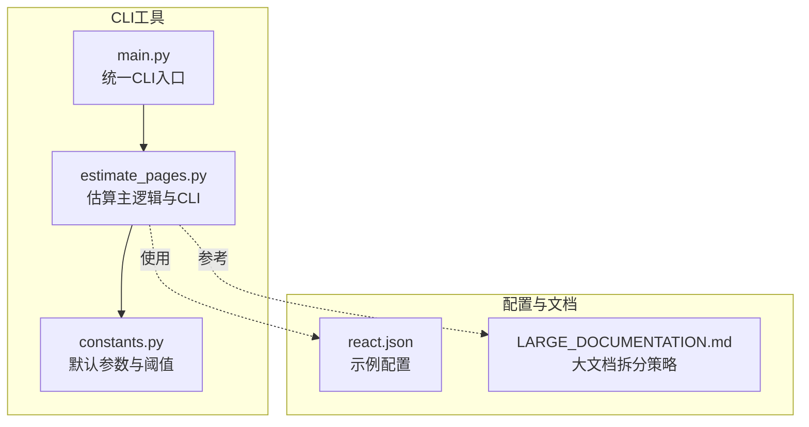
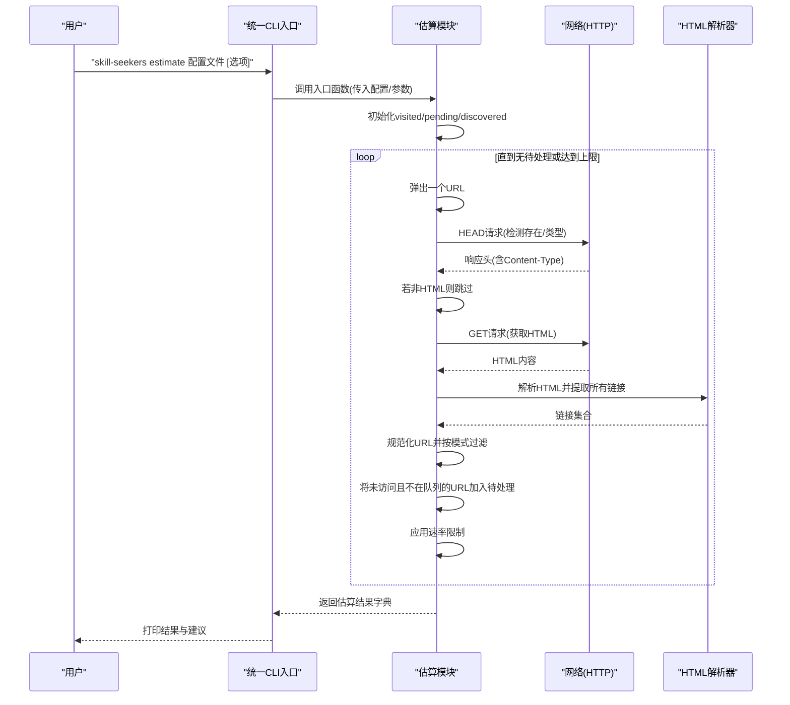
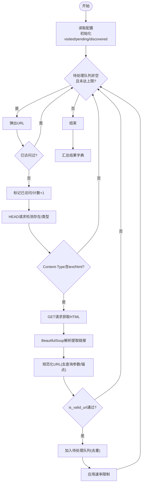
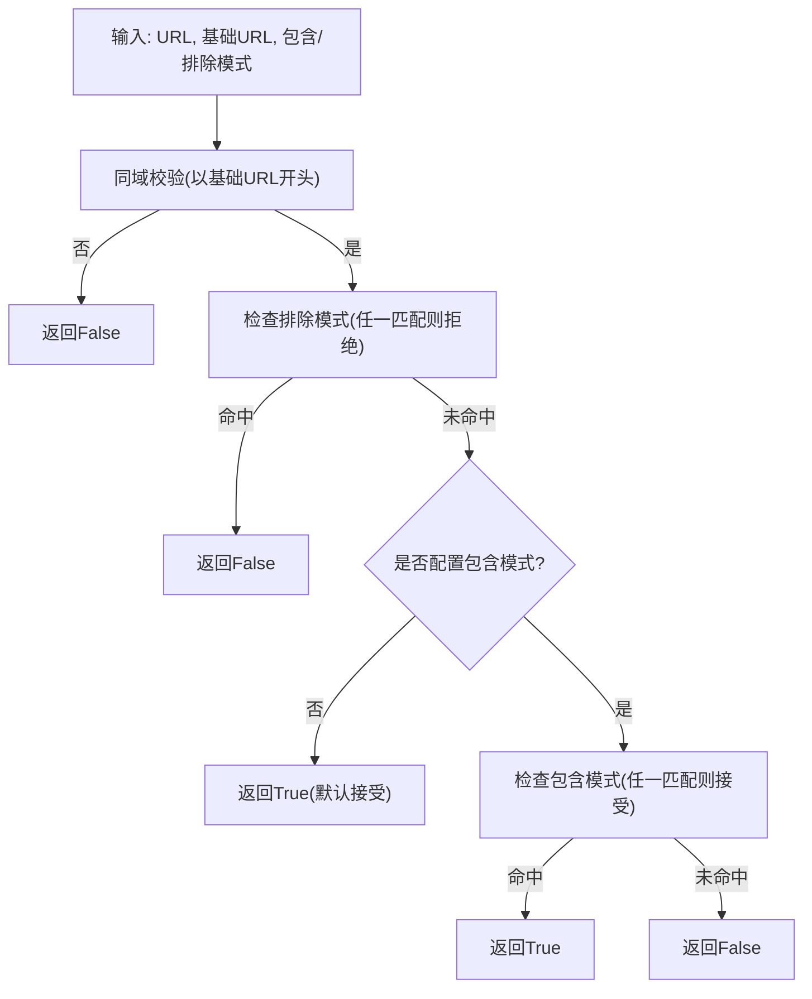
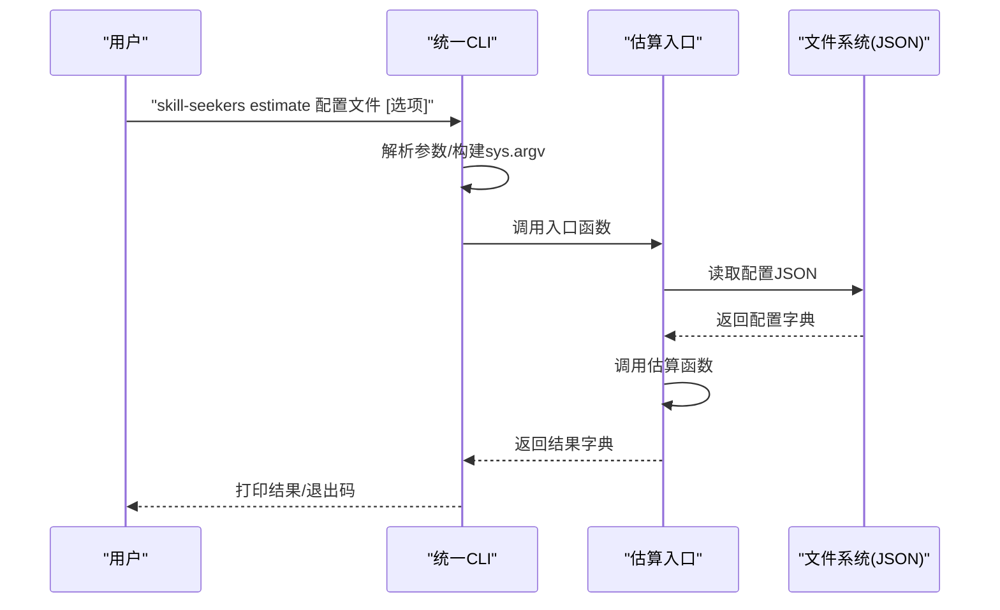
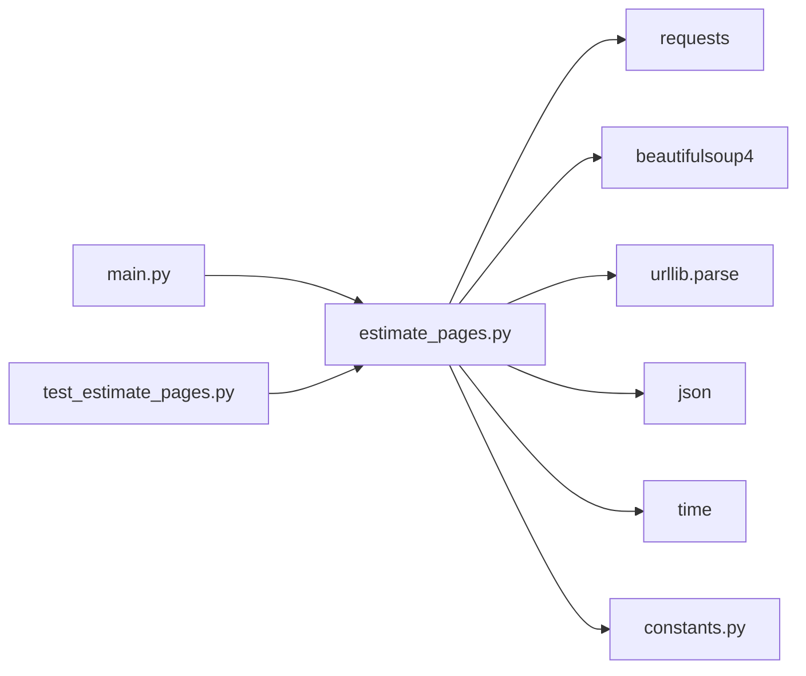

# 页面估算

<cite>
**本文引用的文件列表**
- [estimate_pages.py](file://src/skill_seekers/cli/estimate_pages.py)
- [constants.py](file://src/skill_seekers/cli/constants.py)
- [main.py（CLI统一入口）](file://src/skill_seekers/cli/main.py)
- [LARGE_DOCUMENTATION.md](file://docs/LARGE_DOCUMENTATION.md)
- [react.json（示例配置）](file://configs/react.json)
- [test_estimate_pages.py](file://tests/test_estimate_pages.py)
</cite>

## 目录
1. [简介](#简介)
2. [项目结构](#项目结构)
3. [核心组件](#核心组件)
4. [架构概览](#架构概览)
5. [详细组件分析](#详细组件分析)
6. [依赖关系分析](#依赖关系分析)
7. [性能考量](#性能考量)
8. [故障排查指南](#故障排查指南)
9. [结论](#结论)
10. [附录：命令行与输出解读](#附录命令行与输出解读)

## 简介
本模块用于在不下载内容的前提下，对文档站点进行快速页面数量估算。它通过发送HEAD请求探测页面存在性并跳过非HTML资源，随后对返回的HTML页面执行解析，提取所有链接，基于基础URL、包含/排除模式进行有效性过滤，采用广度优先式的“爬虫式发现”机制，统计已发现、待处理与总估算页面数，并支持速率限制与发现上限控制。模块还提供命令行入口，便于直接运行与集成到工作流中。

## 项目结构
与页面估算相关的核心文件位于CLI子模块中，配合统一CLI入口与常量配置，形成可复用的估算能力。

图表来源
- [estimate_pages.py](file://src/skill_seekers/cli/estimate_pages.py#L1-L289)
- [constants.py](file://src/skill_seekers/cli/constants.py#L1-L73)
- [main.py（CLI统一入口）](file://src/skill_seekers/cli/main.py#L1-L370)
- [react.json（示例配置）](file://configs/react.json#L1-L32)
- [LARGE_DOCUMENTATION.md](file://docs/LARGE_DOCUMENTATION.md#L1-L432)

章节来源
- [estimate_pages.py](file://src/skill_seekers/cli/estimate_pages.py#L1-L289)
- [constants.py](file://src/skill_seekers/cli/constants.py#L1-L73)
- [main.py（CLI统一入口）](file://src/skill_seekers/cli/main.py#L1-L370)
- [react.json（示例配置）](file://configs/react.json#L1-L32)
- [LARGE_DOCUMENTATION.md](file://docs/LARGE_DOCUMENTATION.md#L1-L432)

## 核心组件
- 估算主函数：负责初始化状态、循环处理待处理URL、HEAD探测、HTML解析、链接提取与过滤、速率限制与发现上限控制，并汇总结果。
- URL有效性判定：基于基础URL同域校验、排除模式优先、包含模式白名单控制。
- CLI入口：提供统一命令行界面，支持配置路径、最大发现数、无限模式与超时参数。
- 常量配置：定义默认速率限制、默认最大发现数、发现阈值等关键参数。
- 输出打印：格式化展示估算结果与推荐操作。

章节来源
- [estimate_pages.py](file://src/skill_seekers/cli/estimate_pages.py#L25-L139)
- [estimate_pages.py](file://src/skill_seekers/cli/estimate_pages.py#L142-L163)
- [estimate_pages.py](file://src/skill_seekers/cli/estimate_pages.py#L165-L218)
- [estimate_pages.py](file://src/skill_seekers/cli/estimate_pages.py#L219-L289)
- [constants.py](file://src/skill_seekers/cli/constants.py#L35-L40)
- [main.py（CLI统一入口）](file://src/skill_seekers/cli/main.py#L152-L160)

## 架构概览
下图展示了从命令行到估算流程的关键交互与数据流。

图表来源
- [main.py（CLI统一入口）](file://src/skill_seekers/cli/main.py#L324-L329)
- [estimate_pages.py](file://src/skill_seekers/cli/estimate_pages.py#L25-L139)
- [estimate_pages.py](file://src/skill_seekers/cli/estimate_pages.py#L165-L218)

## 详细组件分析

### 组件A：估算主流程（estimate_pages）
- 输入参数：配置字典、最大发现数、超时时间。
- 关键状态：
  - 已访问集合：避免重复处理。
  - 待处理队列：广度优先遍历的基础。
  - 已发现计数：记录实际处理的页面数。
- 处理步骤：
  - 读取基础URL、起始URL列表、URL模式（包含/排除）、速率限制。
  - 支持无限模式（max_discovery为-1或None）。
  - 循环条件：待处理队列非空且未达到上限。
  - 对每个URL先HEAD探测，仅处理HTML内容；再GET获取HTML，解析并提取所有带href的链接。
  - URL规范化（保留scheme/netloc/path），然后按is_valid_url进行有效性判断。
  - 将未访问且不在队列中的URL加入待处理。
  - 每次处理后应用速率限制。
- 结果汇总：
  - 已发现、待处理、估算总数、耗时、发现速率、是否命中上限、是否无限模式。

图表来源
- [estimate_pages.py](file://src/skill_seekers/cli/estimate_pages.py#L25-L139)

章节来源
- [estimate_pages.py](file://src/skill_seekers/cli/estimate_pages.py#L25-L139)

### 组件B：URL有效性判定（is_valid_url）
- 同域要求：必须以基础URL开头（去除末尾斜杠）。
- 排除优先：若配置了排除模式，只要包含任一排除模式即拒绝。
- 包含白名单：若配置了包含模式，只有包含任一包含模式才接受；若未配置包含模式，默认接受。
- 作用：确保只处理目标站点内的相关页面，避免无关资源与跨站链接。

图表来源
- [estimate_pages.py](file://src/skill_seekers/cli/estimate_pages.py#L142-L163)

章节来源
- [estimate_pages.py](file://src/skill_seekers/cli/estimate_pages.py#L142-L163)

### 组件C：命令行接口与入口（main）
- 子命令注册：在统一CLI入口中注册“estimate”子命令，支持配置文件路径、最大发现数等参数。
- 入口行为：
  - 解析参数（支持--max-discovery/--unlimited/--timeout）。
  - 加载JSON配置。
  - 调用估算函数，打印结果并根据是否命中上限返回不同退出码。
- 与统一CLI的关系：统一CLI将“estimate”子命令转发到本模块入口。

图表来源
- [main.py（CLI统一入口）](file://src/skill_seekers/cli/main.py#L324-L329)
- [estimate_pages.py](file://src/skill_seekers/cli/estimate_pages.py#L219-L289)

章节来源
- [main.py（CLI统一入口）](file://src/skill_seekers/cli/main.py#L152-L160)
- [main.py（CLI统一入口）](file://src/skill_seekers/cli/main.py#L324-L329)
- [estimate_pages.py](file://src/skill_seekers/cli/estimate_pages.py#L219-L289)

### 组件D：结果打印与推荐（print_results）
- 展示指标：已发现、待处理、估算总数、耗时、发现速率、是否无限模式、是否命中上限。
- 推荐逻辑：
  - 当前max_pages与估算总数比较，给出是否需要提高max_pages的建议。
  - 基于速率限制估算完整抓取所需时间（分钟）。
  - 若命中上限，提示可能实际总数更高，建议提升max_discovery以获得更准确估计。

章节来源
- [estimate_pages.py](file://src/skill_seekers/cli/estimate_pages.py#L165-L218)

### 组件E：常量与阈值（constants）
- 默认速率限制：每次请求间隔秒数。
- 默认最大发现数：估算阶段的默认上限。
- 发现阈值：用于警告与推荐的阈值。
- 与估算模块的耦合：估算模块使用默认速率限制与默认最大发现数；阈值用于推荐逻辑。

章节来源
- [constants.py](file://src/skill_seekers/cli/constants.py#L10-L11)
- [constants.py](file://src/skill_seekers/cli/constants.py#L38-L40)
- [estimate_pages.py](file://src/skill_seekers/cli/estimate_pages.py#L25-L41)
- [estimate_pages.py](file://src/skill_seekers/cli/estimate_pages.py#L197-L207)

## 依赖关系分析
- 内部依赖：
  - estimate_pages依赖constants中的默认速率限制、默认最大发现数、发现阈值。
  - CLI统一入口将“estimate”子命令转发到本模块入口。
- 外部依赖：
  - requests：发起HEAD/GET请求。
  - BeautifulSoup：解析HTML并提取链接。
  - urllib.parse：URL规范化与拼接。
  - json/time：配置加载与进度统计。
- 测试依赖：
  - 单元测试覆盖最小配置、上限尊重、start_urls、CLI帮助输出等场景。

图表来源
- [estimate_pages.py](file://src/skill_seekers/cli/estimate_pages.py#L1-L20)
- [constants.py](file://src/skill_seekers/cli/constants.py#L1-L73)
- [main.py（CLI统一入口）](file://src/skill_seekers/cli/main.py#L324-L329)
- [test_estimate_pages.py](file://tests/test_estimate_pages.py#L1-L161)

章节来源
- [estimate_pages.py](file://src/skill_seekers/cli/estimate_pages.py#L1-L20)
- [test_estimate_pages.py](file://tests/test_estimate_pages.py#L1-L161)

## 性能考量
- HEAD探测优先：先用HEAD请求判断是否存在与内容类型，避免不必要的HTML下载，显著降低带宽与CPU开销。
- 速率限制：通过固定间隔睡眠控制请求频率，降低对目标站点的压力，提高稳定性。
- 广度优先搜索：待处理队列采用先进先出，有助于尽快覆盖主要路径。
- 上限控制：默认最大发现数与无限模式可选，平衡准确性与耗时。
- 错误容忍：网络异常与解析异常被静默跳过，保证估算过程连续性。

章节来源
- [estimate_pages.py](file://src/skill_seekers/cli/estimate_pages.py#L84-L125)
- [estimate_pages.py](file://src/skill_seekers/cli/estimate_pages.py#L116-L118)
- [constants.py](file://src/skill_seekers/cli/constants.py#L10-L11)

## 故障排查指南
- 无法找到配置文件：检查路径是否正确，确认JSON格式有效。
- 请求超时：适当增大--timeout，或减少并发（本模块内部无并发，但外部可并行运行多个实例）。
- 命令不可用：确认已安装包或使用统一CLI入口；也可直接运行模块脚本。
- 估算结果偏低：可能是命中了最大发现数限制，尝试提高--max-discovery或使用--unlimited（注意耗时与目标站点压力）。
- 输出建议与阈值：参考大文档拆分策略文档，结合估算结果决定是否拆分与路由。

章节来源
- [estimate_pages.py](file://src/skill_seekers/cli/estimate_pages.py#L219-L289)
- [test_estimate_pages.py](file://tests/test_estimate_pages.py#L78-L136)

## 结论
该模块通过轻量的HEAD探测与HTML解析，实现了对文档站点页面数量的快速估算。其设计强调稳健性（错误容忍）、可控性（速率限制、上限控制）与实用性（输出建议、阈值参考）。结合大文档拆分策略，估算结果可直接指导后续的拆分与路由决策，从而优化抓取效率与最终技能质量。

## 附录：命令行与输出解读

### 命令行示例
- 基本估算：使用统一CLI估算指定配置文件的页面数。
- 提高发现上限：通过参数扩大发现范围以获得更准确估算。
- 无限模式：忽略上限限制，尽可能发现所有可达页面（谨慎使用）。
- 超时控制：调整HTTP请求超时时间以适配网络环境。

章节来源
- [main.py（CLI统一入口）](file://src/skill_seekers/cli/main.py#L152-L160)
- [estimate_pages.py](file://src/skill_seekers/cli/estimate_pages.py#L233-L289)

### 输出指标说明
- 已发现：估算过程中实际处理的页面数量。
- 待处理：当前仍在队列中等待处理的页面数量。
- 估算总数：已发现 + 待处理，作为本次估算的总页面数。
- 耗时：估算过程所用时间（秒）。
- 发现速率：平均每秒发现的页面数。
- 是否命中上限：是否因达到最大发现数而提前停止。
- 是否无限模式：是否启用了无限发现模式。
- 推荐max_pages：基于当前配置与估算结果给出的建议值。
- 估算完整抓取时间：基于速率限制估算的总耗时（分钟）。

章节来源
- [estimate_pages.py](file://src/skill_seekers/cli/estimate_pages.py#L129-L139)
- [estimate_pages.py](file://src/skill_seekers/cli/estimate_pages.py#L165-L218)

### 估算结果与拆分策略的关系
- 当估算总数小于等于5000：通常无需拆分，可在单个技能中完成抓取。
- 当估算总数在5000至10000之间：建议考虑按类别拆分，以提升聚焦度与维护性。
- 当估算总数超过10000：强烈建议采用“路由器+分类”的拆分策略，将文档拆分为多个子技能并通过路由器智能路由，以获得最佳用户体验与抓取效率。

章节来源
- [LARGE_DOCUMENTATION.md](file://docs/LARGE_DOCUMENTATION.md#L19-L43)
- [LARGE_DOCUMENTATION.md](file://docs/LARGE_DOCUMENTATION.md#L81-L97)
- [LARGE_DOCUMENTATION.md](file://docs/LARGE_DOCUMENTATION.md#L178-L244)
- [LARGE_DOCUMENTATION.md](file://docs/LARGE_DOCUMENTATION.md#L246-L269)
- [LARGE_DOCUMENTATION.md](file://docs/LARGE_DOCUMENTATION.md#L413-L426)