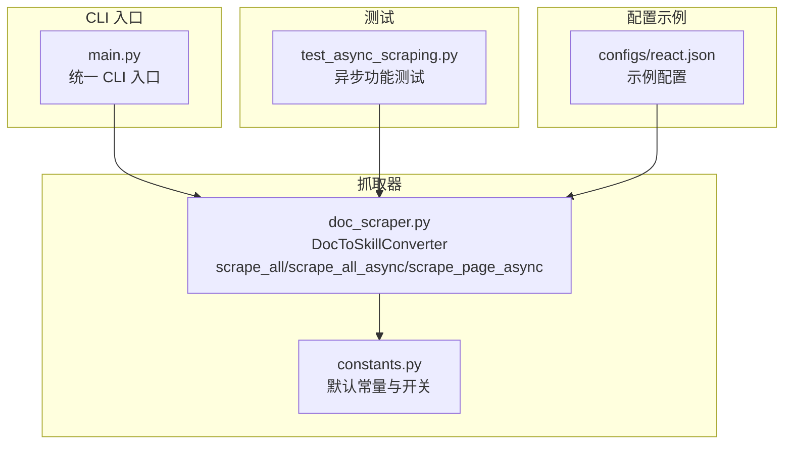
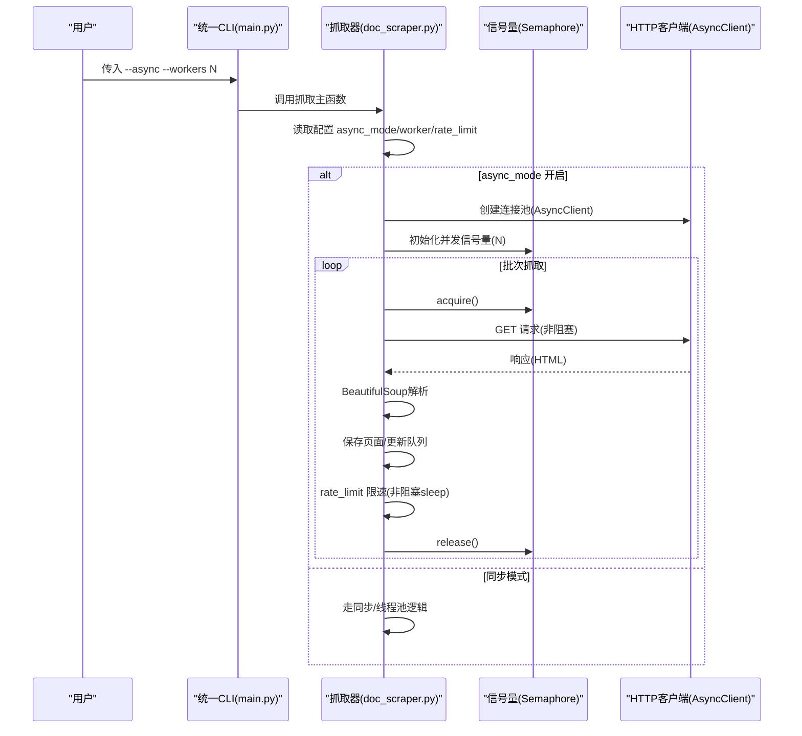
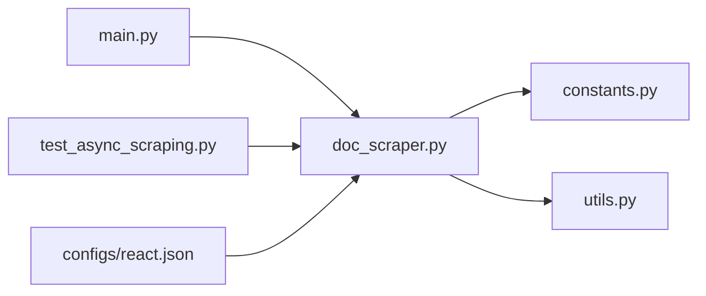
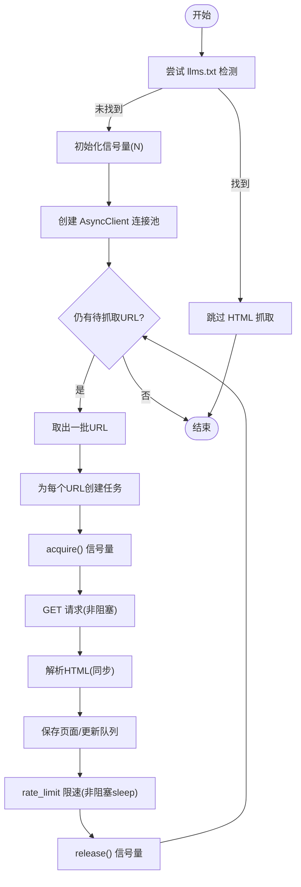

# 异步模式

<cite>
**本文引用的文件列表**
- [ASYNC_SUPPORT.md](file://ASYNC_SUPPORT.md)
- [doc_scraper.py](file://src/skill_seekers/cli/doc_scraper.py)
- [main.py](file://src/skill_seekers/cli/main.py)
- [constants.py](file://src/skill_seekers/cli/constants.py)
- [test_async_scraping.py](file://tests/test_async_scraping.py)
- [utils.py](file://src/skill_seekers/cli/utils.py)
- [react.json](file://configs/react.json)
</cite>

## 目录
1. [简介](#简介)
2. [项目结构](#项目结构)
3. [核心组件](#核心组件)
4. [架构总览](#架构总览)
5. [详细组件分析](#详细组件分析)
6. [依赖关系分析](#依赖关系分析)
7. [性能考量](#性能考量)
8. [故障排查指南](#故障排查指南)
9. [结论](#结论)
10. [附录](#附录)

## 简介
本节介绍异步模式如何通过 asyncio 和 httpx.AsyncClient 实现高性能抓取，对比同步多线程模式在吞吐量（2-3倍提升）、内存占用（减少约66%）和并发能力方面的显著优势。文档还说明如何通过命令行参数 --async 或在配置文件中设置 async_mode: true 启用异步模式；解释其内部机制：使用 asyncio.Semaphore 控制并发、httpx.AsyncClient 连接池以及非阻塞的异步 I/O 操作；并给出不同规模文档（小、中、大）的最佳实践建议，以及何时应避免使用异步模式（如调试或小规模抓取）。最后涵盖错误处理、性能监控与现有同步模式的兼容性。

## 项目结构
异步模式相关的核心实现集中在 CLI 抓取器模块中，入口参数解析位于统一 CLI 入口，配置常量集中于 constants 模块，测试覆盖了异步模式的关键行为。

图表来源
- [main.py](file://src/skill_seekers/cli/main.py#L80-L95)
- [doc_scraper.py](file://src/skill_seekers/cli/doc_scraper.py#L100-L110)
- [constants.py](file://src/skill_seekers/cli/constants.py#L9-L14)
- [test_async_scraping.py](file://tests/test_async_scraping.py#L1-L40)
- [react.json](file://configs/react.json#L1-L32)

章节来源
- [main.py](file://src/skill_seekers/cli/main.py#L80-L95)
- [doc_scraper.py](file://src/skill_seekers/cli/doc_scraper.py#L100-L110)
- [constants.py](file://src/skill_seekers/cli/constants.py#L9-L14)
- [test_async_scraping.py](file://tests/test_async_scraping.py#L1-L40)
- [react.json](file://configs/react.json#L1-L32)

## 核心组件
- 命令行参数与路由
  - 统一 CLI 入口提供 --async 选项，将其透传给抓取器主函数，从而影响是否启用异步模式。
  - 抓取器根据配置中的 async_mode 决定调用同步还是异步抓取流程。
- 配置与默认值
  - 默认 async_mode 关闭，可通过配置文件或命令行开启。
  - 支持 workers 参数控制并发任务数；支持 rate_limit 控制请求间隔；支持 checkpoint 间歇保存进度。
- 异步抓取器
  - 提供 scrape_all_async 作为异步入口，scrape_page_async 作为单页异步抓取方法。
  - 使用 asyncio.Semaphore 控制并发；使用 httpx.AsyncClient 建立连接池；使用 asyncio.sleep 实现非阻塞限速。
- 错误处理与重试
  - 异步页面抓取对异常进行日志记录而不中断整体流程。
  - 提供 retry_with_backoff_async 用于异步场景的指数退避重试。

章节来源
- [main.py](file://src/skill_seekers/cli/main.py#L80-L95)
- [doc_scraper.py](file://src/skill_seekers/cli/doc_scraper.py#L100-L110)
- [doc_scraper.py](file://src/skill_seekers/cli/doc_scraper.py#L389-L428)
- [doc_scraper.py](file://src/skill_seekers/cli/doc_scraper.py#L722-L800)
- [constants.py](file://src/skill_seekers/cli/constants.py#L9-L14)
- [utils.py](file://src/skill_seekers/cli/utils.py#L292-L343)

## 架构总览
异步模式的整体工作流如下：统一 CLI 解析 --async 与 --workers，传递到抓取器；抓取器根据 async_mode 判断走同步或异步路径；异步路径使用 httpx.AsyncClient 连接池与 asyncio.Semaphore 并发控制，按 rate_limit 间隔执行请求，同时支持 checkpoint 间歇保存。

图表来源
- [main.py](file://src/skill_seekers/cli/main.py#L80-L95)
- [doc_scraper.py](file://src/skill_seekers/cli/doc_scraper.py#L722-L800)
- [doc_scraper.py](file://src/skill_seekers/cli/doc_scraper.py#L389-L428)

## 详细组件分析

### 命令行与配置集成
- 统一 CLI 在 scrape 子命令中添加 --async 与 --workers 选项，将参数透传至抓取器。
- 抓取器从配置读取 async_mode，默认关闭；若命令行传入 --async，则覆盖为 true。
- 支持 rate_limit 控制请求间隔；workers 控制并发任务数量；checkpoint 间歇保存进度。

章节来源
- [main.py](file://src/skill_seekers/cli/main.py#L80-L95)
- [doc_scraper.py](file://src/skill_seekers/cli/doc_scraper.py#L100-L110)
- [doc_scraper.py](file://src/skill_seekers/cli/doc_scraper.py#L1471-L1472)
- [doc_scraper.py](file://src/skill_seekers/cli/doc_scraper.py#L1550-L1552)
- [constants.py](file://src/skill_seekers/cli/constants.py#L9-L14)

### 异步抓取入口与路由
- scrape_all() 根据 async_mode 决定调用同步或异步抓取流程：
  - async_mode=True 时，调用 asyncio.run(scrape_all_async())
  - 否则走同步/线程池逻辑
- scrape_all_async()：
  - 优先尝试 llms.txt 检测，成功则跳过 HTML 抓取
  - 初始化 asyncio.Semaphore(self.workers) 控制并发
  - 使用 httpx.AsyncClient(timeout, limits) 建立连接池
  - 以批次方式创建 asyncio.create_task 并行抓取

章节来源
- [doc_scraper.py](file://src/skill_seekers/cli/doc_scraper.py#L561-L570)
- [doc_scraper.py](file://src/skill_seekers/cli/doc_scraper.py#L566-L569)
- [doc_scraper.py](file://src/skill_seekers/cli/doc_scraper.py#L722-L800)

### 单页异步抓取与并发控制
- scrape_page_async(url, semaphore, client)：
  - 使用 async with semaphore 控制最大并发
  - 使用 client.get(url, timeout=30.0) 发起异步请求
  - BeautifulSoup 解析仍为同步，但仅在事件循环内执行
  - 保存页面、更新队列、按 rate_limit 间隔进行非阻塞 sleep
  - 异常被捕获并记录，不中断其他任务

章节来源
- [doc_scraper.py](file://src/skill_seekers/cli/doc_scraper.py#L389-L428)

### 连接池与非阻塞 I/O
- httpx.AsyncClient：
  - 通过 limits=httpx.Limits(max_connections=self.workers * 2) 控制最大连接数
  - 复用连接，降低握手开销，提高吞吐
- asyncio.sleep(rate_limit)：
  - 非阻塞限速，避免阻塞事件循环
- asyncio.Semaphore：
  - 限制同时发起的请求数量，防止资源耗尽

章节来源
- [doc_scraper.py](file://src/skill_seekers/cli/doc_scraper.py#L766-L774)
- [doc_scraper.py](file://src/skill_seekers/cli/doc_scraper.py#L422-L424)

### 错误处理与重试
- 页面抓取异常被捕获并记录，不影响其他任务继续运行
- 提供 retry_with_backoff_async 用于异步场景的指数退避重试，包含延迟与日志输出

章节来源
- [doc_scraper.py](file://src/skill_seekers/cli/doc_scraper.py#L426-L428)
- [utils.py](file://src/skill_seekers/cli/utils.py#L292-L343)

### 测试覆盖与兼容性
- 测试验证：
  - async_mode 默认关闭，可由配置或命令行开启
  - scrape_all() 正确路由到异步版本
  - 异步干跑(dry-run)可完成
  - 异步模式下 HTTP 错误被优雅处理
  - 异步模式使用信号量而非线程锁
  - llms.txt 优先策略在异步模式下同样生效
- 兼容性：
  - 异步模式为可选特性，零破坏性变更
  - 所有现有配置无需修改即可继续使用

章节来源
- [test_async_scraping.py](file://tests/test_async_scraping.py#L30-L83)
- [test_async_scraping.py](file://tests/test_async_scraping.py#L142-L188)
- [test_async_scraping.py](file://tests/test_async_scraping.py#L201-L224)
- [test_async_scraping.py](file://tests/test_async_scraping.py#L237-L269)
- [test_async_scraping.py](file://tests/test_async_scraping.py#L272-L296)
- [test_async_scraping.py](file://tests/test_async_scraping.py#L298-L325)

### 性能监控与指标
- 文档提供了基准数据：在相同 workers 下，异步模式相较同步线程模式约 2-3 倍更快，且内存占用显著更低
- 建议通过以下方式观察性能：
  - 使用 --dry-run 预览抓取范围与速度
  - 结合 rate_limit 与 workers 调优
  - 对大规模抓取启用 checkpoint 间歇保存，便于恢复与统计

章节来源
- [ASYNC_SUPPORT.md](file://ASYNC_SUPPORT.md#L100-L118)

## 依赖关系分析
- 组件耦合与职责
  - main.py 仅负责参数透传，不直接参与抓取逻辑
  - doc_scraper.py 是核心抓取器，承担路由、并发控制、I/O、错误处理
  - constants.py 提供默认配置与开关
  - utils.py 提供通用工具（如指数退避）
  - test_async_scraping.py 验证异步行为与兼容性
- 外部依赖
  - asyncio、httpx.AsyncClient、BeautifulSoup
  - logging、time、os、json 等标准库

图表来源
- [main.py](file://src/skill_seekers/cli/main.py#L80-L95)
- [doc_scraper.py](file://src/skill_seekers/cli/doc_scraper.py#L100-L110)
- [constants.py](file://src/skill_seekers/cli/constants.py#L9-L14)
- [utils.py](file://src/skill_seekers/cli/utils.py#L292-L343)
- [test_async_scraping.py](file://tests/test_async_scraping.py#L1-L40)
- [react.json](file://configs/react.json#L1-L32)

## 性能考量
- 吞吐量提升（2-3倍）
  - 异步模式通过非阻塞 I/O 与连接池复用，显著减少等待时间
  - 参考基准数据与文档说明
- 内存占用（约减少66%）
  - 异步每 worker 的内存远低于线程模式，适合高并发场景
- 并发能力
  - 通过 workers 控制并发任务数；Semaphore 限制同时请求数
  - 连接池上限与 rate_limit 共同保障稳定性
- 不同规模文档的最佳实践
  - 小文档（~100-500页）：建议使用 --async --workers 4，或直接使用同步模式更简单
  - 中等文档（~500-2000页）：推荐 --async --workers 8
  - 大文档（2000+页）：推荐 --async --workers 8 --no-rate-limit，谨慎使用无限限速
- 何时避免异步
  - 小于约 100 页的抓取：异步开销可能不划算
  - workers=1：无并行收益
  - 调试阶段：同步模式更易定位问题

章节来源
- [ASYNC_SUPPORT.md](file://ASYNC_SUPPORT.md#L60-L76)
- [ASYNC_SUPPORT.md](file://ASYNC_SUPPORT.md#L122-L136)
- [doc_scraper.py](file://src/skill_seekers/cli/doc_scraper.py#L766-L774)

## 故障排查指南
- “文件过多”类错误
  - 降低 workers 数量，减小并发
- 异步模式反而更慢
  - worker 过少（建议≥4）或本地网络极快时，异步开销不明显
  - 小文档建议改用同步模式
- 内存占用仍然偏高
  - BeautifulSoup 解析仍较消耗内存；适当减少 workers
- HTTP 错误与异常
  - 异步抓取会记录错误但不会中断整体流程；可在配置中增加 rate_limit 或减少 workers
- 重试与退避
  - 使用 retry_with_backoff_async 进行指数退避重试，避免瞬时失败导致整体失败

章节来源
- [ASYNC_SUPPORT.md](file://ASYNC_SUPPORT.md#L184-L210)
- [doc_scraper.py](file://src/skill_seekers/cli/doc_scraper.py#L426-L428)
- [utils.py](file://src/skill_seekers/cli/utils.py#L292-L343)

## 结论
异步模式通过 asyncio 与 httpx.AsyncClient 的组合，在高并发、低延迟网络环境下显著提升抓取吞吐量与资源利用率。其通过 Semaphore 控制并发、连接池复用与非阻塞限速，既保证了性能又兼顾了稳定性。配合 dry-run、checkpoint 与合理的 workers/rate_limit 设置，可在不同规模文档场景下获得最佳效果。对于小规模或调试场景，同步模式仍是更直观的选择。

## 附录

### 启用异步模式的方式
- 命令行参数
  - 使用 --async 开启异步模式
  - 使用 --workers 指定并发任务数
  - 示例参考文档与命令行帮助
- 配置文件
  - 在配置 JSON 中添加 "async_mode": true
  - 可同时设置 "workers"、"rate_limit"、"checkpoint" 等参数

章节来源
- [ASYNC_SUPPORT.md](file://ASYNC_SUPPORT.md#L20-L55)
- [main.py](file://src/skill_seekers/cli/main.py#L80-L95)
- [react.json](file://configs/react.json#L1-L32)

### 关键流程图：异步抓取算法

图表来源
- [doc_scraper.py](file://src/skill_seekers/cli/doc_scraper.py#L722-L800)
- [doc_scraper.py](file://src/skill_seekers/cli/doc_scraper.py#L389-L428)