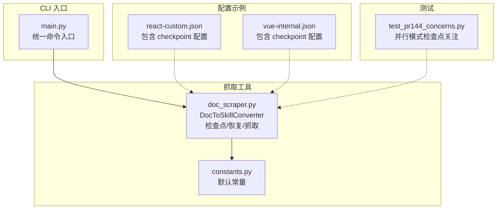
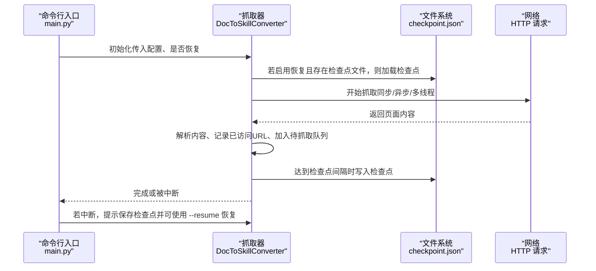
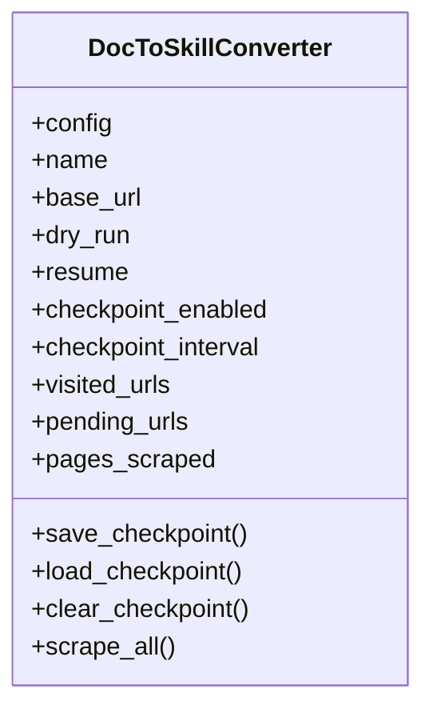
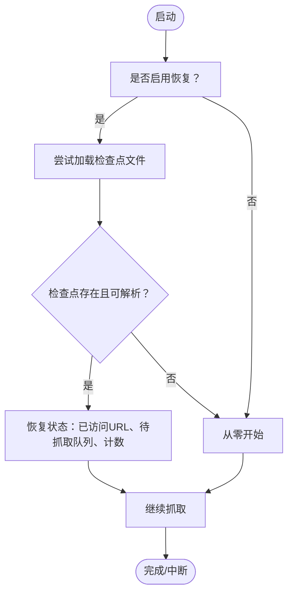
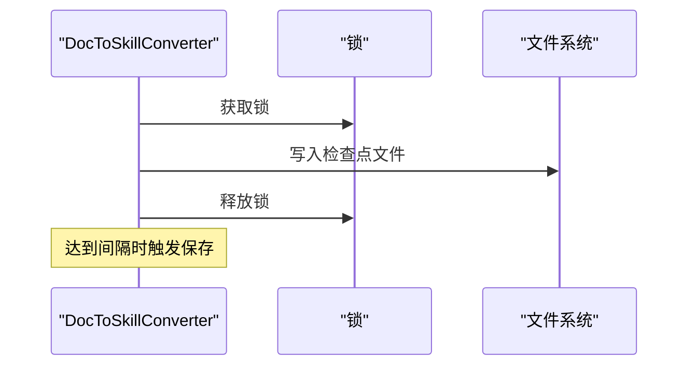
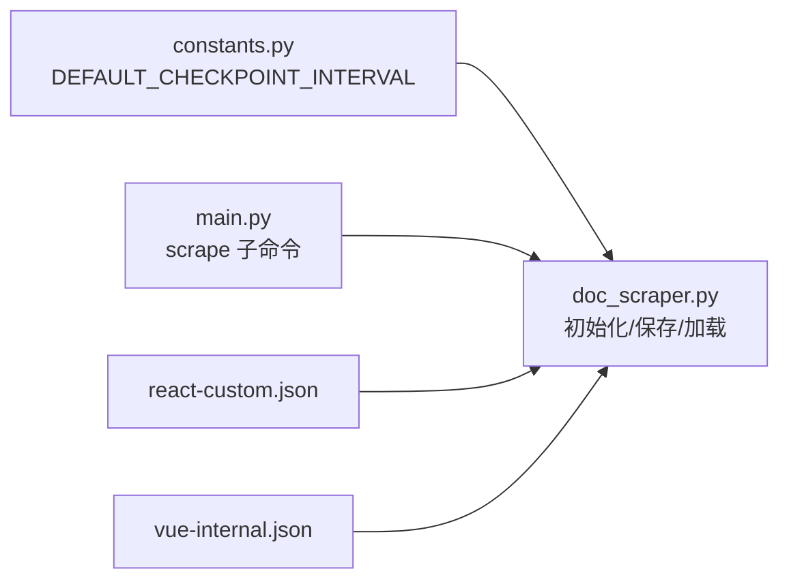

# 检查点与恢复

<cite>
**本文引用的文件列表**
- [doc_scraper.py](file://src/skill_seekers/cli/doc_scraper.py)
- [constants.py](file://src/skill_seekers/cli/constants.py)
- [main.py](file://src/skill_seekers/cli/main.py)
- [react-custom.json](file://configs/example-team/react-custom.json)
- [vue-internal.json](file://configs/example-team/vue-internal.json)
- [test_pr144_concerns.py](file://tests/test_pr144_concerns.py)
</cite>

## 目录
1. [简介](#简介)
2. [项目结构](#项目结构)
3. [核心组件](#核心组件)
4. [架构总览](#架构总览)
5. [详细组件分析](#详细组件分析)
6. [依赖关系分析](#依赖关系分析)
7. [性能考量](#性能考量)
8. [故障排查指南](#故障排查指南)
9. [结论](#结论)
10. [附录](#附录)

## 简介
本文件系统性阐述“检查点与恢复”机制如何为长时间运行的抓取任务提供容错能力。该机制在抓取过程中定期保存关键状态（如已访问的 URL、待抓取队列、已抓取页面计数等），一旦任务因中断而停止，可在后续使用相同配置重新启动时自动加载检查点，从而从断点继续，避免从头开始。本文将说明：
- 如何在配置文件中通过 checkpoint 对象启用与配置检查点（enabled、interval 字段）
- 恢复流程：如何检测并自动加载检查点文件
- 在大型文档或网络不稳定场景下的重要性
- 最佳实践建议（例如对超过 1000 页的抓取任务启用检查点）

## 项目结构
与检查点功能直接相关的核心文件与职责如下：
- 抓取器与检查点逻辑：src/skill_seekers/cli/doc_scraper.py
- 默认常量（含检查点间隔）：src/skill_seekers/cli/constants.py
- 命令行入口与子命令分发：src/skill_seekers/cli/main.py
- 示例配置（展示如何在配置中添加 checkpoint）：configs/example-team/react-custom.json、configs/example-team/vue-internal.json
- 并行模式下检查点行为的测试关注点：tests/test_pr144_concerns.py

图表来源
- [doc_scraper.py](file://src/skill_seekers/cli/doc_scraper.py#L71-L211)
- [constants.py](file://src/skill_seekers/cli/constants.py#L9-L13)
- [main.py](file://src/skill_seekers/cli/main.py#L240-L264)
- [react-custom.json](file://configs/example-team/react-custom.json#L1-L36)
- [vue-internal.json](file://configs/example-team/vue-internal.json#L1-L37)
- [test_pr144_concerns.py](file://tests/test_pr144_concerns.py#L1-L47)

章节来源
- [doc_scraper.py](file://src/skill_seekers/cli/doc_scraper.py#L71-L211)
- [constants.py](file://src/skill_seekers/cli/constants.py#L9-L13)
- [main.py](file://src/skill_seekers/cli/main.py#L240-L264)

## 核心组件
- DocToSkillConverter：负责抓取、解析、保存页面、生成技能；内置检查点与恢复能力。
- 检查点数据结构：包含配置快照、已访问 URL 集合、待抓取 URL 队列、已抓取页面计数、最后更新时间、检查点间隔等。
- 默认检查点间隔：来自 constants 中的 DEFAULT_CHECKPOINT_INTERVAL，默认每 1000 页保存一次检查点。
- 命令行支持：--resume 用于从上次检查点恢复；--fresh 可清除检查点并强制全新开始。

章节来源
- [doc_scraper.py](file://src/skill_seekers/cli/doc_scraper.py#L71-L211)
- [constants.py](file://src/skill_seekers/cli/constants.py#L9-L13)
- [main.py](file://src/skill_seekers/cli/main.py#L240-L264)

## 架构总览
检查点与恢复在整体抓取流程中的位置如下：

图表来源
- [doc_scraper.py](file://src/skill_seekers/cli/doc_scraper.py#L131-L211)
- [doc_scraper.py](file://src/skill_seekers/cli/doc_scraper.py#L608-L720)
- [doc_scraper.py](file://src/skill_seekers/cli/doc_scraper.py#L1633-L1651)

## 详细组件分析

### 组件：DocToSkillConverter（检查点与恢复）
- 初始化阶段
  - 读取配置中的 checkpoint 对象，提取 enabled 与 interval 字段；若未显式设置则使用默认值。
  - 若启用恢复且非预演模式，则尝试加载检查点文件。
- 检查点保存
  - 当启用检查点且非预演模式时，在达到指定间隔（默认每 1000 页）时写入检查点文件。
  - 写入内容包括：配置快照、已访问 URL 集合、待抓取 URL 队列、已抓取页面计数、最后更新时间、检查点间隔。
- 检查点加载
  - 若检查点文件存在，则读取并恢复上述状态；否则提示从零开始。
- 清理检查点
  - 成功完成或手动选择全新开始时，可清理检查点文件。

图表来源
- [doc_scraper.py](file://src/skill_seekers/cli/doc_scraper.py#L71-L211)

章节来源
- [doc_scraper.py](file://src/skill_seekers/cli/doc_scraper.py#L71-L211)

### 恢复流程（从检查点恢复）
- 启动时若传入 --resume，构造器会尝试加载检查点文件。
- 加载成功后，恢复已访问 URL 集合、待抓取队列、已抓取页面计数等状态。
- 之后继续抓取，直到完成或再次中断。

图表来源
- [doc_scraper.py](file://src/skill_seekers/cli/doc_scraper.py#L131-L211)
- [doc_scraper.py](file://src/skill_seekers/cli/doc_scraper.py#L1625-L1631)

章节来源
- [doc_scraper.py](file://src/skill_seekers/cli/doc_scraper.py#L131-L211)
- [doc_scraper.py](file://src/skill_seekers/cli/doc_scraper.py#L1625-L1631)

### 检查点保存时机与并发注意事项
- 保存触发条件：启用检查点且达到检查点间隔（默认每 1000 页）。
- 并发模式下，检查点保存受锁保护；但测试脚本指出存在计数器非线程安全的问题，可能影响检查点时机的准确性。

图表来源
- [doc_scraper.py](file://src/skill_seekers/cli/doc_scraper.py#L608-L720)
- [doc_scraper.py](file://src/skill_seekers/cli/doc_scraper.py#L677-L708)
- [test_pr144_concerns.py](file://tests/test_pr144_concerns.py#L45-L74)

章节来源
- [doc_scraper.py](file://src/skill_seekers/cli/doc_scraper.py#L608-L720)
- [doc_scraper.py](file://src/skill_seekers/cli/doc_scraper.py#L677-L708)
- [test_pr144_concerns.py](file://tests/test_pr144_concerns.py#L45-L74)

## 依赖关系分析
- 常量依赖：检查点间隔默认值来自 constants.DEFAULT_CHECKPOINT_INTERVAL。
- 命令行依赖：--resume 与 --fresh 由 doc_scraper 的命令行参数定义；main.py 将 scrape 子命令转发给 doc_scraper。
- 配置依赖：checkpoint 对象需在配置文件中声明 enabled 与 interval 字段。

图表来源
- [constants.py](file://src/skill_seekers/cli/constants.py#L9-L13)
- [doc_scraper.py](file://src/skill_seekers/cli/doc_scraper.py#L71-L211)
- [main.py](file://src/skill_seekers/cli/main.py#L240-L264)
- [react-custom.json](file://configs/example-team/react-custom.json#L1-L36)
- [vue-internal.json](file://configs/example-team/vue-internal.json#L1-L37)

章节来源
- [constants.py](file://src/skill_seekers/cli/constants.py#L9-L13)
- [doc_scraper.py](file://src/skill_seekers/cli/doc_scraper.py#L71-L211)
- [main.py](file://src/skill_seekers/cli/main.py#L240-L264)

## 性能考量
- 检查点间隔越大，磁盘写入频率越低，I/O 压力越小；但发生中断时回退的代价越大。
- 默认间隔为 1000 页，适合大多数中大型抓取任务；对于超大站点，建议结合实际页数与稳定性需求调整 interval。
- 并发模式下，检查点保存受锁保护，避免竞态；但计数器的非线程安全问题可能导致检查点保存时机不够精确，需关注测试脚本中的风险提示。

章节来源
- [constants.py](file://src/skill_seekers/cli/constants.py#L9-L13)
- [doc_scraper.py](file://src/skill_seekers/cli/doc_scraper.py#L608-L720)
- [test_pr144_concerns.py](file://tests/test_pr144_concerns.py#L45-L74)

## 故障排查指南
- 检查点文件损坏或无法解析
  - 表现：加载失败并提示从零开始。
  - 处理：删除检查点文件后重新抓取，或修复检查点文件。
- 检查点未保存
  - 表现：中断后无法恢复。
  - 排查：确认启用了检查点（enabled=true），并确保达到间隔；同时检查磁盘权限与可用空间。
- 并发模式下检查点时机不准
  - 风险：计数器非线程安全，可能导致检查点保存时机偏差。
  - 建议：在高并发场景下适当缩短间隔，或在关键节点手动保存检查点（如完成一批任务后）。
- 恢复后重复抓取同一 URL
  - 风险：测试脚本指出 visited_urls.add 与链接去重检查的锁保护不一致，可能导致重复抓取。
  - 建议：升级版本或在恢复前确认检查点中的 visited_urls 已正确恢复。

章节来源
- [doc_scraper.py](file://src/skill_seekers/cli/doc_scraper.py#L179-L211)
- [doc_scraper.py](file://src/skill_seekers/cli/doc_scraper.py#L608-L720)
- [test_pr144_concerns.py](file://tests/test_pr144_concerns.py#L1-L47)

## 结论
检查点与恢复机制通过定期保存抓取状态，显著提升了长时间运行抓取任务的可靠性与用户体验。在配置文件中通过 checkpoint 对象启用并设置间隔，即可在中断后自动恢复。对于大型文档或网络不稳定场景，建议启用检查点并根据任务规模合理设置间隔；同时关注并发模式下的计数器与锁保护问题，确保检查点保存的准确与时效。

## 附录

### 如何在配置文件中启用检查点
- 在配置文件中添加 checkpoint 对象，包含以下字段：
  - enabled：布尔值，控制是否启用检查点。
  - interval：整数，表示每隔多少页保存一次检查点。
- 示例配置参考：
  - [react-custom.json](file://configs/example-team/react-custom.json#L1-L36)
  - [vue-internal.json](file://configs/example-team/vue-internal.json#L1-L37)

章节来源
- [react-custom.json](file://configs/example-team/react-custom.json#L1-L36)
- [vue-internal.json](file://configs/example-team/vue-internal.json#L1-L37)

### 命令行参数与使用
- 启用恢复：--resume
- 强制全新开始：--fresh
- 默认检查点间隔：来自 constants.DEFAULT_CHECKPOINT_INTERVAL（默认 1000 页）
- 命令行入口与转发：main.py 将 scrape 子命令转发至 doc_scraper

章节来源
- [doc_scraper.py](file://src/skill_seekers/cli/doc_scraper.py#L1440-L1481)
- [doc_scraper.py](file://src/skill_seekers/cli/doc_scraper.py#L1625-L1631)
- [constants.py](file://src/skill_seekers/cli/constants.py#L9-L13)
- [main.py](file://src/skill_seekers/cli/main.py#L240-L264)

### 最佳实践建议
- 对于超过 1000 页的抓取任务，建议启用检查点（enabled=true），并根据稳定性与磁盘 I/O 负担评估 interval 的取值。
- 在高并发或网络不稳定环境下，建议缩短检查点间隔，降低中断后的回退成本。
- 使用 --resume 参数进行恢复，必要时配合 --fresh 清理旧检查点后重新开始。
- 关注测试脚本中关于计数器与锁保护的潜在问题，必要时在关键节点手动保存检查点。

章节来源
- [constants.py](file://src/skill_seekers/cli/constants.py#L9-L13)
- [doc_scraper.py](file://src/skill_seekers/cli/doc_scraper.py#L608-L720)
- [test_pr144_concerns.py](file://tests/test_pr144_concerns.py#L45-L74)