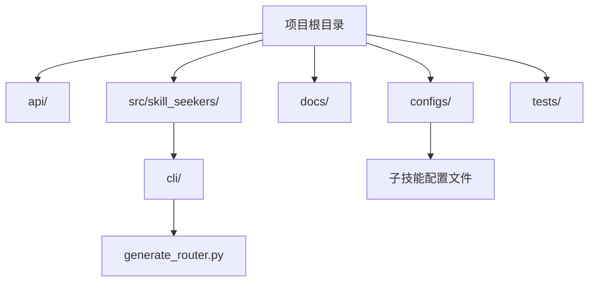
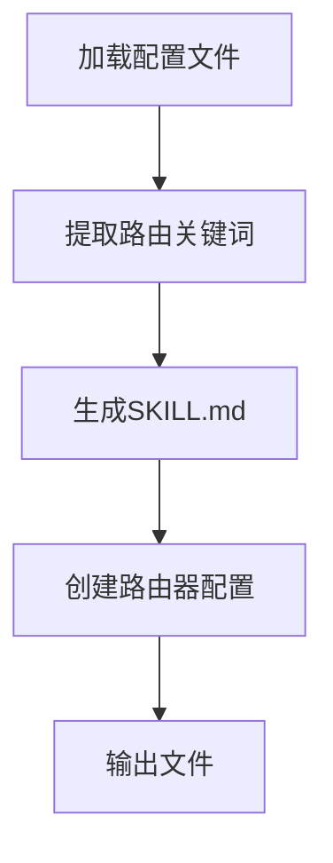
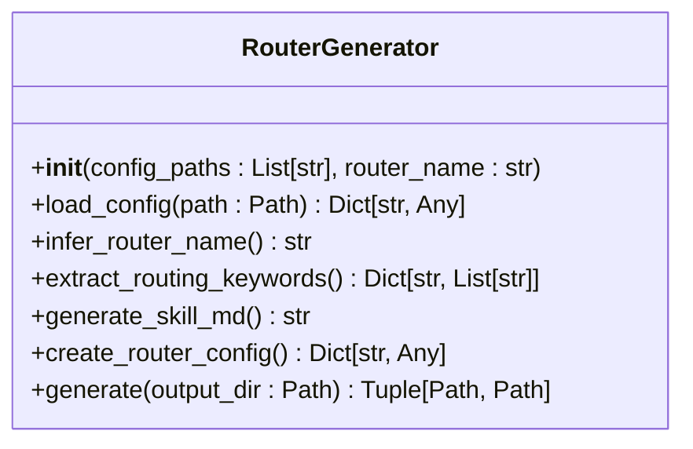
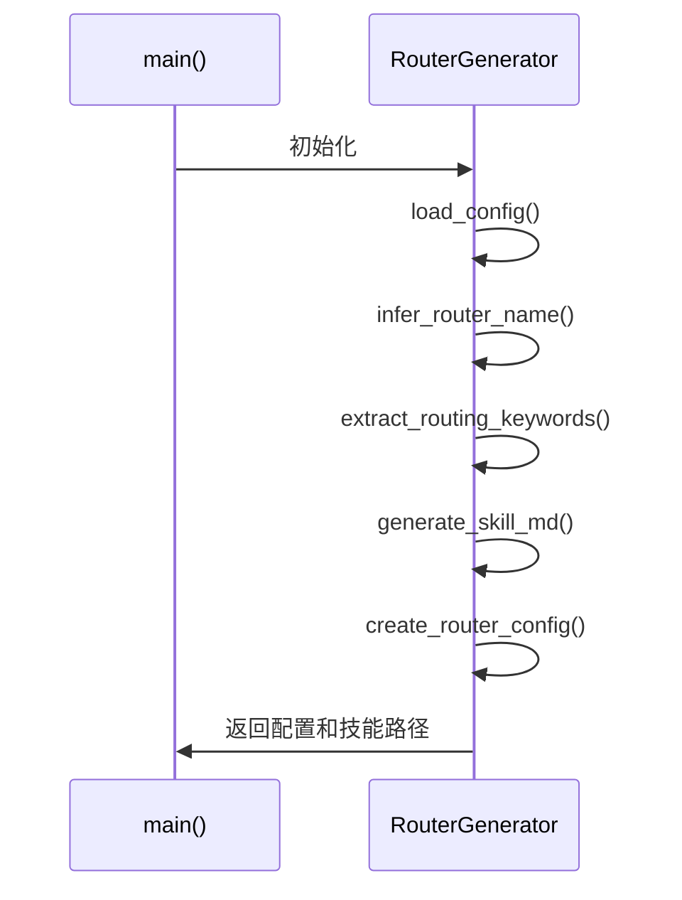
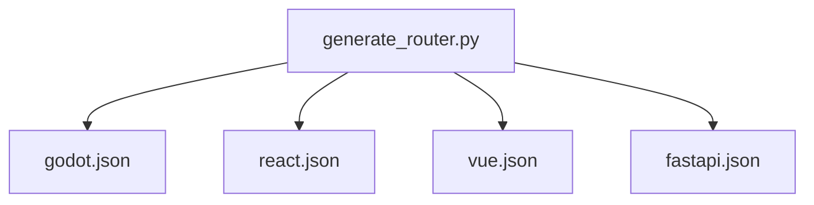

# 路由器技能

<cite>
**本文档中引用的文件**  
- [generate_router.py](file://src/skill_seekers/cli/generate_router.py)
- [godot.json](file://configs/godot.json)
- [react.json](file://configs/react.json)
- [vue.json](file://configs/vue.json)
- [fastapi.json](file://configs/fastapi.json)
- [godot_unified.json](file://configs/godot_unified.json)
- [react_unified.json](file://configs/react_unified.json)
- [django_unified.json](file://configs/django_unified.json)
- [README.md](file://README.md)
</cite>

## 目录
1. [简介](#简介)
2. [项目结构](#项目结构)
3. [核心组件](#核心组件)
4. [架构概述](#架构概述)
5. [详细组件分析](#详细组件分析)
6. [依赖分析](#依赖分析)
7. [性能考虑](#性能考虑)
8. [故障排除指南](#故障排除指南)
9. [结论](#结论)

## 简介
路由器技能（Router Skill）是 Skill Seekers 框架中的智能枢纽，负责根据用户查询的关键词将请求路由到最合适的专用子技能。该技能通过 `generate_router.py` 脚本自动生成，能够分析一组子技能的配置文件，提取其名称、描述和类别关键词，并生成包含路由逻辑的 SKILL.md 文件和特殊的路由器配置文件。本文档将深入解析其生成机制和工作原理。

## 项目结构
项目结构清晰地分为 API、配置、文档、源代码和测试等主要目录。路由器技能的生成脚本位于 `src/skill_seekers/cli/` 目录下，而子技能的配置文件则存储在 `configs/` 目录中。

**图示来源**  
- [generate_router.py](file://src/skill_seekers/cli/generate_router.py)
- [configs/](file://configs/)

## 核心组件
路由器技能的核心组件包括 `RouterGenerator` 类，它负责加载配置文件、提取路由关键词、生成 SKILL.md 内容和创建路由器配置。

**本节来源**  
- [generate_router.py](file://src/skill_seekers/cli/generate_router.py#L16-L275)

## 架构概述
路由器技能的架构包括配置文件分析、路由逻辑生成和输出文件创建三个主要步骤。`RouterGenerator` 类通过分析子技能的配置文件，提取关键词并生成路由逻辑，最终创建 SKILL.md 和路由器配置文件。

**图示来源**  
- [generate_router.py](file://src/skill_seekers/cli/generate_router.py#L16-L275)

## 详细组件分析
### RouterGenerator 类分析
`RouterGenerator` 类是路由器技能生成的核心，包含多个关键方法。

#### 类图

**图示来源**  
- [generate_router.py](file://src/skill_seekers/cli/generate_router.py#L16-L275)

#### 方法调用流程

**图示来源**  
- [generate_router.py](file://src/skill_seekers/cli/generate_router.py#L197-L275)

## 依赖分析
路由器技能依赖于子技能的配置文件，这些文件定义了各个子技能的名称、描述、基础 URL 和类别关键词。通过分析这些配置文件，路由器技能能够智能地将用户查询路由到最合适的子技能。

**图示来源**  
- [generate_router.py](file://src/skill_seekers/cli/generate_router.py#L19-L22)
- [godot.json](file://configs/godot.json)
- [react.json](file://configs/react.json)
- [vue.json](file://configs/vue.json)
- [fastapi.json](file://configs/fastapi.json)

## 性能考虑
路由器技能的生成过程是高效的，因为它只分析配置文件而不进行实际的文档抓取。生成的路由器技能也只抓取概述页面，从而减少了资源消耗。

## 故障排除指南
如果路由器技能生成失败，请检查以下几点：
- 确保所有子技能配置文件路径正确且可访问
- 确保配置文件格式正确，符合 JSON 标准
- 确保没有重复的路由器配置文件

**本节来源**  
- [generate_router.py](file://src/skill_seekers/cli/generate_router.py#L28-L32)
- [README.md](file://README.md#L257-L270)

## 结论
路由器技能通过 `generate_router.py` 脚本实现了智能路由功能，能够根据用户查询的关键词将请求路由到最合适的专用子技能。该技能的生成机制高效且灵活，为 Skill Seekers 框架提供了强大的路由能力。