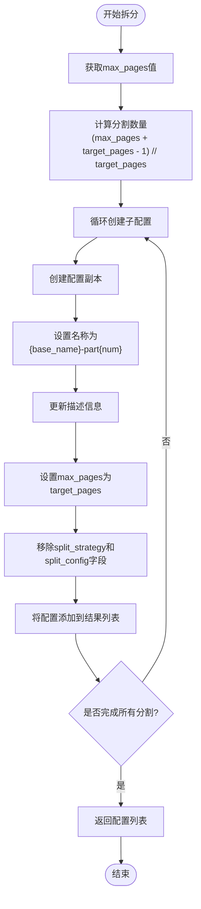
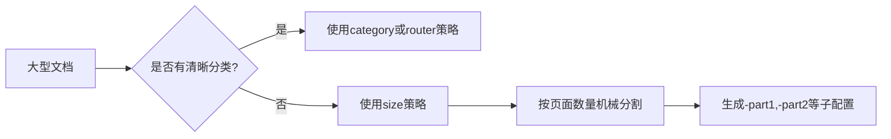

# 按大小拆分

<cite>
**本文档引用文件**  
- [split_config.py](file://src/skill_seekers/cli/split_config.py)
- [LARGE_DOCUMENTATION.md](file://docs/LARGE_DOCUMENTATION.md)
- [example_pdf.json](file://configs/example_pdf.json)
- [godot-large-example.json](file://configs/godot-large-example.json)
</cite>

## 目录
1. [简介](#简介)
2. [核心实现机制](#核心实现机制)
3. [算法逻辑详解](#算法逻辑详解)
4. [应用场景分析](#应用场景分析)
5. [性能考量与建议](#性能考量与建议)
6. [命令行使用方式](#命令行使用方式)
7. [结论](#结论)

## 简介
`size`策略是配置拆分工具中用于处理大型文档的一种关键技术。该策略通过将大型文档根据页面数量进行机械式分割，生成多个大小可控的子配置文件。与依赖语义结构的分类拆分不同，`size`策略纯粹基于页面计数进行操作，适用于内容庞大但缺乏明确分类体系的文档。本文件深入解析该策略的技术实现和实际应用。

**Section sources**
- [split_config.py](file://src/skill_seekers/cli/split_config.py#L1-L321)
- [LARGE_DOCUMENTATION.md](file://docs/LARGE_DOCUMENTATION.md#L100-L118)

## 核心实现机制
`size`策略的核心实现在于`split_by_size`方法，该方法位于`ConfigSplitter`类中。当文档的`max_pages`值超过预设阈值且缺乏清晰分类时，系统会自动选择此策略。该方法不依赖文档内容的语义信息，而是通过简单的数学计算将文档均匀分割为多个部分。

该策略的关键特性包括：
- **机械式分割**：仅基于页面数量进行分割，不考虑内容主题或结构
- **均匀分布**：确保每个子配置的目标页数接近`--target-pages`参数值
- **命名规范**：自动生成带有序号的唯一名称（如-part1、-part2）
- **配置继承**：子配置继承原始配置的所有属性，仅修改名称、描述和最大页数

**Section sources**
- [split_config.py](file://src/skill_seekers/cli/split_config.py#L125-L148)

## 算法逻辑详解
`split_by_size`方法的算法逻辑简洁而高效，主要包含以下几个步骤：

1. **获取总页数**：从原始配置中读取`max_pages`值，若未设置则使用默认值500
2. **计算分割数量**：使用公式`(max_pages + target_pages - 1) // target_pages`计算所需分割的子配置数量
3. **生成子配置**：循环创建指定数量的子配置，每个子配置都基于原始配置的副本
4. **设置属性**：为每个子配置设置唯一的名称、描述和目标页数
5. **清理配置**：移除子配置中的拆分相关字段，防止递归拆分



**Diagram sources**
- [split_config.py](file://src/skill_seekers/cli/split_config.py#L127-L146)

## 应用场景分析
`size`策略特别适用于以下场景：

- **无明确分类的大型文档**：当文档内容庞大但缺乏清晰的主题划分时
- **线性结构文档**：如用户手册、技术规范等按顺序组织的文档
- **快速拆分需求**：需要快速将大型文档拆分为可管理部分的场景
- **测试和开发环境**：在开发过程中需要处理大型文档的子集

与分类拆分相比，`size`策略的优势在于其简单性和可预测性，但缺点是可能将相关主题分割到不同的子配置中。



**Diagram sources**
- [LARGE_DOCUMENTATION.md](file://docs/LARGE_DOCUMENTATION.md#L100-L118)
- [split_config.py](file://src/skill_seekers/cli/split_config.py#L125-L148)

## 性能考量与建议
在使用`size`策略时，选择合适的`--target-pages`值至关重要，需要在技能大小和管理复杂度之间找到平衡：

- **较小的target-pages值**（如1000-2000）：
  - 优点：每个技能更专注，加载更快
  - 缺点：技能数量增多，管理复杂度提高

- **中等的target-pages值**（如3000-5000）：
  - 优点：平衡了技能大小和数量
  - 推荐：适用于大多数大型文档

- **较大的target-pages值**（如8000+）：
  - 优点：技能数量少，管理简单
  - 缺点：单个技能可能仍然过大

建议根据文档的总页数和预期用途选择合适的值。对于超过10000页的文档，建议使用3000-5000作为目标页数。

**Section sources**
- [split_config.py](file://src/skill_seekers/cli/split_config.py#L20-L23)
- [LARGE_DOCUMENTATION.md](file://docs/LARGE_DOCUMENTATION.md#L277-L283)

## 命令行使用方式
`size`策略可以通过命令行参数进行自定义配置：

```bash
# 使用size策略，目标页数为3000
python3 cli/split_config.py configs/bigdocs.json --strategy size --target-pages 3000

# 使用size策略，目标页数为5000（默认值）
python3 cli/split_config.py configs/bigdocs.json --strategy size

# 干运行，查看将要创建的配置而不实际保存
python3 cli/split_config.py configs/bigdocs.json --strategy size --target-pages 3000 --dry-run
```

当使用`--strategy size`时，系统会创建如下命名的子配置：
- bigdocs-part1.json
- bigdocs-part2.json
- bigdocs-part3.json
- 等等

**Section sources**
- [split_config.py](file://src/skill_seekers/cli/split_config.py#L239-L241)
- [LARGE_DOCUMENTATION.md](file://docs/LARGE_DOCUMENTATION.md#L104-L112)

## 结论
`size`策略为处理大型、无明确分类的文档提供了一种简单而有效的解决方案。通过纯粹基于页面数量的机械分割，该策略能够快速将大型文档拆分为大小可控的子配置。虽然这种方法可能不如基于语义的分类拆分精确，但其简单性和可预测性使其成为处理特定类型文档的理想选择。合理选择`--target-pages`参数值，可以在技能大小和管理复杂度之间取得良好平衡。