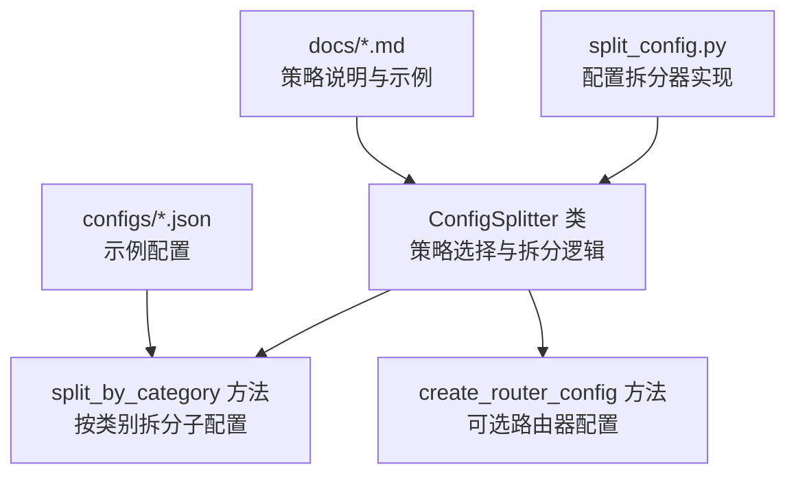
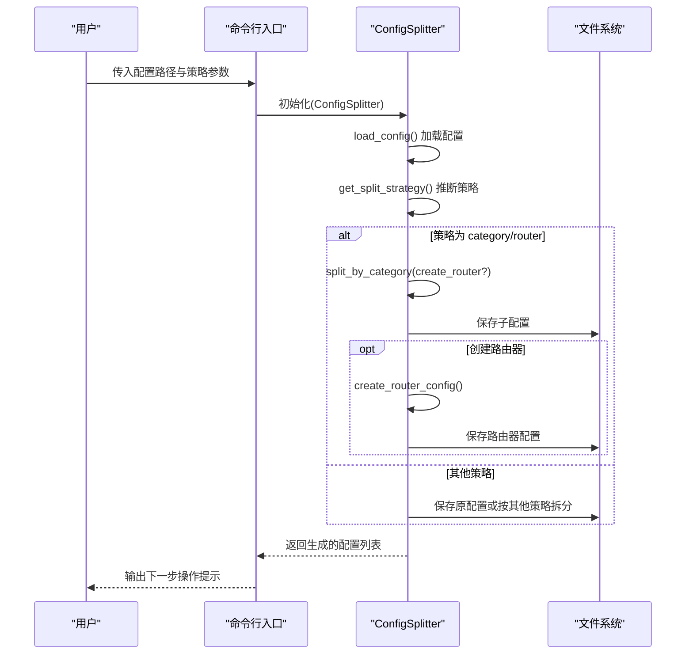
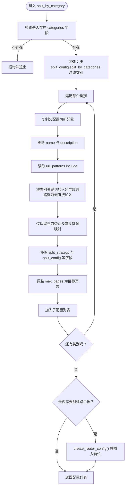
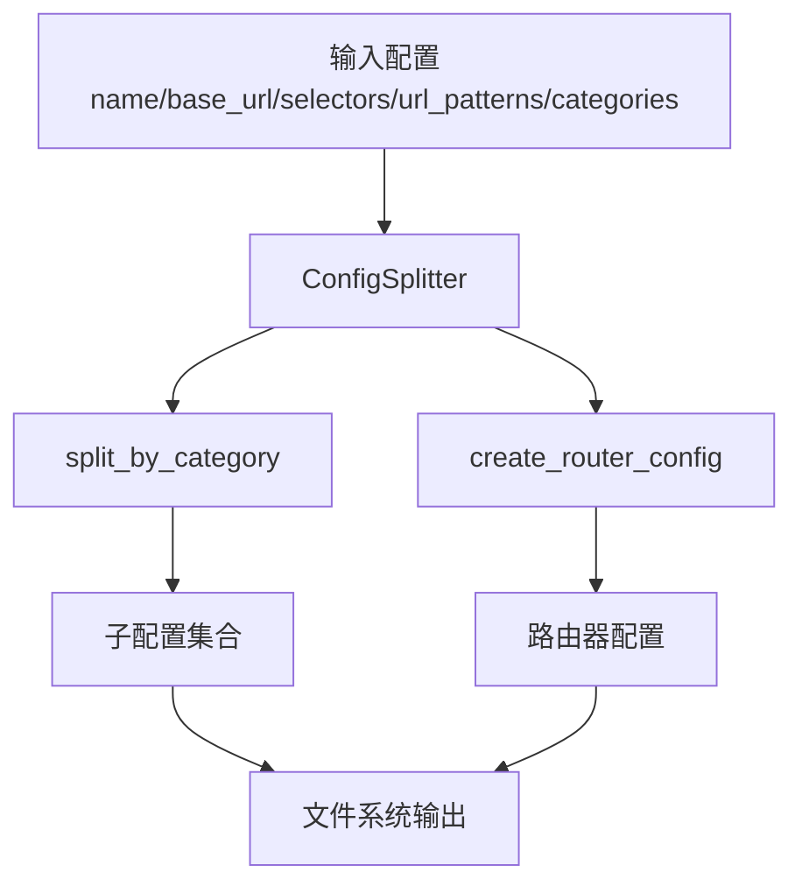

# 按类别拆分

<cite>
**本文引用的文件**
- [split_config.py](file://src/skill_seekers/cli/split_config.py)
- [godot.json](file://configs/godot.json)
- [react.json](file://configs/react.json)
- [django.json](file://configs/django.json)
- [LARGE_DOCUMENTATION.md](file://docs/LARGE_DOCUMENTATION.md)
- [CLAUDE.md](file://docs/CLAUDE.md)
</cite>

## 目录
1. [简介](#简介)
2. [项目结构](#项目结构)
3. [核心组件](#核心组件)
4. [架构总览](#架构总览)
5. [详细组件分析](#详细组件分析)
6. [依赖关系分析](#依赖关系分析)
7. [性能考量](#性能考量)
8. [故障排查指南](#故障排查指南)
9. [结论](#结论)
10. [附录](#附录)

## 简介
本篇文档聚焦于配置拆分工具中的“按类别”（category）策略，系统性阐述其在 ConfigSplitter 类中的实现与使用方式。该策略通过读取配置文件中的 categories 字段，将一个大型文档站点的配置拆分为多个专注于特定主题的子配置；同时支持可选的“路由器”（router）模式，为用户提供统一入口并智能路由到对应子技能。本文将从实现机制、数据结构、控制流程、错误处理与性能特征等方面进行深入解析，并给出实际 JSON 配置示例与启用方式说明。

## 项目结构
与“按类别拆分”直接相关的核心文件位于 CLI 子模块中，配置样例位于 configs 目录下，策略说明与用法示例见文档目录。

图表来源
- [split_config.py](file://src/skill_seekers/cli/split_config.py#L17-L221)
- [godot.json](file://configs/godot.json#L1-L48)
- [react.json](file://configs/react.json#L1-L32)
- [django.json](file://configs/django.json#L1-L35)
- [LARGE_DOCUMENTATION.md](file://docs/LARGE_DOCUMENTATION.md#L61-L118)

章节来源
- [split_config.py](file://src/skill_seekers/cli/split_config.py#L17-L221)
- [godot.json](file://configs/godot.json#L1-L48)
- [react.json](file://configs/react.json#L1-L32)
- [django.json](file://configs/django.json#L1-L35)
- [LARGE_DOCUMENTATION.md](file://docs/LARGE_DOCUMENTATION.md#L61-L118)

## 核心组件
- ConfigSplitter：负责加载配置、自动推断拆分策略、执行具体拆分策略并保存结果。
- split_by_category：按 categories 字段逐个类别生成子配置，更新 URL 包含规则，保留该类别的关键词映射，并继承父配置的其余属性。
- create_router_config：在需要时创建一个“路由器”配置，用于统一导航到各子技能。

章节来源
- [split_config.py](file://src/skill_seekers/cli/split_config.py#L17-L221)

## 架构总览
“按类别拆分”的整体流程如下：
- 加载输入配置文件
- 自动判断策略（优先使用配置中的 split_strategy，否则基于 max_pages 与是否存在 categories 等条件自动选择）
- 若策略为 category 或 router，则调用 split_by_category
- 对每个类别生成独立子配置，必要时插入路由器配置
- 保存生成的配置文件

图表来源
- [split_config.py](file://src/skill_seekers/cli/split_config.py#L224-L321)
- [split_config.py](file://src/skill_seekers/cli/split_config.py#L39-L64)
- [split_config.py](file://src/skill_seekers/cli/split_config.py#L66-L123)
- [split_config.py](file://src/skill_seekers/cli/split_config.py#L150-L171)

## 详细组件分析

### ConfigSplitter 类与策略选择
- 负责加载配置、推断策略、执行拆分与保存。
- 策略选择逻辑优先检查配置中的 split_strategy 字段；若为 auto，则依据 max_pages 与是否包含 categories 等条件自动推荐策略。

章节来源
- [split_config.py](file://src/skill_seekers/cli/split_config.py#L27-L64)

### split_by_category 方法实现要点
- 输入：categories 字典，键为类别名，值为关键词列表（可包含路径前缀）。
- 处理流程：
  - 读取父配置，复制为新配置
  - 更新 name 与 description，形成“父名-类别名”的唯一标识与描述
  - 读取 url_patterns.include，将类别关键词加入包含规则（对以斜杠开头的路径前缀直接加入）
  - 仅保留当前类别与其关键词映射，删除 split_strategy 与 split_config 等拆分相关字段，避免子配置再次拆分
  - 调整 max_pages 为目标页数，便于后续估算与抓取
  - 可选地创建路由器配置，插入到返回列表首位
- 输出：若干子配置列表（以及可选的路由器配置）

图表来源
- [split_config.py](file://src/skill_seekers/cli/split_config.py#L66-L123)
- [split_config.py](file://src/skill_seekers/cli/split_config.py#L150-L171)

章节来源
- [split_config.py](file://src/skill_seekers/cli/split_config.py#L66-L123)
- [split_config.py](file://src/skill_seekers/cli/split_config.py#L150-L171)

### 路由器配置（可选）
- 当策略为 router 或显式要求创建路由器时，会生成一个特殊的“路由器”配置，包含：
  - 基础元信息（name、description、base_url、selectors、url_patterns、rate_limit）
  - 特殊标记字段（如 _router、_sub_skills、_routing_keywords）
  - 仅需少量页面（max_pages 较小）即可作为导航入口
- 路由器配置会插入到子配置列表的首位，便于统一管理与发布。

章节来源
- [split_config.py](file://src/skill_seekers/cli/split_config.py#L150-L171)

### categories 字段结构与示例
- 结构：categories 是一个字典，键为类别名（字符串），值为关键词数组（字符串数组）。关键词可以是普通词或路径前缀（以斜杠开头）。
- 示例：
  - Godot 示例配置展示了多个类别，如“getting_started”、“scripting”、“2d”、“3d”等，每个类别包含一组关键词。
  - React 示例配置包含“getting_started”、“hooks”、“components”、“state”、“api”等类别。
  - Django 示例配置包含“getting_started”、“models”、“views”、“templates”、“forms”、“authentication”、“api”等类别。

章节来源
- [godot.json](file://configs/godot.json#L32-L44)
- [react.json](file://configs/react.json#L22-L29)
- [django.json](file://configs/django.json#L23-L31)

### 启用方式
- 命令行参数：
  - 使用 --strategy category 明确启用按类别拆分
  - 使用 --strategy router 在按类别拆分的同时生成路由器配置
- 配置文件内设置：
  - 在配置中添加 split_strategy 字段，值为 "category" 或 "router"
  - 可选：split_config 中可指定 split_by_categories 限定拆分范围，或设置 router_name、create_router 等选项

章节来源
- [split_config.py](file://src/skill_seekers/cli/split_config.py#L224-L321)
- [LARGE_DOCUMENTATION.md](file://docs/LARGE_DOCUMENTATION.md#L61-L118)
- [CLAUDE.md](file://docs/CLAUDE.md#L181-L181)

## 依赖关系分析
- ConfigSplitter 依赖于输入配置文件的结构完整性（name、base_url、selectors、url_patterns、categories 等字段），并在拆分过程中继承这些字段。
- 路由器配置依赖子配置的 categories 信息，以便在运行时进行关键词匹配与路由。
- 策略选择逻辑依赖于配置中的 max_pages 与 categories 字段的存在与否。

图表来源
- [split_config.py](file://src/skill_seekers/cli/split_config.py#L27-L64)
- [split_config.py](file://src/skill_seekers/cli/split_config.py#L66-L123)
- [split_config.py](file://src/skill_seekers/cli/split_config.py#L150-L171)

章节来源
- [split_config.py](file://src/skill_seekers/cli/split_config.py#L27-L64)
- [split_config.py](file://src/skill_seekers/cli/split_config.py#L66-L123)
- [split_config.py](file://src/skill_seekers/cli/split_config.py#L150-L171)

## 性能考量
- URL 包含规则的更新采用去重集合，避免重复包含相同路径前缀，减少后续抓取时的无效遍历。
- 拆分后每个子配置的 max_pages 被设定为目标页数，有助于稳定估算与抓取任务的资源分配。
- 路由器配置仅保留少量页面，降低其抓取成本与存储开销。

章节来源
- [split_config.py](file://src/skill_seekers/cli/split_config.py#L88-L98)
- [split_config.py](file://src/skill_seekers/cli/split_config.py#L110-L111)
- [split_config.py](file://src/skill_seekers/cli/split_config.py#L150-L171)

## 故障排查指南
- 未定义 categories：当配置中缺少 categories 字段时，按类别拆分会直接报错并退出。请确保配置包含 categories 字段。
- 未知策略：若策略不在允许范围内，将打印错误并退出。请确认 --strategy 参数或 split_strategy 的值正确。
- JSON 解析失败：配置文件格式不合法会导致解析错误。请检查 JSON 语法与字段类型。
- 路由器创建失败：若未正确生成子配置或未设置 split_config，可能导致路由器配置缺失。请确认已先生成子配置再创建路由器。

章节来源
- [split_config.py](file://src/skill_seekers/cli/split_config.py#L66-L71)
- [split_config.py](file://src/skill_seekers/cli/split_config.py#L197-L199)
- [split_config.py](file://src/skill_seekers/cli/split_config.py#L30-L38)

## 结论
“按类别拆分”策略通过 categories 字段将大型文档站点拆分为多个专注主题的子配置，显著提升检索与使用的精准度。配合可选的路由器模式，既能保持用户友好的导航体验，又能保证每个子技能的规模可控。该策略适用于具有明确分类结构的大型文档网站，如框架文档中的“安装”、“教程”、“API 参考”等类别。

## 附录

### 实际 JSON 配置示例（片段）
- Godot 示例配置中 categories 字段包含多个类别与关键词，适合按类别拆分。
- React 示例配置中 categories 字段包含“getting_started”、“hooks”、“components”、“state”、“api”等类别。
- Django 示例配置中 categories 字段包含“getting_started”、“models”、“views”、“templates”、“forms”、“authentication”、“api”等类别。

章节来源
- [godot.json](file://configs/godot.json#L32-L44)
- [react.json](file://configs/react.json#L22-L29)
- [django.json](file://configs/django.json#L23-L31)

### 启用策略的两种方式
- 命令行参数：--strategy category 或 --strategy router
- 配置文件设置：在配置中添加 split_strategy: category 或 router，并可在 split_config 中进一步细化行为

章节来源
- [split_config.py](file://src/skill_seekers/cli/split_config.py#L224-L321)
- [LARGE_DOCUMENTATION.md](file://docs/LARGE_DOCUMENTATION.md#L61-L118)
- [CLAUDE.md](file://docs/CLAUDE.md#L181-L181)