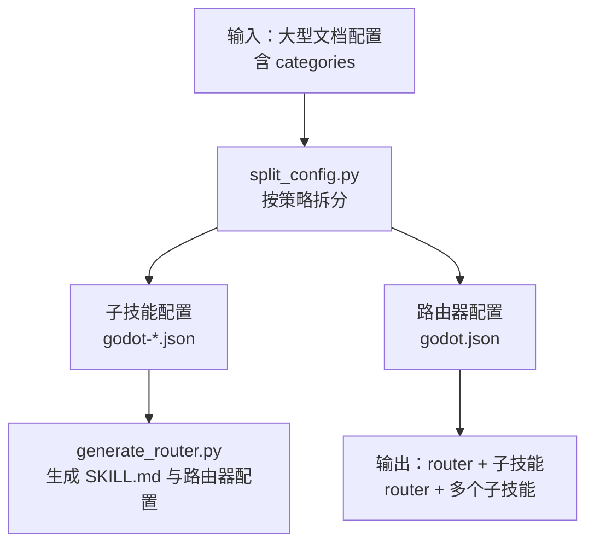
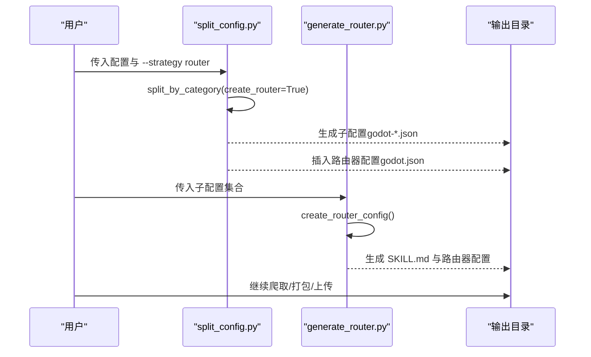
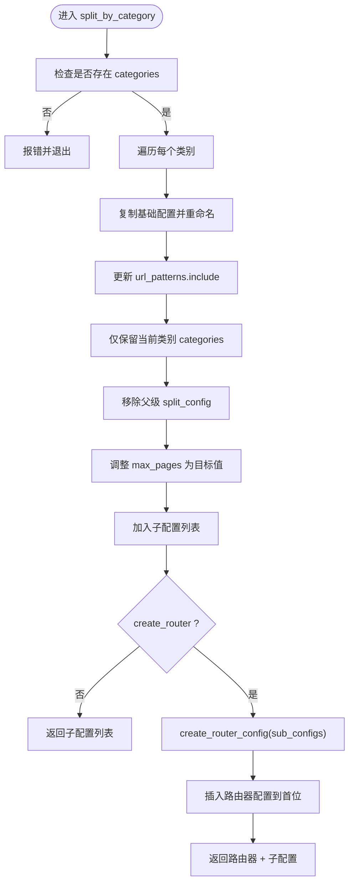
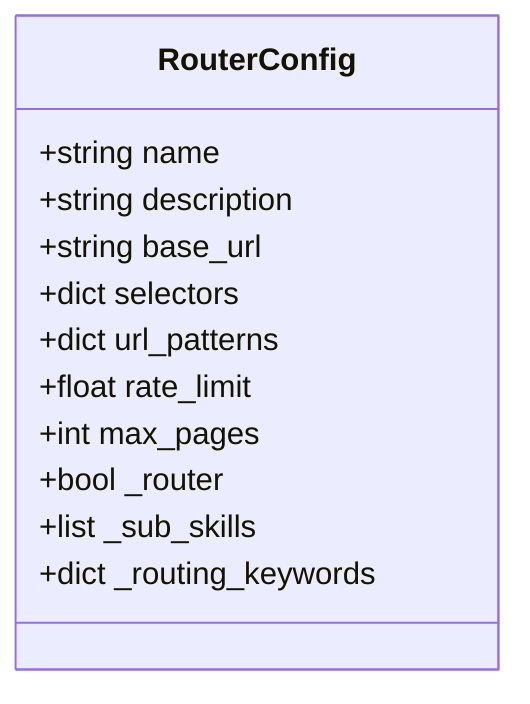
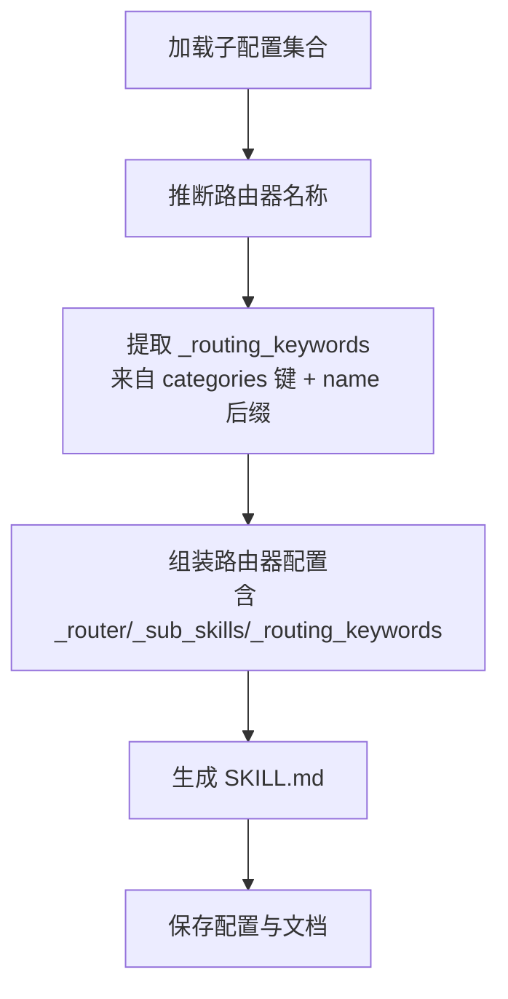
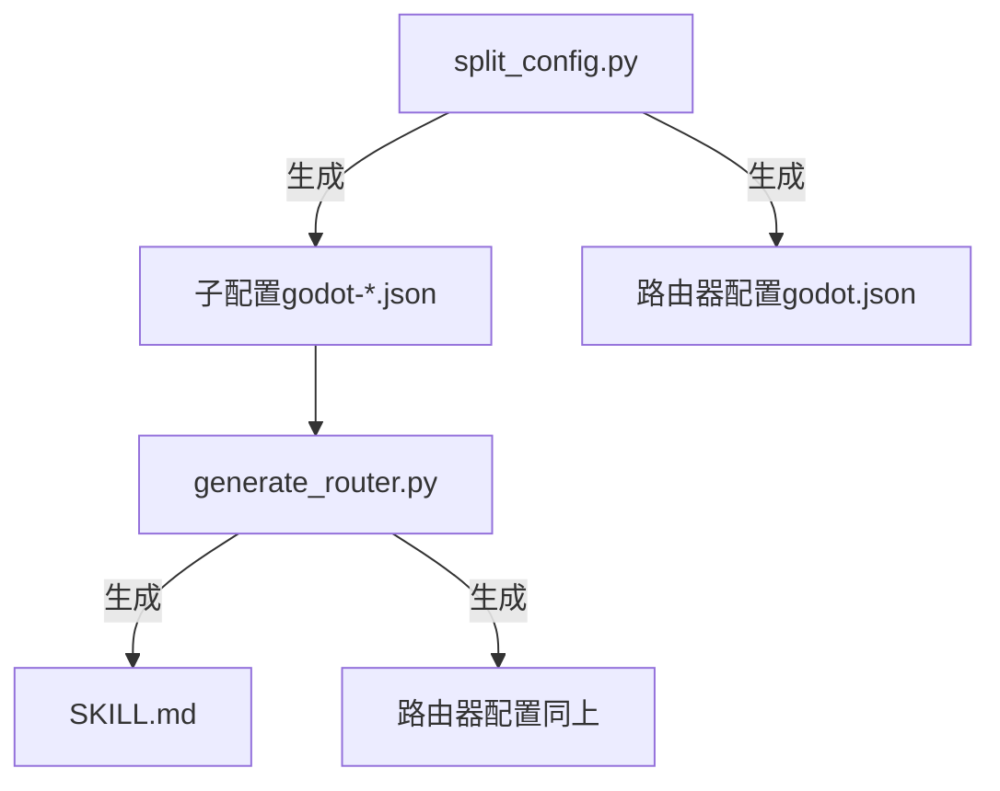

# 路由器模式拆分

<cite>
**本文引用的文件列表**
- [generate_router.py](file://src/skill_seekers/cli/generate_router.py)
- [split_config.py](file://src/skill_seekers/cli/split_config.py)
- [LARGE_DOCUMENTATION.md](file://docs/LARGE_DOCUMENTATION.md)
- [react-custom.json](file://configs/example-team/react-custom.json)
- [vue-internal.json](file://configs/example-team/vue-internal.json)
- [main.py](file://src/skill_seekers/cli/main.py)
</cite>

## 目录
1. [引言](#引言)
2. [项目结构与定位](#项目结构与定位)
3. [核心组件](#核心组件)
4. [架构总览](#架构总览)
5. [详细组件分析](#详细组件分析)
6. [依赖关系分析](#依赖关系分析)
7. [性能与可扩展性](#性能与可扩展性)
8. [故障排查指南](#故障排查指南)
9. [结论](#结论)
10. [附录：使用示例与最佳实践](#附录使用示例与最佳实践)

## 引言
本篇文档聚焦于“路由器（router）策略”的工作原理与实现细节，解释它如何在“按类别拆分”的基础上，自动生成一个路由器配置文件，用于协调多个子技能。我们将深入解析 split_by_category 方法在 create_router=True 时的执行流程，以及 create_router_config 如何构建包含 _sub_skills 和 _routing_keywords 元数据的路由器配置；并说明 _router、_sub_skills、_routing_keywords 等特殊字段的作用，以及它们如何帮助 AI 代理在不同子技能之间进行智能路由。最后给出完整使用示例，展示如何通过 --strategy router 参数触发该模式，并阐明生成的路由器配置与子配置之间的关系，强调该策略适用于超大文档，能实现分层技能架构。

## 项目结构与定位
- 路由器模式位于 CLI 工具链中，主要涉及两个脚本：
  - split_config.py：负责根据策略将大配置拆分为多个子配置，并在需要时生成路由器配置。
  - generate_router.py：基于已有的子技能配置，生成一个路由器配置与对应的 SKILL.md 文档。
- 配置样例位于 configs/ 下，展示了 categories 字段与命名约定，为路由器关键词提取提供基础。
- 文档 docs/LARGE_DOCUMENTATION.md 对路由器模式的适用场景、工作流与最佳实践进行了系统说明。

图表来源
- [split_config.py](file://src/skill_seekers/cli/split_config.py#L66-L123)
- [generate_router.py](file://src/skill_seekers/cli/generate_router.py#L153-L194)

章节来源
- [split_config.py](file://src/skill_seekers/cli/split_config.py#L66-L123)
- [generate_router.py](file://src/skill_seekers/cli/generate_router.py#L153-L194)

## 核心组件
- ConfigSplitter.split_by_category(create_router: bool)
  - 在存在 categories 的前提下，为每个类别创建独立子配置，并在 create_router=True 时插入一个路由器配置到结果列表首位。
- ConfigSplitter.create_router_config(sub_configs: List[Dict])
  - 构建路由器配置，设置 _router 标记、_sub_skills 列表、_routing_keywords 映射等关键元数据。
- RouterGenerator.create_router_config()
  - 基于一组子配置，生成路由器配置（与上述方法类似），并生成对应的 SKILL.md。
- RouterGenerator.extract_routing_keywords()
  - 从子配置的 categories 键与名称后缀中提取关键词，作为路由依据。

章节来源
- [split_config.py](file://src/skill_seekers/cli/split_config.py#L66-L123)
- [split_config.py](file://src/skill_seekers/cli/split_config.py#L150-L170)
- [generate_router.py](file://src/skill_seekers/cli/generate_router.py#L47-L66)
- [generate_router.py](file://src/skill_seekers/cli/generate_router.py#L153-L194)

## 架构总览
路由器模式的总体流程如下：
- 自动或手动选择策略：当文档规模较大且具备清晰分类时，推荐使用 router 策略。
- 拆分阶段：按类别生成若干子配置；若启用 create_router，则在结果前插入一个路由器配置。
- 路由器生成阶段：对子配置集合生成路由器配置与 SKILL.md，明确各子技能的关键词映射。
- 后续步骤：分别对子技能进行爬取、增强、打包与上传；用户提问时由路由器决定激活哪个子技能。

图表来源
- [split_config.py](file://src/skill_seekers/cli/split_config.py#L172-L200)
- [split_config.py](file://src/skill_seekers/cli/split_config.py#L117-L123)
- [generate_router.py](file://src/skill_seekers/cli/generate_router.py#L172-L194)

## 详细组件分析

### 组件A：ConfigSplitter.split_by_category 的执行流程
- 输入：原始配置（需包含 categories），可选参数 create_router。
- 步骤：
  1) 若未定义 categories，直接报错退出。
  2) 遍历 categories，为每个类别复制一份基础配置，重命名 name、调整 description、更新 url_patterns.include 以限定该类别范围。
  3) 仅保留当前类别的 categories，移除父级 split_config，避免递归拆分。
  4) 调整 max_pages 为目标页数，便于后续统一控制。
  5) 若 create_router=True，调用 create_router_config(sub_configs) 生成路由器配置，并将其插入结果列表首位。
- 输出：子配置列表（首项为路由器配置）。

图表来源
- [split_config.py](file://src/skill_seekers/cli/split_config.py#L66-L123)
- [split_config.py](file://src/skill_seekers/cli/split_config.py#L150-L170)

章节来源
- [split_config.py](file://src/skill_seekers/cli/split_config.py#L66-L123)
- [split_config.py](file://src/skill_seekers/cli/split_config.py#L150-L170)

### 组件B：ConfigSplitter.create_router_config 的构建逻辑
- 输入：子配置列表（每个子配置均包含 categories）。
- 关键字段：
  - name：由 split_config.router_name 或父配置 base_name 决定。
  - base_url/selectors/url_patterns/rate_limit/max_pages：继承自父配置，max_pages 设为较小值（路由器仅需概览页面）。
  - _router：布尔标记，标识该配置为路由器。
  - _sub_skills：子配置的 name 列表。
  - _routing_keywords：字典，键为子配置 name，值为其 categories 的键名列表。
- 输出：路由器配置对象。

图表来源
- [split_config.py](file://src/skill_seekers/cli/split_config.py#L150-L170)

章节来源
- [split_config.py](file://src/skill_seekers/cli/split_config.py#L150-L170)

### 组件C：RouterGenerator.create_router_config 的构建逻辑
- 输入：一组已加载的子配置。
- 关键字段：
  - name：从子配置推断公共前缀（第一个短横线前的部分）。
  - base_url/selectors/url_patterns/rate_limit/max_pages：采用模板配置（第一个子配置）。
  - _router：布尔标记。
  - _sub_skills：子配置 name 列表。
  - _routing_keywords：从子配置的 categories 键提取关键词，并补充从 name 中拆分出的主题词。
- 输出：路由器配置对象与 SKILL.md。

图表来源
- [generate_router.py](file://src/skill_seekers/cli/generate_router.py#L34-L66)
- [generate_router.py](file://src/skill_seekers/cli/generate_router.py#L153-L194)

章节来源
- [generate_router.py](file://src/skill_seekers/cli/generate_router.py#L34-L66)
- [generate_router.py](file://src/skill_seekers/cli/generate_router.py#L153-L194)

### 组件D：路由关键词提取与路由器配置的关系
- _routing_keywords 的作用：
  - 以“关键词 → 子技能”的映射形式，指导路由器在用户提问时识别应激活的子技能。
  - 提取来源：
    - 来自子配置的 categories 键（即类别名）。
    - 来自子配置 name 的短横线后缀（通常代表主题领域）。
- _sub_skills 的作用：
  - 记录所有子技能名称，供路由器在路由决策与 UI 展示中使用。
- _router 的作用：
  - 标识该配置为路由器，便于上层工具链识别与处理。

章节来源
- [generate_router.py](file://src/skill_seekers/cli/generate_router.py#L47-L66)
- [split_config.py](file://src/skill_seekers/cli/split_config.py#L150-L170)

## 依赖关系分析
- split_config.py 与 generate_router.py 的协作：
  - split_config.py 生成子配置与路由器配置（当 create_router=True）。
  - generate_router.py 接收子配置集合，生成 SKILL.md 与路由器配置，二者共享 _sub_skills 与 _routing_keywords 的语义。
- 配置样例对路由关键词的影响：
  - configs/example-team/*.json 展示了 categories 的典型结构，其中键名常作为路由关键词的自然来源。
- CLI 主入口：
  - main.py 提供统一命令行入口，但路由器模式的触发与生成主要通过 split_config.py 与 generate_router.py 完成。

图表来源
- [split_config.py](file://src/skill_seekers/cli/split_config.py#L117-L123)
- [generate_router.py](file://src/skill_seekers/cli/generate_router.py#L172-L194)

章节来源
- [split_config.py](file://src/skill_seekers/cli/split_config.py#L117-L123)
- [generate_router.py](file://src/skill_seekers/cli/generate_router.py#L172-L194)

## 性能与可扩展性
- 并行化优势：
  - 路由器模式将大文档拆分为多个子技能，可在多终端或后台任务中并行爬取，显著缩短整体耗时。
- 路由器仅需概览页面：
  - 路由器配置的 max_pages 设置较小，降低爬取成本与上下文窗口压力。
- 可扩展的分层架构：
  - 支持多层级拆分：先按类别生成子技能，再对某些子技能进一步拆分，形成“路由器 → 子路由器 → 子技能”的分层结构。

章节来源
- [LARGE_DOCUMENTATION.md](file://docs/LARGE_DOCUMENTATION.md#L180-L244)

## 故障排查指南
- “无 categories”错误
  - 现象：split_by_category 报错退出。
  - 原因：原始配置未定义 categories。
  - 处理：为配置添加 categories，确保每个子配置有明确的类别键。
- “路由器未正确路由”
  - 现象：用户提问后未激活预期子技能。
  - 原因：_routing_keywords 中缺少匹配关键词或关键词不够明确。
  - 处理：检查并调整子配置的 categories 键与 name 后缀，必要时手动优化 SKILL.md 中的路由说明。
- “生成的路由器名称不理想”
  - 现象：路由器名称与预期不符。
  - 原因：子配置名称的公共前缀不一致。
  - 处理：统一子配置命名规范，确保短横线前缀一致。

章节来源
- [split_config.py](file://src/skill_seekers/cli/split_config.py#L66-L71)
- [generate_router.py](file://src/skill_seekers/cli/generate_router.py#L34-L46)
- [LARGE_DOCUMENTATION.md](file://docs/LARGE_DOCUMENTATION.md#L384-L395)

## 结论
路由器模式通过“按类别拆分 + 自动生成路由器配置”的方式，为超大文档提供了可扩展、可维护、用户体验友好的分层技能架构。split_by_category 在 create_router=True 时会插入路由器配置，而 create_router_config 则通过 _sub_skills 与 _routing_keywords 将子技能与其关键词映射清晰地表达出来。配合并行爬取与统一打包流程，路由器模式能够在保证质量的同时显著提升效率，适用于 10K+ 页面的大规模文档场景。

## 附录：使用示例与最佳实践

### 使用示例：通过 --strategy router 触发路由器模式
- 自动拆分并生成路由器与子技能：
  - 步骤：估计 → 拆分（router）→ 并行爬取子技能 → 生成路由器 → 打包 → 上传。
  - 参考文档中的“快速开始”与“详细工作流”部分。
- 手动在配置中声明拆分策略：
  - 在原始配置中添加 split_strategy 与 split_config（如 router_name、target_pages_per_skill、create_router、split_by_categories 等）。
  - 然后运行 split_config.py，即可得到 router + 子技能配置集。

章节来源
- [LARGE_DOCUMENTATION.md](file://docs/LARGE_DOCUMENTATION.md#L119-L175)
- [LARGE_DOCUMENTATION.md](file://docs/LARGE_DOCUMENTATION.md#L178-L244)

### 路由器配置与子配置的关系
- 路由器配置（_router=True）：
  - 包含 _sub_skills 与 _routing_keywords，用于在用户提问时进行关键词匹配与子技能激活。
- 子配置（categories + name）：
  - categories 的键名作为路由关键词的主要来源；name 的短横线后缀作为补充关键词。
- 生成的 SKILL.md：
  - 为路由器提供自然语言的路由说明与示例，帮助用户理解“关键词 → 子技能”的映射关系。

章节来源
- [split_config.py](file://src/skill_seekers/cli/split_config.py#L150-L170)
- [generate_router.py](file://src/skill_seekers/cli/generate_router.py#L47-L66)
- [generate_router.py](file://src/skill_seekers/cli/generate_router.py#L153-L194)

### 配置样例参考
- 示例团队配置展示了 categories 的典型结构，有助于理解路由关键词的来源与命名约定。

章节来源
- [react-custom.json](file://configs/example-team/react-custom.json#L21-L26)
- [vue-internal.json](file://configs/example-team/vue-internal.json#L20-L26)