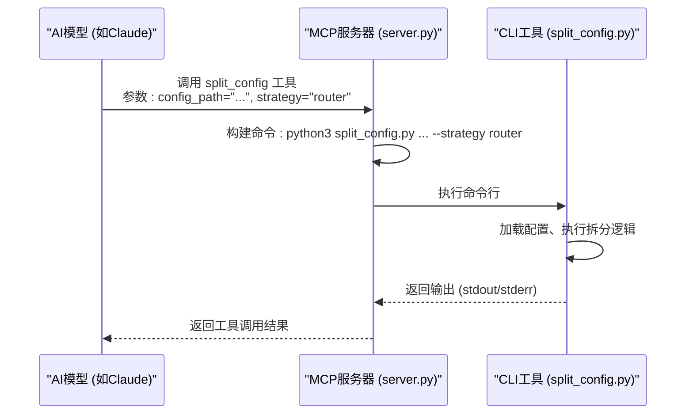

# 配置拆分

<cite>
**本文档中引用的文件**  
- [split_config.py](file://src/skill_seekers/cli/split_config.py#L1-L321)
- [godot-large-example.json](file://configs/godot-large-example.json#L1-L64)
- [server.py](file://src/skill_seekers/mcp/server.py#L1076-L1150)
- [example-mcp-config.json](file://example-mcp-config.json#L1-L12)
</cite>

## 目录
1. [简介](#简介)
2. [核心功能与拆分策略](#核心功能与拆分策略)
3. [命令行接口与参数](#命令行接口与参数)
4. [通过MCP工具调用](#通过mcp工具调用)
5. [配置文件中的自动化拆分](#配置文件中的自动化拆分)

## 简介
配置拆分工具 `split_config.py` 是一个用于处理大型文档配置的实用程序。它能够将一个庞大的单一配置文件，根据预设的策略，自动拆分为多个更小、更专注的独立配置文件。这种拆分对于管理包含数万页内容的大型文档至关重要，可以显著提高处理效率和可维护性。该工具支持多种拆分策略，包括基于类别的拆分、基于大小的拆分以及智能的自动拆分。用户可以通过命令行直接调用，也可以通过MCP（Model Context Protocol）工具在AI环境中进行集成调用。

## 核心功能与拆分策略
`split_config.py` 的核心功能是根据不同的策略将大型配置文件进行逻辑或物理上的分割。其主要支持四种策略：`auto`（自动）、`category`（类别）、`router`（路由器）和 `size`（大小）。每种策略都针对不同的使用场景和需求。

### 'category' 策略
`category` 策略利用配置文件中的 `categories` 字段进行拆分。该字段是一个字典，定义了文档的不同主题或模块及其相关的关键词。当使用此策略时，工具会为 `categories` 字典中的每一个键（即每一个类别）创建一个独立的配置文件。新配置文件会继承原始配置的大部分设置，但会将其 `url_patterns.include` 列表更新为仅包含该类别关键词的URL路径，并将 `categories` 字段限制为仅包含当前类别。这确保了每个生成的子技能都高度专注于一个特定的主题。

**Section sources**
- [split_config.py](file://src/skill_seekers/cli/split_config.py#L66-L113)

### 'router' 策略
`router` 策略是 `category` 策略的增强版。它不仅会创建多个基于类别的子配置文件，还会自动生成一个“路由器”配置文件。这个路由器配置本身不包含详细内容，而是作为一个智能的入口点，包含一个 `_sub_skills` 列表，指向所有生成的子技能，并通过 `_routing_keywords` 映射来指导AI模型如何根据用户查询的关键词将请求路由到最合适的子技能。这在处理超大型文档时非常有用，因为它允许AI首先通过路由器进行粗粒度的路由，然后再深入到具体的子技能中。

**Section sources**
- [split_config.py](file://src/skill_seekers/cli/split_config.py#L117-L121)

### 'size' 策略
`size` 策略根据目标页数 (`--target-pages`) 进行分割。它不关心文档的内容结构，而是简单地根据配置文件中预估的总页数 (`max_pages`) 和目标页数来计算需要拆分成多少个部分。例如，如果一个文档预估有15,000页，而目标页数是5,000页，那么工具将创建3个独立的配置文件（`name-part1`, `name-part2`, `name-part3`）。每个子配置文件的 `max_pages` 会被设置为目标页数，从而实现物理上的分割。

**Section sources**
- [split_config.py](file://src/skill_seekers/cli/split_config.py#L125-L145)

### 'auto' 策略
`auto` 策略是默认策略，它会根据配置文件的特征自动选择最佳的拆分方法。其决策逻辑如下：
1.  如果配置文件中明确指定了 `split_strategy` 且不为 `none`，则使用该策略。
2.  如果文档的 `max_pages` 小于5000，则认为文档较小，无需拆分。
3.  如果文档的 `max_pages` 在5000到10000之间，并且定义了 `categories`，则推荐使用 `category` 策略。
4.  如果文档的 `max_pages` 超过10000，并且 `categories` 的数量大于等于3，则推荐使用 `router` 策略。
5.  否则，使用 `size` 策略。

**Section sources**
- [split_config.py](file://src/skill_seekers/cli/split_config.py#L39-L64)

## 命令行接口与参数
`split_config.py` 提供了一个直观的命令行接口，允许用户直接从终端执行拆分操作。

### 主要参数
- `config`: （必需）指定要拆分的配置文件的路径，例如 `configs/godot.json`。
- `--strategy`: 指定拆分策略，可选值为 `auto`, `none`, `category`, `router`, `size`。默认为 `auto`。
- `--target-pages`: 设置每个子技能的目标页数，默认为5000页。
- `--output-dir`: 指定生成的配置文件的输出目录，默认与输入配置文件在同一目录。
- `--dry-run`: 执行试运行，显示将要创建的文件，但不实际保存它们。

### 使用示例
```bash
# 使用默认的自动策略
python3 split_config.py configs/godot.json

# 使用类别策略
python3 split_config.py configs/godot.json --strategy category

# 使用路由器策略
python3 split_config.py configs/godot.json --strategy router

# 设置自定义目标页数
python3 split_config.py configs/godot.json --target-pages 3000

# 执行试运行
python3 split_config.py configs/godot.json --dry-run
```

**Section sources**
- [split_config.py](file://src/skill_seekers/cli/split_config.py#L224-L316)

## 通过MCP工具调用
该工具可以通过MCP（Model Context Protocol）服务器在AI环境中被调用。MCP服务器将 `split_config.py` 封装为一个名为 `split_config` 的工具，允许AI模型通过自然语言指令来触发拆分过程。

### MCP工具调用流程
1.  **MCP服务器启动**：运行 `server.py` 脚本，启动MCP服务器。
2.  **工具注册**：服务器在启动时会注册 `split_config` 工具，其描述和参数模式在 `server.py` 中定义。
3.  **AI调用**：AI模型（如Claude）可以调用 `split_config` 工具，并传入参数（如 `config_path`, `strategy`, `target_pages`）。
4.  **执行命令**：MCP服务器接收到调用后，会构建一个命令行，使用 `sys.executable` 调用 `split_config.py` 脚本，并传入相应的参数。
5.  **返回结果**：`split_config.py` 执行完毕后，其输出会被捕获并返回给AI模型。



**Diagram sources**
- [server.py](file://src/skill_seekers/mcp/server.py#L1076-L1150)
- [split_config.py](file://src/skill_seekers/cli/split_config.py#L224-L321)

**Section sources**
- [server.py](file://src/skill_seekers/mcp/server.py#L290-L316)
- [example-mcp-config.json](file://example-mcp-config.json#L1-L12)

## 配置文件中的自动化拆分
用户可以在配置文件中直接定义 `split_strategy` 和 `split_config` 选项，以实现完全自动化的拆分流程。当 `split_config.py` 加载配置时，它会优先检查配置文件内部的 `split_strategy` 字段。

### 配置文件示例
以下是一个 `godot-large-example.json` 的简化示例，展示了如何在配置文件中启用自动化拆分：

```json
{
  "name": "godot",
  "description": "...",
  "max_pages": 40000,
  "categories": { ... },
  "split_strategy": "router",
  "split_config": {
    "target_pages_per_skill": 5000,
    "create_router": true,
    "split_by_categories": ["scripting", "2d", "3d", "physics", "shaders"],
    "router_name": "godot"
  }
}
```

在此配置中：
- `split_strategy` 被设置为 `router`，指示工具使用路由器策略。
- `split_config` 对象提供了详细的拆分选项，例如指定目标页数、是否创建路由器、要拆分的具体类别列表以及路由器的名称。

当运行 `python3 split_config.py configs/godot-large-example.json` 时，工具会读取这些内嵌的指令，自动执行拆分，无需在命令行中指定额外参数，从而实现了配置即代码的自动化工作流。

**Section sources**
- [godot-large-example.json](file://configs/godot-large-example.json#L48-L56)
- [split_config.py](file://src/skill_seekers/cli/split_config.py#L42-L45)