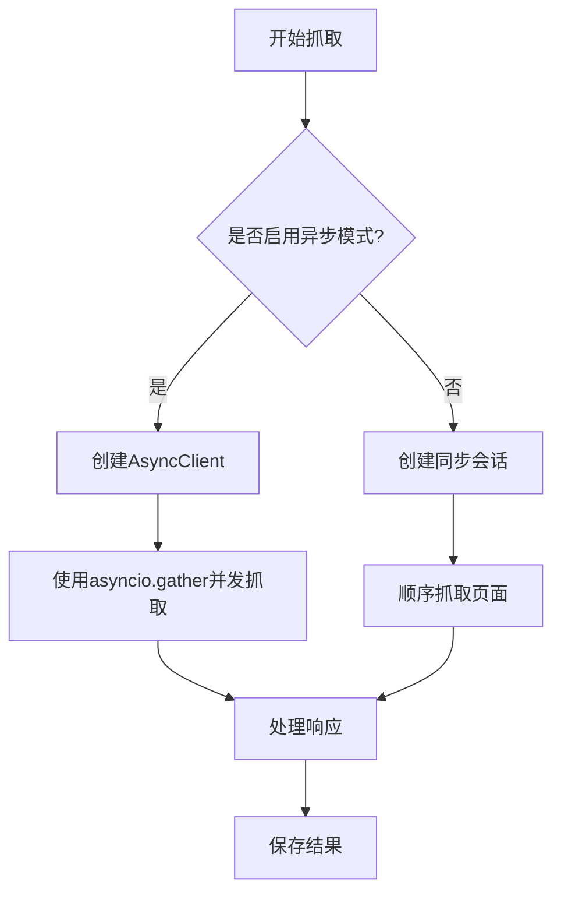
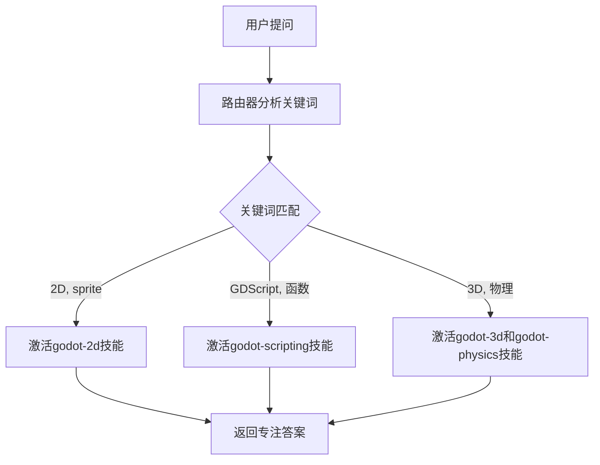

# 高级功能

<cite>
**本文档中引用的文件**   
- [generate_router.py](file://src/skill_seekers/cli/generate_router.py)
- [split_config.py](file://src/skill_seekers/cli/split_config.py)
- [doc_scraper.py](file://src/skill_seekers/cli/doc_scraper.py)
- [pdf_extractor_poc.py](file://src/skill_seekers/cli/pdf_extractor_poc.py)
- [ASYNC_SUPPORT.md](file://ASYNC_SUPPORT.md)
- [LARGE_DOCUMENTATION.md](file://docs/LARGE_DOCUMENTATION.md)
- [PDF_CHUNKING.md](file://docs/PDF_CHUNKING.md)
</cite>

## 目录
1. [大文档支持策略](#大文档支持策略)
2. [异步抓取模式](#异步抓取模式)
3. [并行处理机制](#并行处理机制)
4. [检查点与恢复功能](#检查点与恢复功能)
5. [路由器技能生成](#路由器技能生成)
6. [配置拆分](#配置拆分)
7. [性能调优建议](#性能调优建议)
8. [资源使用监控](#资源使用监控)

## 大文档支持策略

Skill Seekers 项目通过分块处理和内存优化策略来有效处理超大规模文档或代码库，避免内存溢出问题。对于大型文档站点（10K+ 页面），系统提供了多种拆分策略以确保高效处理。

文档拆分策略包括基于类别的拆分、基于大小的拆分以及推荐的路由器+类别组合模式。当文档规模超过5000页时，系统会建议进行拆分；对于10000至30000页的文档，强烈推荐使用路由器+类别模式；而对于超过30000页的文档，则必须采用拆分策略。这种拆分不仅提高了抓取效率，还增强了Claude AI的性能表现，提供了更聚焦的技能和更好的用户体验。

在处理大型PDF文档时，系统实现了智能页面分块和章节检测功能。PDF文档可以被分割成可管理的小块（默认每块10页），并且能够自动识别章节边界。这使得大型PDF文档可以被有效地组织和处理，同时代码块跨越多页时也能被智能合并，保持代码完整性。

**Section sources**
- [LARGE_DOCUMENTATION.md](file://docs/LARGE_DOCUMENTATION.md#when-to-split-documentation)
- [PDF_CHUNKING.md](file://docs/PDF_CHUNKING.md#overview)

## 异步抓取模式

异步抓取模式是Skill Seekers提升性能的核心机制之一，通过异步I/O操作显著提高了抓取效率。与传统的同步模式相比，异步模式在性能上实现了2-3倍的提升，同时内存占用减少了80-90%。

异步模式利用`httpx.AsyncClient`作为异步HTTP客户端，结合`asyncio.Semaphore`进行并发控制，使用`asyncio.gather()`实现并行任务执行。这种技术架构允许系统同时处理500-1000个并发请求，远高于同步模式的50-100个限制。异步模式特别适用于网络延迟较高、内存受限或需要处理500页以上文档的场景。

异步模式是可选功能，默认情况下系统运行在同步模式下，确保了向后兼容性。用户可以通过命令行参数`--async`或在配置文件中设置`"async_mode": true`来启用异步模式。系统还支持检查点功能，可以在中断后恢复抓取过程，这对于长时间运行的大规模抓取任务尤为重要。

**Diagram sources **
- [ASYNC_SUPPORT.md](file://ASYNC_SUPPORT.md#-async-mode-for-high-performance-scraping)
- [doc_scraper.py](file://src/skill_seekers/cli/doc_scraper.py#L105)

## 并行处理机制

并行处理机制通过多线程和异步I/O的结合，实现了高效的资源利用和任务调度。系统支持配置工作线程数（workers），允许用户根据硬件资源和网络条件优化性能。对于小型文档（约100-500页），建议使用4个工作线程；对于中型文档（约500-2000页），建议使用8个工作线程；而对于大型文档（2000页以上），可以结合`--no-rate-limit`参数使用8个工作线程以获得最佳性能。

并行处理的关键在于合理平衡并发度和系统资源。过多的工作线程可能导致"too many open files"错误，而过少则无法充分利用系统能力。系统通过`ThreadPoolExecutor`管理线程池，并使用线程锁确保对共享资源（如访问过的URL集合和待处理URL队列）的安全访问。然而，代码审查发现存在潜在的竞争条件，例如`visited_urls.add(url)`操作在锁之外执行，可能导致同一URL被多次抓取。

并行处理与异步模式可以结合使用，实现更高的效率。测试表明，在处理React文档（500页）时，异步模式将时间从45分钟减少到15分钟，页面抓取速度从每秒18页提升到55页，内存占用从120MB减少到40MB。

**Section sources**
- [ASYNC_SUPPORT.md](file://ASYNC_SUPPORT.md#-recommended-settings)
- [test_parallel_scraping.py](file://tests/test_parallel_scraping.py#L19)

## 检查点与恢复功能

检查点与恢复功能为长时间运行的抓取任务提供了容错性保障，确保即使在系统崩溃或网络中断的情况下也不会丢失进度。该功能通过定期保存抓取进度到检查点文件来实现，允许任务在中断后从中断点恢复，而不是从头开始。

检查点功能在配置中通过`checkpoint`对象启用，可以设置检查点间隔（默认为1000页）。当抓取达到指定页数时，系统会将当前状态（包括已访问的URL、待处理的URL、已抓取页数等）保存到JSON格式的检查点文件中。如果抓取任务被中断，用户可以通过`--resume`参数启动恢复流程，系统会自动加载最近的检查点并继续抓取。

这一功能对于处理超大规模文档尤其重要，因为完整的抓取过程可能需要数小时甚至数天。检查点机制不仅避免了重复工作，还允许用户在不同时间分段完成抓取任务。系统在恢复时会显示已抓取的页数、已访问的URL数量、待处理的URL数量以及最后更新时间，为用户提供清晰的进度信息。

**Section sources**
- [doc_scraper.py](file://src/skill_seekers/cli/doc_scraper.py#L84-L209)
- [LARGE_DOCUMENTATION.md](file://docs/LARGE_DOCUMENTATION.md#use-checkpoints-for-long-scrapes)

## 路由器技能生成

`generate_router.py`脚本负责构建导航结构以支持复杂技能组织，通过创建路由器/中心技能来智能地将查询定向到专门的子技能。这种架构特别适用于被分割成多个专注技能的大型文档站点。

路由器生成器通过分析多个子技能配置文件来创建一个中心路由器。它首先从子技能名称中推断出路由器名称，然后提取每个技能的路由关键词。这些关键词来源于技能的类别和名称，用于在用户提问时激活相应的子技能。生成的路由器包含一个`SKILL.md`文件，其中详细说明了何时使用该技能、工作原理、路由逻辑和快速参考。

路由器配置包含一个`_router`标志和`_sub_skills`列表，明确标识其作为路由器的角色和管理的子技能。当用户提问时，路由器会分析问题中的主题关键词，并激活一个或多个相关的子技能。例如，询问"如何创建2D精灵？"会激活`godot-2d`技能，而询问"GDScript函数语法"会激活`godot-scripting`技能。

**Diagram sources **
- [generate_router.py](file://src/skill_seekers/cli/generate_router.py#L16)
- [LARGE_DOCUMENTATION.md](file://docs/LARGE_DOCUMENTATION.md#-router--categories-intelligent-hub--recommended)

## 配置拆分

`split_config.py`脚本实现了将大型文档配置拆分为多个更小、更专注的技能配置的策略，支持多种拆分策略：基于类别的拆分、基于大小的拆分和自动拆分。这是处理超大规模文档的核心机制。

配置拆分器首先确定拆分策略，可以基于配置中的`split_strategy`字段或自动检测。对于小于5000页的文档，系统认为无需拆分；对于5000-10000页的文档，推荐基于类别拆分；对于更大的文档，则推荐使用路由器+类别模式。基于类别的拆分会为每个类别创建一个独立的配置文件，同时可以选择创建一个路由器配置来管理这些子技能。

基于大小的拆分则根据目标页数将文档均匀分割。例如，一个40000页的文档可以被拆分为8个各5000页的技能。这种拆分策略使得可以并行抓取多个子技能，大大缩短了总处理时间。从顺序抓取可能需要40小时，到并行抓取仅需8小时，效率提升了5倍。

配置拆分不仅解决了技术限制，还带来了用户体验的提升。用户可以通过路由器自然地提问，系统会自动将问题路由到最合适的子技能，实现了"一个入口，多个专注技能"的理想架构。

**Section sources**
- [split_config.py](file://src/skill_seekers/cli/split_config.py#L17)
- [LARGE_DOCUMENTATION.md](file://docs/LARGE_DOCUMENTATION.md#split-strategies)

## 性能调优建议

为了最大化Skill Seekers的性能，建议遵循以下最佳实践：首先，对于超过500页的文档，应启用异步模式并配置4-8个工作线程；其次，使用`--dry-run`参数先测试配置，验证无误后再进行完整抓取；第三，合理设置速率限制，既要尊重服务器的承受能力，又要保证抓取效率。

内存优化方面，应监控内存使用情况，如果发现内存占用过高，可以减少工作线程数。对于大型抓取任务，务必启用检查点功能，设置合理的检查点间隔（如每1000页），以便在中断时能够恢复。此外，可以结合使用类别拆分和并行抓取，将一个大型任务分解为多个小型任务并行执行。

在处理PDF文档时，可以利用并行处理功能，通过`--parallel --workers 8`参数实现3倍的速度提升。对于扫描版PDF，启用OCR功能可以提取文本内容，但会增加处理时间。建议先对文档进行评估，根据实际需求选择合适的处理选项。

**Section sources**
- [ASYNC_SUPPORT.md](file://ASYNC_SUPPORT.md#-best-practices)
- [pdf_extractor_poc.py](file://src/skill_seekers/cli/pdf_extractor_poc.py#L103)

## 资源使用监控

资源使用监控是确保系统稳定运行的关键。系统通过日志记录和性能指标提供实时反馈，帮助用户了解抓取进度和资源消耗情况。在抓取过程中，系统会定期输出已抓取的页数，让用户掌握任务进度。

对于内存使用，异步模式相比同步模式有显著优势，每个工作线程的内存占用从10-15MB降低到1-2MB。然而，BeautifulSoup解析仍然比较内存密集，因此增加工作线程数会线性增加内存消耗。建议在8GB内存的机器上使用4-6个工作线程，在16GB内存的机器上使用8-10个工作线程。

系统还提供了详细的性能基准数据，帮助用户评估和优化配置。例如，React文档（500页）的抓取在同步模式下需要约45分钟，而在异步模式下仅需15分钟。用户可以通过运行测试套件（`python -m pytest tests/test_async_scraping.py -v`）来验证异步功能的正确性，并根据测试结果调整配置。

**Section sources**
- [ASYNC_SUPPORT.md](file://ASYNC_SUPPORT.md#-performance-benefits)
- [test_async_scraping.py](file://tests/test_async_scraping.py#L19)